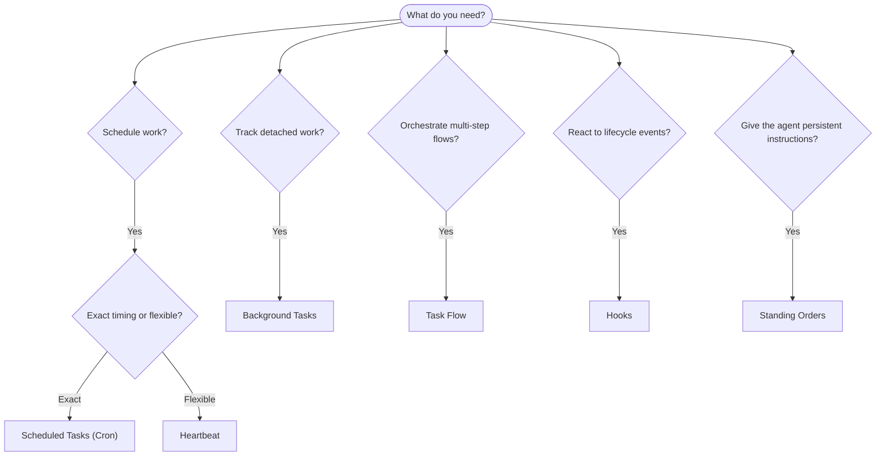

---
read_when:
    - عند تحديد كيفية أتمتة العمل باستخدام OpenClaw
    - عند الاختيار بين heartbeat، وcron، وhooks، والأوامر الدائمة
    - عند البحث عن نقطة الدخول المناسبة للأتمتة
summary: 'نظرة عامة على آليات الأتمتة: المهام، وcron، وhooks، والأوامر الدائمة، وTask Flow'
title: الأتمتة والمهام
x-i18n:
    generated_at: "2026-04-05T12:34:21Z"
    model: gpt-5.4
    provider: openai
    source_hash: 13cd05dcd2f38737f7bb19243ad1136978bfd727006fd65226daa3590f823afe
    source_path: automation/index.md
    workflow: 15
---

# الأتمتة والمهام

يشغّل OpenClaw العمل في الخلفية من خلال المهام، والوظائف المجدولة، وhooks الأحداث، والتعليمات الدائمة. تساعدك هذه الصفحة على اختيار الآلية المناسبة وفهم كيفية ترابطها.

## دليل اتخاذ القرار السريع

| حالة الاستخدام | الخيار الموصى به | السبب |
| -------------- | ---------------- | ------ |
| إرسال تقرير يومي في تمام الساعة 9 صباحًا | Scheduled Tasks (Cron) | توقيت دقيق، وتنفيذ معزول |
| ذكّرني بعد 20 دقيقة | Scheduled Tasks (Cron) | تشغيل لمرة واحدة مع توقيت دقيق (`--at`) |
| تشغيل تحليل عميق أسبوعي | Scheduled Tasks (Cron) | مهمة مستقلة، ويمكنها استخدام نموذج مختلف |
| فحص البريد الوارد كل 30 دقيقة | Heartbeat | يجمّع مع فحوصات أخرى، ومدرك للسياق |
| مراقبة التقويم للأحداث القادمة | Heartbeat | ملائم بطبيعته للوعي الدوري |
| فحص حالة وكيل فرعي أو تشغيل ACP | Background Tasks | يسجّل دفتر المهام كل العمل المنفصل |
| تدقيق ما الذي تم تشغيله ومتى | Background Tasks | `openclaw tasks list` و`openclaw tasks audit` |
| بحث متعدد الخطوات ثم تلخيص | Task Flow | تنسيق دائم مع تتبع المراجعات |
| تشغيل برنامج نصي عند إعادة تعيين الجلسة | Hooks | يعتمد على الأحداث، ويعمل عند أحداث دورة الحياة |
| تنفيذ تعليمات برمجية عند كل استدعاء أداة | Hooks | يمكن لـ Hooks التصفية حسب نوع الحدث |
| التحقق دائمًا من الامتثال قبل الرد | Standing Orders | تُحقن تلقائيًا في كل جلسة |

### Scheduled Tasks (Cron) مقابل Heartbeat

| البعد | Scheduled Tasks (Cron) | Heartbeat |
| ----- | ---------------------- | --------- |
| التوقيت | دقيق (تعبيرات cron، تشغيل لمرة واحدة) | تقريبي (افتراضيًا كل 30 دقيقة) |
| سياق الجلسة | جديد (معزول) أو مشترك | سياق الجلسة الرئيسية الكامل |
| سجلات المهام | يتم إنشاؤها دائمًا | لا يتم إنشاؤها أبدًا |
| التسليم | قناة، أو webhook، أو بصمت | مضمّن داخل الجلسة الرئيسية |
| الأنسب لـ | التقارير، والتذكيرات، والوظائف الخلفية | فحوصات البريد الوارد، والتقويم، والإشعارات |

استخدم Scheduled Tasks (Cron) عندما تحتاج إلى توقيت دقيق أو تنفيذ معزول. واستخدم Heartbeat عندما يستفيد العمل من سياق الجلسة الكامل ويكون التوقيت التقريبي كافيًا.

## المفاهيم الأساسية

### المهام المجدولة (cron)

يمثل Cron المجدول المدمج في Gateway للتوقيت الدقيق. فهو يحتفظ بالوظائف، ويوقظ الوكيل في الوقت المناسب، ويمكنه تسليم المخرجات إلى قناة دردشة أو نقطة نهاية webhook. ويدعم التذكيرات التي تعمل لمرة واحدة، والتعبيرات المتكررة، ومشغلات webhook الواردة.

راجع [Scheduled Tasks](/automation/cron-jobs).

### المهام

يتتبع دفتر المهام الخلفية جميع الأعمال المنفصلة: عمليات تشغيل ACP، وتشغيل الوكلاء الفرعيين، وتنفيذات cron المعزولة، وعمليات CLI. المهام هي سجلات وليست مجدولات. استخدم `openclaw tasks list` و`openclaw tasks audit` لفحصها.

راجع [Background Tasks](/automation/tasks).

### Task Flow

يمثل Task Flow طبقة تنسيق التدفقات فوق المهام الخلفية. وهو يدير التدفقات الدائمة متعددة الخطوات مع أوضاع المزامنة المُدارة والمنعكسة، وتتبع المراجعات، و`openclaw tasks flow list|show|cancel` للفحص.

راجع [Task Flow](/automation/taskflow).

### الأوامر الدائمة

تمنح الأوامر الدائمة الوكيل صلاحية تشغيل دائمة للبرامج المحددة. وهي توجد في ملفات مساحة العمل (عادةً `AGENTS.md`) وتُحقن في كل جلسة. ويمكن دمجها مع cron لفرض التنفيذ المعتمد على الوقت.

راجع [Standing Orders](/automation/standing-orders).

### Hooks

تمثل Hooks برامج نصية تعتمد على الأحداث ويتم تشغيلها بواسطة أحداث دورة حياة الوكيل (`/new` و`/reset` و`/stop`) وضغط الجلسة، وبدء تشغيل البوابة، وتدفق الرسائل، واستدعاءات الأدوات. يتم اكتشاف Hooks تلقائيًا من الأدلة ويمكن إدارتها باستخدام `openclaw hooks`.

راجع [Hooks](/automation/hooks).

### Heartbeat

يمثل Heartbeat دورًا دوريًا للجلسة الرئيسية (افتراضيًا كل 30 دقيقة). وهو يجمّع عدة فحوصات (البريد الوارد، والتقويم، والإشعارات) في دور وكيل واحد مع سياق الجلسة الكامل. ولا تنشئ أدوار Heartbeat سجلات مهام. استخدم `HEARTBEAT.md` لقائمة تحقق صغيرة، أو كتلة `tasks:` عندما تريد فحوصات دورية مستحقة فقط داخل heartbeat نفسه. تتخطى ملفات heartbeat الفارغة كـ `empty-heartbeat-file`، ويتخطى وضع المهام المستحقة فقط كـ `no-tasks-due`.

راجع [Heartbeat](/gateway/heartbeat).

## كيف تعمل معًا

- **Cron** يتعامل مع الجداول الدقيقة (التقارير اليومية، والمراجعات الأسبوعية) والتذكيرات التي تعمل لمرة واحدة. جميع تنفيذات cron تنشئ سجلات مهام.
- **Heartbeat** يتعامل مع المراقبة الروتينية (البريد الوارد، والتقويم، والإشعارات) في دور مجمّع واحد كل 30 دقيقة.
- **Hooks** تتفاعل مع أحداث محددة (استدعاءات الأدوات، وإعادة تعيين الجلسة، والضغط) عبر برامج نصية مخصصة.
- **الأوامر الدائمة** تمنح الوكيل سياقًا مستمرًا وحدودًا للصلاحيات.
- **Task Flow** ينسق التدفقات متعددة الخطوات فوق المهام الفردية.
- **المهام** تتتبع تلقائيًا كل الأعمال المنفصلة حتى تتمكن من فحصها وتدقيقها.

## ذو صلة

- [Scheduled Tasks](/automation/cron-jobs) — الجدولة الدقيقة والتذكيرات التي تعمل لمرة واحدة
- [Background Tasks](/automation/tasks) — دفتر المهام لجميع الأعمال المنفصلة
- [Task Flow](/automation/taskflow) — تنسيق التدفقات الدائمة متعددة الخطوات
- [Hooks](/automation/hooks) — برامج نصية لدورة الحياة تعتمد على الأحداث
- [Standing Orders](/automation/standing-orders) — تعليمات الوكيل الدائمة
- [Heartbeat](/gateway/heartbeat) — أدوار دورية للجلسة الرئيسية
- [Configuration Reference](/gateway/configuration-reference) — جميع مفاتيح الإعداد
