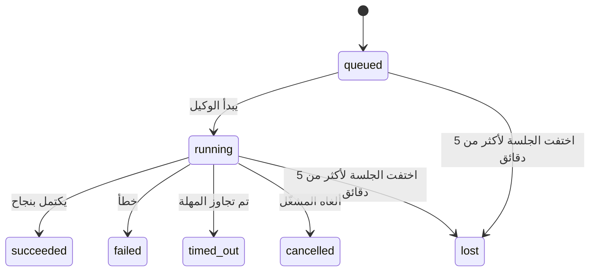

---
read_when:
    - فحص أعمال الخلفية الجارية حاليًا أو المكتملة مؤخرًا
    - تصحيح إخفاقات التسليم لتشغيلات الوكيل المنفصلة
    - فهم كيفية ارتباط تشغيلات الخلفية بالجلسات وcron وHeartbeat
summary: تتبّع مهام الخلفية لتشغيلات ACP، والوكلاء الفرعيين، ووظائف cron المعزولة، وعمليات CLI
title: مهام الخلفية
x-i18n:
    generated_at: "2026-04-06T03:06:47Z"
    model: gpt-5.4
    provider: openai
    source_hash: 2f56c1ac23237907a090c69c920c09578a2f56f5d8bf750c7f2136c603c8a8ff
    source_path: automation/tasks.md
    workflow: 15
---

# مهام الخلفية

> **هل تبحث عن الجدولة؟** راجع [الأتمتة والمهام](/ar/automation) لاختيار الآلية المناسبة. تغطي هذه الصفحة **تتبّع** أعمال الخلفية، وليس جدولتها.

تتتبّع مهام الخلفية الأعمال التي تعمل **خارج جلسة المحادثة الرئيسية**:
تشغيلات ACP، وتشغيلات الوكلاء الفرعيين، وتنفيذات وظائف cron المعزولة، والعمليات التي يبدأها CLI.

لا **تحل** المهام محل الجلسات أو وظائف cron أو Heartbeat — بل هي **سجل النشاط** الذي يدوّن ما هي الأعمال المنفصلة التي حدثت، ومتى حدثت، وما إذا كانت قد نجحت.

<Note>
ليست كل تشغيلات الوكيل تنشئ مهمة. لا تنشئها دورات Heartbeat ولا الدردشة التفاعلية العادية. أما جميع تنفيذات cron، وتشغيلات ACP، وتشغيلات الوكلاء الفرعيين، وأوامر الوكيل عبر CLI، فتنشئ مهام.
</Note>

## ملخص سريع

- المهام هي **سجلات** وليست أدوات جدولة — cron وHeartbeat يحددان _متى_ يُنفَّذ العمل، والمهام تتتبّع _ما الذي حدث_.
- ACP والوكلاء الفرعيون وجميع وظائف cron وعمليات CLI تنشئ مهام. أما دورات Heartbeat فلا تفعل ذلك.
- تنتقل كل مهمة عبر `queued → running → terminal` ‏(`succeeded` أو `failed` أو `timed_out` أو `cancelled` أو `lost`).
- تظل مهام cron نشطة ما دام وقت تشغيل cron لا يزال يملك الوظيفة؛ وتظل مهام CLI المدعومة بالدردشة نشطة فقط ما دام سياق التشغيل المالك لها لا يزال فعالًا.
- الإكمال يتم بالدفع: يمكن للعمل المنفصل أن يُخطر مباشرة أو يوقظ
  جلسة الطالب/Heartbeat عند انتهائه، لذلك تكون حلقات استطلاع
  الحالة عادةً نمطًا غير مناسب.
- تعمل تشغيلات cron المعزولة وعمليات إكمال الوكلاء الفرعيين، بأفضل جهد، على تنظيف علامات تبويب/عمليات المتصفح المتتبَّعة لجلسة الطفل قبل محاسبة التنظيف النهائية.
- يَحجب تسليم cron المعزول ردود الأصل المؤقتة القديمة بينما
  لا يزال عمل الوكيل الفرعي التابع قيد التصريف، كما يفضّل المخرجات النهائية التابعة
  عندما تصل قبل التسليم.
- تُسلَّم إشعارات الإكمال مباشرة إلى قناة أو تُدرج في قائمة انتظار لدورة Heartbeat التالية.
- يعرض `openclaw tasks list` جميع المهام؛ ويُظهر `openclaw tasks audit` المشكلات.
- تُحتفَظ بالسجلات النهائية لمدة 7 أيام، ثم تُزال تلقائيًا.

## بداية سريعة

```bash
# عرض جميع المهام (الأحدث أولًا)
openclaw tasks list

# التصفية حسب وقت التشغيل أو الحالة
openclaw tasks list --runtime acp
openclaw tasks list --status running

# عرض تفاصيل مهمة محددة (بالمعرّف أو معرّف التشغيل أو مفتاح الجلسة)
openclaw tasks show <lookup>

# إلغاء مهمة قيد التشغيل (يُنهي جلسة الطفل)
openclaw tasks cancel <lookup>

# تغيير سياسة الإشعارات لمهمة
openclaw tasks notify <lookup> state_changes

# تشغيل تدقيق سلامة
openclaw tasks audit

# معاينة الصيانة أو تطبيقها
openclaw tasks maintenance
openclaw tasks maintenance --apply

# فحص حالة TaskFlow
openclaw tasks flow list
openclaw tasks flow show <lookup>
openclaw tasks flow cancel <lookup>
```

## ما الذي ينشئ مهمة

| المصدر                 | نوع وقت التشغيل | متى يُنشأ سجل المهمة                               | سياسة الإشعارات الافتراضية |
| ---------------------- | --------------- | -------------------------------------------------- | -------------------------- |
| تشغيلات ACP في الخلفية | `acp`           | عند إنشاء جلسة ACP فرعية                           | `done_only`                |
| تنسيق الوكلاء الفرعيين | `subagent`      | عند إنشاء وكيل فرعي عبر `sessions_spawn`           | `done_only`                |
| وظائف cron (كل الأنواع) | `cron`         | كل تنفيذ لـ cron (الجلسة الرئيسية والمعزولة)       | `silent`                   |
| عمليات CLI             | `cli`           | أوامر `openclaw agent` التي تعمل عبر البوابة      | `silent`                   |
| مهام وسائط الوكيل      | `cli`           | تشغيلات `video_generate` المدعومة بجلسة            | `silent`                   |

تستخدم مهام cron الخاصة بالجلسة الرئيسية سياسة الإشعارات `silent` افتراضيًا — فهي تنشئ سجلات للتتبّع لكنها لا تولّد إشعارات. كما تستخدم مهام cron المعزولة أيضًا `silent` افتراضيًا لكنها تكون أوضح لأنها تعمل في جلستها الخاصة.

تستخدم تشغيلات `video_generate` المدعومة بجلسة أيضًا سياسة الإشعارات `silent`. فهي لا تزال تنشئ سجلات مهام، لكن تُعاد المعالجة عند الإكمال إلى جلسة الوكيل الأصلية كإيقاظ داخلي حتى يتمكن الوكيل من كتابة رسالة المتابعة وإرفاق الفيديو المكتمل بنفسه. إذا فعّلت `tools.media.asyncCompletion.directSend`، فإن عمليات الإكمال غير المتزامنة لـ `music_generate` و`video_generate` تحاول أولًا التسليم المباشر إلى القناة قبل الرجوع إلى مسار إيقاظ جلسة الطالب.

وأثناء بقاء مهمة `video_generate` مدعومة بجلسة نشطة، تعمل الأداة أيضًا كحاجز أمان: إذ إن استدعاءات `video_generate` المتكررة في الجلسة نفسها تُرجع حالة المهمة النشطة بدلًا من بدء عملية توليد متزامنة ثانية. استخدم `action: "status"` عندما تريد طلب تقدم/حالة صريح من جهة الوكيل.

**ما الذي لا ينشئ مهام:**

- دورات Heartbeat — الجلسة الرئيسية؛ راجع [Heartbeat](/ar/gateway/heartbeat)
- دورات الدردشة التفاعلية العادية
- استجابات `/command` المباشرة

## دورة حياة المهمة



| الحالة      | ما الذي تعنيه                                                            |
| ----------- | ------------------------------------------------------------------------ |
| `queued`    | أُنشئت وتنتظر بدء الوكيل                                                  |
| `running`   | يتم تنفيذ دورة الوكيل حاليًا بشكل نشط                                     |
| `succeeded` | اكتملت بنجاح                                                              |
| `failed`    | اكتملت مع حدوث خطأ                                                        |
| `timed_out` | تجاوزت المهلة المكوّنة                                                     |
| `cancelled` | أوقفها المشغّل عبر `openclaw tasks cancel`                                |
| `lost`      | فقد وقت التشغيل حالة الدعم الموثوقة بعد فترة سماح مدتها 5 دقائق          |

تحدث الانتقالات تلقائيًا — فعندما ينتهي تشغيل الوكيل المرتبط، تتحدث حالة المهمة لتطابقه.

تكون `lost` واعية بوقت التشغيل:

- مهام ACP: اختفت بيانات جلسة الطفل التابعة لـ ACP.
- مهام الوكيل الفرعي: اختفت جلسة الطفل التابعة من مخزن الوكيل المستهدف.
- مهام cron: لم يعد وقت تشغيل cron يتتبّع الوظيفة على أنها نشطة.
- مهام CLI: تستخدم مهام جلسة الطفل المعزولة جلسة الطفل؛ أما مهام CLI المدعومة بالدردشة فتستخدم سياق التشغيل الحي بدلًا من ذلك، لذلك لا تُبقي صفوف الجلسة المتبقية للقناة/المجموعة/المباشرة هذه المهام نشطة.

## التسليم والإشعارات

عندما تصل مهمة إلى حالة نهائية، يقوم OpenClaw بإخطارك. هناك مساران للتسليم:

**التسليم المباشر** — إذا كان للمهمة هدف قناة (`requesterOrigin`)، فستُرسل رسالة الإكمال مباشرة إلى تلك القناة (Telegram أو Discord أو Slack، إلخ). وبالنسبة إلى عمليات إكمال الوكلاء الفرعيين، يحافظ OpenClaw أيضًا على توجيه السلسلة/الموضوع المرتبط عند توفره، ويمكنه ملء قيمة `to` / الحساب الناقصة من المسار المخزَّن لجلسة الطالب (`lastChannel` / `lastTo` / `lastAccountId`) قبل التخلي عن التسليم المباشر.

**التسليم عبر قائمة انتظار الجلسة** — إذا فشل التسليم المباشر أو لم يتم تعيين أصل، فسيُدرج التحديث كحدث نظام في جلسة الطالب، ويظهر في دورة Heartbeat التالية.

<Tip>
يؤدي اكتمال المهمة إلى تفعيل إيقاظ Heartbeat فوري حتى ترى النتيجة بسرعة — ولا يتعين عليك انتظار نبضة Heartbeat المجدولة التالية.
</Tip>

هذا يعني أن سير العمل المعتاد قائم على الدفع: ابدأ العمل المنفصل مرة واحدة، ثم
دع وقت التشغيل يوقظك أو يخطرك عند الإكمال. لا تستطلع حالة المهمة إلا عندما
تحتاج إلى تصحيح أو تدخل أو تدقيق صريح.

### سياسات الإشعارات

تحكم في مقدار ما تسمعه عن كل مهمة:

| السياسة                | ما الذي يُسلَّم                                                          |
| ---------------------- | ------------------------------------------------------------------------ |
| `done_only` (افتراضي)  | الحالة النهائية فقط (`succeeded` أو `failed` وما إلى ذلك) — **وهذا هو الافتراضي** |
| `state_changes`        | كل انتقال حالة وتحديث تقدم                                               |
| `silent`               | لا شيء على الإطلاق                                                       |

غيّر السياسة أثناء تشغيل المهمة:

```bash
openclaw tasks notify <lookup> state_changes
```

## مرجع CLI

### `tasks list`

```bash
openclaw tasks list [--runtime <acp|subagent|cron|cli>] [--status <status>] [--json]
```

أعمدة المخرجات: معرّف المهمة، والنوع، والحالة، والتسليم، ومعرّف التشغيل، وجلسة الطفل، والملخص.

### `tasks show`

```bash
openclaw tasks show <lookup>
```

تقبل قيمة lookup معرّف مهمة، أو معرّف تشغيل، أو مفتاح جلسة. وتعرض السجل الكامل بما في ذلك التوقيت، وحالة التسليم، والخطأ، والملخص النهائي.

### `tasks cancel`

```bash
openclaw tasks cancel <lookup>
```

بالنسبة إلى مهام ACP والوكيل الفرعي، يؤدي هذا إلى إنهاء جلسة الطفل. تنتقل الحالة إلى `cancelled` ويُرسل إشعار تسليم.

### `tasks notify`

```bash
openclaw tasks notify <lookup> <done_only|state_changes|silent>
```

### `tasks audit`

```bash
openclaw tasks audit [--json]
```

يُظهر المشكلات التشغيلية. كما تظهر النتائج في `openclaw status` عند اكتشاف مشكلات.

| النتيجة                  | الخطورة | المُشغِّل                                             |
| ------------------------ | ------- | ----------------------------------------------------- |
| `stale_queued`           | warn    | بقيت في حالة انتظار لأكثر من 10 دقائق                 |
| `stale_running`          | error   | بقيت قيد التشغيل لأكثر من 30 دقيقة                    |
| `lost`                   | error   | اختفت ملكية المهمة المدعومة بوقت التشغيل              |
| `delivery_failed`        | warn    | فشل التسليم وكانت سياسة الإشعارات ليست `silent`       |
| `missing_cleanup`        | warn    | مهمة نهائية بلا طابع زمني للتنظيف                     |
| `inconsistent_timestamps` | warn   | مخالفة في التسلسل الزمني (مثلًا انتهت قبل أن تبدأ)    |

### `tasks maintenance`

```bash
openclaw tasks maintenance [--json]
openclaw tasks maintenance --apply [--json]
```

استخدم هذا لمعاينة أو تطبيق التسوية، ووضع طابع التنظيف، وإزالة السجلات
للمهام وحالة Task Flow.

التسوية واعية بوقت التشغيل:

- تتحقق مهام ACP/الوكيل الفرعي من جلسة الطفل التابعة لها.
- تتحقق مهام cron مما إذا كان وقت تشغيل cron لا يزال يملك الوظيفة.
- تتحقق مهام CLI المدعومة بالدردشة من سياق التشغيل الحي المالك، وليس فقط من صف جلسة الدردشة.

كما أن تنظيف الإكمال واعٍ بوقت التشغيل:

- تحاول عملية إكمال الوكيل الفرعي، بأفضل جهد، إغلاق علامات تبويب/عمليات المتصفح المتتبَّعة لجلسة الطفل قبل متابعة تنظيف الإعلان.
- تحاول عملية إكمال cron المعزول، بأفضل جهد، إغلاق علامات تبويب/عمليات المتصفح المتتبَّعة لجلسة cron قبل أن يُفكك التشغيل بالكامل.
- ينتظر تسليم cron المعزول انتهاء متابعة الوكيل الفرعي التابع عند الحاجة،
  ويَحجب نص الإقرار الأصلي القديم بدلًا من إعلانه.
- يفضّل تسليم إكمال الوكيل الفرعي أحدث نص مساعد مرئي؛ وإذا كان فارغًا يعود إلى أحدث نص مُنقّى من `tool`/`toolResult`، وقد تُختصر تشغيلات استدعاء الأدوات التي انتهت بمهلة فقط إلى ملخص قصير للتقدم الجزئي.
- لا تُخفي إخفاقات التنظيف النتيجة الحقيقية للمهمة.

### `tasks flow list|show|cancel`

```bash
openclaw tasks flow list [--status <status>] [--json]
openclaw tasks flow show <lookup> [--json]
openclaw tasks flow cancel <lookup>
```

استخدم هذه الأوامر عندما يكون ما يهمك هو Task Flow المنسِّق
بدلًا من سجل مهمة خلفية فردية.

## لوحة مهام الدردشة (`/tasks`)

استخدم `/tasks` في أي جلسة دردشة لرؤية مهام الخلفية المرتبطة بتلك الجلسة. تعرض اللوحة
المهام النشطة والمكتملة مؤخرًا مع وقت التشغيل والحالة والتوقيت وتفاصيل التقدم أو الخطأ.

عندما لا تحتوي الجلسة الحالية على مهام مرئية مرتبطة، يعود `/tasks` إلى أعداد المهام المحلية للوكيل
حتى تحصل على نظرة عامة من دون كشف تفاصيل الجلسات الأخرى.

للحصول على السجل التشغيلي الكامل، استخدم CLI: ‏`openclaw tasks list`.

## التكامل مع الحالة (ضغط المهام)

يتضمن `openclaw status` ملخصًا سريعًا لحالة المهام:

```
Tasks: 3 queued · 2 running · 1 issues
```

يعرض الملخص:

- **active** — عدد `queued` + `running`
- **failures** — عدد `failed` + `timed_out` + `lost`
- **byRuntime** — التقسيم حسب `acp` و`subagent` و`cron` و`cli`

يستخدم كلٌّ من `/status` والأداة `session_status` لقطة مهام واعية بالتنظيف: إذ تُفضَّل المهام النشطة،
وتُخفى الصفوف المكتملة القديمة، ولا تظهر الإخفاقات الأخيرة إلا عندما لا يبقى عمل نشط.
وهذا يُبقي بطاقة الحالة مركّزة على ما يهم الآن.

## التخزين والصيانة

### مكان وجود المهام

تُحفَظ سجلات المهام في SQLite في:

```
$OPENCLAW_STATE_DIR/tasks/runs.sqlite
```

يُحمَّل السجل إلى الذاكرة عند بدء البوابة، وتُزامَن الكتابات إلى SQLite لضمان الاستمرارية عبر عمليات إعادة التشغيل.

### الصيانة التلقائية

يعمل منظِّف كل **60 ثانية** ويتعامل مع ثلاثة أمور:

1. **التسوية** — يتحقق مما إذا كانت المهام النشطة لا تزال لها حالة دعم تشغيلية موثوقة. تستخدم مهام ACP/الوكيل الفرعي حالة جلسة الطفل، وتستخدم مهام cron ملكية الوظيفة النشطة، وتستخدم مهام CLI المدعومة بالدردشة سياق التشغيل المالك. وإذا اختفت حالة الدعم هذه لأكثر من 5 دقائق، تُعلَّم المهمة بالحالة `lost`.
2. **وضع طابع التنظيف** — يعيّن طابعًا زمنيًا `cleanupAfter` على المهام النهائية (`endedAt` + 7 أيام).
3. **الإزالة** — يحذف السجلات التي تجاوزت تاريخ `cleanupAfter` الخاص بها.

**الاحتفاظ**: تُحتفَظ بسجلات المهام النهائية لمدة **7 أيام**، ثم تُزال تلقائيًا. لا حاجة إلى أي إعداد.

## كيف ترتبط المهام بالأنظمة الأخرى

### المهام وTask Flow

تُعد [Task Flow](/ar/automation/taskflow) طبقة تنسيق التدفق فوق مهام الخلفية. وقد ينسّق تدفق واحد عدة مهام خلال عمره باستخدام أوضاع مزامنة مُدارة أو معكوسة. استخدم `openclaw tasks` لفحص سجلات المهام الفردية و`openclaw tasks flow` لفحص التدفق المنسِّق.

راجع [Task Flow](/ar/automation/taskflow) للتفاصيل.

### المهام وcron

يوجد **تعريف** وظيفة cron في `~/.openclaw/cron/jobs.json`. يُنشئ **كل** تنفيذ لـ cron سجل مهمة — سواء في الجلسة الرئيسية أو في الجلسة المعزولة. تستخدم مهام cron الخاصة بالجلسة الرئيسية سياسة الإشعارات `silent` افتراضيًا لكي تتتبّع دون إنشاء إشعارات.

راجع [وظائف Cron](/ar/automation/cron-jobs).

### المهام وHeartbeat

تشغيلات Heartbeat هي دورات في الجلسة الرئيسية — وهي لا تنشئ سجلات مهام. وعندما تكتمل مهمة، يمكنها تفعيل إيقاظ Heartbeat حتى ترى النتيجة بسرعة.

راجع [Heartbeat](/ar/gateway/heartbeat).

### المهام والجلسات

قد تشير المهمة إلى `childSessionKey` (حيث يُنفَّذ العمل) و`requesterSessionKey` (مَن بدأه). الجلسات هي سياق المحادثة؛ أما المهام فهي تتبّع للنشاط فوق ذلك.

### المهام وتشغيلات الوكيل

يرتبط `runId` الخاص بالمهمة بتشغيل الوكيل الذي ينفذ العمل. وتحدّث أحداث دورة حياة الوكيل (البدء، والانتهاء، والخطأ) حالة المهمة تلقائيًا — ولا تحتاج إلى إدارة دورة الحياة يدويًا.

## ذو صلة

- [الأتمتة والمهام](/ar/automation) — جميع آليات الأتمتة في لمحة
- [Task Flow](/ar/automation/taskflow) — تنسيق التدفق فوق المهام
- [المهام المجدولة](/ar/automation/cron-jobs) — جدولة أعمال الخلفية
- [Heartbeat](/ar/gateway/heartbeat) — دورات الجلسة الرئيسية الدورية
- [CLI: Tasks](/cli/index#tasks) — مرجع أوامر CLI
