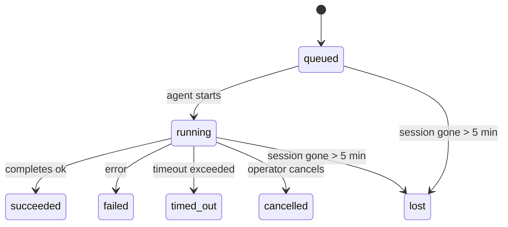

---
read_when:
    - فحص العمل الجاري في الخلفية أو الذي اكتمل مؤخرًا
    - تصحيح أخطاء فشل التسليم لتشغيلات الوكيل المنفصلة
    - فهم كيفية ارتباط التشغيلات في الخلفية بالجلسات وcron وheartbeat
summary: تتبّع المهام في الخلفية لتشغيلات ACP، والوكلاء الفرعيين، ووظائف cron المعزولة، وعمليات CLI
title: المهام في الخلفية
x-i18n:
    generated_at: "2026-04-05T12:34:43Z"
    model: gpt-5.4
    provider: openai
    source_hash: 6c95ccf4388d07e60a7bb68746b161793f4bb5ff2ba3d5ce9e51f2225dab2c4d
    source_path: automation/tasks.md
    workflow: 15
---

# المهام في الخلفية

> **هل تبحث عن الجدولة؟** راجع [Automation & Tasks](/automation) لاختيار الآلية المناسبة. تغطي هذه الصفحة **تتبّع** العمل في الخلفية، وليس جدولته.

تتتبّع المهام في الخلفية العمل الذي يُشغَّل **خارج جلسة المحادثة الرئيسية**:
تشغيلات ACP، وإنشاء الوكلاء الفرعيين، وتنفيذات وظائف cron المعزولة، والعمليات التي تبدأ عبر CLI.

لا تحل المهام محل الجلسات أو وظائف cron أو heartbeat، بل هي **سجل النشاط** الذي يدوّن ما الذي حدث في العمل المنفصل، ومتى حدث، وما إذا كان قد نجح.

<Note>
ليس كل تشغيل وكيل ينشئ مهمة. أدوار heartbeat والدردشة التفاعلية العادية لا تفعل ذلك. أما جميع تنفيذات cron، وعمليات إنشاء ACP، وعمليات إنشاء الوكلاء الفرعيين، وأوامر وكيل CLI فتنشئ مهام.
</Note>

## ملخص سريع

- المهام هي **سجلات** وليست مجدولات — يحدد cron وheartbeat _متى_ يُشغَّل العمل، بينما تتتبّع المهام _ما الذي حدث_.
- تنشئ ACP، والوكلاء الفرعيون، وجميع وظائف cron، وعمليات CLI مهام. أدوار heartbeat لا تفعل ذلك.
- تنتقل كل مهمة عبر `queued → running → terminal` (succeeded أو failed أو timed_out أو cancelled أو lost).
- تبقى مهام cron نشطة ما دام وقت تشغيل cron لا يزال يملك الوظيفة؛ وتبقى مهام CLI المعتمدة على الدردشة نشطة فقط ما دام سياق التشغيل المالك لها لا يزال فعالًا.
- يعتمد الإكمال على الدفع: يمكن للعمل المنفصل الإخطار مباشرة أو إيقاظ
  جلسة الطالب/heartbeat عند انتهائه، لذلك تكون حلقات استطلاع الحالة عادةً
  نهجًا غير مناسب.
- تنظّف تشغيلات cron المعزولة وإكمالات الوكلاء الفرعيين، على أساس أفضل جهد، علامات تبويب/عمليات المتصفح المتتبَّعة لجلسة الابن قبل إنهاء أعمال التنظيف النهائية.
- يمنع تسليم cron المعزول الردود المرحلية القديمة من الأصل أثناء
  استمرار تصريف عمل الوكيل الفرعي المنحدر، ويفضّل المخرجات النهائية للفرع
  المنحدر عندما تصل قبل التسليم.
- تُسلَّم إشعارات الإكمال مباشرة إلى قناة أو تُدرج في الطابور لنبضة heartbeat التالية.
- يعرض `openclaw tasks list` جميع المهام؛ ويكشف `openclaw tasks audit` المشكلات.
- تُحتفظ السجلات النهائية لمدة 7 أيام، ثم تُحذف تلقائيًا.

## بدء سريع

```bash
# عرض جميع المهام (الأحدث أولًا)
openclaw tasks list

# التصفية حسب وقت التشغيل أو الحالة
openclaw tasks list --runtime acp
openclaw tasks list --status running

# عرض تفاصيل مهمة محددة (بالمعرف أو معرّف التشغيل أو مفتاح الجلسة)
openclaw tasks show <lookup>

# إلغاء مهمة قيد التشغيل (يُنهي جلسة الابن)
openclaw tasks cancel <lookup>

# تغيير سياسة الإشعارات لمهمة
openclaw tasks notify <lookup> state_changes

# تشغيل تدقيق صحي
openclaw tasks audit

# معاينة الصيانة أو تطبيقها
openclaw tasks maintenance
openclaw tasks maintenance --apply

# فحص حالة TaskFlow
openclaw tasks flow list
openclaw tasks flow show <lookup>
openclaw tasks flow cancel <lookup>
```

## ما الذي ينشئ مهمة

| المصدر                 | نوع وقت التشغيل | متى يُنشأ سجل المهمة                                  | سياسة الإشعار الافتراضية |
| ---------------------- | --------------- | ----------------------------------------------------- | ------------------------ |
| تشغيلات ACP في الخلفية | `acp`           | عند إنشاء جلسة ACP فرعية                              | `done_only`              |
| تنسيق الوكلاء الفرعيين | `subagent`      | عند إنشاء وكيل فرعي عبر `sessions_spawn`              | `done_only`              |
| وظائف cron (كل الأنواع) | `cron`         | كل تنفيذ cron (في الجلسة الرئيسية والمعزول)           | `silent`                 |
| عمليات CLI             | `cli`           | أوامر `openclaw agent` التي تعمل عبر gateway          | `silent`                 |

تستخدم مهام cron في الجلسة الرئيسية سياسة الإشعار `silent` افتراضيًا — فهي تنشئ سجلات للتتبّع لكنها لا تولّد إشعارات. كما تستخدم مهام cron المعزولة `silent` افتراضيًا أيضًا، لكنها أوضح ظهورًا لأنها تعمل في جلستها الخاصة.

**ما الذي لا ينشئ مهام:**

- أدوار heartbeat — الجلسة الرئيسية؛ راجع [Heartbeat](/gateway/heartbeat)
- أدوار الدردشة التفاعلية العادية
- استجابات `/command` المباشرة

## دورة حياة المهمة



| الحالة      | ما الذي تعنيه                                                            |
| ----------- | ------------------------------------------------------------------------ |
| `queued`    | أُنشئت وتنتظر بدء الوكيل                                                 |
| `running`   | يجري تنفيذ دور الوكيل حاليًا                                             |
| `succeeded` | اكتملت بنجاح                                                             |
| `failed`    | اكتملت مع حدوث خطأ                                                       |
| `timed_out` | تجاوزت المهلة المكوّنة                                                    |
| `cancelled` | أوقفها المشغّل عبر `openclaw tasks cancel`                               |
| `lost`      | فقد وقت التشغيل حالة الدعم الموثوقة بعد فترة سماح مدتها 5 دقائق          |

تحدث الانتقالات تلقائيًا — فعندما ينتهي تشغيل الوكيل المرتبط، تتحدّث حالة المهمة لتطابقه.

تكون `lost` واعية بوقت التشغيل:

- مهام ACP: اختفت بيانات جلسة ACP الفرعية الداعمة.
- مهام الوكيل الفرعي: اختفت الجلسة الفرعية الداعمة من مخزن الوكيل المستهدف.
- مهام cron: لم يعد وقت تشغيل cron يتتبّع الوظيفة بوصفها نشطة.
- مهام CLI: تستخدم مهام الجلسة الفرعية المعزولة جلسة الابن؛ بينما تستخدم مهام CLI المعتمدة على الدردشة سياق التشغيل النشط مباشرة، لذلك لا تُبقي صفوف جلسات القناة/المجموعة/المباشرة العالقة هذه المهام نشطة.

## التسليم والإشعارات

عندما تصل مهمة إلى حالة نهائية، يقوم OpenClaw بإخطارك. توجد مساران للتسليم:

**التسليم المباشر** — إذا كان للمهمة هدف قناة (أي `requesterOrigin`)، تنتقل رسالة الإكمال مباشرة إلى تلك القناة (Telegram أو Discord أو Slack، وغير ذلك). بالنسبة إلى إكمالات الوكيل الفرعي، يحافظ OpenClaw أيضًا على توجيه السلسلة/الموضوع المرتبط عند توفره، ويمكنه ملء قيمة `to` أو الحساب المفقود من المسار المخزَّن في جلسة الطالب (`lastChannel` / `lastTo` / `lastAccountId`) قبل التخلي عن التسليم المباشر.

**التسليم المدرج في طابور الجلسة** — إذا فشل التسليم المباشر أو لم يُضبط أصل، يُدرج التحديث كحدث نظام في جلسة الطالب ويظهر عند heartbeat التالية.

<Tip>
يؤدي اكتمال المهمة إلى تشغيل إيقاظ heartbeat فوري حتى ترى النتيجة بسرعة — لا تحتاج إلى انتظار نبضة heartbeat المجدولة التالية.
</Tip>

هذا يعني أن سير العمل المعتاد يعتمد على الدفع: ابدأ العمل المنفصل مرة واحدة، ثم دع
وقت التشغيل يوقظك أو يخطرك عند الإكمال. لا تستطلع حالة المهمة إلا عندما
تحتاج إلى تصحيح الأخطاء أو التدخل أو إجراء تدقيق صريح.

### سياسات الإشعار

تحكّم في مقدار ما تتلقاه من كل مهمة:

| السياسة               | ما الذي يُسلَّم                                                         |
| --------------------- | ----------------------------------------------------------------------- |
| `done_only` (افتراضي) | الحالة النهائية فقط (مثل succeeded وfailed وغيرها) — **وهذا هو الافتراضي** |
| `state_changes`       | كل انتقال حالة وتحديث تقدّم                                             |
| `silent`              | لا شيء على الإطلاق                                                      |

غيّر السياسة أثناء تشغيل المهمة:

```bash
openclaw tasks notify <lookup> state_changes
```

## مرجع CLI

### `tasks list`

```bash
openclaw tasks list [--runtime <acp|subagent|cron|cli>] [--status <status>] [--json]
```

أعمدة المخرجات: معرّف المهمة، والنوع، والحالة، والتسليم، ومعرّف التشغيل، وجلسة الابن، والملخص.

### `tasks show`

```bash
openclaw tasks show <lookup>
```

يقبل رمز البحث معرّف مهمة، أو معرّف تشغيل، أو مفتاح جلسة. ويعرض السجل الكامل بما في ذلك التوقيت، وحالة التسليم، والخطأ، والملخص النهائي.

### `tasks cancel`

```bash
openclaw tasks cancel <lookup>
```

بالنسبة إلى مهام ACP والوكيل الفرعي، يؤدي هذا إلى إنهاء جلسة الابن. وتنتقل الحالة إلى `cancelled` ويُرسل إشعار بالتسليم.

### `tasks notify`

```bash
openclaw tasks notify <lookup> <done_only|state_changes|silent>
```

### `tasks audit`

```bash
openclaw tasks audit [--json]
```

يكشف عن المشكلات التشغيلية. كما تظهر النتائج في `openclaw status` عند اكتشاف مشكلات.

| النتيجة                  | الشدة  | المحفّز                                                |
| ------------------------ | ------ | ------------------------------------------------------ |
| `stale_queued`           | warn   | بقيت في الانتظار لأكثر من 10 دقائق                     |
| `stale_running`          | error  | بقيت قيد التشغيل لأكثر من 30 دقيقة                     |
| `lost`                   | error  | اختفت ملكية المهمة المدعومة من وقت التشغيل             |
| `delivery_failed`        | warn   | فشل التسليم وسياسة الإشعار ليست `silent`               |
| `missing_cleanup`        | warn   | مهمة نهائية من دون طابع زمني للتنظيف                   |
| `inconsistent_timestamps`| warn   | مخالفة في الخط الزمني (مثل الانتهاء قبل البدء)         |

### `tasks maintenance`

```bash
openclaw tasks maintenance [--json]
openclaw tasks maintenance --apply [--json]
```

استخدم هذا لمعاينة أو تطبيق التسوية، ووضع طابع التنظيف، والحذف
للمهام وحالة Task Flow.

التسوية واعية بوقت التشغيل:

- تتحقق مهام ACP/الوكيل الفرعي من جلسة الابن الداعمة.
- تتحقق مهام cron مما إذا كان وقت تشغيل cron لا يزال يملك الوظيفة.
- تتحقق مهام CLI المعتمدة على الدردشة من سياق التشغيل النشط المالك، وليس فقط صف جلسة الدردشة.

كما أن تنظيف الإكمال واعٍ بوقت التشغيل:

- يحاول إكمال الوكيل الفرعي، على أساس أفضل جهد، إغلاق علامات تبويب/عمليات المتصفح المتتبَّعة لجلسة الابن قبل متابعة إعلان التنظيف.
- يحاول إكمال cron المعزول، على أساس أفضل جهد، إغلاق علامات تبويب/عمليات المتصفح المتتبَّعة لجلسة cron قبل أن يُفكك التشغيل بالكامل.
- ينتظر تسليم cron المعزول متابعة الوكيل الفرعي المنحدر عند الحاجة،
  ويمنع نص الإقرار الأصلي القديم بدلًا من الإعلان عنه.
- يفضّل تسليم إكمال الوكيل الفرعي أحدث نص مرئي للمساعد؛ وإذا كان فارغًا يعود إلى نص tool/toolResult الأحدث بعد تنقيته، ويمكن أن تُختصر تشغيلات استدعاء الأدوات التي انتهت بالمهلة فقط إلى ملخص قصير للتقدّم الجزئي.
- لا تحجب إخفاقات التنظيف النتيجة الحقيقية للمهمة.

### `tasks flow list|show|cancel`

```bash
openclaw tasks flow list [--status <status>] [--json]
openclaw tasks flow show <lookup> [--json]
openclaw tasks flow cancel <lookup>
```

استخدم هذه الأوامر عندما يكون Task Flow المنسِّق هو ما يهمك
بدلًا من سجل مهمة واحدة في الخلفية.

## لوحة مهام الدردشة (`/tasks`)

استخدم `/tasks` في أي جلسة دردشة لرؤية المهام في الخلفية المرتبطة بتلك الجلسة. تعرض اللوحة
المهام النشطة والتي اكتملت مؤخرًا مع وقت التشغيل والحالة والتوقيت وتفاصيل التقدّم أو الخطأ.

عندما لا تحتوي الجلسة الحالية على مهام مرتبطة مرئية، يعود `/tasks` إلى أعداد المهام المحلية للوكيل
حتى تحصل على نظرة عامة من دون كشف تفاصيل الجلسات الأخرى.

للحصول على سجل المشغّل الكامل، استخدم CLI: `openclaw tasks list`.

## التكامل مع الحالة (ضغط المهام)

يتضمن `openclaw status` ملخصًا سريعًا للمهام:

```
Tasks: 3 queued · 2 running · 1 issues
```

يعرض الملخص:

- **active** — عدد `queued` + `running`
- **failures** — عدد `failed` + `timed_out` + `lost`
- **byRuntime** — تفصيل حسب `acp` و`subagent` و`cron` و`cli`

يستخدم كل من `/status` وأداة `session_status` لقطة مهام واعية بالتنظيف: تُفضَّل المهام النشطة،
وتُخفى الصفوف المكتملة القديمة، ولا تظهر الإخفاقات الحديثة إلا عندما لا يبقى عمل نشط.
وهذا يُبقي بطاقة الحالة مركّزة على ما يهم الآن.

## التخزين والصيانة

### مكان وجود المهام

تُحفَظ سجلات المهام في SQLite في:

```
$OPENCLAW_STATE_DIR/tasks/runs.sqlite
```

يُحمَّل السجل إلى الذاكرة عند بدء gateway، وتُزامَن الكتابات إلى SQLite لضمان الاستمرارية عبر عمليات إعادة التشغيل.

### الصيانة التلقائية

يعمل منظّف كل **60 ثانية** ويتعامل مع ثلاثة أمور:

1. **التسوية** — يتحقق مما إذا كانت المهام النشطة لا تزال تملك دعمًا موثوقًا من وقت التشغيل. تستخدم مهام ACP/الوكيل الفرعي حالة الجلسة الفرعية، وتستخدم مهام cron ملكية الوظيفة النشطة، وتستخدم مهام CLI المعتمدة على الدردشة سياق التشغيل المالك. إذا اختفت حالة الدعم هذه لأكثر من 5 دقائق، تُعلَّم المهمة بأنها `lost`.
2. **وضع طابع التنظيف** — يضبط طابعًا زمنيًا `cleanupAfter` على المهام النهائية (`endedAt + 7 days`).
3. **الحذف** — يحذف السجلات التي تجاوزت تاريخ `cleanupAfter` الخاص بها.

**مدة الاحتفاظ**: تُحتفظ سجلات المهام النهائية لمدة **7 أيام**، ثم تُحذف تلقائيًا. لا حاجة إلى أي إعداد.

## كيف ترتبط المهام بالأنظمة الأخرى

### المهام وTask Flow

[Task Flow](/automation/taskflow) هي طبقة تنسيق التدفق فوق المهام في الخلفية. قد ينسّق تدفق واحد عدة مهام خلال عمره باستخدام أوضاع المزامنة المُدارة أو المعكوسة. استخدم `openclaw tasks` لفحص سجلات المهام الفردية و`openclaw tasks flow` لفحص التدفق المنسِّق.

راجع [Task Flow](/automation/taskflow) للتفاصيل.

### المهام وcron

يعيش **تعريف** وظيفة cron في `~/.openclaw/cron/jobs.json`. ينشئ **كل** تنفيذ cron سجل مهمة — سواء في الجلسة الرئيسية أو بشكل معزول. تستخدم مهام cron في الجلسة الرئيسية سياسة الإشعار `silent` افتراضيًا حتى تتتبّع من دون توليد إشعارات.

راجع [وظائف Cron](/automation/cron-jobs).

### المهام وheartbeat

تشغيلات heartbeat هي أدوار جلسة رئيسية — ولا تنشئ سجلات مهام. وعندما تكتمل مهمة، يمكنها تشغيل إيقاظ heartbeat حتى ترى النتيجة بسرعة.

راجع [Heartbeat](/gateway/heartbeat).

### المهام والجلسات

قد تشير المهمة إلى `childSessionKey` (حيث يُشغَّل العمل) و`requesterSessionKey` (من بدأه). الجلسات هي سياق المحادثة؛ أما المهام فهي تتبّع النشاط فوق ذلك.

### المهام وتشغيلات الوكيل

يرتبط `runId` الخاص بالمهمة بتشغيل الوكيل الذي ينفّذ العمل. وتحدّث أحداث دورة حياة الوكيل (البدء، والانتهاء، والخطأ) حالة المهمة تلقائيًا — ولا تحتاج إلى إدارة دورة الحياة يدويًا.

## ذو صلة

- [Automation & Tasks](/automation) — جميع آليات الأتمتة في لمحة
- [Task Flow](/automation/taskflow) — تنسيق التدفق فوق المهام
- [المهام المجدولة](/automation/cron-jobs) — جدولة العمل في الخلفية
- [Heartbeat](/gateway/heartbeat) — أدوار الجلسة الرئيسية الدورية
- [CLI: Tasks](/cli/index#tasks) — مرجع أوامر CLI
