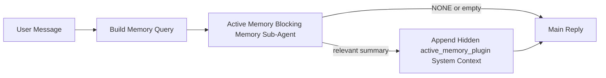

---
read_when:
    - أنت تريد فهم الغرض من الذاكرة النشطة
    - تريد تشغيل الذاكرة النشطة لوكيل محادثة
    - تريد ضبط سلوك الذاكرة النشطة من دون تفعيلها في كل مكان
summary: وكيل فرعي لذاكرة الحظر مملوك للمكوّن الإضافي يحقن الذاكرة ذات الصلة في جلسات الدردشة التفاعلية
title: الذاكرة النشطة
x-i18n:
    generated_at: "2026-04-10T07:17:27Z"
    model: gpt-5.4
    provider: openai
    source_hash: 6a51437df4ae4d9d57764601dfcfcdadb269e2895bf49dc82b9f496c1b3cb341
    source_path: concepts/active-memory.md
    workflow: 15
---

# الذاكرة النشطة

الذاكرة النشطة هي وكيل فرعي اختياري لذاكرة الحظر مملوك للمكوّن الإضافي ويعمل
قبل الرد الرئيسي في جلسات المحادثة المؤهلة.

وهي موجودة لأن معظم أنظمة الذاكرة قادرة ولكنها تفاعلية. فهي تعتمد على
الوكيل الرئيسي ليقرر متى يبحث في الذاكرة، أو على المستخدم ليقول أشياء
مثل "تذكر هذا" أو "ابحث في الذاكرة". وبحلول ذلك الوقت، تكون اللحظة التي كان
من الممكن أن تجعل فيها الذاكرة الرد يبدو طبيعيًا قد فاتت بالفعل.

تمنح الذاكرة النشطة النظام فرصة واحدة محدودة لإظهار الذاكرة ذات الصلة
قبل إنشاء الرد الرئيسي.

## الصق هذا في الوكيل الخاص بك

الصق هذا في الوكيل الخاص بك إذا كنت تريد أن يفعّل الذاكرة النشطة باستخدام
إعداد مكتفٍ ذاتيًا وآمن افتراضيًا:

```json5
{
  plugins: {
    entries: {
      "active-memory": {
        enabled: true,
        config: {
          enabled: true,
          agents: ["main"],
          allowedChatTypes: ["direct"],
          modelFallbackPolicy: "default-remote",
          queryMode: "recent",
          promptStyle: "balanced",
          timeoutMs: 15000,
          maxSummaryChars: 220,
          persistTranscripts: false,
          logging: true,
        },
      },
    },
  },
}
```

يؤدي هذا إلى تشغيل المكوّن الإضافي للوكيل `main`، وإبقائه مقصورًا افتراضيًا على
الجلسات بأسلوب الرسائل المباشرة، ويسمح له أولًا بوراثة نموذج الجلسة الحالية،
ومع ذلك يظل يسمح بالرجوع الاحتياطي البعيد المضمّن إذا لم يتوفر أي نموذج صريح
أو موروث.

بعد ذلك، أعد تشغيل البوابة:

```bash
node scripts/run-node.mjs gateway --profile dev
```

لمعاينته مباشرة داخل محادثة:

```text
/verbose on
```

## تشغيل الذاكرة النشطة

أكثر إعدادات الأمان هي:

1. تفعيل المكوّن الإضافي
2. استهداف وكيل محادثة واحد
3. إبقاء التسجيل مفعّلًا فقط أثناء الضبط

ابدأ بهذا في `openclaw.json`:

```json5
{
  plugins: {
    entries: {
      "active-memory": {
        enabled: true,
        config: {
          agents: ["main"],
          allowedChatTypes: ["direct"],
          modelFallbackPolicy: "default-remote",
          queryMode: "recent",
          promptStyle: "balanced",
          timeoutMs: 15000,
          maxSummaryChars: 220,
          persistTranscripts: false,
          logging: true,
        },
      },
    },
  },
}
```

ثم أعد تشغيل البوابة:

```bash
node scripts/run-node.mjs gateway --profile dev
```

معنى هذا:

- `plugins.entries.active-memory.enabled: true` يشغّل المكوّن الإضافي
- `config.agents: ["main"]` يفعّل الذاكرة النشطة للوكيل `main` فقط
- `config.allowedChatTypes: ["direct"]` يُبقي الذاكرة النشطة مفعّلة افتراضيًا فقط للجلسات بأسلوب الرسائل المباشرة
- إذا لم يتم تعيين `config.model`، فإن الذاكرة النشطة ترث أولًا نموذج الجلسة الحالية
- `config.modelFallbackPolicy: "default-remote"` يُبقي الرجوع الاحتياطي البعيد المضمّن هو الافتراضي عندما لا يتوفر نموذج صريح أو موروث
- `config.promptStyle: "balanced"` يستخدم نمط المطالبة الافتراضي للأغراض العامة لوضع `recent`
- لا تزال الذاكرة النشطة تعمل فقط على جلسات الدردشة التفاعلية الدائمة المؤهلة

## كيفية رؤيتها

تحقن الذاكرة النشطة سياق نظام مخفيًا للنموذج. وهي لا تعرض
وسوم `<active_memory_plugin>...</active_memory_plugin>` الخام للعميل.

## تبديل الجلسة

استخدم أمر المكوّن الإضافي عندما تريد إيقاف الذاكرة النشطة مؤقتًا أو استئنافها
لجلسة الدردشة الحالية من دون تعديل الإعدادات:

```text
/active-memory status
/active-memory off
/active-memory on
```

هذا النطاق خاص بالجلسة. ولا يغيّر
`plugins.entries.active-memory.enabled` أو استهداف الوكيل أو أي إعداد
عام آخر.

إذا كنت تريد أن يكتب الأمر الإعدادات ويوقف الذاكرة النشطة مؤقتًا أو يستأنفها
لكل الجلسات، فاستخدم الصيغة العامة الصريحة:

```text
/active-memory status --global
/active-memory off --global
/active-memory on --global
```

تكتب الصيغة العامة `plugins.entries.active-memory.config.enabled`. وهي تُبقي
`plugins.entries.active-memory.enabled` مفعّلًا حتى يظل الأمر متاحًا
لتشغيل الذاكرة النشطة مرة أخرى لاحقًا.

إذا كنت تريد معرفة ما الذي تفعله الذاكرة النشطة في جلسة مباشرة، ففعّل
الوضع المطوّل لتلك الجلسة:

```text
/verbose on
```

عند تفعيل الوضع المطوّل، يمكن لـ OpenClaw إظهار:

- سطر حالة للذاكرة النشطة مثل `Active Memory: ok 842ms recent 34 chars`
- ملخص تصحيح مقروء مثل `Active Memory Debug: Lemon pepper wings with blue cheese.`

هذه الأسطر مشتقة من نفس مرور الذاكرة النشطة الذي يغذي سياق
النظام المخفي، لكنها منسقة للبشر بدلًا من عرض ترميز المطالبة الخام.

افتراضيًا، يكون نص جلسة وكيل الذاكرة الفرعي للحظر مؤقتًا ويُحذف
بعد اكتمال التشغيل.

مثال على التدفق:

```text
/verbose on
what wings should i order?
```

شكل الرد المرئي المتوقع:

```text
...normal assistant reply...

🧩 Active Memory: ok 842ms recent 34 chars
🔎 Active Memory Debug: Lemon pepper wings with blue cheese.
```

## متى يعمل

تستخدم الذاكرة النشطة بوابتين:

1. **الاشتراك عبر الإعدادات**
   يجب تفعيل المكوّن الإضافي، ويجب أن يظهر معرّف الوكيل الحالي في
   `plugins.entries.active-memory.config.agents`.
2. **أهلية وقت التشغيل الصارمة**
   حتى عند التفعيل والاستهداف، لا تعمل الذاكرة النشطة إلا مع
   جلسات الدردشة التفاعلية الدائمة المؤهلة.

القاعدة الفعلية هي:

```text
plugin enabled
+
agent id targeted
+
allowed chat type
+
eligible interactive persistent chat session
=
active memory runs
```

إذا فشل أي من ذلك، فلن تعمل الذاكرة النشطة.

## أنواع الجلسات

تتحكم `config.allowedChatTypes` في أنواع المحادثات التي يمكن أن تشغّل الذاكرة
النشطة أصلًا.

القيمة الافتراضية هي:

```json5
allowedChatTypes: ["direct"]
```

هذا يعني أن الذاكرة النشطة تعمل افتراضيًا في الجلسات بأسلوب الرسائل المباشرة،
لكنها لا تعمل في جلسات المجموعات أو القنوات إلا إذا قمت بتفعيلها لها صراحةً.

أمثلة:

```json5
allowedChatTypes: ["direct"]
```

```json5
allowedChatTypes: ["direct", "group"]
```

```json5
allowedChatTypes: ["direct", "group", "channel"]
```

## أين تعمل

الذاكرة النشطة ميزة لإثراء المحادثة، وليست ميزة استدلال
على مستوى المنصة بالكامل.

| السطح                                                             | هل تعمل الذاكرة النشطة؟                                  |
| ------------------------------------------------------------------- | ------------------------------------------------------- |
| جلسات Control UI / web chat الدائمة                           | نعم، إذا كان المكوّن الإضافي مفعّلًا وكان الوكيل مستهدفًا |
| جلسات القنوات التفاعلية الأخرى على نفس مسار الدردشة الدائم | نعم، إذا كان المكوّن الإضافي مفعّلًا وكان الوكيل مستهدفًا |
| التشغيلات غير التفاعلية أحادية الاستخدام                                              | لا                                                      |
| تشغيلات نبضات الحياة/الخلفية                                           | لا                                                      |
| مسارات `agent-command` الداخلية العامة                              | لا                                                      |
| تنفيذ الوكيل الفرعي/المساعد الداخلي                                 | لا                                                      |

## لماذا تستخدمها

استخدم الذاكرة النشطة عندما:

- تكون الجلسة دائمة وموجّهة للمستخدم
- يكون لدى الوكيل ذاكرة طويلة الأمد ذات معنى للبحث فيها
- تكون الاستمرارية والتخصيص أهم من الحتمية الخام للمطالبة

وهي تعمل بشكل جيد خاصةً مع:

- التفضيلات الثابتة
- العادات المتكررة
- سياق المستخدم طويل الأمد الذي ينبغي أن يظهر بشكل طبيعي

وهي ليست مناسبة لـ:

- الأتمتة
- العمال الداخليين
- مهام API أحادية الاستخدام
- الأماكن التي قد يكون فيها التخصيص المخفي مفاجئًا

## كيف تعمل

شكل وقت التشغيل هو:



يمكن لوكيل الذاكرة الفرعي للحظر استخدام ما يلي فقط:

- `memory_search`
- `memory_get`

إذا كان الاتصال ضعيفًا، فيجب أن يعيد `NONE`.

## أوضاع الاستعلام

تتحكم `config.queryMode` في مقدار المحادثة التي يراها وكيل الذاكرة الفرعي للحظر.

## أنماط المطالبة

يتحكم `config.promptStyle` في مدى حماس أو صرامة وكيل الذاكرة الفرعي للحظر
عند اتخاذ قرار ما إذا كان سيعيد ذاكرة أم لا.

الأنماط المتاحة:

- `balanced`: الافتراضي العام لوضع `recent`
- `strict`: الأقل حماسًا؛ الأفضل عندما تريد أقل قدر ممكن من التأثر بالسياق القريب
- `contextual`: الأكثر ملاءمة للاستمرارية؛ الأفضل عندما يكون لتاريخ المحادثة أهمية أكبر
- `recall-heavy`: أكثر استعدادًا لإظهار الذاكرة عند وجود تطابقات أخف لكنها لا تزال محتملة
- `precision-heavy`: يفضّل `NONE` بقوة ما لم يكن التطابق واضحًا
- `preference-only`: مُحسّن للمفضلات والعادات والروتين والذوق والحقائق الشخصية المتكررة

التعيين الافتراضي عندما لا يتم تعيين `config.promptStyle`:

```text
message -> strict
recent -> balanced
full -> contextual
```

إذا قمت بتعيين `config.promptStyle` صراحةً، فستكون هذه القيمة المتجاوزة هي المعتمدة.

مثال:

```json5
promptStyle: "preference-only"
```

## سياسة الرجوع الاحتياطي للنموذج

إذا لم يتم تعيين `config.model`، فإن الذاكرة النشطة تحاول حل نموذج بهذا الترتيب:

```text
explicit plugin model
-> current session model
-> agent primary model
-> optional built-in remote fallback
```

تتحكم `config.modelFallbackPolicy` في الخطوة الأخيرة.

الافتراضي:

```json5
modelFallbackPolicy: "default-remote"
```

خيار آخر:

```json5
modelFallbackPolicy: "resolved-only"
```

استخدم `resolved-only` إذا كنت تريد من الذاكرة النشطة تخطي الاسترجاع بدلًا من
الرجوع إلى الافتراضي البعيد المضمّن عندما لا يتوفر نموذج صريح أو موروث.

## منافذ هروب متقدمة

هذه الخيارات ليست عمدًا جزءًا من الإعداد الموصى به.

يمكن لـ `config.thinking` تجاوز مستوى التفكير لوكيل الذاكرة الفرعي للحظر:

```json5
thinking: "medium"
```

الافتراضي:

```json5
thinking: "off"
```

لا تفعّل هذا افتراضيًا. تعمل الذاكرة النشطة ضمن مسار الرد، لذلك فإن وقت
التفكير الإضافي يزيد مباشرةً من زمن الاستجابة المرئي للمستخدم.

يضيف `config.promptAppend` تعليمات إضافية للمشغّل بعد مطالبة الذاكرة النشطة
الافتراضية وقبل سياق المحادثة:

```json5
promptAppend: "Prefer stable long-term preferences over one-off events."
```

يستبدل `config.promptOverride` مطالبة الذاكرة النشطة الافتراضية. ولا يزال OpenClaw
يضيف سياق المحادثة بعد ذلك:

```json5
promptOverride: "You are a memory search agent. Return NONE or one compact user fact."
```

لا يُنصح بتخصيص المطالبة إلا إذا كنت تختبر عمدًا
عقد استرجاع مختلفًا. فالمطالبة الافتراضية مضبوطة لإرجاع `NONE`
أو سياقًا مدمجًا لحقائق المستخدم للنموذج الرئيسي.

### `message`

يُرسل فقط أحدث رسالة من المستخدم.

```text
Latest user message only
```

استخدم هذا عندما:

- تريد أسرع سلوك
- تريد أقوى انحياز نحو استرجاع التفضيلات الثابتة
- لا تحتاج المنعطفات اللاحقة إلى سياق المحادثة

المهلة الزمنية الموصى بها:

- ابدأ من حوالي `3000` إلى `5000` مللي ثانية

### `recent`

تُرسل أحدث رسالة من المستخدم بالإضافة إلى ذيل صغير من المحادثة الحديثة.

```text
Recent conversation tail:
user: ...
assistant: ...
user: ...

Latest user message:
...
```

استخدم هذا عندما:

- تريد توازنًا أفضل بين السرعة والارتكاز إلى المحادثة
- تعتمد أسئلة المتابعة غالبًا على آخر بضع منعطفات

المهلة الزمنية الموصى بها:

- ابدأ من حوالي `15000` مللي ثانية

### `full`

تُرسل المحادثة الكاملة إلى وكيل الذاكرة الفرعي للحظر.

```text
Full conversation context:
user: ...
assistant: ...
user: ...
...
```

استخدم هذا عندما:

- تكون أفضل جودة استرجاع أهم من زمن الاستجابة
- تحتوي المحادثة على إعداد مهم في موضع بعيد من السلسلة

المهلة الزمنية الموصى بها:

- زِدها بدرجة كبيرة مقارنةً بـ `message` أو `recent`
- ابدأ من حوالي `15000` مللي ثانية أو أكثر بحسب حجم السلسلة

بشكل عام، يجب أن تزداد المهلة الزمنية مع حجم السياق:

```text
message < recent < full
```

## استمرارية النصوص

تؤدي تشغيلات وكيل الذاكرة الفرعي للحظر الخاصة بالذاكرة النشطة إلى إنشاء
نص `session.jsonl` حقيقي أثناء استدعاء وكيل الذاكرة الفرعي للحظر.

افتراضيًا، يكون هذا النص مؤقتًا:

- يُكتب في دليل مؤقت
- يُستخدم فقط لتشغيل وكيل الذاكرة الفرعي للحظر
- يُحذف فورًا بعد انتهاء التشغيل

إذا كنت تريد الاحتفاظ بنصوص وكيل الذاكرة الفرعي للحظر على القرص لأغراض التصحيح أو
الفحص، ففعّل الاستمرارية صراحةً:

```json5
{
  plugins: {
    entries: {
      "active-memory": {
        enabled: true,
        config: {
          agents: ["main"],
          persistTranscripts: true,
          transcriptDir: "active-memory",
        },
      },
    },
  },
}
```

عند التفعيل، تخزّن الذاكرة النشطة النصوص في دليل منفصل ضمن
مجلد جلسات الوكيل المستهدف، وليس في
مسار نص محادثة المستخدم الرئيسي.

يكون التخطيط الافتراضي من حيث المفهوم:

```text
agents/<agent>/sessions/active-memory/<blocking-memory-sub-agent-session-id>.jsonl
```

يمكنك تغيير الدليل الفرعي النسبي باستخدام `config.transcriptDir`.

استخدم هذا بحذر:

- يمكن أن تتراكم نصوص وكيل الذاكرة الفرعي للحظر بسرعة في الجلسات المزدحمة
- يمكن لوضع الاستعلام `full` أن يكرر قدرًا كبيرًا من سياق المحادثة
- تحتوي هذه النصوص على سياق مطالبة مخفي وذكريات مسترجعة

## الإعدادات

توجد جميع إعدادات الذاكرة النشطة ضمن:

```text
plugins.entries.active-memory
```

أهم الحقول هي:

| المفتاح                         | النوع                                                                                                 | المعنى                                                                                                |
| --------------------------- | ---------------------------------------------------------------------------------------------------- | ------------------------------------------------------------------------------------------------------ |
| `enabled`                   | `boolean`                                                                                            | يفعّل المكوّن الإضافي نفسه                                                                              |
| `config.agents`             | `string[]`                                                                                           | معرّفات الوكلاء الذين يمكنهم استخدام الذاكرة النشطة                                                                   |
| `config.model`              | `string`                                                                                             | مرجع نموذج اختياري لوكيل الذاكرة الفرعي للحظر؛ وعند عدم تعيينه، تستخدم الذاكرة النشطة نموذج الجلسة الحالية |
| `config.queryMode`          | `"message" \| "recent" \| "full"`                                                                    | يتحكم في مقدار المحادثة التي يراها وكيل الذاكرة الفرعي للحظر                                      |
| `config.promptStyle`        | `"balanced" \| "strict" \| "contextual" \| "recall-heavy" \| "precision-heavy" \| "preference-only"` | يتحكم في مدى حماس أو صرامة وكيل الذاكرة الفرعي للحظر عند اتخاذ قرار ما إذا كان سيعيد ذاكرة   |
| `config.thinking`           | `"off" \| "minimal" \| "low" \| "medium" \| "high" \| "xhigh" \| "adaptive"`                         | تجاوز متقدم لمستوى التفكير لوكيل الذاكرة الفرعي للحظر؛ الافتراضي هو `off` للسرعة                  |
| `config.promptOverride`     | `string`                                                                                             | استبدال كامل متقدم للمطالبة؛ غير موصى به للاستخدام العادي                                       |
| `config.promptAppend`       | `string`                                                                                             | تعليمات إضافية متقدمة تُلحق بالمطالبة الافتراضية أو المستبدلة                               |
| `config.timeoutMs`          | `number`                                                                                             | مهلة زمنية قصوى صارمة لوكيل الذاكرة الفرعي للحظر                                                         |
| `config.maxSummaryChars`    | `number`                                                                                             | الحد الأقصى لإجمالي الأحرف المسموح بها في ملخص الذاكرة النشطة                                          |
| `config.logging`            | `boolean`                                                                                            | يصدر سجلات الذاكرة النشطة أثناء الضبط                                                                  |
| `config.persistTranscripts` | `boolean`                                                                                            | يحتفظ بنصوص وكيل الذاكرة الفرعي للحظر على القرص بدلًا من حذف الملفات المؤقتة                     |
| `config.transcriptDir`      | `string`                                                                                             | دليل نصوص وكيل الذاكرة الفرعي للحظر النسبي ضمن مجلد جلسات الوكيل                |

حقول ضبط مفيدة:

| المفتاح                           | النوع     | المعنى                                                       |
| ----------------------------- | -------- | ------------------------------------------------------------- |
| `config.maxSummaryChars`      | `number` | الحد الأقصى لإجمالي الأحرف المسموح بها في ملخص الذاكرة النشطة |
| `config.recentUserTurns`      | `number` | منعطفات المستخدم السابقة التي يجب تضمينها عندما تكون `queryMode` هي `recent`      |
| `config.recentAssistantTurns` | `number` | منعطفات المساعد السابقة التي يجب تضمينها عندما تكون `queryMode` هي `recent` |
| `config.recentUserChars`      | `number` | الحد الأقصى للأحرف لكل منعطف مستخدم حديث                                |
| `config.recentAssistantChars` | `number` | الحد الأقصى للأحرف لكل منعطف مساعد حديث                           |
| `config.cacheTtlMs`           | `number` | إعادة استخدام ذاكرة التخزين المؤقت للاستعلامات المتطابقة المتكررة                    |

## الإعداد الموصى به

ابدأ بـ `recent`.

```json5
{
  plugins: {
    entries: {
      "active-memory": {
        enabled: true,
        config: {
          agents: ["main"],
          queryMode: "recent",
          promptStyle: "balanced",
          timeoutMs: 15000,
          maxSummaryChars: 220,
          logging: true,
        },
      },
    },
  },
}
```

إذا كنت تريد فحص السلوك المباشر أثناء الضبط، فاستخدم `/verbose on` في
الجلسة بدلًا من البحث عن أمر تصحيح منفصل للذاكرة النشطة.

ثم انتقل إلى:

- `message` إذا كنت تريد زمن استجابة أقل
- `full` إذا قررت أن السياق الإضافي يستحق وكيل الذاكرة الفرعي للحظر الأبطأ

## تصحيح الأخطاء

إذا لم تظهر الذاكرة النشطة حيث تتوقع:

1. تأكد من أن المكوّن الإضافي مفعّل ضمن `plugins.entries.active-memory.enabled`.
2. تأكد من أن معرّف الوكيل الحالي مدرج في `config.agents`.
3. تأكد من أنك تختبر من خلال جلسة دردشة تفاعلية دائمة.
4. فعّل `config.logging: true` وراقب سجلات البوابة.
5. تحقّق من أن البحث في الذاكرة نفسه يعمل باستخدام `openclaw memory status --deep`.

إذا كانت نتائج الذاكرة مليئة بالضجيج، فشدّد:

- `maxSummaryChars`

إذا كانت الذاكرة النشطة بطيئة جدًا:

- خفّض `queryMode`
- خفّض `timeoutMs`
- قلّل عدد المنعطفات الحديثة
- قلّل حدود الأحرف لكل منعطف

## الصفحات ذات الصلة

- [البحث في الذاكرة](/ar/concepts/memory-search)
- [مرجع إعدادات الذاكرة](/ar/reference/memory-config)
- [إعداد Plugin SDK](/ar/plugins/sdk-setup)
