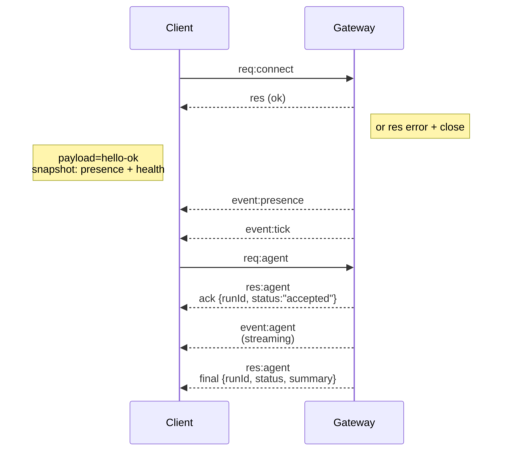

---
read_when:
    - العمل على بروتوكول gateway أو العملاء أو وسائل النقل
summary: بنية Gateway عبر WebSocket، والمكونات، وتدفقات العملاء
title: بنية Gateway
x-i18n:
    generated_at: "2026-04-05T12:40:04Z"
    model: gpt-5.4
    provider: openai
    source_hash: 2b12a2a29e94334c6d10787ac85c34b5b046f9a14f3dd53be453368ca4a7547d
    source_path: concepts/architecture.md
    workflow: 15
---

# بنية Gateway

## نظرة عامة

- يمتلك **Gateway** واحد طويل العمر جميع أسطح المراسلة (WhatsApp عبر
  Baileys، وTelegram عبر grammY، وSlack، وDiscord، وSignal، وiMessage، وWebChat).
- يتصل عملاء مستوى التحكم (تطبيق macOS، وCLI، وواجهة الويب، وعمليات الأتمتة) بـ
  Gateway عبر **WebSocket** على مضيف الربط المهيأ (الافتراضي
  `127.0.0.1:18789`).
- تتصل **العقد** (macOS/iOS/Android/بلا واجهة) أيضًا عبر **WebSocket**، ولكن
  تعلن `role: node` مع قدرات/أوامر صريحة.
- Gateway واحد لكل مضيف؛ وهو المكان الوحيد الذي يفتح جلسة WhatsApp.
- يتم تقديم **مضيف canvas** بواسطة خادم HTTP الخاص بـ Gateway تحت:
  - `/__openclaw__/canvas/` ‏(HTML/CSS/JS قابل للتحرير بواسطة الوكيل)
  - `/__openclaw__/a2ui/` ‏(مضيف A2UI)
    ويستخدم المنفذ نفسه الخاص بـ Gateway (الافتراضي `18789`).

## المكونات والتدفقات

### Gateway ‏(daemon)

- يحافظ على اتصالات المزوّدين.
- يكشف WS API مكتوبة الأنواع (طلبات، واستجابات، وأحداث دفع من الخادم).
- يتحقق من الإطارات الواردة مقابل JSON Schema.
- يصدر أحداثًا مثل `agent` و`chat` و`presence` و`health` و`heartbeat` و`cron`.

### العملاء (تطبيق mac / CLI / إدارة الويب)

- اتصال WS واحد لكل عميل.
- يرسلون طلبات (`health` و`status` و`send` و`agent` و`system-presence`).
- يشتركون في الأحداث (`tick` و`agent` و`presence` و`shutdown`).

### العقد (macOS / iOS / Android / بلا واجهة)

- تتصل بـ **خادم WS نفسه** مع `role: node`.
- توفّر هوية جهاز في `connect`؛ ويكون الاقتران **قائمًا على الجهاز** (الدور `node`) وتوجد
  الموافقة في مخزن اقتران الأجهزة.
- تكشف أوامر مثل `canvas.*` و`camera.*` و`screen.record` و`location.get`.

تفاصيل البروتوكول:

- [بروتوكول Gateway](/gateway/protocol)

### WebChat

- واجهة ثابتة تستخدم Gateway WS API لسجل الدردشة وعمليات الإرسال.
- في الإعدادات البعيدة، تتصل عبر نفق SSH/Tailscale نفسه مثل بقية
  العملاء.

## دورة حياة الاتصال (عميل واحد)



## البروتوكول على السلك (ملخص)

- النقل: WebSocket، وإطارات نصية بحمولة JSON.
- يجب أن يكون الإطار الأول **`connect`**.
- بعد المصافحة:
  - الطلبات: `{type:"req", id, method, params}` → `{type:"res", id, ok, payload|error}`
  - الأحداث: `{type:"event", event, payload, seq?, stateVersion?}`
- إن `hello-ok.features.methods` / `events` هي بيانات وصفية للاكتشاف، وليست
  تفريغًا مولدًا لكل مسار مساعد قابل للاستدعاء.
- تستخدم المصادقة بالسر المشترك `connect.params.auth.token` أو
  `connect.params.auth.password`، وفقًا لوضع مصادقة gateway المهيأ.
- تستوفي الأوضاع الحاملة للهوية مثل Tailscale Serve
  (`gateway.auth.allowTailscale: true`) أو الربط غير المحلي
  `gateway.auth.mode: "trusted-proxy"` المصادقة من ترويسات الطلب
  بدلًا من `connect.params.auth.*`.
- يقوم `gateway.auth.mode: "none"` في الإدخال الخاص بتعطيل مصادقة السر المشترك
  بالكامل؛ وأبقِ هذا الوضع معطّلًا على الإدخالات العامة/غير الموثوقة.
- مفاتيح idempotency مطلوبة للطرق ذات الآثار الجانبية (`send` و`agent`) من أجل
  إعادة المحاولة بأمان؛ ويحتفظ الخادم بذاكرة تخزين مؤقت قصيرة العمر لإزالة التكرار.
- يجب أن تتضمن العقد `role: "node"` بالإضافة إلى caps/commands/permissions في `connect`.

## الاقتران + الثقة المحلية

- تتضمن جميع عملاء WS ‏(operators + nodes) **هوية جهاز** عند `connect`.
- تتطلب معرّفات الأجهزة الجديدة موافقة اقتران؛ ويصدر Gateway **رمز جهاز**
  للاتصالات اللاحقة.
- يمكن الموافقة تلقائيًا على الاتصالات المحلية المباشرة عبر loopback للحفاظ على
  سلاسة تجربة الاستخدام على المضيف نفسه.
- يمتلك OpenClaw أيضًا مسار اتصال ذاتي ضيقًا داخل الخلفية/الحاوية لتدفقات المساعد
  الموثوقة ذات السر المشترك.
- لا تزال اتصالات tailnet وLAN، بما في ذلك روابط tailnet على المضيف نفسه، تتطلب
  موافقة اقتران صريحة.
- يجب أن توقّع جميع الاتصالات قيمة nonce ‏`connect.challenge`.
- تربط حمولة التوقيع `v3` أيضًا `platform` + `deviceFamily`؛ ويثبّت gateway البيانات الوصفية المقترنة عند إعادة الاتصال ويتطلب اقتران إصلاح عند تغيّر البيانات الوصفية.
- لا تزال الاتصالات **غير المحلية** تتطلب موافقة صريحة.
- لا تزال مصادقة Gateway ‏(`gateway.auth.*`) تنطبق على **كل** الاتصالات، المحلية أو
  البعيدة.

التفاصيل: [بروتوكول Gateway](/gateway/protocol)، [الاقتران](/channels/pairing)،
[الأمان](/gateway/security).

## كتابة أنواع البروتوكول وتوليد الشيفرة

- تعرّف مخططات TypeBox البروتوكول.
- يتم توليد JSON Schema من هذه المخططات.
- يتم توليد نماذج Swift من JSON Schema.

## الوصول البعيد

- المفضل: Tailscale أو VPN.
- البديل: نفق SSH

  ```bash
  ssh -N -L 18789:127.0.0.1:18789 user@host
  ```

- تنطبق المصافحة نفسها + رمز المصادقة نفسه عبر النفق.
- يمكن تمكين TLS + التثبيت الاختياري لـ WS في الإعدادات البعيدة.

## لمحة تشغيلية

- البدء: `openclaw gateway` ‏(في الواجهة الأمامية، مع تسجيل السجلات إلى stdout).
- الصحة: `health` عبر WS ‏(ومضمنة أيضًا في `hello-ok`).
- الإشراف: launchd/systemd لإعادة التشغيل التلقائي.

## الثوابت

- يتحكم Gateway واحد فقط في جلسة Baileys واحدة لكل مضيف.
- المصافحة إلزامية؛ وأي إطار أول غير JSON أو غير `connect` يؤدي إلى إغلاق صارم.
- لا تتم إعادة تشغيل الأحداث؛ ويجب على العملاء إعادة التحديث عند وجود فجوات.

## ذو صلة

- [حلقة الوكيل](/concepts/agent-loop) — دورة تنفيذ الوكيل بالتفصيل
- [بروتوكول Gateway](/gateway/protocol) — عقد بروتوكول WebSocket
- [الطابور](/concepts/queue) — طابور الأوامر والتزامن
- [الأمان](/gateway/security) — نموذج الثقة والتقوية
