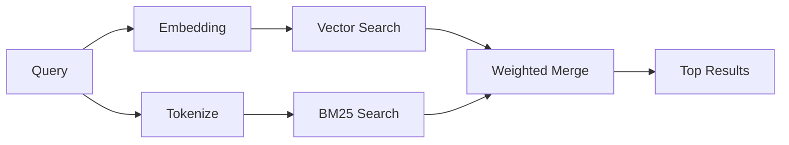

---
read_when:
    - تريد فهم كيفية عمل `memory_search`
    - تريد اختيار موفر embedding
    - تريد ضبط جودة البحث
summary: كيف يعثر بحث الذاكرة على الملاحظات ذات الصلة باستخدام embeddings والاسترجاع الهجين
title: بحث الذاكرة
x-i18n:
    generated_at: "2026-04-06T03:06:28Z"
    model: gpt-5.4
    provider: openai
    source_hash: b6541cd702bff41f9a468dad75ea438b70c44db7c65a4b793cbacaf9e583c7e9
    source_path: concepts/memory-search.md
    workflow: 15
---

# بحث الذاكرة

يعثر `memory_search` على الملاحظات ذات الصلة من ملفات الذاكرة لديك، حتى عندما
تختلف الصياغة عن النص الأصلي. ويعمل ذلك من خلال فهرسة الذاكرة إلى مقاطع صغيرة
والبحث فيها باستخدام embeddings أو الكلمات المفتاحية أو كليهما.

## البدء السريع

إذا كان لديك مفتاح API مهيأ لـ OpenAI أو Gemini أو Voyage أو Mistral، فإن بحث
الذاكرة يعمل تلقائيًا. لتعيين موفر بشكل صريح:

```json5
{
  agents: {
    defaults: {
      memorySearch: {
        provider: "openai", // أو "gemini" أو "local" أو "ollama" وما إلى ذلك.
      },
    },
  },
}
```

لاستخدام embeddings محلية من دون مفتاح API، استخدم `provider: "local"` (يتطلب
`node-llama-cpp`).

## الموفرون المدعومون

| الموفر | المعرّف | يحتاج مفتاح API | ملاحظات |
| -------- | --------- | ------------- | ---------------------------------------------------- |
| OpenAI   | `openai`  | نعم           | يُكتشف تلقائيًا، سريع |
| Gemini   | `gemini`  | نعم           | يدعم فهرسة الصور/الصوت |
| Voyage   | `voyage`  | نعم           | يُكتشف تلقائيًا |
| Mistral  | `mistral` | نعم           | يُكتشف تلقائيًا |
| Bedrock  | `bedrock` | لا            | يُكتشف تلقائيًا عند نجاح سلسلة بيانات اعتماد AWS |
| Ollama   | `ollama`  | لا            | محلي، ويجب تعيينه صراحةً |
| Local    | `local`   | لا            | نموذج GGUF، تنزيل بحجم ~0.6 GB |

## كيف يعمل البحث

يشغّل OpenClaw مسارين للاسترجاع بالتوازي ويدمج النتائج:



- **البحث المتجهي** يعثر على الملاحظات ذات المعنى المتشابه (مثل تطابق "gateway host" مع
  "the machine running OpenClaw").
- **بحث الكلمات المفتاحية BM25** يعثر على التطابقات الدقيقة (المعرّفات، وسلاسل الأخطاء، ومفاتيح
  الإعدادات).

إذا كان أحد المسارين فقط متاحًا (لا توجد embeddings أو لا توجد FTS)، فسيعمل
المسار الآخر وحده.

## تحسين جودة البحث

تساعد ميزتان اختياريتان عندما يكون لديك سجل كبير من الملاحظات:

### اضمحلال زمني

تفقد الملاحظات القديمة وزن الترتيب تدريجيًا بحيث تظهر المعلومات الحديثة أولًا.
وبعمر نصف افتراضي يبلغ 30 يومًا، تحصل ملاحظة من الشهر الماضي على 50% من
وزنها الأصلي. لا تُطبّق أي عملية اضمحلال على الملفات الدائمة مثل `MEMORY.md`.

<Tip>
فعّل الاضمحلال الزمني إذا كان لدى وكيلك ملاحظات يومية تمتد لأشهر وكانت
المعلومات القديمة تتفوق باستمرار على السياق الحديث.
</Tip>

### MMR (التنوع)

يقلل النتائج المتكررة. فإذا كانت خمس ملاحظات كلها تذكر إعداد الموجّه نفسه، فإن
MMR يضمن أن تغطي النتائج العليا موضوعات مختلفة بدلًا من التكرار.

<Tip>
فعّل MMR إذا كان `memory_search` يستمر في إعادة مقتطفات شبه متطابقة من
ملاحظات يومية مختلفة.
</Tip>

### تفعيل الاثنين معًا

```json5
{
  agents: {
    defaults: {
      memorySearch: {
        query: {
          hybrid: {
            mmr: { enabled: true },
            temporalDecay: { enabled: true },
          },
        },
      },
    },
  },
}
```

## ذاكرة متعددة الوسائط

باستخدام Gemini Embedding 2، يمكنك فهرسة الصور والملفات الصوتية إلى جانب
Markdown. تظل استعلامات البحث نصية، لكنها تطابق المحتوى المرئي والصوتي. راجع
[مرجع إعدادات الذاكرة](/ar/reference/memory-config) لمعرفة الإعداد.

## بحث ذاكرة الجلسة

يمكنك اختياريًا فهرسة نصوص الجلسات حتى يتمكن `memory_search` من استرجاع
المحادثات السابقة. هذا إعداد اختياري عبر
`memorySearch.experimental.sessionMemory`. راجع
[مرجع الإعدادات](/ar/reference/memory-config) لمزيد من التفاصيل.

## استكشاف الأخطاء وإصلاحها

**لا توجد نتائج؟** شغّل `openclaw memory status` للتحقق من الفهرس. إذا كان فارغًا،
فشغّل `openclaw memory index --force`.

**توجد تطابقات كلمات مفتاحية فقط؟** قد لا يكون موفر embedding مهيأ. تحقق من
`openclaw memory status --deep`.

**تعذر العثور على نص CJK؟** أعد بناء فهرس FTS باستخدام
`openclaw memory index --force`.

## قراءة إضافية

- [الذاكرة](/ar/concepts/memory) -- تخطيط الملفات، والواجهات الخلفية، والأدوات
- [مرجع إعدادات الذاكرة](/ar/reference/memory-config) -- جميع خيارات الإعداد
