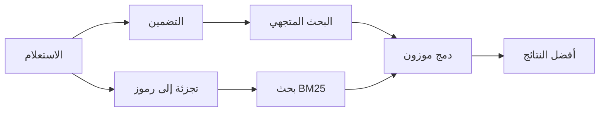

---
read_when:
    - تريد أن تفهم كيف يعمل `memory_search`
    - تريد اختيار موفّر تضمينات
    - تريد ضبط جودة البحث
summary: كيف يعثر بحث الذاكرة على الملاحظات ذات الصلة باستخدام التضمينات والاسترجاع الهجين
title: بحث الذاكرة
x-i18n:
    generated_at: "2026-04-10T07:17:40Z"
    model: gpt-5.4
    provider: openai
    source_hash: ca0237f4f1ee69dcbfb12e6e9527a53e368c0bf9b429e506831d4af2f3a3ac6f
    source_path: concepts/memory-search.md
    workflow: 15
---

# بحث الذاكرة

يعثر `memory_search` على الملاحظات ذات الصلة من ملفات الذاكرة لديك، حتى عندما
تختلف الصياغة عن النص الأصلي. يعمل ذلك عبر فهرسة الذاكرة إلى مقاطع صغيرة
والبحث فيها باستخدام التضمينات، أو الكلمات المفتاحية، أو كليهما.

## البدء السريع

إذا كان لديك مفتاح API مضبوط لـ OpenAI أو Gemini أو Voyage أو Mistral، فإن بحث
الذاكرة يعمل تلقائيًا. لتعيين موفّر بشكل صريح:

```json5
{
  agents: {
    defaults: {
      memorySearch: {
        provider: "openai", // أو "gemini" أو "local" أو "ollama" وما إلى ذلك.
      },
    },
  },
}
```

بالنسبة إلى التضمينات المحلية من دون مفتاح API، استخدم `provider: "local"` (يتطلب
`node-llama-cpp`).

## الموفّرون المدعومون

| الموفّر | المعرّف        | يحتاج إلى مفتاح API | ملاحظات                                                |
| ------- | -------------- | ------------------- | ------------------------------------------------------ |
| OpenAI  | `openai`       | نعم                 | يُكتشف تلقائيًا، سريع                                  |
| Gemini  | `gemini`       | نعم                 | يدعم فهرسة الصور/الصوت                                 |
| Voyage  | `voyage`       | نعم                 | يُكتشف تلقائيًا                                        |
| Mistral | `mistral`      | نعم                 | يُكتشف تلقائيًا                                        |
| Bedrock | `bedrock`      | لا                  | يُكتشف تلقائيًا عند نجاح سلسلة بيانات اعتماد AWS       |
| Ollama  | `ollama`       | لا                  | محلي، ويجب تعيينه صراحةً                               |
| Local   | `local`        | لا                  | نموذج GGUF، تنزيل بحجم ~0.6 غيغابايت                   |

## كيف يعمل البحث

يشغّل OpenClaw مساري استرجاع بالتوازي ثم يدمج النتائج:



- **البحث المتجهي** يعثر على الملاحظات ذات المعنى المتشابه ("gateway host" يطابق
  "الجهاز الذي يشغّل OpenClaw").
- **بحث الكلمات المفتاحية BM25** يعثر على التطابقات الدقيقة (المعرّفات، وسلاسل
  الأخطاء، ومفاتيح الإعدادات).

إذا كان مسار واحد فقط متاحًا (لا توجد تضمينات أو لا توجد FTS)، فسيعمل المسار
الآخر وحده.

## تحسين جودة البحث

تساعد ميزتان اختياريتان عندما يكون لديك سجل كبير من الملاحظات:

### التناقص الزمني

تفقد الملاحظات القديمة وزنها في الترتيب تدريجيًا، بحيث تظهر المعلومات الحديثة
أولًا. مع نصف العمر الافتراضي البالغ 30 يومًا، تسجّل ملاحظة من الشهر الماضي 50%
من وزنها الأصلي. لا يُطبّق التناقص أبدًا على الملفات الدائمة مثل `MEMORY.md`.

<Tip>
فعّل التناقص الزمني إذا كان لدى وكيلك أشهر من الملاحظات اليومية وكانت
المعلومات القديمة تتفوّق باستمرار على السياق الحديث.
</Tip>

### MMR (التنوّع)

يقلّل النتائج المتكررة. إذا كانت خمس ملاحظات تذكر إعداد جهاز التوجيه نفسه، فإن
MMR يضمن أن تغطي أفضل النتائج موضوعات مختلفة بدلًا من التكرار.

<Tip>
فعّل MMR إذا كان `memory_search` يستمر في إعادة مقاطع شبه متطابقة من
ملاحظات يومية مختلفة.
</Tip>

### تفعيل الاثنين معًا

```json5
{
  agents: {
    defaults: {
      memorySearch: {
        query: {
          hybrid: {
            mmr: { enabled: true },
            temporalDecay: { enabled: true },
          },
        },
      },
    },
  },
}
```

## الذاكرة متعددة الوسائط

باستخدام Gemini Embedding 2، يمكنك فهرسة الصور والملفات الصوتية إلى جانب
Markdown. تظل استعلامات البحث نصية، لكنها تطابق المحتوى المرئي والصوتي. راجع
[مرجع إعدادات الذاكرة](/ar/reference/memory-config) لمعرفة الإعداد.

## بحث ذاكرة الجلسة

يمكنك اختياريًا فهرسة نصوص الجلسات حتى يتمكن `memory_search` من استدعاء
المحادثات السابقة. هذا خيار اشتراك اختياري عبر
`memorySearch.experimental.sessionMemory`. راجع
[مرجع الإعدادات](/ar/reference/memory-config) للتفاصيل.

## استكشاف الأخطاء وإصلاحها

**لا توجد نتائج؟** شغّل `openclaw memory status` للتحقق من الفهرس. إذا كان فارغًا،
فشغّل `openclaw memory index --force`.

**مطابقات كلمات مفتاحية فقط؟** قد لا يكون موفّر التضمينات مضبوطًا. تحقّق من
`openclaw memory status --deep`.

**تعذر العثور على نص CJK؟** أعد بناء فهرس FTS باستخدام
`openclaw memory index --force`.

## قراءة إضافية

- [الذاكرة النشطة](/ar/concepts/active-memory) -- ذاكرة الوكيل الفرعي لجلسات الدردشة التفاعلية
- [الذاكرة](/ar/concepts/memory) -- تخطيط الملفات، والواجهات الخلفية، والأدوات
- [مرجع إعدادات الذاكرة](/ar/reference/memory-config) -- جميع خيارات الإعداد
