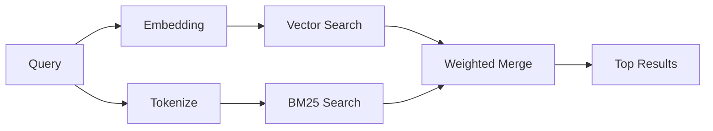

---
read_when:
    - تريد فهم كيفية عمل `memory_search`
    - تريد اختيار مزود embedding
    - تريد ضبط جودة البحث
summary: كيف يعثر البحث في الذاكرة على الملاحظات ذات الصلة باستخدام embeddings والاسترجاع الهجين
title: البحث في الذاكرة
x-i18n:
    generated_at: "2026-04-05T12:40:35Z"
    model: gpt-5.4
    provider: openai
    source_hash: 87b1cb3469c7805f95bca5e77a02919d1e06d626ad3633bbc5465f6ab9db12a2
    source_path: concepts/memory-search.md
    workflow: 15
---

# البحث في الذاكرة

يعثر `memory_search` على الملاحظات ذات الصلة من ملفات الذاكرة، حتى عندما
تختلف الصياغة عن النص الأصلي. ويعمل ذلك عن طريق فهرسة الذاكرة إلى أجزاء
صغيرة والبحث فيها باستخدام embeddings أو الكلمات المفتاحية أو كليهما.

## البدء السريع

إذا كانت لديك مفاتيح API مكوّنة لـ OpenAI أو Gemini أو Voyage أو Mistral، فإن
البحث في الذاكرة يعمل تلقائيًا. ولتعيين مزود بشكل صريح:

```json5
{
  agents: {
    defaults: {
      memorySearch: {
        provider: "openai", // أو "gemini" أو "local" أو "ollama" وما إلى ذلك.
      },
    },
  },
}
```

بالنسبة إلى embeddings المحلية من دون مفتاح API، استخدم `provider: "local"` ‏(يتطلب
node-llama-cpp).

## المزوّدون المدعومون

| المزوّد | المعرّف   | يحتاج إلى مفتاح API | ملاحظات                         |
| ------- | --------- | ------------------- | ------------------------------- |
| OpenAI  | `openai`  | نعم                 | يُكتشف تلقائيًا، سريع           |
| Gemini  | `gemini`  | نعم                 | يدعم فهرسة الصور/الصوت          |
| Voyage  | `voyage`  | نعم                 | يُكتشف تلقائيًا                 |
| Mistral | `mistral` | نعم                 | يُكتشف تلقائيًا                 |
| Ollama  | `ollama`  | لا                  | محلي، ويجب تعيينه صراحةً        |
| Local   | `local`   | لا                  | نموذج GGUF، تنزيل ~0.6 GB       |

## كيف يعمل البحث

يشغّل OpenClaw مساري استرجاع بالتوازي ويدمج النتائج:



- **البحث المتجهي** يعثر على الملاحظات ذات المعنى المشابه ("gateway host" يطابق
  "the machine running OpenClaw").
- **بحث الكلمات المفتاحية BM25** يعثر على المطابقات الدقيقة (المعرّفات، وسلاسل الأخطاء، ومفاتيح
  التكوين).

إذا كان مسار واحد فقط متاحًا (لا توجد embeddings أو لا توجد FTS)، فسيعمل الآخر وحده.

## تحسين جودة البحث

تساعد ميزتان اختياريتان عندما يكون لديك سجل كبير من الملاحظات:

### التلاشي الزمني

تفقد الملاحظات القديمة وزنها في الترتيب تدريجيًا بحيث تظهر المعلومات الحديثة أولًا.
وباستخدام عمر نصف افتراضي قدره 30 يومًا، تحصل ملاحظة من الشهر الماضي على 50% من
وزنها الأصلي. ولا يتم أبدًا تطبيق التلاشي على الملفات الدائمة مثل `MEMORY.md`.

<Tip>
فعّل التلاشي الزمني إذا كان لدى وكيلك عدة أشهر من الملاحظات اليومية وكانت
المعلومات القديمة تسبق السياق الحديث باستمرار.
</Tip>

### MMR (التنوع)

يقلل النتائج المتكررة. فإذا كانت خمس ملاحظات تذكر تكوين router نفسه، فإن MMR
يضمن أن تغطي النتائج العليا موضوعات مختلفة بدلًا من التكرار.

<Tip>
فعّل MMR إذا كان `memory_search` يستمر في إرجاع مقاطع شبه مكررة من
ملاحظات يومية مختلفة.
</Tip>

### تمكين الاثنين

```json5
{
  agents: {
    defaults: {
      memorySearch: {
        query: {
          hybrid: {
            mmr: { enabled: true },
            temporalDecay: { enabled: true },
          },
        },
      },
    },
  },
}
```

## الذاكرة متعددة الوسائط

باستخدام Gemini Embedding 2، يمكنك فهرسة ملفات الصور والصوت إلى جانب
Markdown. تبقى استعلامات البحث نصية، لكنها تتطابق مع المحتوى البصري والصوتي.
راجع [مرجع تكوين الذاكرة](/reference/memory-config) من أجل
الإعداد.

## البحث في ذاكرة الجلسة

يمكنك اختياريًا فهرسة نصوص الجلسات بحيث يتمكن `memory_search` من استرجاع
المحادثات السابقة. وهذه الميزة اختيارية عبر
`memorySearch.experimental.sessionMemory`. راجع
[مرجع التكوين](/reference/memory-config) للتفاصيل.

## استكشاف الأخطاء وإصلاحها

**لا توجد نتائج؟** شغّل `openclaw memory status` للتحقق من الفهرس. وإذا كان فارغًا، شغّل
`openclaw memory index --force`.

**مطابقات الكلمات المفتاحية فقط؟** قد لا يكون مزود embedding لديك مكوّنًا. تحقق من
`openclaw memory status --deep`.

**تعذر العثور على نص CJK؟** أعد بناء فهرس FTS باستخدام
`openclaw memory index --force`.

## قراءة إضافية

- [الذاكرة](/concepts/memory) -- تخطيط الملفات، والواجهات الخلفية، والأدوات
- [مرجع تكوين الذاكرة](/reference/memory-config) -- جميع خيارات التكوين
