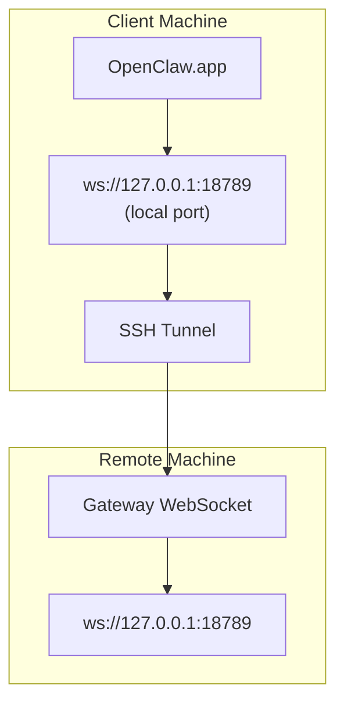

> تم دمج هذا المحتوى في [الوصول البعيد](/gateway/remote#macos-persistent-ssh-tunnel-via-launchagent). راجع تلك الصفحة للحصول على الدليل الحالي.

# تشغيل OpenClaw.app مع Gateway بعيد

يستخدم OpenClaw.app نفق SSH للاتصال بـ gateway بعيد. يوضح لك هذا الدليل كيفية إعداده.

## نظرة عامة



## إعداد سريع

### الخطوة 1: أضف إعدادات SSH

عدّل `~/.ssh/config` وأضف:

```ssh
Host remote-gateway
    HostName <REMOTE_IP>          # e.g., 172.27.187.184
    User <REMOTE_USER>            # e.g., jefferson
    LocalForward 18789 127.0.0.1:18789
    IdentityFile ~/.ssh/id_rsa
```

استبدل `<REMOTE_IP>` و`<REMOTE_USER>` بالقيم الخاصة بك.

### الخطوة 2: انسخ مفتاح SSH

انسخ مفتاحك العام إلى الجهاز البعيد (أدخل كلمة المرور مرة واحدة):

```bash
ssh-copy-id -i ~/.ssh/id_rsa <REMOTE_USER>@<REMOTE_IP>
```

### الخطوة 3: اضبط مصادقة Gateway البعيد

```bash
openclaw config set gateway.remote.token "<your-token>"
```

استخدم `gateway.remote.password` بدلًا من ذلك إذا كان gateway البعيد يستخدم مصادقة كلمة المرور.
لا يزال `OPENCLAW_GATEWAY_TOKEN` صالحًا كتجاوز على مستوى shell، لكن
إعداد العميل البعيد الدائم هو `gateway.remote.token` / `gateway.remote.password`.

### الخطوة 4: ابدأ نفق SSH

```bash
ssh -N remote-gateway &
```

### الخطوة 5: أعد تشغيل OpenClaw.app

```bash
# Quit OpenClaw.app (⌘Q), then reopen:
open /path/to/OpenClaw.app
```

سيتصل التطبيق الآن بـ gateway البعيد عبر نفق SSH.

---

## بدء تشغيل النفق تلقائيًا عند تسجيل الدخول

لكي يبدأ نفق SSH تلقائيًا عند تسجيل الدخول، أنشئ Launch Agent.

### أنشئ ملف PLIST

احفظ هذا باسم `~/Library/LaunchAgents/ai.openclaw.ssh-tunnel.plist`:

```xml
<?xml version="1.0" encoding="UTF-8"?>
<!DOCTYPE plist PUBLIC "-//Apple//DTD PLIST 1.0//EN" "http://www.apple.com/DTDs/PropertyList-1.0.dtd">
<plist version="1.0">
<dict>
    <key>Label</key>
    <string>ai.openclaw.ssh-tunnel</string>
    <key>ProgramArguments</key>
    <array>
        <string>/usr/bin/ssh</string>
        <string>-N</string>
        <string>remote-gateway</string>
    </array>
    <key>KeepAlive</key>
    <true/>
    <key>RunAtLoad</key>
    <true/>
</dict>
</plist>
```

### حمّل Launch Agent

```bash
launchctl bootstrap gui/$UID ~/Library/LaunchAgents/ai.openclaw.ssh-tunnel.plist
```

سيقوم النفق الآن بما يلي:

- البدء تلقائيًا عند تسجيل الدخول
- إعادة التشغيل إذا تعطل
- الاستمرار في العمل في الخلفية

ملاحظة قديمة: أزل أي LaunchAgent متبقٍ باسم `com.openclaw.ssh-tunnel` إذا كان موجودًا.

---

## استكشاف الأخطاء وإصلاحها

**تحقق مما إذا كان النفق يعمل:**

```bash
ps aux | grep "ssh -N remote-gateway" | grep -v grep
lsof -i :18789
```

**أعد تشغيل النفق:**

```bash
launchctl kickstart -k gui/$UID/ai.openclaw.ssh-tunnel
```

**أوقف النفق:**

```bash
launchctl bootout gui/$UID/ai.openclaw.ssh-tunnel
```

---

## كيف يعمل

| المكوّن                            | ما الذي يفعله                                                |
| ---------------------------------- | ------------------------------------------------------------ |
| `LocalForward 18789 127.0.0.1:18789` | يمرر المنفذ المحلي 18789 إلى المنفذ البعيد 18789               |
| `ssh -N`                             | SSH من دون تنفيذ أوامر بعيدة (فقط تمرير المنافذ)              |
| `KeepAlive`                          | يعيد تشغيل النفق تلقائيًا إذا تعطل                           |
| `RunAtLoad`                          | يبدأ النفق عند تحميل العامل                                  |

يتصل OpenClaw.app بالعنوان `ws://127.0.0.1:18789` على جهاز العميل الخاص بك. ويقوم نفق SSH بتمرير هذا الاتصال إلى المنفذ 18789 على الجهاز البعيد حيث يعمل Gateway.
