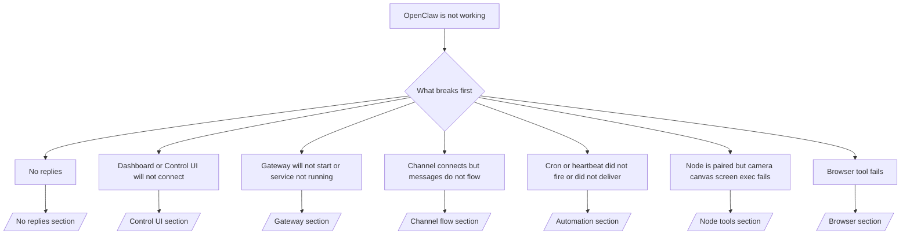

---
read_when:
    - OpenClaw لا يعمل وأنت تحتاج إلى أسرع مسار للإصلاح
    - أنت تريد تدفق فرز أولي قبل الغوص في أدلة التشغيل التفصيلية
summary: مركز استكشاف الأخطاء وإصلاحها وفق الأعراض أولًا لـ OpenClaw
title: استكشاف الأخطاء وإصلاحها العام
x-i18n:
    generated_at: "2026-04-05T12:46:17Z"
    model: gpt-5.4
    provider: openai
    source_hash: 23ae9638af5edf5a5e0584ccb15ba404223ac3b16c2d62eb93b2c9dac171c252
    source_path: help/troubleshooting.md
    workflow: 15
---

# استكشاف الأخطاء وإصلاحها

إذا لم يكن لديك سوى دقيقتين، فاستخدم هذه الصفحة كبوابة فرز أولية.

## أول 60 ثانية

شغّل هذا التسلسل بالترتيب نفسه:

```bash
openclaw status
openclaw status --all
openclaw gateway probe
openclaw gateway status
openclaw doctor
openclaw channels status --probe
openclaw logs --follow
```

المخرجات الجيدة في سطر واحد:

- `openclaw status` ← يعرض القنوات المهيأة ولا توجد أخطاء auth واضحة.
- `openclaw status --all` ← التقرير الكامل موجود وقابل للمشاركة.
- `openclaw gateway probe` ← الهدف المتوقع للبوابة قابل للوصول (`Reachable: yes`). إن `RPC: limited - missing scope: operator.read` يعني تشخيصات متدهورة، وليس فشل اتصال.
- `openclaw gateway status` ← `Runtime: running` و`RPC probe: ok`.
- `openclaw doctor` ← لا توجد أخطاء إعداد/خدمة مانعة.
- `openclaw channels status --probe` ← عندما تكون البوابة قابلة للوصول، يعرض حالة النقل الحية لكل حساب بالإضافة إلى نتائج الفحص/التدقيق مثل `works` أو `audit ok`؛ وإذا كانت
  البوابة غير قابلة للوصول، يرجع الأمر إلى ملخصات تعتمد على الإعدادات فقط.
- `openclaw logs --follow` ← نشاط مستقر، ولا توجد أخطاء قاتلة متكررة.

## ‏429 من Anthropic للسياق الطويل

إذا رأيت:
`HTTP 429: rate_limit_error: Extra usage is required for long context requests`,
فانتقل إلى [/gateway/troubleshooting#anthropic-429-extra-usage-required-for-long-context](/gateway/troubleshooting#anthropic-429-extra-usage-required-for-long-context).

## فشل تثبيت plugin بسبب غياب openclaw extensions

إذا فشل التثبيت مع `package.json missing openclaw.extensions`، فإن حزمة plugin
تستخدم شكلًا قديمًا لم يعد OpenClaw يقبله.

الحل في حزمة plugin:

1. أضف `openclaw.extensions` إلى `package.json`.
2. وجّه الإدخالات إلى ملفات runtime المبنية (عادةً `./dist/index.js`).
3. أعد نشر plugin وشغّل `openclaw plugins install <package>` مرة أخرى.

مثال:

```json
{
  "name": "@openclaw/my-plugin",
  "version": "1.2.3",
  "openclaw": {
    "extensions": ["./dist/index.js"]
  }
}
```

المرجع: [بنية Plugins](/plugins/architecture)

## شجرة القرار



<AccordionGroup>
  <Accordion title="لا توجد ردود">
    ```bash
    openclaw status
    openclaw gateway status
    openclaw channels status --probe
    openclaw pairing list --channel <channel> [--account <id>]
    openclaw logs --follow
    ```

    تبدو المخرجات الجيدة كالتالي:

    - `Runtime: running`
    - `RPC probe: ok`
    - تعرض قناتك اتصال النقل، وحيثما كان ذلك مدعومًا، `works` أو `audit ok` في `channels status --probe`
    - يظهر المرسل على أنه معتمد (أو أن سياسة الرسائل الخاصة open/allowlist)

    التواقيع الشائعة في السجلات:

    - `drop guild message (mention required` ← تقييد الإشارة منع الرسالة في Discord.
    - `pairing request` ← المرسل غير معتمد وينتظر الموافقة على الاقتران عبر الرسائل الخاصة.
    - `blocked` / `allowlist` في سجلات القناة ← تتم تصفية المرسل أو الغرفة أو المجموعة.

    الصفحات التفصيلية:

    - [/gateway/troubleshooting#no-replies](/gateway/troubleshooting#no-replies)
    - [/channels/troubleshooting](/channels/troubleshooting)
    - [/channels/pairing](/channels/pairing)

  </Accordion>

  <Accordion title="‏Dashboard أو Control UI لا يتصلان">
    ```bash
    openclaw status
    openclaw gateway status
    openclaw logs --follow
    openclaw doctor
    openclaw channels status --probe
    ```

    تبدو المخرجات الجيدة كالتالي:

    - يظهر `Dashboard: http://...` في `openclaw gateway status`
    - `RPC probe: ok`
    - لا توجد حلقة auth في السجلات

    التواقيع الشائعة في السجلات:

    - `device identity required` ← لا يمكن لسياق HTTP/غير الآمن إكمال مصادقة الجهاز.
    - `origin not allowed` ← قيمة `Origin` في المتصفح غير مسموح بها لهدف
      البوابة الخاص بـ Control UI.
    - `AUTH_TOKEN_MISMATCH` مع تلميحات إعادة المحاولة (`canRetryWithDeviceToken=true`) ← قد تحدث إعادة محاولة واحدة تلقائيًا باستخدام device-token موثوق.
    - تعيد تلك المحاولة باستخدام الرمز المخزن مؤقتًا استخدام مجموعة النطاقات المخزنة مع
      رمز الجهاز المقترن. بينما تحتفظ الاستدعاءات الصريحة باستخدام `deviceToken` / `scopes` الصريحة
      بمجموعة النطاقات المطلوبة الخاصة بها.
    - في مسار Control UI غير المتزامن عبر Tailscale Serve، يتم تسلسل المحاولات الفاشلة لنفس
      `{scope, ip}` قبل أن يسجل المحدِّد الفشل، لذلك قد تُظهر محاولة سيئة ثانية متزامنة بالفعل
      `retry later`.
    - `too many failed authentication attempts (retry later)` من
      أصل متصفح localhost ← يتم قفل حالات الفشل المتكررة من `Origin` نفسه مؤقتًا؛ بينما يستخدم أصل localhost آخر مجموعة مستقلة.
    - `unauthorized` المتكرر بعد تلك المحاولة ← token/password خاطئ، أو عدم تطابق وضع auth، أو رمز جهاز مقترن قديم.
    - `gateway connect failed:` ← واجهة المستخدم تستهدف URL/منفذًا خاطئًا أو بوابة غير قابلة للوصول.

    الصفحات التفصيلية:

    - [/gateway/troubleshooting#dashboard-control-ui-connectivity](/gateway/troubleshooting#dashboard-control-ui-connectivity)
    - [/web/control-ui](/web/control-ui)
    - [/gateway/authentication](/gateway/authentication)

  </Accordion>

  <Accordion title="‏Gateway لا تبدأ أو أن الخدمة مثبتة لكنها لا تعمل">
    ```bash
    openclaw status
    openclaw gateway status
    openclaw logs --follow
    openclaw doctor
    openclaw channels status --probe
    ```

    تبدو المخرجات الجيدة كالتالي:

    - `Service: ... (loaded)`
    - `Runtime: running`
    - `RPC probe: ok`

    التواقيع الشائعة في السجلات:

    - `Gateway start blocked: set gateway.mode=local` أو `existing config is missing gateway.mode` ← وضع البوابة هو remote، أو أن ملف الإعدادات يفتقد علامة الوضع المحلي ويجب إصلاحه.
    - `refusing to bind gateway ... without auth` ← ربط غير loopback من دون مسار auth صالح للبوابة (token/password، أو trusted-proxy حيثما يكون مهيأً).
    - `another gateway instance is already listening` أو `EADDRINUSE` ← المنفذ مستخدم بالفعل.

    الصفحات التفصيلية:

    - [/gateway/troubleshooting#gateway-service-not-running](/gateway/troubleshooting#gateway-service-not-running)
    - [/gateway/background-process](/gateway/background-process)
    - [/gateway/configuration](/gateway/configuration)

  </Accordion>

  <Accordion title="القناة متصلة لكن الرسائل لا تتدفق">
    ```bash
    openclaw status
    openclaw gateway status
    openclaw logs --follow
    openclaw doctor
    openclaw channels status --probe
    ```

    تبدو المخرجات الجيدة كالتالي:

    - نقل القناة متصل.
    - اجتياز فحوصات الاقتران/قائمة السماح.
    - يتم اكتشاف الإشارات عند الحاجة.

    التواقيع الشائعة في السجلات:

    - `mention required` ← تقييد الإشارة في المجموعات منع المعالجة.
    - `pairing` / `pending` ← مرسل الرسائل الخاصة لم تتم الموافقة عليه بعد.
    - `not_in_channel` أو `missing_scope` أو `Forbidden` أو `401/403` ← مشكلة في أذونات القناة أو الرمز المميز.

    الصفحات التفصيلية:

    - [/gateway/troubleshooting#channel-connected-messages-not-flowing](/gateway/troubleshooting#channel-connected-messages-not-flowing)
    - [/channels/troubleshooting](/channels/troubleshooting)

  </Accordion>

  <Accordion title="لم يعمل Cron أو heartbeat أو لم يتم التسليم">
    ```bash
    openclaw status
    openclaw gateway status
    openclaw cron status
    openclaw cron list
    openclaw cron runs --id <jobId> --limit 20
    openclaw logs --follow
    ```

    تبدو المخرجات الجيدة كالتالي:

    - تعرض `cron.status` أنها مفعلة مع موعد الاستيقاظ التالي.
    - تعرض `cron runs` إدخالات `ok` حديثة.
    - Heartbeat مفعّل وليس خارج الساعات النشطة.

    التواقيع الشائعة في السجلات:

- `cron: scheduler disabled; jobs will not run automatically` ← cron معطل.
- `heartbeat skipped` مع `reason=quiet-hours` ← خارج الساعات النشطة المهيأة.
- `heartbeat skipped` مع `reason=empty-heartbeat-file` ← الملف `HEARTBEAT.md` موجود لكنه يحتوي فقط على هيكل فارغ/عناوين فقط.
- `heartbeat skipped` مع `reason=no-tasks-due` ← وضع مهام `HEARTBEAT.md` نشط، لكن لم يحن موعد أي من فواصل المهام بعد.
- `heartbeat skipped` مع `reason=alerts-disabled` ← كل مظاهر عرض heartbeat معطلة (`showOk` و`showAlerts` و`useIndicator` كلها متوقفة).
- `requests-in-flight` ← المسار الرئيسي مشغول؛ وتم تأجيل استيقاظ heartbeat. - `unknown accountId` ← حساب هدف تسليم heartbeat غير موجود.

      الصفحات التفصيلية:

      - [/gateway/troubleshooting#cron-and-heartbeat-delivery](/gateway/troubleshooting#cron-and-heartbeat-delivery)
      - [/automation/cron-jobs#troubleshooting](/automation/cron-jobs#troubleshooting)
      - [/gateway/heartbeat](/gateway/heartbeat)

    </Accordion>

    <Accordion title="العقدة مقترنة لكن الأداة تفشل في camera أو canvas أو screen أو exec">
      ```bash
      openclaw status
      openclaw gateway status
      openclaw nodes status
      openclaw nodes describe --node <idOrNameOrIp>
      openclaw logs --follow
      ```

      تبدو المخرجات الجيدة كالتالي:

      - العقدة مدرجة على أنها متصلة ومقترنة للدور `node`.
      - الإمكانية موجودة للأمر الذي تستدعيه.
      - حالة الأذونات ممنوحة لتلك الأداة.

      التواقيع الشائعة في السجلات:

      - `NODE_BACKGROUND_UNAVAILABLE` ← اجعل تطبيق العقدة في الواجهة الأمامية.
      - `*_PERMISSION_REQUIRED` ← تم رفض إذن نظام التشغيل أو كان مفقودًا.
      - `SYSTEM_RUN_DENIED: approval required` ← موافقة exec معلقة.
      - `SYSTEM_RUN_DENIED: allowlist miss` ← الأمر غير موجود في قائمة سماح exec.

      الصفحات التفصيلية:

      - [/gateway/troubleshooting#node-paired-tool-fails](/gateway/troubleshooting#node-paired-tool-fails)
      - [/nodes/troubleshooting](/nodes/troubleshooting)
      - [/tools/exec-approvals](/tools/exec-approvals)

    </Accordion>

    <Accordion title="أصبح Exec يطلب موافقة فجأة">
      ```bash
      openclaw config get tools.exec.host
      openclaw config get tools.exec.security
      openclaw config get tools.exec.ask
      openclaw gateway restart
      ```

      ما الذي تغيّر:

      - إذا لم يتم تعيين `tools.exec.host`، فالقيمة الافتراضية هي `auto`.
      - تُحل `host=auto` إلى `sandbox` عندما يكون runtime المعزول نشطًا، وإلى `gateway` خلاف ذلك.
      - `host=auto` خاصة بالتوجيه فقط؛ بينما يأتي سلوك "YOLO" من دون مطالبة من `security=full` مع `ask=off` على gateway/node.
      - على `gateway` و`node`، تكون القيمة الافتراضية لـ `tools.exec.security` عند عدم التعيين هي `full`.
      - تكون القيمة الافتراضية لـ `tools.exec.ask` عند عدم التعيين هي `off`.
      - النتيجة: إذا كنت ترى موافقات، فقد تم تشديد بعض السياسات المحلية للمضيف أو الخاصة بكل جلسة على exec بعيدًا عن القيم الافتراضية الحالية.

      استعد سلوك عدم طلب الموافقة الافتراضي الحالي:

      ```bash
      openclaw config set tools.exec.host gateway
      openclaw config set tools.exec.security full
      openclaw config set tools.exec.ask off
      openclaw gateway restart
      ```

      بدائل أكثر أمانًا:

      - اضبط فقط `tools.exec.host=gateway` إذا كنت تريد فقط توجيهًا مستقرًا للمضيف.
      - استخدم `security=allowlist` مع `ask=on-miss` إذا كنت تريد exec على المضيف مع الإبقاء على المراجعة عند عدم التطابق مع قائمة السماح.
      - فعّل وضع sandbox إذا كنت تريد أن تُحل `host=auto` مرة أخرى إلى `sandbox`.

      التواقيع الشائعة في السجلات:

      - `Approval required.` ← الأمر ينتظر `/approve ...`.
      - `SYSTEM_RUN_DENIED: approval required` ← موافقة exec على مضيف العقدة معلقة.
      - `exec host=sandbox requires a sandbox runtime for this session` ← اختيار sandbox ضمني/صريح لكن وضع sandbox متوقف.

      الصفحات التفصيلية:

      - [/tools/exec](/tools/exec)
      - [/tools/exec-approvals](/tools/exec-approvals)
      - [/gateway/security#runtime-expectation-drift](/gateway/security#runtime-expectation-drift)

    </Accordion>

    <Accordion title="فشل أداة Browser">
      ```bash
      openclaw status
      openclaw gateway status
      openclaw browser status
      openclaw logs --follow
      openclaw doctor
      ```

      تبدو المخرجات الجيدة كالتالي:

      - تعرض حالة Browser القيمة `running: true` ومتصفحًا/ملف تعريف مختارًا.
      - يبدأ `openclaw`، أو يمكن للمستخدم رؤية علامات تبويب Chrome المحلية.

      التواقيع الشائعة في السجلات:

      - `unknown command "browser"` أو `unknown command 'browser'` ← تم تعيين `plugins.allow` ولا يتضمن `browser`.
      - `Failed to start Chrome CDP on port` ← فشل تشغيل المتصفح المحلي.
      - `browser.executablePath not found` ← مسار الثنائي المهيأ غير صحيح.
      - `browser.cdpUrl must be http(s) or ws(s)` ← يستخدم عنوان CDP URL المهيأ مخططًا غير مدعوم.
      - `browser.cdpUrl has invalid port` ← يحتوي CDP URL المهيأ على منفذ غير صالح أو خارج النطاق.
      - `No Chrome tabs found for profile="user"` ← لا توجد علامات تبويب Chrome محلية مفتوحة لملف تعريف الإرفاق Chrome MCP.
      - `Remote CDP for profile "<name>" is not reachable` ← نقطة نهاية CDP البعيدة المهيأة غير قابلة للوصول من هذا المضيف.
      - `Browser attachOnly is enabled ... not reachable` أو `Browser attachOnly is enabled and CDP websocket ... is not reachable` ← لا يملك ملف تعريف attach-only هدف CDP حيًا.
      - تجاوزات viewport / dark-mode / locale / offline القديمة في ملفات تعريف attach-only أو CDP البعيدة ← شغّل `openclaw browser stop --browser-profile <name>` لإغلاق جلسة التحكم النشطة وتحرير حالة المحاكاة من دون إعادة تشغيل البوابة.

      الصفحات التفصيلية:

      - [/gateway/troubleshooting#browser-tool-fails](/gateway/troubleshooting#browser-tool-fails)
      - [/tools/browser#missing-browser-command-or-tool](/tools/browser#missing-browser-command-or-tool)
      - [/tools/browser-linux-troubleshooting](/tools/browser-linux-troubleshooting)
      - [/tools/browser-wsl2-windows-remote-cdp-troubleshooting](/tools/browser-wsl2-windows-remote-cdp-troubleshooting)

    </Accordion>
  </AccordionGroup>

## ذو صلة

- [الأسئلة الشائعة](/help/faq) — الأسئلة المتكررة
- [استكشاف أخطاء Gateway وإصلاحها](/gateway/troubleshooting) — المشكلات الخاصة بالبوابة
- [Doctor](/gateway/doctor) — فحوصات الصحة والإصلاحات الآلية
- [استكشاف أخطاء القنوات وإصلاحها](/channels/troubleshooting) — مشكلات اتصال القنوات
- [استكشاف أخطاء الأتمتة وإصلاحها](/automation/cron-jobs#troubleshooting) — مشكلات cron وheartbeat
