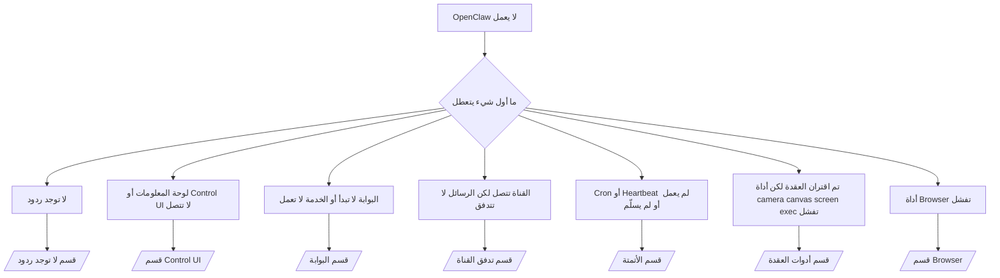

---
read_when:
    - لا يعمل OpenClaw وتحتاج إلى أسرع طريق إلى حل
    - تريد مسار فرز أولي قبل التعمق في أدلة التشغيل التفصيلية
summary: مركز استكشاف الأخطاء وإصلاحها في OpenClaw وفقًا للأعراض أولًا
title: استكشاف الأخطاء وإصلاحها العام
x-i18n:
    generated_at: "2026-04-08T02:16:50Z"
    model: gpt-5.4
    provider: openai
    source_hash: 8abda90ef80234c2f91a51c5e1f2c004d4a4da12a5d5631b5927762550c6d5e3
    source_path: help/troubleshooting.md
    workflow: 15
---

# استكشاف الأخطاء وإصلاحها

إذا كان لديك دقيقتان فقط، فاستخدم هذه الصفحة كنقطة دخول سريعة للفرز الأولي.

## أول 60 ثانية

شغّل هذا التسلسل بالترتيب تمامًا:

```bash
openclaw status
openclaw status --all
openclaw gateway probe
openclaw gateway status
openclaw doctor
openclaw channels status --probe
openclaw logs --follow
```

المخرجات الجيدة في سطر واحد:

- `openclaw status` → يعرض القنوات المهيأة ولا توجد أخطاء مصادقة واضحة.
- `openclaw status --all` → التقرير الكامل موجود وقابل للمشاركة.
- `openclaw gateway probe` → هدف البوابة المتوقع يمكن الوصول إليه (`Reachable: yes`). يشير `RPC: limited - missing scope: operator.read` إلى تشخيصات متدهورة، وليس إلى فشل في الاتصال.
- `openclaw gateway status` → `Runtime: running` و`RPC probe: ok`.
- `openclaw doctor` → لا توجد أخطاء حاجبة في الإعدادات/الخدمة.
- `openclaw channels status --probe` → إذا كانت البوابة قابلة للوصول، فسيُرجع حالة النقل الحية لكل حساب
  بالإضافة إلى نتائج الفحص/التدقيق مثل `works` أو `audit ok`؛ وإذا كانت
  البوابة غير قابلة للوصول، يعود الأمر إلى ملخصات تعتمد على الإعدادات فقط.
- `openclaw logs --follow` → نشاط مستقر، ولا توجد أخطاء قاتلة متكررة.

## Anthropic long context 429

إذا رأيت:
`HTTP 429: rate_limit_error: Extra usage is required for long context requests`
فانتقل إلى [/gateway/troubleshooting#anthropic-429-extra-usage-required-for-long-context](/ar/gateway/troubleshooting#anthropic-429-extra-usage-required-for-long-context).

## تعمل واجهة OpenAI-compatible الخلفية المحلية مباشرة لكنها تفشل في OpenClaw

إذا كانت واجهة `/v1` الخلفية المحلية أو المستضافة ذاتيًا تستجيب مباشرةً
لاختبارات `/v1/chat/completions` الصغيرة لكنها تفشل مع `openclaw infer model run` أو في
أدوار الوكيل العادية:

1. إذا كان الخطأ يذكر أن `messages[].content` يتوقع سلسلة نصية، فاضبط
   `models.providers.<provider>.models[].compat.requiresStringContent: true`.
2. إذا استمرت الواجهة الخلفية في الفشل فقط في أدوار وكيل OpenClaw، فاضبط
   `models.providers.<provider>.models[].compat.supportsTools: false` ثم أعد المحاولة.
3. إذا ظلت الاستدعاءات المباشرة الصغيرة تعمل لكن موجّهات OpenClaw الأكبر تتسبب في تعطل
   الواجهة الخلفية، فاعتبر المشكلة المتبقية قيدًا من النموذج/الخادم upstream
   وتابع في الدليل التفصيلي:
   [/gateway/troubleshooting#local-openai-compatible-backend-passes-direct-probes-but-agent-runs-fail](/ar/gateway/troubleshooting#local-openai-compatible-backend-passes-direct-probes-but-agent-runs-fail)

## فشل تثبيت plugin مع openclaw extensions مفقودة

إذا فشل التثبيت مع `package.json missing openclaw.extensions`، فإن حزمة plugin
تستخدم بنية قديمة لم يعد OpenClaw يقبلها.

الحل في حزمة plugin:

1. أضف `openclaw.extensions` إلى `package.json`.
2. وجّه الإدخالات إلى ملفات runtime المبنية (عادةً `./dist/index.js`).
3. أعد نشر plugin وشغّل `openclaw plugins install <package>` مرة أخرى.

مثال:

```json
{
  "name": "@openclaw/my-plugin",
  "version": "1.2.3",
  "openclaw": {
    "extensions": ["./dist/index.js"]
  }
}
```

مرجع: [معمارية plugin](/ar/plugins/architecture)

## شجرة القرار



<AccordionGroup>
  <Accordion title="لا توجد ردود">
    ```bash
    openclaw status
    openclaw gateway status
    openclaw channels status --probe
    openclaw pairing list --channel <channel> [--account <id>]
    openclaw logs --follow
    ```

    تبدو المخرجات الجيدة كما يلي:

    - `Runtime: running`
    - `RPC probe: ok`
    - تعرض قناتك اتصال النقل، وحيثما كان ذلك مدعومًا، `works` أو `audit ok` في `channels status --probe`
    - يظهر المرسِل على أنه معتمد (أو أن سياسة الرسائل المباشرة مفتوحة/قائمة السماح)

    توقيعات السجلات الشائعة:

    - `drop guild message (mention required` → منعت بوابة الإشارة معالجة الرسالة في Discord.
    - `pairing request` → المرسل غير معتمد وينتظر الموافقة على الاقتران عبر الرسائل المباشرة.
    - `blocked` / `allowlist` في سجلات القناة → تمت تصفية المرسل أو الغرفة أو المجموعة.

    الصفحات التفصيلية:

    - [/gateway/troubleshooting#no-replies](/ar/gateway/troubleshooting#no-replies)
    - [/channels/troubleshooting](/ar/channels/troubleshooting)
    - [/channels/pairing](/ar/channels/pairing)

  </Accordion>

  <Accordion title="لوحة المعلومات أو Control UI لا تتصل">
    ```bash
    openclaw status
    openclaw gateway status
    openclaw logs --follow
    openclaw doctor
    openclaw channels status --probe
    ```

    تبدو المخرجات الجيدة كما يلي:

    - يظهر `Dashboard: http://...` في `openclaw gateway status`
    - `RPC probe: ok`
    - لا توجد حلقة مصادقة في السجلات

    توقيعات السجلات الشائعة:

    - `device identity required` → لا يمكن لسياق HTTP/غير الآمن إكمال مصادقة الجهاز.
    - `origin not allowed` → لا يُسمح بـ `Origin` الخاص بالمتصفح لهدف بوابة Control UI.
    - `AUTH_TOKEN_MISMATCH` مع تلميحات إعادة المحاولة (`canRetryWithDeviceToken=true`) → قد تحدث إعادة محاولة واحدة موثوقة باستخدام رمز الجهاز تلقائيًا.
    - تعيد إعادة المحاولة باستخدام الرمز المؤقت استخدام مجموعة النطاقات المخزنة مؤقتًا مع
      رمز الجهاز المقترن. أما المستدعون الذين يستخدمون `deviceToken` صريحًا / `scopes` صريحة
      فيحتفظون بمجموعة النطاقات المطلوبة الخاصة بهم.
    - في مسار Control UI غير المتزامن عبر Tailscale Serve، تتم
      موازاة المحاولات الفاشلة لنفس `{scope, ip}` قبل أن يسجّل المحدِّد الفشل، لذلك
      قد تُظهر إعادة محاولة سيئة ثانية متزامنة بالفعل `retry later`.
    - `too many failed authentication attempts (retry later)` من
      مصدر متصفح localhost → يتم قفل الإخفاقات المتكررة من `Origin` نفسه مؤقتًا؛ بينما يستخدم أصل localhost آخر سلة منفصلة.
    - `unauthorized` متكرر بعد إعادة المحاولة تلك → رمز/كلمة مرور خاطئة، أو عدم تطابق وضع المصادقة، أو رمز جهاز مقترن قديم.
    - `gateway connect failed:` → تستهدف UI عنوان URL/منفذًا خاطئًا أو بوابة يتعذر الوصول إليها.

    الصفحات التفصيلية:

    - [/gateway/troubleshooting#dashboard-control-ui-connectivity](/ar/gateway/troubleshooting#dashboard-control-ui-connectivity)
    - [/web/control-ui](/web/control-ui)
    - [/gateway/authentication](/ar/gateway/authentication)

  </Accordion>

  <Accordion title="البوابة لا تبدأ أو الخدمة مثبتة لكنها لا تعمل">
    ```bash
    openclaw status
    openclaw gateway status
    openclaw logs --follow
    openclaw doctor
    openclaw channels status --probe
    ```

    تبدو المخرجات الجيدة كما يلي:

    - `Service: ... (loaded)`
    - `Runtime: running`
    - `RPC probe: ok`

    توقيعات السجلات الشائعة:

    - `Gateway start blocked: set gateway.mode=local` أو `existing config is missing gateway.mode` → وضع البوابة هو remote، أو أن ملف الإعدادات يفتقد علامة الوضع المحلي ويجب إصلاحه.
    - `refusing to bind gateway ... without auth` → ربط غير loopback بدون مسار مصادقة صالح للبوابة (رمز/كلمة مرور، أو trusted-proxy حيثما كان مهيأً).
    - `another gateway instance is already listening` أو `EADDRINUSE` → المنفذ مستخدم بالفعل.

    الصفحات التفصيلية:

    - [/gateway/troubleshooting#gateway-service-not-running](/ar/gateway/troubleshooting#gateway-service-not-running)
    - [/gateway/background-process](/ar/gateway/background-process)
    - [/gateway/configuration](/ar/gateway/configuration)

  </Accordion>

  <Accordion title="القناة تتصل لكن الرسائل لا تتدفق">
    ```bash
    openclaw status
    openclaw gateway status
    openclaw logs --follow
    openclaw doctor
    openclaw channels status --probe
    ```

    تبدو المخرجات الجيدة كما يلي:

    - نقل القناة متصل.
    - تمر فحوصات الاقتران/قائمة السماح.
    - يتم اكتشاف الإشارات حيثما تكون مطلوبة.

    توقيعات السجلات الشائعة:

    - `mention required` → منعت بوابة الإشارة في المجموعة المعالجة.
    - `pairing` / `pending` → مرسل الرسالة المباشرة غير معتمد بعد.
    - `not_in_channel`, `missing_scope`, `Forbidden`, `401/403` → مشكلة في رمز أذونات القناة.

    الصفحات التفصيلية:

    - [/gateway/troubleshooting#channel-connected-messages-not-flowing](/ar/gateway/troubleshooting#channel-connected-messages-not-flowing)
    - [/channels/troubleshooting](/ar/channels/troubleshooting)

  </Accordion>

  <Accordion title="لم يعمل Cron أو Heartbeat أو لم يسلّم">
    ```bash
    openclaw status
    openclaw gateway status
    openclaw cron status
    openclaw cron list
    openclaw cron runs --id <jobId> --limit 20
    openclaw logs --follow
    ```

    تبدو المخرجات الجيدة كما يلي:

    - يعرض `cron.status` أنه مفعّل مع وقت الاستيقاظ التالي.
    - يعرض `cron runs` إدخالات `ok` حديثة.
    - يكون Heartbeat مفعّلًا وليس خارج ساعات النشاط.

    توقيعات السجلات الشائعة:

- `cron: scheduler disabled; jobs will not run automatically` → تم تعطيل cron.
- `heartbeat skipped` مع `reason=quiet-hours` → خارج ساعات النشاط المهيأة.
- `heartbeat skipped` مع `reason=empty-heartbeat-file` → الملف `HEARTBEAT.md` موجود لكنه يحتوي فقط على هيكل فارغ/عناوين فقط.
- `heartbeat skipped` مع `reason=no-tasks-due` → وضع المهام في `HEARTBEAT.md` نشط ولكن لم يحن موعد أي من فواصل المهام بعد.
- `heartbeat skipped` مع `reason=alerts-disabled` → تم تعطيل كل ظهور Heartbeat (`showOk` و`showAlerts` و`useIndicator` كلها معطلة).
- `requests-in-flight` → المسار الرئيسي مشغول؛ تم تأجيل تنبيه Heartbeat. - `unknown accountId` → حساب هدف تسليم Heartbeat غير موجود.

      الصفحات التفصيلية:

      - [/gateway/troubleshooting#cron-and-heartbeat-delivery](/ar/gateway/troubleshooting#cron-and-heartbeat-delivery)
      - [/automation/cron-jobs#troubleshooting](/ar/automation/cron-jobs#troubleshooting)
      - [/gateway/heartbeat](/ar/gateway/heartbeat)

    </Accordion>

    <Accordion title="تم اقتران العقدة لكن الأداة تفشل في camera canvas screen exec">
      ```bash
      openclaw status
      openclaw gateway status
      openclaw nodes status
      openclaw nodes describe --node <idOrNameOrIp>
      openclaw logs --follow
      ```

      تبدو المخرجات الجيدة كما يلي:

      - تظهر العقدة على أنها متصلة ومقترنة للدور `node`.
      - توجد capability للأمر الذي تستدعيه.
      - حالة الإذن ممنوحة للأداة.

      توقيعات السجلات الشائعة:

      - `NODE_BACKGROUND_UNAVAILABLE` → اجلب تطبيق العقدة إلى الواجهة الأمامية.
      - `*_PERMISSION_REQUIRED` → تم رفض/فقدان إذن نظام التشغيل.
      - `SYSTEM_RUN_DENIED: approval required` → موافقة exec معلّقة.
      - `SYSTEM_RUN_DENIED: allowlist miss` → الأمر غير موجود في قائمة السماح الخاصة بـ exec.

      الصفحات التفصيلية:

      - [/gateway/troubleshooting#node-paired-tool-fails](/ar/gateway/troubleshooting#node-paired-tool-fails)
      - [/nodes/troubleshooting](/ar/nodes/troubleshooting)
      - [/tools/exec-approvals](/ar/tools/exec-approvals)

    </Accordion>

    <Accordion title="أصبح Exec يطلب الموافقة فجأة">
      ```bash
      openclaw config get tools.exec.host
      openclaw config get tools.exec.security
      openclaw config get tools.exec.ask
      openclaw gateway restart
      ```

      ما الذي تغيّر:

      - إذا لم يتم ضبط `tools.exec.host`، فالقيمة الافتراضية هي `auto`.
      - يحل `host=auto` إلى `sandbox` عندما يكون runtime الخاص بـ sandbox نشطًا، وإلى `gateway` خلاف ذلك.
      - `host=auto` خاص بالتوجيه فقط؛ أما سلوك "YOLO" بدون مطالبة فيأتي من `security=full` مع `ask=off` على gateway/node.
      - في `gateway` و`node`، تكون القيمة الافتراضية لـ `tools.exec.security` عند عدم ضبطها هي `full`.
      - تكون القيمة الافتراضية لـ `tools.exec.ask` عند عدم ضبطها هي `off`.
      - النتيجة: إذا كنت ترى موافقات، فهذا يعني أن سياسة محلية على المضيف أو خاصة بالجلسة قد شددت exec بعيدًا عن القيم الافتراضية الحالية.

      استعد سلوك الوضع الحالي الافتراضي بدون موافقة:

      ```bash
      openclaw config set tools.exec.host gateway
      openclaw config set tools.exec.security full
      openclaw config set tools.exec.ask off
      openclaw gateway restart
      ```

      بدائل أكثر أمانًا:

      - اضبط فقط `tools.exec.host=gateway` إذا كنت تريد مجرد توجيه مستقر على المضيف.
      - استخدم `security=allowlist` مع `ask=on-miss` إذا كنت تريد exec على المضيف لكنك ما زلت تريد مراجعة عند الإخفاق في قائمة السماح.
      - فعّل وضع sandbox إذا كنت تريد أن يعود `host=auto` إلى `sandbox`.

      توقيعات السجلات الشائعة:

      - `Approval required.` → ينتظر الأمر `/approve ...`.
      - `SYSTEM_RUN_DENIED: approval required` → موافقة exec على مضيف العقدة معلّقة.
      - `exec host=sandbox requires a sandbox runtime for this session` → تم اختيار sandbox ضمنيًا/صراحة لكن وضع sandbox معطل.

      الصفحات التفصيلية:

      - [/tools/exec](/ar/tools/exec)
      - [/tools/exec-approvals](/ar/tools/exec-approvals)
      - [/gateway/security#runtime-expectation-drift](/ar/gateway/security#runtime-expectation-drift)

    </Accordion>

    <Accordion title="أداة Browser تفشل">
      ```bash
      openclaw status
      openclaw gateway status
      openclaw browser status
      openclaw logs --follow
      openclaw doctor
      ```

      تبدو المخرجات الجيدة كما يلي:

      - تعرض حالة Browser `running: true` ومتصفحًا/ملف تعريف محددًا.
      - يبدأ `openclaw`، أو يمكن لـ `user` رؤية علامات تبويب Chrome المحلية.

      توقيعات السجلات الشائعة:

      - `unknown command "browser"` أو `unknown command 'browser'` → تم ضبط `plugins.allow` ولا يتضمن `browser`.
      - `Failed to start Chrome CDP on port` → فشل تشغيل المتصفح المحلي.
      - `browser.executablePath not found` → مسار الملف التنفيذي المهيأ غير صحيح.
      - `browser.cdpUrl must be http(s) or ws(s)` → يستخدم عنوان CDP المهيأ مخططًا غير مدعوم.
      - `browser.cdpUrl has invalid port` → يحتوي عنوان CDP المهيأ على منفذ سيئ أو خارج النطاق.
      - `No Chrome tabs found for profile="user"` → لا يحتوي ملف تعريف إرفاق Chrome MCP على علامات تبويب Chrome محلية مفتوحة.
      - `Remote CDP for profile "<name>" is not reachable` → يتعذر الوصول إلى نقطة نهاية CDP البعيدة المهيأة من هذا المضيف.
      - `Browser attachOnly is enabled ... not reachable` أو `Browser attachOnly is enabled and CDP websocket ... is not reachable` → لا يحتوي ملف تعريف attach-only على هدف CDP حي.
      - تجاوزات viewport / dark-mode / locale / offline القديمة على ملفات تعريف attach-only أو CDP البعيدة → شغّل `openclaw browser stop --browser-profile <name>` لإغلاق جلسة التحكم النشطة وتحرير حالة المحاكاة دون إعادة تشغيل البوابة.

      الصفحات التفصيلية:

      - [/gateway/troubleshooting#browser-tool-fails](/ar/gateway/troubleshooting#browser-tool-fails)
      - [/tools/browser#missing-browser-command-or-tool](/ar/tools/browser#missing-browser-command-or-tool)
      - [/tools/browser-linux-troubleshooting](/ar/tools/browser-linux-troubleshooting)
      - [/tools/browser-wsl2-windows-remote-cdp-troubleshooting](/ar/tools/browser-wsl2-windows-remote-cdp-troubleshooting)

    </Accordion>
  </AccordionGroup>

## ذو صلة

- [الأسئلة الشائعة](/ar/help/faq) — الأسئلة المتداولة
- [استكشاف أخطاء البوابة وإصلاحها](/ar/gateway/troubleshooting) — المشكلات الخاصة بالبوابة
- [Doctor](/ar/gateway/doctor) — فحوصات الصحة والإصلاحات الآلية
- [استكشاف أخطاء القنوات وإصلاحها](/ar/channels/troubleshooting) — مشكلات اتصال القنوات
- [استكشاف أخطاء الأتمتة وإصلاحها](/ar/automation/cron-jobs#troubleshooting) — مشكلات cron وHeartbeat
