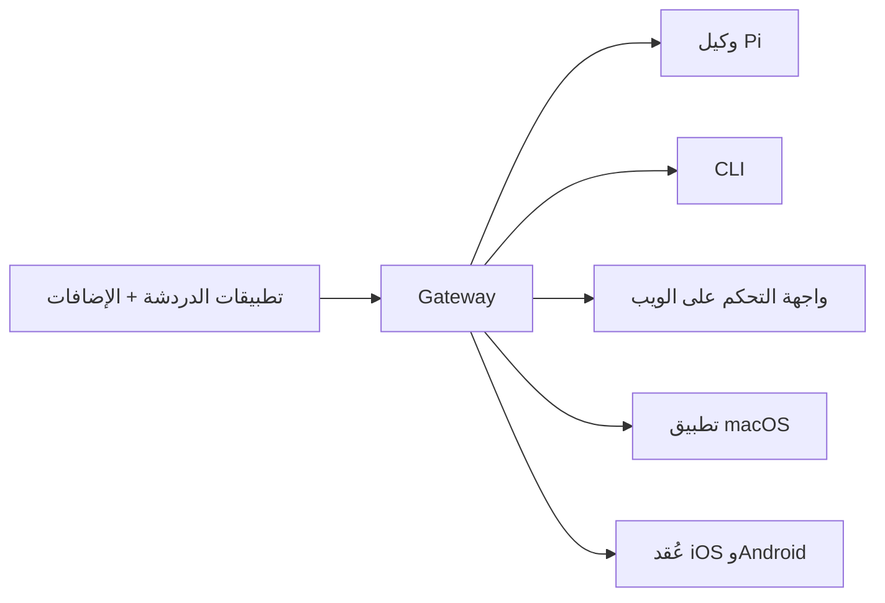

---
read_when:
    - تقديم OpenClaw للقادمين الجدد
summary: OpenClaw هي بوابة متعددة القنوات لوكلاء الذكاء الاصطناعي وتعمل على أي نظام تشغيل.
title: OpenClaw
x-i18n:
    generated_at: "2026-04-05T11:36:25Z"
    model: gpt-5.4
    provider: openai
    source_hash: 9c29a8d9fc41a94b650c524bb990106f134345560e6d615dac30e8815afff481
    source_path: index.md
    workflow: 15
---

# OpenClaw 🦞

<p align="center">
    
    
</p>

> _"اقشر! اقشر!"_ — كركند فضائي، على الأرجح

<p align="center">
  <strong>بوابة تعمل على أي نظام تشغيل لوكلاء الذكاء الاصطناعي عبر Discord وGoogle Chat وiMessage وMatrix وMicrosoft Teams وSignal وSlack وTelegram وWhatsApp وZalo والمزيد.</strong><br />
  أرسل رسالة، واحصل على رد من وكيل من جيبك. شغّل Gateway واحدًا عبر القنوات المضمنة، وإضافات القنوات المجمعة، وWebChat، وعُقد الأجهزة المحمولة.
</p>

<Columns>
  <Card title="ابدأ" href="/start/getting-started" icon="rocket">
    ثبّت OpenClaw وشغّل Gateway خلال دقائق.
  </Card>
  <Card title="شغّل الإعداد التمهيدي" href="/start/wizard" icon="sparkles">
    إعداد موجّه باستخدام `openclaw onboard` وتدفّقات الاقتران.
  </Card>
  <Card title="افتح واجهة التحكم" href="/web/control-ui" icon="layout-dashboard">
    شغّل لوحة التحكم في المتصفح للمحادثة والإعدادات والجلسات.
  </Card>
</Columns>

## ما هو OpenClaw؟

OpenClaw هو **Gateway مستضاف ذاتيًا** يربط تطبيقات الدردشة المفضلة لديك وواجهات القنوات — القنوات المضمنة بالإضافة إلى إضافات القنوات المجمعة أو الخارجية مثل Discord وGoogle Chat وiMessage وMatrix وMicrosoft Teams وSignal وSlack وTelegram وWhatsApp وZalo والمزيد — بوكلاء برمجة بالذكاء الاصطناعي مثل Pi. أنت تشغّل عملية Gateway واحدة على جهازك الخاص (أو على خادم)، فتتحول إلى جسر بين تطبيقات المراسلة لديك ومساعد ذكاء اصطناعي متاح دائمًا.

**لمن هو؟** للمطورين والمستخدمين المتقدمين الذين يريدون مساعدًا شخصيًا بالذكاء الاصطناعي يمكنهم مراسلته من أي مكان — من دون التخلي عن التحكم في بياناتهم أو الاعتماد على خدمة مستضافة.

**ما الذي يميّزه؟**

- **مستضاف ذاتيًا**: يعمل على أجهزتك ووفق قواعدك
- **متعدد القنوات**: يخدم Gateway واحد القنوات المضمنة بالإضافة إلى إضافات القنوات المجمعة أو الخارجية في الوقت نفسه
- **مصمم أصلًا للوكلاء**: مبني لوكلاء البرمجة مع استخدام الأدوات والجلسات والذاكرة والتوجيه متعدد الوكلاء
- **مفتوح المصدر**: مرخّص بموجب MIT ويقوده المجتمع

**ماذا تحتاج؟** Node 24 (موصى به)، أو Node 22 LTS (`22.14+`) للتوافق، ومفتاح API من المزوّد الذي تختاره، و5 دقائق. للحصول على أفضل جودة وأمان، استخدم أقوى نموذج متاح من الجيل الأحدث.

## كيف يعمل



يُعد Gateway المصدر الوحيد للحقيقة للجلسات والتوجيه واتصالات القنوات.

## الإمكانات الأساسية

<Columns>
  <Card title="بوابة متعددة القنوات" icon="network">
    Discord وiMessage وSignal وSlack وTelegram وWhatsApp وWebChat والمزيد باستخدام عملية Gateway واحدة.
  </Card>
  <Card title="قنوات الإضافات" icon="plug">
    تضيف الإضافات المجمعة Matrix وNostr وTwitch وZalo والمزيد في الإصدارات الحالية العادية.
  </Card>
  <Card title="توجيه متعدد الوكلاء" icon="route">
    جلسات معزولة لكل وكيل أو مساحة عمل أو مرسل.
  </Card>
  <Card title="دعم الوسائط" icon="image">
    أرسل واستقبل الصور والصوت والمستندات.
  </Card>
  <Card title="واجهة التحكم على الويب" icon="monitor">
    لوحة تحكم في المتصفح للمحادثة والإعدادات والجلسات والعُقد.
  </Card>
  <Card title="عُقد الأجهزة المحمولة" icon="smartphone">
    اقترن بعُقد iOS وAndroid لسير عمل Canvas والكاميرا والميزات الصوتية.
  </Card>
</Columns>

## بدء سريع

<Steps>
  <Step title="ثبّت OpenClaw">
    ```bash
    npm install -g openclaw@latest
    ```
  </Step>
  <Step title="أجرِ الإعداد التمهيدي وثبّت الخدمة">
    ```bash
    openclaw onboard --install-daemon
    ```
  </Step>
  <Step title="ابدأ الدردشة">
    افتح واجهة التحكم في متصفحك وأرسل رسالة:

    ```bash
    openclaw dashboard
    ```

    أو صِل قناة ([Telegram](/channels/telegram) هي الأسرع) وابدأ الدردشة من هاتفك.

  </Step>
</Steps>

هل تحتاج إلى إعداد التثبيت والتطوير الكامل؟ راجع [البدء](/start/getting-started).

## لوحة التحكم

افتح واجهة التحكم في المتصفح بعد بدء Gateway.

- الإعداد المحلي الافتراضي: [http://127.0.0.1:18789/](http://127.0.0.1:18789/)
- الوصول عن بُعد: [واجهات الويب](/web) و[Tailscale](/gateway/tailscale)

<p align="center">
  
</p>

## الإعدادات (اختياري)

توجد الإعدادات في `~/.openclaw/openclaw.json`.

- إذا **لم تفعل شيئًا**، يستخدم OpenClaw ملف Pi الثنائي المجمّع في وضع RPC مع جلسات لكل مرسل.
- إذا أردت تقييده، فابدأ بـ `channels.whatsapp.allowFrom` وقواعد الإشارة (للمجموعات).

مثال:

```json5
{
  channels: {
    whatsapp: {
      allowFrom: ["+15555550123"],
      groups: { "*": { requireMention: true } },
    },
  },
  messages: { groupChat: { mentionPatterns: ["@openclaw"] } },
}
```

## ابدأ من هنا

<Columns>
  <Card title="محاور التوثيق" href="/start/hubs" icon="book-open">
    جميع الوثائق والأدلة، منظّمة حسب حالة الاستخدام.
  </Card>
  <Card title="الإعدادات" href="/gateway/configuration" icon="settings">
    إعدادات Gateway الأساسية والرموز وإعدادات المزوّد.
  </Card>
  <Card title="الوصول عن بُعد" href="/gateway/remote" icon="globe">
    أنماط الوصول عبر SSH وtailnet.
  </Card>
  <Card title="القنوات" href="/channels/telegram" icon="message-square">
    إعداد خاص بالقنوات لـ Feishu وMicrosoft Teams وWhatsApp وTelegram وDiscord والمزيد.
  </Card>
  <Card title="العُقد" href="/nodes" icon="smartphone">
    عُقد iOS وAndroid مع الاقتران وCanvas والكاميرا وإجراءات الجهاز.
  </Card>
  <Card title="المساعدة" href="/help" icon="life-buoy">
    الإصلاحات الشائعة ونقطة الدخول إلى استكشاف الأخطاء وإصلاحها.
  </Card>
</Columns>

## تعرّف على المزيد

<Columns>
  <Card title="قائمة الميزات الكاملة" href="/concepts/features" icon="list">
    إمكانات القنوات والتوجيه والوسائط كاملة.
  </Card>
  <Card title="توجيه متعدد الوكلاء" href="/concepts/multi-agent" icon="route">
    عزل مساحات العمل والجلسات لكل وكيل.
  </Card>
  <Card title="الأمان" href="/gateway/security" icon="shield">
    الرموز وقوائم السماح وعناصر التحكم في الأمان.
  </Card>
  <Card title="استكشاف الأخطاء وإصلاحها" href="/gateway/troubleshooting" icon="wrench">
    تشخيصات Gateway والأخطاء الشائعة.
  </Card>
  <Card title="نبذة وشكر وتقدير" href="/reference/credits" icon="info">
    أصول المشروع والمساهمون والترخيص.
  </Card>
</Columns>
