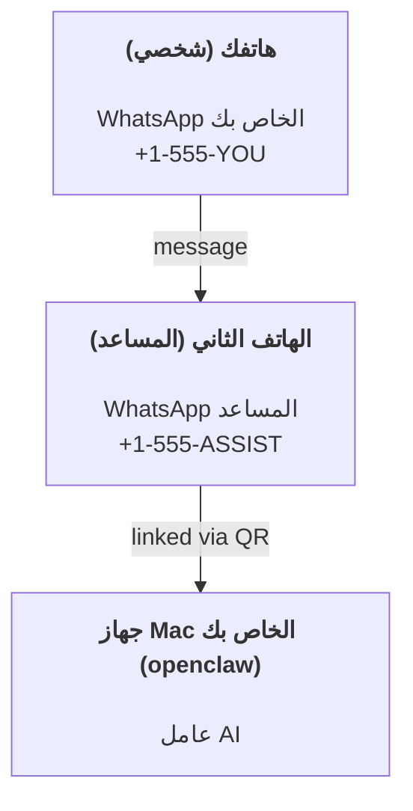

---
read_when:
    - إعداد مثيل مساعد جديد
    - مراجعة تبعات السلامة/الأذونات
summary: دليل شامل لتشغيل OpenClaw كمساعد شخصي مع تنبيهات السلامة
title: إعداد المساعد الشخصي
x-i18n:
    generated_at: "2026-04-05T12:57:00Z"
    model: gpt-5.4
    provider: openai
    source_hash: 02f10a9f7ec08f71143cbae996d91cbdaa19897a40f725d8ef524def41cf2759
    source_path: start/openclaw.md
    workflow: 15
---

# بناء مساعد شخصي باستخدام OpenClaw

OpenClaw هو Gateway مستضاف ذاتيًا يربط Discord وGoogle Chat وiMessage وMatrix وMicrosoft Teams وSignal وSlack وTelegram وWhatsApp وZalo وغير ذلك بعوامل AI. يغطي هذا الدليل إعداد "المساعد الشخصي": رقم WhatsApp مخصص يتصرف كمساعد AI دائم التشغيل.

## ⚠️ السلامة أولًا

أنت تضع عاملًا في موضع يمكّنه من:

- تشغيل أوامر على جهازك (بحسب سياسة الأدوات لديك)
- قراءة/كتابة الملفات في مساحة العمل الخاصة بك
- إرسال الرسائل مرة أخرى عبر WhatsApp/Telegram/Discord/Mattermost والقنوات المجمّعة الأخرى

ابدأ بشكل متحفظ:

- اضبط دائمًا `channels.whatsapp.allowFrom` (ولا تشغّل أبدًا إعدادًا مفتوحًا للعالم على جهاز Mac الشخصي لديك).
- استخدم رقم WhatsApp مخصصًا للمساعد.
- أصبحت Heartbeats افتراضيًا تعمل كل 30 دقيقة. عطّلها إلى أن تثق في الإعداد عبر تعيين `agents.defaults.heartbeat.every: "0m"`.

## المتطلبات الأساسية

- تثبيت OpenClaw وإكمال الإعداد الأولي — راجع [البدء](/ar/start/getting-started) إذا لم تكن قد فعلت ذلك بعد
- رقم هاتف ثانٍ (SIM/eSIM/مدفوع مسبقًا) للمساعد

## إعداد الهاتفين (موصى به)

أنت تريد هذا:



إذا ربطت WhatsApp الشخصي الخاص بك بـ OpenClaw، فستصبح كل رسالة تصلك "إدخالًا للعامل". وهذا نادرًا ما يكون ما تريده.

## بدء سريع خلال 5 دقائق

1. اربط WhatsApp Web (سيعرض رمز QR؛ امسحه بواسطة هاتف المساعد):

```bash
openclaw channels login
```

2. شغّل Gateway (واتركه قيد التشغيل):

```bash
openclaw gateway --port 18789
```

3. ضع إعدادًا أدنى في `~/.openclaw/openclaw.json`:

```json5
{
  gateway: { mode: "local" },
  channels: { whatsapp: { allowFrom: ["+15555550123"] } },
}
```

الآن أرسل رسالة إلى رقم المساعد من هاتفك المدرج في allowlist.

عند انتهاء الإعداد الأولي، نفتح لوحة التحكم تلقائيًا ونطبع رابطًا نظيفًا (من دون رموز مميّزة). إذا طلب المصادقة، الصق السر المشترك المُعدّ في إعدادات Control UI. يستخدم الإعداد الأولي رمزًا مميزًا افتراضيًا (`gateway.auth.token`)، لكن مصادقة كلمة المرور تعمل أيضًا إذا بدّلت `gateway.auth.mode` إلى `password`. لإعادة الفتح لاحقًا: `openclaw dashboard`.

## امنح العامل مساحة عمل (AGENTS)

يقرأ OpenClaw تعليمات التشغيل و"الذاكرة" من دليل مساحة العمل الخاص به.

افتراضيًا، يستخدم OpenClaw `~/.openclaw/workspace` كمساحة عمل للعامل، وسيُنشئها (إضافة إلى ملفات البداية `AGENTS.md` و`SOUL.md` و`TOOLS.md` و`IDENTITY.md` و`USER.md` و`HEARTBEAT.md`) تلقائيًا عند الإعداد/أول تشغيل للعامل. لا يتم إنشاء `BOOTSTRAP.md` إلا عندما تكون مساحة العمل جديدة تمامًا (ولا ينبغي أن يعود بعد حذفه). الملف `MEMORY.md` اختياري (ولا يُنشأ تلقائيًا)؛ وعند وجوده، يتم تحميله للجلسات العادية. جلسات العوامل الفرعية تحقن فقط `AGENTS.md` و`TOOLS.md`.

نصيحة: تعامل مع هذا المجلد على أنه "ذاكرة" OpenClaw واجعله مستودع git (ويُفضّل أن يكون خاصًا) حتى يتم نسخ ملفات `AGENTS.md` + الذاكرة احتياطيًا. إذا كان git مثبتًا، تُهيَّأ مساحات العمل الجديدة تمامًا تلقائيًا.

```bash
openclaw setup
```

التخطيط الكامل لمساحة العمل + دليل النسخ الاحتياطي: [مساحة عمل العامل](/ar/concepts/agent-workspace)
سير عمل الذاكرة: [الذاكرة](/ar/concepts/memory)

اختياري: اختر مساحة عمل مختلفة باستخدام `agents.defaults.workspace` (يدعم `~`).

```json5
{
  agent: {
    workspace: "~/.openclaw/workspace",
  },
}
```

إذا كنت توفّر بالفعل ملفات مساحة العمل الخاصة بك من مستودع، يمكنك تعطيل إنشاء ملفات التمهيد بالكامل:

```json5
{
  agent: {
    skipBootstrap: true,
  },
}
```

## الإعداد الذي يحوله إلى "مساعد"

يوفر OpenClaw افتراضيًا إعداد مساعد جيدًا، لكنك ستحتاج عادةً إلى ضبط:

- الشخصية/التعليمات في [`SOUL.md`](/ar/concepts/soul)
- إعدادات التفكير الافتراضية (إذا رغبت)
- Heartbeats (بعد أن تثق به)

مثال:

```json5
{
  logging: { level: "info" },
  agent: {
    model: "anthropic/claude-opus-4-6",
    workspace: "~/.openclaw/workspace",
    thinkingDefault: "high",
    timeoutSeconds: 1800,
    // ابدأ بـ 0؛ وفعّلها لاحقًا.
    heartbeat: { every: "0m" },
  },
  channels: {
    whatsapp: {
      allowFrom: ["+15555550123"],
      groups: {
        "*": { requireMention: true },
      },
    },
  },
  routing: {
    groupChat: {
      mentionPatterns: ["@openclaw", "openclaw"],
    },
  },
  session: {
    scope: "per-sender",
    resetTriggers: ["/new", "/reset"],
    reset: {
      mode: "daily",
      atHour: 4,
      idleMinutes: 10080,
    },
  },
}
```

## الجلسات والذاكرة

- ملفات الجلسة: `~/.openclaw/agents/<agentId>/sessions/{{SessionId}}.jsonl`
- بيانات الجلسة الوصفية (استخدام الرموز، وآخر مسار، وما إلى ذلك): `~/.openclaw/agents/<agentId>/sessions/sessions.json` (قديم: `~/.openclaw/sessions/sessions.json`)
- يؤدي `/new` أو `/reset` إلى بدء جلسة جديدة لتلك الدردشة (قابل للضبط عبر `resetTriggers`). إذا أُرسل وحده، يرد العامل بتحية قصيرة لتأكيد إعادة التعيين.
- يقوم `/compact [instructions]` بضغط سياق الجلسة ويعرض ميزانية السياق المتبقية.

## Heartbeats (الوضع الاستباقي)

افتراضيًا، يشغّل OpenClaw heartbeat كل 30 دقيقة باستخدام الموجه:
`Read HEARTBEAT.md if it exists (workspace context). Follow it strictly. Do not infer or repeat old tasks from prior chats. If nothing needs attention, reply HEARTBEAT_OK.`
عيّن `agents.defaults.heartbeat.every: "0m"` للتعطيل.

- إذا كان `HEARTBEAT.md` موجودًا لكنه فارغ فعليًا (يحتوي فقط على أسطر فارغة وعناوين Markdown مثل `# Heading`)، يتجاوز OpenClaw تشغيل heartbeat لتوفير استدعاءات API.
- إذا كان الملف مفقودًا، يستمر تشغيل heartbeat ويقرر النموذج ما يجب فعله.
- إذا رد العامل بـ `HEARTBEAT_OK` (اختياريًا مع حشو قصير؛ راجع `agents.defaults.heartbeat.ackMaxChars`)، فإن OpenClaw يمنع الإرسال الخارجي لذلك heartbeat.
- افتراضيًا، يُسمح بتسليم heartbeat إلى أهداف بنمط الرسائل المباشرة `user:<id>`. عيّن `agents.defaults.heartbeat.directPolicy: "block"` لمنع التسليم إلى الأهداف المباشرة مع إبقاء تشغيل heartbeat نشطًا.
- تشغّل Heartbeats دورات عامل كاملة — وكلما قصرت الفواصل، زاد استهلاك الرموز.

```json5
{
  agent: {
    heartbeat: { every: "30m" },
  },
}
```

## الوسائط الواردة والصادرة

يمكن تمرير المرفقات الواردة (الصور/الصوت/المستندات) إلى أمرك عبر قوالب:

- `{{MediaPath}}` (مسار ملف مؤقت محلي)
- `{{MediaUrl}}` (عنوان pseudo-URL)
- `{{Transcript}}` (إذا كان نسخ الصوت ممكّنًا)

المرفقات الصادرة من العامل: أدرج `MEDIA:<path-or-url>` في سطر مستقل (من دون مسافات). مثال:

```
إليك لقطة الشاشة.
MEDIA:https://example.com/screenshot.png
```

يستخرج OpenClaw هذه الأسطر ويرسلها كوسائط إلى جانب النص.

يتبع سلوك المسار المحلي نموذج الثقة نفسه لقراءة الملفات لدى العامل:

- إذا كانت `tools.fs.workspaceOnly` تساوي `true`، تظل المسارات المحلية الصادرة لـ `MEDIA:` مقيدة بجذر الملفات المؤقتة الخاص بـ OpenClaw، وذاكرة الوسائط المؤقتة، ومسارات مساحة عمل العامل، والملفات التي أنشأتها sandbox.
- إذا كانت `tools.fs.workspaceOnly` تساوي `false`، يمكن للمسارات المحلية الصادرة لـ `MEDIA:` استخدام الملفات المحلية على المضيف التي يُسمح للعامل أصلًا بقراءتها.
- لا تزال الإرسالات المحلية من المضيف تسمح فقط بالوسائط وأنواع المستندات الآمنة (الصور، والصوت، والفيديو، وPDF، ومستندات Office). لا تُعامل النصوص العادية والملفات الشبيهة بالأسرار كوسائط قابلة للإرسال.

هذا يعني أن الصور/الملفات المُنشأة خارج مساحة العمل يمكن الآن إرسالها عندما تسمح سياسة fs لديك أصلًا بهذه القراءات، من دون إعادة فتح تسريب مرفقات نصية عشوائية من المضيف.

## قائمة التحقق التشغيلية

```bash
openclaw status          # الحالة المحلية (بيانات الاعتماد، والجلسات، والأحداث الموضوعة في الطابور)
openclaw status --all    # تشخيص كامل (للقراءة فقط، وقابل للصق)
openclaw status --deep   # يطلب من Gateway فحصًا مباشرًا للحالة مع فحوصات القنوات عند الدعم
openclaw health --json   # لقطة حالة Gateway (WS؛ قد يعيد الافتراضي لقطة مخزنة مؤقتًا وحديثة)
```

توجد السجلات ضمن `/tmp/openclaw/` (الافتراضي: `openclaw-YYYY-MM-DD.log`).

## الخطوات التالية

- WebChat: [WebChat](/web/webchat)
- عمليات Gateway: [دليل تشغيل Gateway](/ar/gateway)
- Cron + التنبيهات: [مهام Cron](/ar/automation/cron-jobs)
- رفيق شريط قوائم macOS: [تطبيق OpenClaw لنظام macOS](/ar/platforms/macos)
- تطبيق عقدة iOS: [تطبيق iOS](/ar/platforms/ios)
- تطبيق عقدة Android: [تطبيق Android](/ar/platforms/android)
- حالة Windows: [Windows (WSL2)](/ar/platforms/windows)
- حالة Linux: [تطبيق Linux](/ar/platforms/linux)
- الأمان: [الأمان](/ar/gateway/security)
