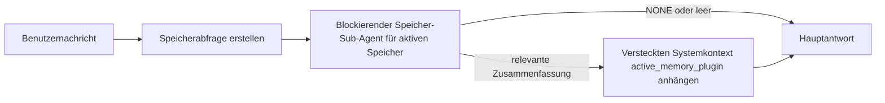

---
read_when:
    - Sie möchten verstehen, wofür der aktive Speicher da ist
    - Sie möchten den aktiven Speicher für einen Konversationsagenten aktivieren
    - Sie möchten das Verhalten des aktiven Speichers abstimmen, ohne ihn überall zu aktivieren
summary: Ein plugin-eigener blockierender Speicher-Sub-Agent, der relevanten Speicher in interaktive Chatsitzungen einspeist
title: Aktiver Speicher
x-i18n:
    generated_at: "2026-04-10T06:21:13Z"
    model: gpt-5.4
    provider: openai
    source_hash: 6a51437df4ae4d9d57764601dfcfcdadb269e2895bf49dc82b9f496c1b3cb341
    source_path: concepts/active-memory.md
    workflow: 15
---

# Aktiver Speicher

Der aktive Speicher ist ein optionaler plugin-eigener blockierender Speicher-Sub-Agent, der
vor der Hauptantwort für berechtigte Konversationssitzungen ausgeführt wird.

Er existiert, weil die meisten Speichersysteme leistungsfähig, aber reaktiv sind. Sie verlassen sich darauf,
dass der Haupt-Agent entscheidet, wann der Speicher durchsucht wird, oder darauf, dass der Benutzer Dinge sagt
wie „Merke dir das“ oder „Suche im Speicher“. Dann ist der Moment, in dem der Speicher die Antwort natürlich
hätte wirken lassen, bereits vorbei.

Der aktive Speicher gibt dem System eine begrenzte Möglichkeit, relevanten Speicher anzuzeigen,
bevor die Hauptantwort generiert wird.

## Fügen Sie dies in Ihren Agenten ein

Fügen Sie dies in Ihren Agenten ein, wenn Sie den aktiven Speicher mit einer
eigenständigen Einrichtung mit sicheren Standardeinstellungen aktivieren möchten:

```json5
{
  plugins: {
    entries: {
      "active-memory": {
        enabled: true,
        config: {
          enabled: true,
          agents: ["main"],
          allowedChatTypes: ["direct"],
          modelFallbackPolicy: "default-remote",
          queryMode: "recent",
          promptStyle: "balanced",
          timeoutMs: 15000,
          maxSummaryChars: 220,
          persistTranscripts: false,
          logging: true,
        },
      },
    },
  },
}
```

Dadurch wird das Plugin für den `main`-Agenten aktiviert, standardmäßig auf Sitzungen
im Stil von Direktnachrichten beschränkt, es kann zuerst das aktuelle Sitzungsmodell erben und
erlaubt weiterhin den integrierten Remote-Fallback, wenn kein explizites oder geerbtes Modell verfügbar ist.

Starten Sie danach das Gateway neu:

```bash
node scripts/run-node.mjs gateway --profile dev
```

Zur Live-Prüfung in einer Konversation:

```text
/verbose on
```

## Aktiven Speicher aktivieren

Die sicherste Einrichtung ist:

1. das Plugin aktivieren
2. einen Konversationsagenten auswählen
3. die Protokollierung nur während der Abstimmung eingeschaltet lassen

Beginnen Sie mit Folgendem in `openclaw.json`:

```json5
{
  plugins: {
    entries: {
      "active-memory": {
        enabled: true,
        config: {
          agents: ["main"],
          allowedChatTypes: ["direct"],
          modelFallbackPolicy: "default-remote",
          queryMode: "recent",
          promptStyle: "balanced",
          timeoutMs: 15000,
          maxSummaryChars: 220,
          persistTranscripts: false,
          logging: true,
        },
      },
    },
  },
}
```

Starten Sie dann das Gateway neu:

```bash
node scripts/run-node.mjs gateway --profile dev
```

Das bedeutet:

- `plugins.entries.active-memory.enabled: true` aktiviert das Plugin
- `config.agents: ["main"]` aktiviert den aktiven Speicher nur für den `main`-Agenten
- `config.allowedChatTypes: ["direct"]` beschränkt den aktiven Speicher standardmäßig auf Sitzungen im Stil von Direktnachrichten
- wenn `config.model` nicht gesetzt ist, übernimmt der aktive Speicher zuerst das aktuelle Sitzungsmodell
- `config.modelFallbackPolicy: "default-remote"` behält den integrierten Remote-Fallback als Standard bei, wenn kein explizites oder geerbtes Modell verfügbar ist
- `config.promptStyle: "balanced"` verwendet den standardmäßigen allgemeinen Prompt-Stil für den Modus `recent`
- der aktive Speicher wird weiterhin nur für berechtigte interaktive persistente Chatsitzungen ausgeführt

## So sehen Sie ihn

Der aktive Speicher fügt versteckten Systemkontext für das Modell ein. Er zeigt dem Client
keine rohen Tags `<active_memory_plugin>...</active_memory_plugin>` an.

## Sitzungsumschaltung

Verwenden Sie den Plugin-Befehl, wenn Sie den aktiven Speicher für die
aktuelle Chatsitzung pausieren oder fortsetzen möchten, ohne die Konfiguration zu bearbeiten:

```text
/active-memory status
/active-memory off
/active-memory on
```

Dies ist auf die Sitzung beschränkt. Es ändert nicht
`plugins.entries.active-memory.enabled`, die Agentenauswahl oder andere globale
Konfigurationen.

Wenn der Befehl die Konfiguration schreiben und den aktiven Speicher für
alle Sitzungen pausieren oder fortsetzen soll, verwenden Sie die explizite globale Form:

```text
/active-memory status --global
/active-memory off --global
/active-memory on --global
```

Die globale Form schreibt `plugins.entries.active-memory.config.enabled`. Sie lässt
`plugins.entries.active-memory.enabled` aktiviert, sodass der Befehl später weiterhin verfügbar bleibt,
um den aktiven Speicher wieder einzuschalten.

Wenn Sie sehen möchten, was der aktive Speicher in einer Live-Sitzung tut, schalten Sie
den ausführlichen Modus für diese Sitzung ein:

```text
/verbose on
```

Wenn der ausführliche Modus aktiviert ist, kann OpenClaw Folgendes anzeigen:

- eine Statuszeile für den aktiven Speicher wie `Active Memory: ok 842ms recent 34 chars`
- eine lesbare Debug-Zusammenfassung wie `Active Memory Debug: Lemon pepper wings with blue cheese.`

Diese Zeilen stammen aus demselben Durchlauf des aktiven Speichers, der den versteckten
Systemkontext speist, sind aber für Menschen formatiert, statt rohe Prompt-Markup offenzulegen.

Standardmäßig ist das Transkript des blockierenden Speicher-Sub-Agenten temporär und wird
nach Abschluss des Durchlaufs gelöscht.

Beispielablauf:

```text
/verbose on
what wings should i order?
```

Erwartete sichtbare Antwortform:

```text
...normale Assistentenantwort...

🧩 Active Memory: ok 842ms recent 34 chars
🔎 Active Memory Debug: Lemon pepper wings with blue cheese.
```

## Wann er ausgeführt wird

Der aktive Speicher verwendet zwei Gates:

1. **Config-Opt-in**
   Das Plugin muss aktiviert sein, und die aktuelle Agenten-ID muss in
   `plugins.entries.active-memory.config.agents` enthalten sein.
2. **Strikte Laufzeitberechtigung**
   Selbst wenn er aktiviert und ausgewählt ist, wird der aktive Speicher nur für berechtigte
   interaktive persistente Chatsitzungen ausgeführt.

Die tatsächliche Regel lautet:

```text
Plugin aktiviert
+
Agenten-ID ausgewählt
+
zulässiger Chattyp
+
berechtigte interaktive persistente Chatsitzung
=
aktiver Speicher wird ausgeführt
```

Wenn eine dieser Bedingungen nicht erfüllt ist, wird der aktive Speicher nicht ausgeführt.

## Sitzungstypen

`config.allowedChatTypes` steuert, in welchen Arten von Konversationen der aktive
Speicher überhaupt ausgeführt werden darf.

Der Standard ist:

```json5
allowedChatTypes: ["direct"]
```

Das bedeutet, dass der aktive Speicher standardmäßig in Sitzungen im Stil von Direktnachrichten ausgeführt wird,
aber nicht in Gruppen- oder Kanalsitzungen, es sei denn, Sie aktivieren sie ausdrücklich.

Beispiele:

```json5
allowedChatTypes: ["direct"]
```

```json5
allowedChatTypes: ["direct", "group"]
```

```json5
allowedChatTypes: ["direct", "group", "channel"]
```

## Wo er ausgeführt wird

Der aktive Speicher ist eine Funktion zur Anreicherung von Konversationen, keine plattformweite
Inferenzfunktion.

| Oberfläche                                                          | Führt aktiven Speicher aus?                             |
| ------------------------------------------------------------------- | ------------------------------------------------------- |
| Control UI / persistente Web-Chat-Sitzungen                         | Ja, wenn das Plugin aktiviert ist und der Agent ausgewählt ist |
| Andere interaktive Kanalsitzungen auf demselben persistenten Chatpfad | Ja, wenn das Plugin aktiviert ist und der Agent ausgewählt ist |
| Headless-Einmalausführungen                                         | Nein                                                    |
| Heartbeat-/Hintergrundausführungen                                  | Nein                                                    |
| Generische interne `agent-command`-Pfade                            | Nein                                                    |
| Ausführung von Sub-Agenten/internen Hilfen                          | Nein                                                    |

## Warum ihn verwenden

Verwenden Sie den aktiven Speicher, wenn:

- die Sitzung persistent und benutzerseitig ist
- der Agent über sinnvollen Langzeitspeicher verfügt, der durchsucht werden kann
- Kontinuität und Personalisierung wichtiger sind als reine Prompt-Deterministik

Er funktioniert besonders gut für:

- stabile Präferenzen
- wiederkehrende Gewohnheiten
- langfristigen Benutzerkontext, der natürlich erscheinen soll

Er ist ungeeignet für:

- Automatisierung
- interne Worker
- Einmal-API-Aufgaben
- Orte, an denen versteckte Personalisierung überraschend wäre

## Funktionsweise

Die Laufzeitform ist:



Der blockierende Speicher-Sub-Agent kann nur Folgendes verwenden:

- `memory_search`
- `memory_get`

Wenn die Verbindung schwach ist, sollte er `NONE` zurückgeben.

## Abfragemodi

`config.queryMode` steuert, wie viel Konversation der blockierende Speicher-Sub-Agent sieht.

## Prompt-Stile

`config.promptStyle` steuert, wie bereitwillig oder streng der blockierende Speicher-Sub-Agent ist,
wenn er entscheidet, ob Speicher zurückgegeben wird.

Verfügbare Stile:

- `balanced`: allgemeiner Standard für den Modus `recent`
- `strict`: am wenigsten bereitwillig; am besten, wenn Sie nur sehr wenig Einfluss aus nahem Kontext möchten
- `contextual`: am stärksten auf Kontinuität ausgerichtet; am besten, wenn der Konversationsverlauf stärker zählen soll
- `recall-heavy`: eher bereit, Speicher auch bei schwächeren, aber noch plausiblen Übereinstimmungen anzuzeigen
- `precision-heavy`: bevorzugt aggressiv `NONE`, sofern die Übereinstimmung nicht offensichtlich ist
- `preference-only`: optimiert für Favoriten, Gewohnheiten, Routinen, Geschmack und wiederkehrende persönliche Fakten

Standardzuordnung, wenn `config.promptStyle` nicht gesetzt ist:

```text
message -> strict
recent -> balanced
full -> contextual
```

Wenn Sie `config.promptStyle` explizit setzen, hat diese Überschreibung Vorrang.

Beispiel:

```json5
promptStyle: "preference-only"
```

## Modell-Fallback-Richtlinie

Wenn `config.model` nicht gesetzt ist, versucht der aktive Speicher, ein Modell in dieser Reihenfolge aufzulösen:

```text
explizites Plugin-Modell
-> aktuelles Sitzungsmodell
-> primäres Agentenmodell
-> optionaler integrierter Remote-Fallback
```

`config.modelFallbackPolicy` steuert den letzten Schritt.

Standard:

```json5
modelFallbackPolicy: "default-remote"
```

Andere Option:

```json5
modelFallbackPolicy: "resolved-only"
```

Verwenden Sie `resolved-only`, wenn der aktive Speicher das Abrufen überspringen soll, statt auf den
integrierten Remote-Standard zurückzufallen, wenn kein explizites oder geerbtes Modell
verfügbar ist.

## Erweiterte Notausgänge

Diese Optionen gehören absichtlich nicht zur empfohlenen Einrichtung.

`config.thinking` kann die Denkleistung des blockierenden Speicher-Sub-Agenten überschreiben:

```json5
thinking: "medium"
```

Standard:

```json5
thinking: "off"
```

Aktivieren Sie dies nicht standardmäßig. Der aktive Speicher läuft im Antwortpfad, daher erhöht zusätzliche
Denkzeit direkt die für Benutzer sichtbare Latenz.

`config.promptAppend` fügt nach dem standardmäßigen Prompt für den aktiven
Speicher und vor dem Konversationskontext zusätzliche Operator-Anweisungen hinzu:

```json5
promptAppend: "Bevorzuge stabile langfristige Präferenzen gegenüber einmaligen Ereignissen."
```

`config.promptOverride` ersetzt den standardmäßigen Prompt für den aktiven Speicher. OpenClaw
hängt den Konversationskontext danach weiterhin an:

```json5
promptOverride: "Du bist ein Speicher-Suchagent. Gib NONE oder einen kompakten Benutzerfakt zurück."
```

Eine Prompt-Anpassung wird nicht empfohlen, es sei denn, Sie testen absichtlich einen
anderen Abrufvertrag. Der Standard-Prompt ist darauf abgestimmt, entweder `NONE`
oder kompakten Benutzerfakt-Kontext für das Hauptmodell zurückzugeben.

### `message`

Es wird nur die neueste Benutzernachricht gesendet.

```text
Nur die neueste Benutzernachricht
```

Verwenden Sie dies, wenn:

- Sie das schnellste Verhalten möchten
- Sie die stärkste Ausrichtung auf den Abruf stabiler Präferenzen möchten
- Folgezüge keinen Konversationskontext benötigen

Empfohlene Zeitüberschreitung:

- beginnen Sie bei etwa `3000` bis `5000` ms

### `recent`

Die neueste Benutzernachricht plus ein kleiner aktueller Konversationsverlauf wird gesendet.

```text
Aktueller Konversationsverlauf:
user: ...
assistant: ...
user: ...

Neueste Benutzernachricht:
...
```

Verwenden Sie dies, wenn:

- Sie ein besseres Gleichgewicht zwischen Geschwindigkeit und konversationeller Verankerung möchten
- Folgefragen oft von den letzten wenigen Zügen abhängen

Empfohlene Zeitüberschreitung:

- beginnen Sie bei etwa `15000` ms

### `full`

Die vollständige Konversation wird an den blockierenden Speicher-Sub-Agenten gesendet.

```text
Vollständiger Konversationskontext:
user: ...
assistant: ...
user: ...
...
```

Verwenden Sie dies, wenn:

- die bestmögliche Abrufqualität wichtiger ist als Latenz
- die Konversation wichtige Vorbereitungen weit oben im Verlauf enthält

Empfohlene Zeitüberschreitung:

- erhöhen Sie sie deutlich im Vergleich zu `message` oder `recent`
- beginnen Sie bei etwa `15000` ms oder höher, abhängig von der Thread-Größe

Im Allgemeinen sollte die Zeitüberschreitung mit der Kontextgröße zunehmen:

```text
message < recent < full
```

## Transkriptpersistenz

Läufe des blockierenden Speicher-Sub-Agenten für den aktiven Speicher erstellen während des Aufrufs des blockierenden Speicher-Sub-Agenten ein echtes `session.jsonl`-Transkript.

Standardmäßig ist dieses Transkript temporär:

- es wird in ein temporäres Verzeichnis geschrieben
- es wird nur für den Lauf des blockierenden Speicher-Sub-Agenten verwendet
- es wird unmittelbar nach Abschluss des Laufs gelöscht

Wenn Sie diese Transkripte des blockierenden Speicher-Sub-Agenten zur Fehlerbehebung oder
Inspektion auf dem Datenträger behalten möchten, aktivieren Sie die Persistenz ausdrücklich:

```json5
{
  plugins: {
    entries: {
      "active-memory": {
        enabled: true,
        config: {
          agents: ["main"],
          persistTranscripts: true,
          transcriptDir: "active-memory",
        },
      },
    },
  },
}
```

Wenn aktiviert, speichert der aktive Speicher Transkripte in einem separaten Verzeichnis unter dem
Sitzungsordner des Ziel-Agenten, nicht im Transkriptpfad der Haupt-Benutzerkonversation.

Das Standardlayout ist konzeptionell:

```text
agents/<agent>/sessions/active-memory/<blocking-memory-sub-agent-session-id>.jsonl
```

Sie können das relative Unterverzeichnis mit `config.transcriptDir` ändern.

Verwenden Sie dies mit Vorsicht:

- Transkripte des blockierenden Speicher-Sub-Agenten können sich bei stark ausgelasteten Sitzungen schnell ansammeln
- der Abfragemodus `full` kann viel Konversationskontext duplizieren
- diese Transkripte enthalten versteckten Prompt-Kontext und abgerufene Erinnerungen

## Konfiguration

Die gesamte Konfiguration des aktiven Speichers befindet sich unter:

```text
plugins.entries.active-memory
```

Die wichtigsten Felder sind:

| Schlüssel                    | Typ                                                                                                  | Bedeutung                                                                                              |
| --------------------------- | ---------------------------------------------------------------------------------------------------- | ------------------------------------------------------------------------------------------------------ |
| `enabled`                   | `boolean`                                                                                            | Aktiviert das Plugin selbst                                                                            |
| `config.agents`             | `string[]`                                                                                           | Agenten-IDs, die den aktiven Speicher verwenden dürfen                                                 |
| `config.model`              | `string`                                                                                             | Optionale Modell-Referenz für den blockierenden Speicher-Sub-Agenten; wenn nicht gesetzt, verwendet der aktive Speicher das aktuelle Sitzungsmodell |
| `config.queryMode`          | `"message" \| "recent" \| "full"`                                                                    | Steuert, wie viel Konversation der blockierende Speicher-Sub-Agent sieht                              |
| `config.promptStyle`        | `"balanced" \| "strict" \| "contextual" \| "recall-heavy" \| "precision-heavy" \| "preference-only"` | Steuert, wie bereitwillig oder streng der blockierende Speicher-Sub-Agent ist, wenn er entscheidet, ob Speicher zurückgegeben wird |
| `config.thinking`           | `"off" \| "minimal" \| "low" \| "medium" \| "high" \| "xhigh" \| "adaptive"`                         | Erweiterte Überschreibung der Denkleistung für den blockierenden Speicher-Sub-Agenten; Standard `off` für Geschwindigkeit |
| `config.promptOverride`     | `string`                                                                                             | Erweiterter vollständiger Ersatz des Prompts; für den normalen Einsatz nicht empfohlen                 |
| `config.promptAppend`       | `string`                                                                                             | Erweiterte zusätzliche Anweisungen, die an den Standard- oder überschriebenen Prompt angehängt werden |
| `config.timeoutMs`          | `number`                                                                                             | Harte Zeitüberschreitung für den blockierenden Speicher-Sub-Agenten                                   |
| `config.maxSummaryChars`    | `number`                                                                                             | Maximal zulässige Gesamtzahl von Zeichen in der Active-Memory-Zusammenfassung                         |
| `config.logging`            | `boolean`                                                                                            | Gibt während der Abstimmung Protokolle des aktiven Speichers aus                                       |
| `config.persistTranscripts` | `boolean`                                                                                            | Behält Transkripte des blockierenden Speicher-Sub-Agenten auf dem Datenträger, statt temporäre Dateien zu löschen |
| `config.transcriptDir`      | `string`                                                                                             | Relatives Transkriptverzeichnis des blockierenden Speicher-Sub-Agenten unter dem Sitzungsordner des Agenten |

Nützliche Felder zur Abstimmung:

| Schlüssel                     | Typ      | Bedeutung                                                    |
| ----------------------------- | -------- | ------------------------------------------------------------ |
| `config.maxSummaryChars`      | `number` | Maximal zulässige Gesamtzahl von Zeichen in der Active-Memory-Zusammenfassung |
| `config.recentUserTurns`      | `number` | Frühere Benutzerzüge, die einbezogen werden, wenn `queryMode` `recent` ist |
| `config.recentAssistantTurns` | `number` | Frühere Assistentenzüge, die einbezogen werden, wenn `queryMode` `recent` ist |
| `config.recentUserChars`      | `number` | Maximale Zeichenzahl pro aktuellem Benutzerzug               |
| `config.recentAssistantChars` | `number` | Maximale Zeichenzahl pro aktuellem Assistentenzug            |
| `config.cacheTtlMs`           | `number` | Cache-Wiederverwendung für wiederholte identische Abfragen   |

## Empfohlene Einrichtung

Beginnen Sie mit `recent`.

```json5
{
  plugins: {
    entries: {
      "active-memory": {
        enabled: true,
        config: {
          agents: ["main"],
          queryMode: "recent",
          promptStyle: "balanced",
          timeoutMs: 15000,
          maxSummaryChars: 220,
          logging: true,
        },
      },
    },
  },
}
```

Wenn Sie das Live-Verhalten während der Abstimmung prüfen möchten, verwenden Sie `/verbose on` in der
Sitzung, statt nach einem separaten Debug-Befehl für den aktiven Speicher zu suchen.

Wechseln Sie dann zu:

- `message`, wenn Sie eine geringere Latenz möchten
- `full`, wenn Sie entscheiden, dass zusätzlicher Kontext den langsameren blockierenden Speicher-Sub-Agenten wert ist

## Fehlerbehebung

Wenn der aktive Speicher nicht dort angezeigt wird, wo Sie ihn erwarten:

1. Bestätigen Sie, dass das Plugin unter `plugins.entries.active-memory.enabled` aktiviert ist.
2. Bestätigen Sie, dass die aktuelle Agenten-ID in `config.agents` aufgeführt ist.
3. Bestätigen Sie, dass Sie über eine interaktive persistente Chatsitzung testen.
4. Aktivieren Sie `config.logging: true` und beobachten Sie die Gateway-Protokolle.
5. Verifizieren Sie, dass die Speichersuche selbst mit `openclaw memory status --deep` funktioniert.

Wenn Speicher-Treffer zu ungenau sind, verschärfen Sie:

- `maxSummaryChars`

Wenn der aktive Speicher zu langsam ist:

- `queryMode` verringern
- `timeoutMs` verringern
- die Anzahl aktueller Züge reduzieren
- die Zeichenobergrenzen pro Zug reduzieren

## Verwandte Seiten

- [Speichersuche](/de/concepts/memory-search)
- [Referenz zur Speicherkonfiguration](/de/reference/memory-config)
- [Plugin SDK-Einrichtung](/de/plugins/sdk-setup)
