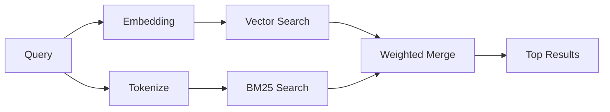

---
read_when:
    - Sie möchten verstehen, wie `memory_search` funktioniert.
    - Sie möchten einen Embedding-Anbieter auswählen.
    - Sie möchten die Suchqualität optimieren.
summary: Wie die Speichersuche relevante Notizen mithilfe von Embeddings und hybrider Suche findet
title: Speichersuche
x-i18n:
    generated_at: "2026-04-10T06:21:13Z"
    model: gpt-5.4
    provider: openai
    source_hash: ca0237f4f1ee69dcbfb12e6e9527a53e368c0bf9b429e506831d4af2f3a3ac6f
    source_path: concepts/memory-search.md
    workflow: 15
---

# Speichersuche

`memory_search` findet relevante Notizen aus Ihren Speicherdateien, auch wenn
die Formulierung vom ursprünglichen Text abweicht. Dazu wird der Speicher in
kleine Abschnitte indiziert und diese mithilfe von Embeddings, Schlüsselwörtern
oder beidem durchsucht.

## Schnellstart

Wenn Sie einen OpenAI-, Gemini-, Voyage- oder Mistral-API-Schlüssel
konfiguriert haben, funktioniert die Speichersuche automatisch. Um einen
Anbieter explizit festzulegen:

```json5
{
  agents: {
    defaults: {
      memorySearch: {
        provider: "openai", // oder "gemini", "local", "ollama" usw.
      },
    },
  },
}
```

Für lokale Embeddings ohne API-Schlüssel verwenden Sie `provider: "local"`
(erfordert node-llama-cpp).

## Unterstützte Anbieter

| Anbieter | ID        | API-Schlüssel erforderlich | Hinweise                                             |
| -------- | --------- | ------------------------- | ---------------------------------------------------- |
| OpenAI   | `openai`  | Ja                        | Automatisch erkannt, schnell                         |
| Gemini   | `gemini`  | Ja                        | Unterstützt Bild-/Audio-Indizierung                  |
| Voyage   | `voyage`  | Ja                        | Automatisch erkannt                                  |
| Mistral  | `mistral` | Ja                        | Automatisch erkannt                                  |
| Bedrock  | `bedrock` | Nein                      | Automatisch erkannt, wenn die AWS-Anmeldeinformationen aufgelöst werden |
| Ollama   | `ollama`  | Nein                      | Lokal, muss explizit festgelegt werden               |
| Local    | `local`   | Nein                      | GGUF-Modell, Download von ca. 0,6 GB                 |

## So funktioniert die Suche

OpenClaw führt zwei Abrufpfade parallel aus und führt die Ergebnisse zusammen:



- **Vektorsuche** findet Notizen mit ähnlicher Bedeutung („gateway host“
  passt zu „der Computer, auf dem OpenClaw läuft“).
- **BM25-Schlüsselwortsuche** findet exakte Übereinstimmungen (IDs,
  Fehlerzeichenfolgen, Konfigurationsschlüssel).

Wenn nur ein Pfad verfügbar ist (keine Embeddings oder kein FTS), läuft der
andere allein.

## Verbesserung der Suchqualität

Zwei optionale Funktionen helfen, wenn Sie einen großen Notizverlauf haben:

### Zeitlicher Verfall

Alte Notizen verlieren nach und nach an Ranking-Gewicht, sodass neuere
Informationen zuerst angezeigt werden. Mit der standardmäßigen Halbwertszeit
von 30 Tagen erreicht eine Notiz vom letzten Monat 50 % ihres ursprünglichen
Gewichts. Dauerhaft relevante Dateien wie `MEMORY.md` werden nie abgeschwächt.

<Tip>
Aktivieren Sie den zeitlichen Verfall, wenn Ihr Agent tägliche Notizen über
Monate hinweg hat und veraltete Informationen wiederholt vor aktuellem Kontext
erscheinen.
</Tip>

### MMR (Diversität)

Reduziert redundante Ergebnisse. Wenn fünf Notizen alle dieselbe
Router-Konfiguration erwähnen, stellt MMR sicher, dass die obersten Ergebnisse
verschiedene Themen abdecken, statt sich zu wiederholen.

<Tip>
Aktivieren Sie MMR, wenn `memory_search` wiederholt nahezu identische Snippets
aus verschiedenen täglichen Notizen zurückgibt.
</Tip>

### Beide aktivieren

```json5
{
  agents: {
    defaults: {
      memorySearch: {
        query: {
          hybrid: {
            mmr: { enabled: true },
            temporalDecay: { enabled: true },
          },
        },
      },
    },
  },
}
```

## Multimodaler Speicher

Mit Gemini Embedding 2 können Sie Bilder und Audiodateien zusammen mit
Markdown indizieren. Suchanfragen bleiben Text, werden aber mit visuellen und
Audioinhalten abgeglichen. Informationen zur Einrichtung finden Sie in der
[Referenz zur Speicherkonfiguration](/de/reference/memory-config).

## Speichersuche für Sitzungen

Sie können optional Sitzungsprotokolle indizieren, sodass `memory_search`
frühere Unterhaltungen abrufen kann. Dies ist eine Opt-in-Funktion über
`memorySearch.experimental.sessionMemory`. Details finden Sie in der
[Konfigurationsreferenz](/de/reference/memory-config).

## Fehlerbehebung

**Keine Ergebnisse?** Führen Sie `openclaw memory status` aus, um den Index zu
prüfen. Wenn er leer ist, führen Sie `openclaw memory index --force` aus.

**Nur Schlüsselworttreffer?** Ihr Embedding-Anbieter ist möglicherweise nicht
konfiguriert. Prüfen Sie `openclaw memory status --deep`.

**CJK-Text wird nicht gefunden?** Erstellen Sie den FTS-Index mit
`openclaw memory index --force` neu.

## Weiterführende Informationen

- [Aktiver Speicher](/de/concepts/active-memory) -- Speicher von Sub-Agents für interaktive Chatsitzungen
- [Speicher](/de/concepts/memory) -- Dateilayout, Backends, Tools
- [Referenz zur Speicherkonfiguration](/de/reference/memory-config) -- alle Konfigurationsoptionen
