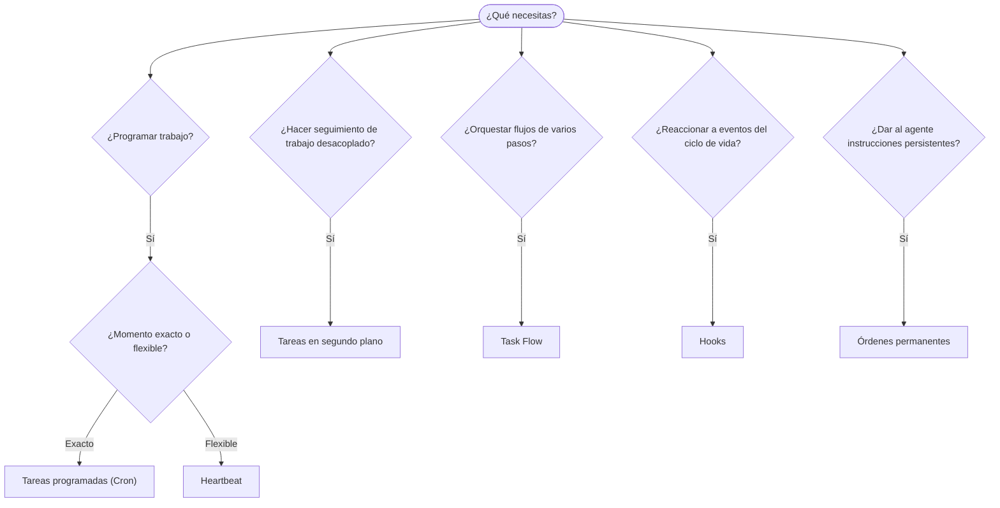

---
read_when:
    - Decidir cómo automatizar el trabajo con OpenClaw
    - Elegir entre heartbeat, cron, hooks y órdenes permanentes
    - Buscar el punto de entrada de automatización adecuado
summary: 'Descripción general de los mecanismos de automatización: tareas, cron, hooks, órdenes permanentes y Task Flow'
title: Automatización y tareas
x-i18n:
    generated_at: "2026-04-05T12:34:24Z"
    model: gpt-5.4
    provider: openai
    source_hash: 13cd05dcd2f38737f7bb19243ad1136978bfd727006fd65226daa3590f823afe
    source_path: automation/index.md
    workflow: 15
---

# Automatización y tareas

OpenClaw ejecuta trabajo en segundo plano mediante tareas, trabajos programados, hooks de eventos e instrucciones permanentes. Esta página te ayuda a elegir el mecanismo adecuado y a entender cómo encajan entre sí.

## Guía rápida de decisión

| Caso de uso                              | Recomendado           | Por qué                                          |
| ---------------------------------------- | --------------------- | ------------------------------------------------ |
| Enviar informe diario exactamente a las 9 AM | Tareas programadas (Cron) | Momento exacto, ejecución aislada                |
| Recuérdame en 20 minutos                 | Tareas programadas (Cron) | Ejecución única con momento preciso (`--at`)     |
| Ejecutar análisis profundo semanal       | Tareas programadas (Cron) | Tarea independiente, puede usar otro modelo      |
| Revisar la bandeja de entrada cada 30 min | Heartbeat             | Agrupa con otras comprobaciones, consciente del contexto |
| Supervisar el calendario para próximos eventos | Heartbeat             | Encaja de forma natural con la supervisión periódica |
| Inspeccionar el estado de un subagente o una ejecución de ACP | Tareas en segundo plano | El registro de tareas hace seguimiento de todo el trabajo desacoplado |
| Auditar qué se ejecutó y cuándo          | Tareas en segundo plano | `openclaw tasks list` y `openclaw tasks audit`   |
| Investigación de varios pasos y luego resumir | Task Flow             | Orquestación duradera con seguimiento de revisiones |
| Ejecutar un script al restablecer la sesión | Hooks                 | Basado en eventos, se activa en eventos del ciclo de vida |
| Ejecutar código en cada llamada a herramienta | Hooks                 | Los hooks pueden filtrar por tipo de evento      |
| Comprobar siempre el cumplimiento antes de responder | Órdenes permanentes   | Se inyectan automáticamente en cada sesión       |

### Tareas programadas (Cron) vs Heartbeat

| Dimensión       | Tareas programadas (Cron)           | Heartbeat                            |
| --------------- | ----------------------------------- | ------------------------------------ |
| Momento         | Exacto (expresiones cron, una sola vez) | Aproximado (cada 30 min por defecto) |
| Contexto de sesión | Nuevo (aislado) o compartido      | Contexto completo de la sesión principal |
| Registros de tareas | Siempre se crean                 | Nunca se crean                       |
| Entrega         | Canal, webhook o silenciosa         | En línea en la sesión principal      |
| Ideal para      | Informes, recordatorios, trabajos en segundo plano | Revisiones de bandeja de entrada, calendario, notificaciones |

Usa Tareas programadas (Cron) cuando necesites un momento preciso o una ejecución aislada. Usa Heartbeat cuando el trabajo se beneficie del contexto completo de la sesión y un momento aproximado sea suficiente.

## Conceptos principales

### Tareas programadas (cron)

Cron es el programador integrado del Gateway para momentos precisos. Conserva los trabajos, activa al agente en el momento adecuado y puede entregar la salida a un canal de chat o a un endpoint de webhook. Admite recordatorios de una sola vez, expresiones recurrentes y disparadores de webhooks entrantes.

Consulta [Tareas programadas](/automation/cron-jobs).

### Tareas

El registro de tareas en segundo plano hace seguimiento de todo el trabajo desacoplado: ejecuciones de ACP, lanzamientos de subagentes, ejecuciones cron aisladas y operaciones de la CLI. Las tareas son registros, no programadores. Usa `openclaw tasks list` y `openclaw tasks audit` para inspeccionarlas.

Consulta [Tareas en segundo plano](/automation/tasks).

### Task Flow

Task Flow es la capa de orquestación de flujos por encima de las tareas en segundo plano. Gestiona flujos duraderos de varios pasos con modos de sincronización administrados y reflejados, seguimiento de revisiones y `openclaw tasks flow list|show|cancel` para inspección.

Consulta [Task Flow](/automation/taskflow).

### Órdenes permanentes

Las órdenes permanentes conceden al agente autoridad operativa permanente para programas definidos. Se almacenan en archivos del espacio de trabajo (normalmente `AGENTS.md`) y se inyectan en cada sesión. Combínalas con cron para la aplicación basada en tiempo.

Consulta [Órdenes permanentes](/automation/standing-orders).

### Hooks

Los hooks son scripts basados en eventos que se activan por eventos del ciclo de vida del agente (`/new`, `/reset`, `/stop`), compactación de sesión, inicio del gateway, flujo de mensajes y llamadas a herramientas. Los hooks se detectan automáticamente desde directorios y se pueden gestionar con `openclaw hooks`.

Consulta [Hooks](/automation/hooks).

### Heartbeat

Heartbeat es un turno periódico de la sesión principal (cada 30 minutos por defecto). Agrupa varias comprobaciones (bandeja de entrada, calendario, notificaciones) en un único turno del agente con el contexto completo de la sesión. Los turnos de heartbeat no crean registros de tareas. Usa `HEARTBEAT.md` para una pequeña lista de verificación, o un bloque `tasks:` cuando quieras comprobaciones periódicas solo cuando correspondan dentro del propio heartbeat. Los archivos de heartbeat vacíos se omiten como `empty-heartbeat-file`; el modo de tareas solo cuando correspondan se omite como `no-tasks-due`.

Consulta [Heartbeat](/gateway/heartbeat).

## Cómo funcionan juntos

- **Cron** gestiona programaciones precisas (informes diarios, revisiones semanales) y recordatorios de una sola vez. Todas las ejecuciones de cron crean registros de tareas.
- **Heartbeat** gestiona la supervisión rutinaria (bandeja de entrada, calendario, notificaciones) en un único turno agrupado cada 30 minutos.
- **Hooks** reaccionan a eventos específicos (llamadas a herramientas, restablecimientos de sesión, compactación) con scripts personalizados.
- **Órdenes permanentes** dan al agente contexto persistente y límites de autoridad.
- **Task Flow** coordina flujos de varios pasos por encima de las tareas individuales.
- **Tareas** hacen seguimiento automáticamente de todo el trabajo desacoplado para que puedas inspeccionarlo y auditarlo.

## Relacionado

- [Tareas programadas](/automation/cron-jobs) — programación precisa y recordatorios de una sola vez
- [Tareas en segundo plano](/automation/tasks) — registro de tareas para todo el trabajo desacoplado
- [Task Flow](/automation/taskflow) — orquestación duradera de flujos de varios pasos
- [Hooks](/automation/hooks) — scripts del ciclo de vida basados en eventos
- [Órdenes permanentes](/automation/standing-orders) — instrucciones persistentes del agente
- [Heartbeat](/gateway/heartbeat) — turnos periódicos de la sesión principal
- [Referencia de configuración](/gateway/configuration-reference) — todas las claves de configuración
