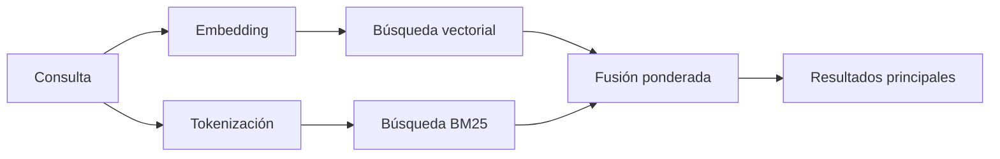

---
read_when:
    - Quieres entender cómo funciona memory_search
    - Quieres elegir un proveedor de embeddings
    - Quieres ajustar la calidad de la búsqueda
summary: Cómo memory_search encuentra notas relevantes usando embeddings y recuperación híbrida
title: Búsqueda en memoria
x-i18n:
    generated_at: "2026-04-05T12:39:55Z"
    model: gpt-5.4
    provider: openai
    source_hash: 87b1cb3469c7805f95bca5e77a02919d1e06d626ad3633bbc5465f6ab9db12a2
    source_path: concepts/memory-search.md
    workflow: 15
---

# Búsqueda en memoria

`memory_search` encuentra notas relevantes de tus archivos de memoria, incluso cuando la
redacción difiere del texto original. Funciona indexando la memoria en pequeños
fragmentos y buscándolos mediante embeddings, palabras clave o ambos.

## Inicio rápido

Si tienes configurada una clave API de OpenAI, Gemini, Voyage o Mistral, la búsqueda
en memoria funciona automáticamente. Para establecer un proveedor de forma explícita:

```json5
{
  agents: {
    defaults: {
      memorySearch: {
        provider: "openai", // o "gemini", "local", "ollama", etc.
      },
    },
  },
}
```

Para embeddings locales sin clave API, usa `provider: "local"` (requiere
node-llama-cpp).

## Proveedores compatibles

| Proveedor | ID        | Necesita clave API | Notas                         |
| --------- | --------- | ------------------ | ----------------------------- |
| OpenAI    | `openai`  | Sí                 | Detectado automáticamente, rápido |
| Gemini    | `gemini`  | Sí                 | Admite indexación de imagen/audio |
| Voyage    | `voyage`  | Sí                 | Detectado automáticamente     |
| Mistral   | `mistral` | Sí                 | Detectado automáticamente     |
| Ollama    | `ollama`  | No                 | Local, debe configurarse explícitamente |
| Local     | `local`   | No                 | Modelo GGUF, descarga de ~0,6 GB |

## Cómo funciona la búsqueda

OpenClaw ejecuta dos rutas de recuperación en paralelo y fusiona los resultados:



- **La búsqueda vectorial** encuentra notas con significado similar ("gateway host" coincide con
  "la máquina que ejecuta OpenClaw").
- **La búsqueda de palabras clave BM25** encuentra coincidencias exactas (ID, cadenas de error, claves
  de configuración).

Si solo una ruta está disponible (sin embeddings o sin FTS), la otra se ejecuta sola.

## Mejorar la calidad de la búsqueda

Dos funciones opcionales ayudan cuando tienes un historial grande de notas:

### Decaimiento temporal

Las notas antiguas pierden gradualmente peso en la clasificación para que la información
reciente aparezca primero. Con la vida media predeterminada de 30 días, una nota del
mes pasado puntúa al 50% de su peso original. Los archivos persistentes como `MEMORY.md` nunca
se ven afectados por el decaimiento.

<Tip>
Activa el decaimiento temporal si tu agente tiene meses de notas diarias y la
información obsoleta sigue apareciendo por encima del contexto reciente.
</Tip>

### MMR (diversidad)

Reduce los resultados redundantes. Si cinco notas mencionan la misma configuración del router, MMR
garantiza que los resultados principales cubran distintos temas en lugar de repetirse.

<Tip>
Activa MMR si `memory_search` sigue devolviendo fragmentos casi duplicados de
distintas notas diarias.
</Tip>

### Activar ambos

```json5
{
  agents: {
    defaults: {
      memorySearch: {
        query: {
          hybrid: {
            mmr: { enabled: true },
            temporalDecay: { enabled: true },
          },
        },
      },
    },
  },
}
```

## Memoria multimodal

Con Gemini Embedding 2, puedes indexar imágenes y archivos de audio junto con
Markdown. Las consultas de búsqueda siguen siendo texto, pero coinciden con
contenido visual y de audio. Consulta la [referencia de configuración de memoria](/reference/memory-config) para ver la
configuración.

## Búsqueda en la memoria de sesiones

Opcionalmente, puedes indexar las transcripciones de sesiones para que `memory_search` pueda recordar
conversaciones anteriores. Esto es opt-in mediante
`memorySearch.experimental.sessionMemory`. Consulta la
[referencia de configuración](/reference/memory-config) para obtener más información.

## Solución de problemas

**¿Sin resultados?** Ejecuta `openclaw memory status` para comprobar el índice. Si está vacío, ejecuta
`openclaw memory index --force`.

**¿Solo coincidencias de palabras clave?** Es posible que tu proveedor de embeddings no esté configurado. Comprueba
`openclaw memory status --deep`.

**¿No se encuentra texto CJK?** Vuelve a crear el índice FTS con
`openclaw memory index --force`.

## Más información

- [Memory](/concepts/memory) -- diseño de archivos, backends, herramientas
- [Memory configuration reference](/reference/memory-config) -- todos los ajustes de configuración
