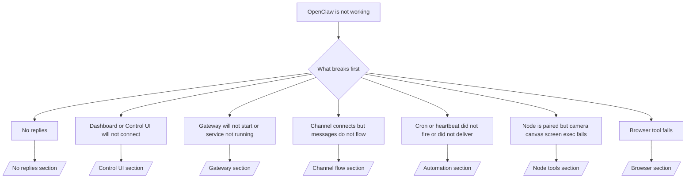

---
read_when:
    - OpenClaw no funciona y necesitas la ruta más rápida hacia una solución
    - Quieres un flujo de triaje antes de profundizar en guías detalladas
summary: Centro de resolución de problemas de OpenClaw orientado por síntomas
title: Resolución general de problemas
x-i18n:
    generated_at: "2026-04-05T12:44:45Z"
    model: gpt-5.4
    provider: openai
    source_hash: 23ae9638af5edf5a5e0584ccb15ba404223ac3b16c2d62eb93b2c9dac171c252
    source_path: help/troubleshooting.md
    workflow: 15
---

# Resolución de problemas

Si solo tienes 2 minutos, usa esta página como punto de entrada de triaje.

## Primeros 60 segundos

Ejecuta exactamente esta secuencia en orden:

```bash
openclaw status
openclaw status --all
openclaw gateway probe
openclaw gateway status
openclaw doctor
openclaw channels status --probe
openclaw logs --follow
```

Salida correcta, resumida en una línea:

- `openclaw status` → muestra los canales configurados y ningún error de autenticación evidente.
- `openclaw status --all` → el informe completo está presente y se puede compartir.
- `openclaw gateway probe` → se puede alcanzar el destino esperado del gateway (`Reachable: yes`). `RPC: limited - missing scope: operator.read` indica diagnóstico **degradado**, no un fallo de conexión.
- `openclaw gateway status` → `Runtime: running` y `RPC probe: ok`.
- `openclaw doctor` → no hay errores bloqueantes de configuración/servicio.
- `openclaw channels status --probe` → un gateway accesible devuelve estado de transporte en vivo por cuenta más resultados de sondeo/auditoría como `works` o `audit ok`; si el gateway no es accesible, el comando recurre a resúmenes solo de configuración.
- `openclaw logs --follow` → actividad constante, sin errores fatales repetidos.

## 429 de Anthropic en contexto largo

Si ves:
`HTTP 429: rate_limit_error: Extra usage is required for long context requests`,
ve a [/gateway/troubleshooting#anthropic-429-extra-usage-required-for-long-context](/gateway/troubleshooting#anthropic-429-extra-usage-required-for-long-context).

## La instalación del plugin falla porque faltan extensiones de openclaw

Si la instalación falla con `package.json missing openclaw.extensions`, el paquete del plugin
está usando una forma antigua que OpenClaw ya no acepta.

Corrige el paquete del plugin:

1. Añade `openclaw.extensions` a `package.json`.
2. Haz que las entradas apunten a archivos runtime compilados (normalmente `./dist/index.js`).
3. Vuelve a publicar el plugin y ejecuta de nuevo `openclaw plugins install <package>`.

Ejemplo:

```json
{
  "name": "@openclaw/my-plugin",
  "version": "1.2.3",
  "openclaw": {
    "extensions": ["./dist/index.js"]
  }
}
```

Referencia: [Arquitectura de plugins](/plugins/architecture)

## Árbol de decisión



<AccordionGroup>
  <Accordion title="Sin respuestas">
    ```bash
    openclaw status
    openclaw gateway status
    openclaw channels status --probe
    openclaw pairing list --channel <channel> [--account <id>]
    openclaw logs --follow
    ```

    Una salida correcta se ve así:

    - `Runtime: running`
    - `RPC probe: ok`
    - Tu canal muestra el transporte conectado y, cuando es compatible, `works` o `audit ok` en `channels status --probe`
    - El remitente aparece aprobado (o la política de mensajes directos es open/allowlist)

    Firmas habituales en los registros:

    - `drop guild message (mention required` → el control por menciones bloqueó el mensaje en Discord.
    - `pairing request` → el remitente no está aprobado y está esperando aprobación de emparejamiento para mensajes directos.
    - `blocked` / `allowlist` en los registros del canal → el remitente, la sala o el grupo están filtrados.

    Páginas detalladas:

    - [/gateway/troubleshooting#no-replies](/gateway/troubleshooting#no-replies)
    - [/channels/troubleshooting](/channels/troubleshooting)
    - [/channels/pairing](/channels/pairing)

  </Accordion>

  <Accordion title="Dashboard o la interfaz de Control no se conectan">
    ```bash
    openclaw status
    openclaw gateway status
    openclaw logs --follow
    openclaw doctor
    openclaw channels status --probe
    ```

    Una salida correcta se ve así:

    - `Dashboard: http://...` se muestra en `openclaw gateway status`
    - `RPC probe: ok`
    - No hay bucle de autenticación en los registros

    Firmas habituales en los registros:

    - `device identity required` → el contexto HTTP/no seguro no puede completar la autenticación del dispositivo.
    - `origin not allowed` → el `Origin` del navegador no está permitido para el destino del gateway de la interfaz de Control.
    - `AUTH_TOKEN_MISMATCH` con sugerencias de reintento (`canRetryWithDeviceToken=true`) → puede producirse automáticamente un reintento con token de dispositivo de confianza.
    - Ese reintento con token en caché reutiliza el conjunto de alcances almacenado con el token de dispositivo emparejado. Las llamadas con `deviceToken` explícito / `scopes` explícitos conservan el conjunto de alcances solicitado.
    - En la ruta asíncrona de la interfaz de Control con Tailscale Serve, los intentos fallidos para el mismo `{scope, ip}` se serializan antes de que el limitador registre el fallo, por lo que un segundo reintento incorrecto concurrente ya puede mostrar `retry later`.
    - `too many failed authentication attempts (retry later)` desde un origen de navegador localhost → los fallos repetidos desde ese mismo `Origin` quedan temporalmente bloqueados; otro origen localhost usa un bucket separado.
    - `repeated unauthorized` después de ese reintento → token/contraseña incorrectos, discrepancia de modo de autenticación o token de dispositivo emparejado obsoleto.
    - `gateway connect failed:` → la interfaz está apuntando a una URL/puerto incorrectos o a un gateway inaccesible.

    Páginas detalladas:

    - [/gateway/troubleshooting#dashboard-control-ui-connectivity](/gateway/troubleshooting#dashboard-control-ui-connectivity)
    - [/web/control-ui](/web/control-ui)
    - [/gateway/authentication](/gateway/authentication)

  </Accordion>

  <Accordion title="El Gateway no inicia o el servicio está instalado pero no se está ejecutando">
    ```bash
    openclaw status
    openclaw gateway status
    openclaw logs --follow
    openclaw doctor
    openclaw channels status --probe
    ```

    Una salida correcta se ve así:

    - `Service: ... (loaded)`
    - `Runtime: running`
    - `RPC probe: ok`

    Firmas habituales en los registros:

    - `Gateway start blocked: set gateway.mode=local` o `existing config is missing gateway.mode` → el modo del gateway es remoto, o falta la marca de modo local en el archivo de configuración y debe repararse.
    - `refusing to bind gateway ... without auth` → enlace fuera de loopback sin una ruta válida de autenticación del gateway (token/contraseña, o trusted-proxy donde esté configurado).
    - `another gateway instance is already listening` o `EADDRINUSE` → el puerto ya está ocupado.

    Páginas detalladas:

    - [/gateway/troubleshooting#gateway-service-not-running](/gateway/troubleshooting#gateway-service-not-running)
    - [/gateway/background-process](/gateway/background-process)
    - [/gateway/configuration](/gateway/configuration)

  </Accordion>

  <Accordion title="El canal se conecta, pero los mensajes no fluyen">
    ```bash
    openclaw status
    openclaw gateway status
    openclaw logs --follow
    openclaw doctor
    openclaw channels status --probe
    ```

    Una salida correcta se ve así:

    - El transporte del canal está conectado.
    - Las comprobaciones de emparejamiento/lista de permitidos pasan.
    - Las menciones se detectan cuando son necesarias.

    Firmas habituales en los registros:

    - `mention required` → el control por menciones bloqueó el procesamiento en grupos.
    - `pairing` / `pending` → el remitente del mensaje directo aún no está aprobado.
    - `not_in_channel`, `missing_scope`, `Forbidden`, `401/403` → problema de permisos o token del canal.

    Páginas detalladas:

    - [/gateway/troubleshooting#channel-connected-messages-not-flowing](/gateway/troubleshooting#channel-connected-messages-not-flowing)
    - [/channels/troubleshooting](/channels/troubleshooting)

  </Accordion>

  <Accordion title="Cron o heartbeat no se activaron o no entregaron">
    ```bash
    openclaw status
    openclaw gateway status
    openclaw cron status
    openclaw cron list
    openclaw cron runs --id <jobId> --limit 20
    openclaw logs --follow
    ```

    Una salida correcta se ve así:

    - `cron.status` muestra que está habilitado con una siguiente activación.
    - `cron runs` muestra entradas recientes `ok`.
    - Heartbeat está habilitado y no está fuera de las horas activas.

    Firmas habituales en los registros:

- `cron: scheduler disabled; jobs will not run automatically` → cron está deshabilitado.
- `heartbeat skipped` con `reason=quiet-hours` → fuera de las horas activas configuradas.
- `heartbeat skipped` con `reason=empty-heartbeat-file` → `HEARTBEAT.md` existe, pero solo contiene estructura en blanco o solo encabezados.
- `heartbeat skipped` con `reason=no-tasks-due` → el modo de tareas de `HEARTBEAT.md` está activo, pero ninguno de los intervalos de tareas vence todavía.
- `heartbeat skipped` con `reason=alerts-disabled` → toda la visibilidad de heartbeat está deshabilitada (`showOk`, `showAlerts` y `useIndicator` están todos desactivados).
- `requests-in-flight` → el carril principal está ocupado; la activación de heartbeat se aplazó.
- `unknown accountId` → la cuenta de destino de entrega de heartbeat no existe.

      Páginas detalladas:

      - [/gateway/troubleshooting#cron-and-heartbeat-delivery](/gateway/troubleshooting#cron-and-heartbeat-delivery)
      - [/automation/cron-jobs#troubleshooting](/automation/cron-jobs#troubleshooting)
      - [/gateway/heartbeat](/gateway/heartbeat)

    </Accordion>

    <Accordion title="El nodo está emparejado, pero falla la herramienta de cámara/canvas/pantalla/exec">
      ```bash
      openclaw status
      openclaw gateway status
      openclaw nodes status
      openclaw nodes describe --node <idOrNameOrIp>
      openclaw logs --follow
      ```

      Una salida correcta se ve así:

      - El nodo aparece como conectado y emparejado para el rol `node`.
      - La capacidad existe para el comando que estás invocando.
      - El estado de permisos está concedido para la herramienta.

      Firmas habituales en los registros:

      - `NODE_BACKGROUND_UNAVAILABLE` → lleva la app del nodo al primer plano.
      - `*_PERMISSION_REQUIRED` → el permiso del sistema operativo fue denegado o falta.
      - `SYSTEM_RUN_DENIED: approval required` → la aprobación de exec está pendiente.
      - `SYSTEM_RUN_DENIED: allowlist miss` → el comando no está en la lista de permitidos de exec.

      Páginas detalladas:

      - [/gateway/troubleshooting#node-paired-tool-fails](/gateway/troubleshooting#node-paired-tool-fails)
      - [/nodes/troubleshooting](/nodes/troubleshooting)
      - [/tools/exec-approvals](/tools/exec-approvals)

    </Accordion>

    <Accordion title="Exec de repente pide aprobación">
      ```bash
      openclaw config get tools.exec.host
      openclaw config get tools.exec.security
      openclaw config get tools.exec.ask
      openclaw gateway restart
      ```

      Qué cambió:

      - Si `tools.exec.host` no está definido, el valor predeterminado es `auto`.
      - `host=auto` se resuelve como `sandbox` cuando hay un entorno de sandbox activo y, en caso contrario, como `gateway`.
      - `host=auto` es solo enrutamiento; el comportamiento sin prompt tipo "YOLO" viene de `security=full` más `ask=off` en gateway/node.
      - En `gateway` y `node`, si `tools.exec.security` no está definido, el valor predeterminado es `full`.
      - Si `tools.exec.ask` no está definido, el valor predeterminado es `off`.
      - Resultado: si estás viendo aprobaciones, alguna política local del host o por sesión endureció exec respecto a los valores predeterminados actuales.

      Restablecer el comportamiento actual predeterminado sin aprobación:

      ```bash
      openclaw config set tools.exec.host gateway
      openclaw config set tools.exec.security full
      openclaw config set tools.exec.ask off
      openclaw gateway restart
      ```

      Alternativas más seguras:

      - Establece solo `tools.exec.host=gateway` si solo quieres un enrutamiento estable al host.
      - Usa `security=allowlist` con `ask=on-miss` si quieres exec en el host pero seguir revisando los fallos de lista de permitidos.
      - Habilita el modo sandbox si quieres que `host=auto` vuelva a resolverse como `sandbox`.

      Firmas habituales en los registros:

      - `Approval required.` → el comando está esperando `/approve ...`.
      - `SYSTEM_RUN_DENIED: approval required` → la aprobación de exec en host de nodo está pendiente.
      - `exec host=sandbox requires a sandbox runtime for this session` → selección implícita/explícita de sandbox, pero el modo sandbox está desactivado.

      Páginas detalladas:

      - [/tools/exec](/tools/exec)
      - [/tools/exec-approvals](/tools/exec-approvals)
      - [/gateway/security#runtime-expectation-drift](/gateway/security#runtime-expectation-drift)

    </Accordion>

    <Accordion title="Falla la herramienta de navegador">
      ```bash
      openclaw status
      openclaw gateway status
      openclaw browser status
      openclaw logs --follow
      openclaw doctor
      ```

      Una salida correcta se ve así:

      - El estado del navegador muestra `running: true` y un navegador/perfil elegido.
      - `openclaw` inicia, o `user` puede ver pestañas locales de Chrome.

      Firmas habituales en los registros:

      - `unknown command "browser"` o `unknown command 'browser'` → `plugins.allow` está definido y no incluye `browser`.
      - `Failed to start Chrome CDP on port` → falló el inicio local del navegador.
      - `browser.executablePath not found` → la ruta binaria configurada es incorrecta.
      - `browser.cdpUrl must be http(s) or ws(s)` → la URL de CDP configurada usa un esquema no compatible.
      - `browser.cdpUrl has invalid port` → la URL de CDP configurada tiene un puerto incorrecto o fuera de rango.
      - `No Chrome tabs found for profile="user"` → el perfil de adjuntar Chrome MCP no tiene pestañas locales abiertas de Chrome.
      - `Remote CDP for profile "<name>" is not reachable` → no se puede alcanzar el endpoint CDP remoto configurado desde este host.
      - `Browser attachOnly is enabled ... not reachable` o `Browser attachOnly is enabled and CDP websocket ... is not reachable` → el perfil solo de adjuntar no tiene un destino CDP activo.
      - Sobrescrituras obsoletas de viewport / dark-mode / locale / offline en perfiles attach-only o CDP remoto → ejecuta `openclaw browser stop --browser-profile <name>` para cerrar la sesión de control activa y liberar el estado de emulación sin reiniciar el gateway.

      Páginas detalladas:

      - [/gateway/troubleshooting#browser-tool-fails](/gateway/troubleshooting#browser-tool-fails)
      - [/tools/browser#missing-browser-command-or-tool](/tools/browser#missing-browser-command-or-tool)
      - [/tools/browser-linux-troubleshooting](/tools/browser-linux-troubleshooting)
      - [/tools/browser-wsl2-windows-remote-cdp-troubleshooting](/tools/browser-wsl2-windows-remote-cdp-troubleshooting)

    </Accordion>
  </AccordionGroup>

## Relacionado

- [FAQ](/help/faq) — preguntas frecuentes
- [Resolución de problemas del Gateway](/gateway/troubleshooting) — problemas específicos del gateway
- [Doctor](/gateway/doctor) — comprobaciones automáticas de estado y reparaciones
- [Resolución de problemas de canales](/channels/troubleshooting) — problemas de conectividad de canales
- [Resolución de problemas de automatización](/automation/cron-jobs#troubleshooting) — problemas de cron y heartbeat
