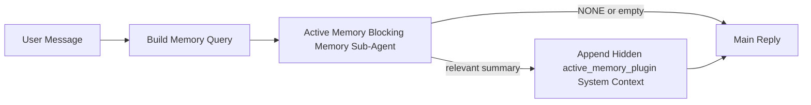

---
read_when:
    - Vous voulez comprendre à quoi sert Active Memory
    - Vous souhaitez activer Active Memory pour un agent conversationnel
    - Vous souhaitez ajuster le comportement d’Active Memory sans l’activer partout
summary: Un sous-agent de mémoire de blocage appartenant au Plugin qui injecte la mémoire pertinente dans les sessions de chat interactives
title: Active Memory
x-i18n:
    generated_at: "2026-04-12T23:28:10Z"
    model: gpt-5.4
    provider: openai
    source_hash: 11665dbc888b6d4dc667a47624cc1f2e4cc71e1d58e1f7d9b5fe4057ec4da108
    source_path: concepts/active-memory.md
    workflow: 15
---

# Active Memory

Active Memory est un sous-agent de mémoire de blocage optionnel appartenant au Plugin qui s’exécute avant la réponse principale pour les sessions conversationnelles éligibles.

Il existe parce que la plupart des systèmes de mémoire sont performants, mais réactifs. Ils s’appuient sur l’agent principal pour décider quand rechercher en mémoire, ou sur l’utilisateur pour dire des choses comme « remember this » ou « search memory ». À ce moment-là, l’instant où la mémoire aurait rendu la réponse naturelle est déjà passé.

Active Memory donne au système une occasion limitée de faire remonter une mémoire pertinente avant que la réponse principale ne soit générée.

## Collez ceci dans votre agent

Collez ceci dans votre agent si vous voulez qu’il active Active Memory avec une configuration autonome et sûre par défaut :

```json5
{
  plugins: {
    entries: {
      "active-memory": {
        enabled: true,
        config: {
          enabled: true,
          agents: ["main"],
          allowedChatTypes: ["direct"],
          modelFallback: "google/gemini-3-flash",
          queryMode: "recent",
          promptStyle: "balanced",
          timeoutMs: 15000,
          maxSummaryChars: 220,
          persistTranscripts: false,
          logging: true,
        },
      },
    },
  },
}
```

Cela active le Plugin pour l’agent `main`, le limite par défaut aux sessions de type message direct, lui permet d’hériter d’abord du modèle de la session actuelle, et n’utilise le modèle de secours configuré que si aucun modèle explicite ou hérité n’est disponible.

Après cela, redémarrez la Gateway :

```bash
openclaw gateway
```

Pour l’inspecter en direct dans une conversation :

```text
/verbose on
/trace on
```

## Activer Active Memory

La configuration la plus sûre consiste à :

1. activer le Plugin
2. cibler un agent conversationnel
3. garder la journalisation activée uniquement pendant l’ajustement

Commencez avec ceci dans `openclaw.json` :

```json5
{
  plugins: {
    entries: {
      "active-memory": {
        enabled: true,
        config: {
          agents: ["main"],
          allowedChatTypes: ["direct"],
          modelFallback: "google/gemini-3-flash",
          queryMode: "recent",
          promptStyle: "balanced",
          timeoutMs: 15000,
          maxSummaryChars: 220,
          persistTranscripts: false,
          logging: true,
        },
      },
    },
  },
}
```

Puis redémarrez la Gateway :

```bash
openclaw gateway
```

Ce que cela signifie :

- `plugins.entries.active-memory.enabled: true` active le Plugin
- `config.agents: ["main"]` active Active Memory uniquement pour l’agent `main`
- `config.allowedChatTypes: ["direct"]` garde par défaut Active Memory activé uniquement pour les sessions de type message direct
- si `config.model` n’est pas défini, Active Memory hérite d’abord du modèle de la session actuelle
- `config.modelFallback` fournit éventuellement votre propre fournisseur/modèle de secours pour le rappel
- `config.promptStyle: "balanced"` utilise le style d’invite généraliste par défaut pour le mode `recent`
- Active Memory ne s’exécute toujours que sur les sessions de chat interactives persistantes éligibles

## Comment le voir

Active Memory injecte un contexte système caché pour le modèle. Il n’expose pas les balises brutes `<active_memory_plugin>...</active_memory_plugin>` au client.

## Bascule de session

Utilisez la commande du Plugin lorsque vous souhaitez suspendre ou reprendre Active Memory pour la session de chat actuelle sans modifier la configuration :

```text
/active-memory status
/active-memory off
/active-memory on
```

Ceci est limité à la session. Cela ne modifie pas `plugins.entries.active-memory.enabled`, le ciblage de l’agent ni les autres paramètres globaux.

Si vous voulez que la commande écrive dans la configuration et suspende ou reprenne Active Memory pour toutes les sessions, utilisez la forme globale explicite :

```text
/active-memory status --global
/active-memory off --global
/active-memory on --global
```

La forme globale écrit dans `plugins.entries.active-memory.config.enabled`. Elle laisse `plugins.entries.active-memory.enabled` activé afin que la commande reste disponible pour réactiver Active Memory plus tard.

Si vous voulez voir ce que fait Active Memory dans une session en direct, activez les bascules de session correspondant à la sortie que vous souhaitez :

```text
/verbose on
/trace on
```

Avec ces options activées, OpenClaw peut afficher :

- une ligne d’état Active Memory telle que `Active Memory: ok 842ms recent 34 chars` quand `/verbose on` est activé
- un résumé de débogage lisible tel que `Active Memory Debug: Lemon pepper wings with blue cheese.` quand `/trace on` est activé

Ces lignes sont dérivées du même passage Active Memory qui alimente le contexte système caché, mais elles sont formatées pour les humains au lieu d’exposer le balisage brut de l’invite. Elles sont envoyées comme message de diagnostic de suivi après la réponse normale de l’assistant afin que des clients de canal comme Telegram n’affichent pas une bulle de diagnostic distincte avant la réponse.

Par défaut, la transcription du sous-agent de mémoire de blocage est temporaire et supprimée une fois l’exécution terminée.

Exemple de flux :

```text
/verbose on
/trace on
what wings should i order?
```

Forme de réponse visible attendue :

```text
...normal assistant reply...

🧩 Active Memory: ok 842ms recent 34 chars
🔎 Active Memory Debug: Lemon pepper wings with blue cheese.
```

## Quand il s’exécute

Active Memory utilise deux contrôles :

1. **Activation dans la configuration**
   Le Plugin doit être activé, et l’identifiant de l’agent actuel doit apparaître dans
   `plugins.entries.active-memory.config.agents`.
2. **Éligibilité d’exécution stricte**
   Même lorsqu’il est activé et ciblé, Active Memory ne s’exécute que pour les
   sessions de chat interactives persistantes éligibles.

La règle réelle est :

```text
plugin enabled
+
agent id targeted
+
allowed chat type
+
eligible interactive persistent chat session
=
active memory runs
```

Si l’un de ces contrôles échoue, Active Memory ne s’exécute pas.

## Types de session

`config.allowedChatTypes` contrôle quels types de conversations peuvent exécuter Active Memory.

La valeur par défaut est :

```json5
allowedChatTypes: ["direct"]
```

Cela signifie qu’Active Memory s’exécute par défaut dans les sessions de type message direct, mais pas dans les sessions de groupe ou de canal, sauf si vous les activez explicitement.

Exemples :

```json5
allowedChatTypes: ["direct"]
```

```json5
allowedChatTypes: ["direct", "group"]
```

```json5
allowedChatTypes: ["direct", "group", "channel"]
```

## Où il s’exécute

Active Memory est une fonctionnalité d’enrichissement conversationnel, pas une fonctionnalité d’inférence à l’échelle de la plateforme.

| Surface                                                             | Active Memory s’exécute ?                              |
| ------------------------------------------------------------------- | ------------------------------------------------------ |
| Sessions persistantes de chat Control UI / web chat                 | Oui, si le Plugin est activé et que l’agent est ciblé |
| Autres sessions de canal interactives sur le même chemin de chat persistant | Oui, si le Plugin est activé et que l’agent est ciblé |
| Exécutions ponctuelles headless                                     | Non                                                    |
| Exécutions Heartbeat/en arrière-plan                                | Non                                                    |
| Chemins internes génériques `agent-command`                         | Non                                                    |
| Exécution de sous-agent/helper interne                              | Non                                                    |

## Pourquoi l’utiliser

Utilisez Active Memory lorsque :

- la session est persistante et destinée à l’utilisateur
- l’agent a une mémoire à long terme utile à rechercher
- la continuité et la personnalisation comptent plus que le déterminisme brut de l’invite

Il fonctionne particulièrement bien pour :

- les préférences stables
- les habitudes récurrentes
- le contexte utilisateur à long terme qui devrait remonter naturellement

Il est mal adapté pour :

- l’automatisation
- les workers internes
- les tâches API ponctuelles
- les endroits où une personnalisation cachée serait surprenante

## Comment cela fonctionne

La structure d’exécution est :



Le sous-agent de mémoire de blocage ne peut utiliser que :

- `memory_search`
- `memory_get`

Si la connexion est faible, il doit renvoyer `NONE`.

## Modes de requête

`config.queryMode` contrôle la quantité de conversation visible par le sous-agent de mémoire de blocage.

## Styles d’invite

`config.promptStyle` contrôle à quel point le sous-agent de mémoire de blocage est enclin ou strict lorsqu’il décide s’il doit renvoyer de la mémoire.

Styles disponibles :

- `balanced` : valeur générale par défaut pour le mode `recent`
- `strict` : le moins enclin ; idéal quand vous voulez très peu de contamination depuis le contexte proche
- `contextual` : le plus favorable à la continuité ; idéal lorsque l’historique de la conversation doit compter davantage
- `recall-heavy` : plus enclin à faire remonter la mémoire sur des correspondances plus souples mais toujours plausibles
- `precision-heavy` : préfère fortement `NONE` sauf si la correspondance est évidente
- `preference-only` : optimisé pour les favoris, habitudes, routines, goûts et faits personnels récurrents

Correspondance par défaut lorsque `config.promptStyle` n’est pas défini :

```text
message -> strict
recent -> balanced
full -> contextual
```

Si vous définissez explicitement `config.promptStyle`, cette valeur de remplacement est prioritaire.

Exemple :

```json5
promptStyle: "preference-only"
```

## Politique de modèle de secours

Si `config.model` n’est pas défini, Active Memory tente de résoudre un modèle dans cet ordre :

```text
explicit plugin model
-> current session model
-> agent primary model
-> optional configured fallback model
```

`config.modelFallback` contrôle l’étape de secours configurée.

Secours personnalisé facultatif :

```json5
modelFallback: "google/gemini-3-flash"
```

Si aucun modèle explicite, hérité ou de secours configuré n’est résolu, Active Memory ignore le rappel pour ce tour.

`config.modelFallbackPolicy` est conservé uniquement comme champ de compatibilité obsolète pour les anciennes configurations. Il ne modifie plus le comportement à l’exécution.

## Mécanismes d’échappement avancés

Ces options ne font intentionnellement pas partie de la configuration recommandée.

`config.thinking` peut remplacer le niveau de réflexion du sous-agent de mémoire de blocage :

```json5
thinking: "medium"
```

Valeur par défaut :

```json5
thinking: "off"
```

Ne l’activez pas par défaut. Active Memory s’exécute dans le chemin de réponse, donc le temps de réflexion supplémentaire augmente directement la latence visible par l’utilisateur.

`config.promptAppend` ajoute des instructions opérateur supplémentaires après l’invite Active Memory par défaut et avant le contexte conversationnel :

```json5
promptAppend: "Prefer stable long-term preferences over one-off events."
```

`config.promptOverride` remplace l’invite Active Memory par défaut. OpenClaw ajoute toujours ensuite le contexte conversationnel :

```json5
promptOverride: "You are a memory search agent. Return NONE or one compact user fact."
```

La personnalisation de l’invite n’est pas recommandée sauf si vous testez délibérément un contrat de rappel différent. L’invite par défaut est ajustée pour renvoyer soit `NONE`, soit un contexte compact de faits utilisateur pour le modèle principal.

### `message`

Seul le dernier message de l’utilisateur est envoyé.

```text
Latest user message only
```

Utilisez ceci lorsque :

- vous voulez le comportement le plus rapide
- vous voulez le biais le plus fort vers le rappel de préférences stables
- les tours de suivi n’ont pas besoin de contexte conversationnel

Délai d’expiration recommandé :

- commencez autour de `3000` à `5000` ms

### `recent`

Le dernier message de l’utilisateur plus une petite portion récente de la conversation sont envoyés.

```text
Recent conversation tail:
user: ...
assistant: ...
user: ...

Latest user message:
...
```

Utilisez ceci lorsque :

- vous voulez un meilleur équilibre entre vitesse et ancrage conversationnel
- les questions de suivi dépendent souvent des derniers tours

Délai d’expiration recommandé :

- commencez autour de `15000` ms

### `full`

La conversation complète est envoyée au sous-agent de mémoire de blocage.

```text
Full conversation context:
user: ...
assistant: ...
user: ...
...
```

Utilisez ceci lorsque :

- la meilleure qualité de rappel compte plus que la latence
- la conversation contient une mise en place importante loin dans le fil

Délai d’expiration recommandé :

- augmentez-le nettement par rapport à `message` ou `recent`
- commencez autour de `15000` ms ou plus selon la taille du fil

En général, le délai d’expiration doit augmenter avec la taille du contexte :

```text
message < recent < full
```

## Persistance des transcriptions

Les exécutions du sous-agent de mémoire de blocage Active Memory créent une vraie transcription `session.jsonl`
pendant l’appel du sous-agent de mémoire de blocage.

Par défaut, cette transcription est temporaire :

- elle est écrite dans un répertoire temporaire
- elle est utilisée uniquement pour l’exécution du sous-agent de mémoire de blocage
- elle est supprimée immédiatement une fois l’exécution terminée

Si vous souhaitez conserver ces transcriptions du sous-agent de mémoire de blocage sur disque pour le débogage ou
l’inspection, activez explicitement la persistance :

```json5
{
  plugins: {
    entries: {
      "active-memory": {
        enabled: true,
        config: {
          agents: ["main"],
          persistTranscripts: true,
          transcriptDir: "active-memory",
        },
      },
    },
  },
}
```

Lorsqu’elle est activée, Active Memory stocke les transcriptions dans un répertoire distinct sous le
dossier de sessions de l’agent cible, et non dans le chemin principal de
transcription de la conversation utilisateur.

La structure par défaut est conceptuellement :

```text
agents/<agent>/sessions/active-memory/<blocking-memory-sub-agent-session-id>.jsonl
```

Vous pouvez modifier le sous-répertoire relatif avec `config.transcriptDir`.

Utilisez cela avec précaution :

- les transcriptions du sous-agent de mémoire de blocage peuvent s’accumuler rapidement sur des sessions très actives
- le mode de requête `full` peut dupliquer une grande partie du contexte de conversation
- ces transcriptions contiennent le contexte d’invite caché et les mémoires rappelées

## Configuration

Toute la configuration d’Active Memory se trouve sous :

```text
plugins.entries.active-memory
```

Les champs les plus importants sont :

| Key                         | Type                                                                                                 | Meaning                                                                                                  |
| --------------------------- | ---------------------------------------------------------------------------------------------------- | -------------------------------------------------------------------------------------------------------- |
| `enabled`                   | `boolean`                                                                                            | Active le Plugin lui-même                                                                                |
| `config.agents`             | `string[]`                                                                                           | Identifiants d’agent pouvant utiliser Active Memory                                                      |
| `config.model`              | `string`                                                                                             | Référence de modèle facultative du sous-agent de mémoire de blocage ; si non définie, Active Memory utilise le modèle de la session actuelle |
| `config.queryMode`          | `"message" \| "recent" \| "full"`                                                                    | Contrôle la quantité de conversation visible par le sous-agent de mémoire de blocage                     |
| `config.promptStyle`        | `"balanced" \| "strict" \| "contextual" \| "recall-heavy" \| "precision-heavy" \| "preference-only"` | Contrôle à quel point le sous-agent de mémoire de blocage est enclin ou strict lorsqu’il décide de renvoyer de la mémoire |
| `config.thinking`           | `"off" \| "minimal" \| "low" \| "medium" \| "high" \| "xhigh" \| "adaptive"`                         | Remplacement avancé du niveau de réflexion pour le sous-agent de mémoire de blocage ; valeur par défaut `off` pour la vitesse |
| `config.promptOverride`     | `string`                                                                                             | Remplacement avancé complet de l’invite ; non recommandé pour un usage normal                            |
| `config.promptAppend`       | `string`                                                                                             | Instructions supplémentaires avancées ajoutées à l’invite par défaut ou remplacée                        |
| `config.timeoutMs`          | `number`                                                                                             | Délai d’expiration strict pour le sous-agent de mémoire de blocage                                       |
| `config.maxSummaryChars`    | `number`                                                                                             | Nombre total maximal de caractères autorisés dans le résumé active-memory                                |
| `config.logging`            | `boolean`                                                                                            | Émet des journaux Active Memory pendant l’ajustement                                                     |
| `config.persistTranscripts` | `boolean`                                                                                            | Conserve sur disque les transcriptions du sous-agent de mémoire de blocage au lieu de supprimer les fichiers temporaires |
| `config.transcriptDir`      | `string`                                                                                             | Répertoire relatif des transcriptions du sous-agent de mémoire de blocage sous le dossier de sessions de l’agent |

Champs d’ajustement utiles :

| Key                           | Type     | Meaning                                                        |
| ----------------------------- | -------- | -------------------------------------------------------------- |
| `config.maxSummaryChars`      | `number` | Nombre total maximal de caractères autorisés dans le résumé active-memory |
| `config.recentUserTurns`      | `number` | Tours utilisateur précédents à inclure lorsque `queryMode` est `recent` |
| `config.recentAssistantTurns` | `number` | Tours assistant précédents à inclure lorsque `queryMode` est `recent` |
| `config.recentUserChars`      | `number` | Nombre maximal de caractères par tour utilisateur récent       |
| `config.recentAssistantChars` | `number` | Nombre maximal de caractères par tour assistant récent         |
| `config.cacheTtlMs`           | `number` | Réutilisation du cache pour les requêtes identiques répétées   |

## Configuration recommandée

Commencez avec `recent`.

```json5
{
  plugins: {
    entries: {
      "active-memory": {
        enabled: true,
        config: {
          agents: ["main"],
          queryMode: "recent",
          promptStyle: "balanced",
          timeoutMs: 15000,
          maxSummaryChars: 220,
          logging: true,
        },
      },
    },
  },
}
```

Si vous souhaitez inspecter le comportement en direct pendant l’ajustement, utilisez `/verbose on` pour la
ligne d’état normale et `/trace on` pour le résumé de débogage active-memory au lieu
de chercher une commande de débogage active-memory distincte. Dans les canaux de chat, ces
lignes de diagnostic sont envoyées après la réponse principale de l’assistant plutôt qu’avant.

Ensuite, passez à :

- `message` si vous souhaitez une latence plus faible
- `full` si vous décidez qu’un contexte supplémentaire vaut la peine d’avoir un sous-agent de mémoire de blocage plus lent

## Débogage

Si Active Memory n’apparaît pas là où vous l’attendez :

1. Confirmez que le Plugin est activé sous `plugins.entries.active-memory.enabled`.
2. Confirmez que l’identifiant d’agent actuel figure dans `config.agents`.
3. Confirmez que vous testez via une session de chat interactive persistante.
4. Activez `config.logging: true` et surveillez les journaux de la Gateway.
5. Vérifiez que la recherche mémoire elle-même fonctionne avec `openclaw memory status --deep`.

Si les résultats mémoire sont trop bruités, resserrez :

- `maxSummaryChars`

Si Active Memory est trop lent :

- réduisez `queryMode`
- réduisez `timeoutMs`
- réduisez le nombre de tours récents
- réduisez le plafond de caractères par tour

## Problèmes courants

### Le fournisseur d’embeddings a changé de manière inattendue

Active Memory utilise le pipeline normal `memory_search` sous
`agents.defaults.memorySearch`. Cela signifie que la configuration du fournisseur d’embeddings n’est une
exigence que si votre configuration `memorySearch` nécessite des embeddings pour le comportement
souhaité.

En pratique :

- une configuration explicite du fournisseur est **requise** si vous voulez un fournisseur qui n’est pas
  détecté automatiquement, tel que `ollama`
- une configuration explicite du fournisseur est **requise** si la détection automatique ne résout
  aucun fournisseur d’embeddings utilisable pour votre environnement
- une configuration explicite du fournisseur est **fortement recommandée** si vous voulez une
  sélection de fournisseur déterministe au lieu de « first available wins »
- une configuration explicite du fournisseur n’est généralement **pas requise** si la détection automatique résout déjà
  le fournisseur que vous voulez et que ce fournisseur est stable dans votre déploiement

Si `memorySearch.provider` n’est pas défini, OpenClaw détecte automatiquement le premier
fournisseur d’embeddings disponible.

Cela peut prêter à confusion dans des déploiements réels :

- une clé API nouvellement disponible peut changer le fournisseur utilisé par la recherche mémoire
- une commande ou une surface de diagnostic peut faire paraître le fournisseur sélectionné
  différent du chemin réellement utilisé pendant la synchronisation mémoire en direct ou
  l’amorçage de la recherche
- les fournisseurs hébergés peuvent échouer avec des erreurs de quota ou de limitation de débit qui n’apparaissent
  qu’une fois qu’Active Memory commence à lancer des recherches de rappel avant chaque réponse

Active Memory peut tout de même s’exécuter sans embeddings lorsque `memory_search` peut fonctionner
en mode dégradé lexical uniquement, ce qui se produit généralement lorsqu’aucun fournisseur
d’embeddings ne peut être résolu.

Ne supposez pas le même repli lors d’échecs d’exécution du fournisseur tels que l’épuisement du quota,
les limitations de débit, les erreurs réseau/fournisseur ou l’absence de modèles locaux/distants
après qu’un fournisseur a déjà été sélectionné.

En pratique :

- si aucun fournisseur d’embeddings ne peut être résolu, `memory_search` peut se dégrader vers
  une récupération lexicale uniquement
- si un fournisseur d’embeddings est résolu puis échoue à l’exécution, OpenClaw ne
  garantit pas actuellement un repli lexical pour cette requête
- si vous avez besoin d’une sélection de fournisseur déterministe, fixez
  `agents.defaults.memorySearch.provider`
- si vous avez besoin d’un basculement de fournisseur sur les erreurs d’exécution, configurez
  explicitement `agents.defaults.memorySearch.fallback`

Si vous dépendez d’un rappel basé sur des embeddings, d’une indexation multimodale ou d’un fournisseur
local/distant spécifique, fixez explicitement le fournisseur au lieu de vous appuyer sur
la détection automatique.

Exemples courants d’épinglage :

OpenAI :

```json5
{
  agents: {
    defaults: {
      memorySearch: {
        provider: "openai",
        model: "text-embedding-3-small",
      },
    },
  },
}
```

Gemini :

```json5
{
  agents: {
    defaults: {
      memorySearch: {
        provider: "gemini",
        model: "gemini-embedding-001",
      },
    },
  },
}
```

Ollama :

```json5
{
  agents: {
    defaults: {
      memorySearch: {
        provider: "ollama",
        model: "nomic-embed-text",
      },
    },
  },
}
```

Si vous vous attendez à un basculement de fournisseur sur des erreurs d’exécution telles que l’épuisement du quota,
fixer un fournisseur seul ne suffit pas. Configurez aussi explicitement un repli :

```json5
{
  agents: {
    defaults: {
      memorySearch: {
        provider: "openai",
        fallback: "gemini",
      },
    },
  },
}
```

### Débogage des problèmes de fournisseur

Si Active Memory est lent, vide ou semble changer de fournisseur de manière inattendue :

- surveillez les journaux de la Gateway pendant la reproduction du problème ; recherchez des lignes telles que
  `active-memory: ... start|done`, `memory sync failed (search-bootstrap)` ou des
  erreurs d’embedding spécifiques au fournisseur
- activez `/trace on` pour afficher dans la session le résumé de débogage Active Memory appartenant au Plugin
- activez `/verbose on` si vous voulez également la ligne d’état normale `🧩 Active Memory: ...`
  après chaque réponse
- exécutez `openclaw memory status --deep` pour inspecter le backend actuel de
  recherche mémoire et l’état de l’index
- vérifiez `agents.defaults.memorySearch.provider` et l’authentification/configuration associée afin de
  vous assurer que le fournisseur attendu est bien celui qui peut être résolu à l’exécution
- si vous utilisez `ollama`, vérifiez que le modèle d’embedding configuré est installé, par
  exemple `ollama list`

Exemple de boucle de débogage :

```text
1. Start the gateway and watch its logs
2. In the chat session, run /trace on
3. Send one message that should trigger Active Memory
4. Compare the chat-visible debug line with the gateway log lines
5. If provider choice is ambiguous, pin agents.defaults.memorySearch.provider explicitly
```

Exemple :

```json5
{
  agents: {
    defaults: {
      memorySearch: {
        provider: "ollama",
        model: "nomic-embed-text",
      },
    },
  },
}
```

Ou, si vous voulez des embeddings Gemini :

```json5
{
  agents: {
    defaults: {
      memorySearch: {
        provider: "gemini",
      },
    },
  },
}
```

Après avoir changé le fournisseur, redémarrez la Gateway et effectuez un nouveau test avec
`/trace on` afin que la ligne de débogage Active Memory reflète le nouveau chemin d’embedding.

## Pages associées

- [Memory Search](/fr/concepts/memory-search)
- [Référence de configuration de la mémoire](/fr/reference/memory-config)
- [Configuration du Plugin SDK](/fr/plugins/sdk-setup)
