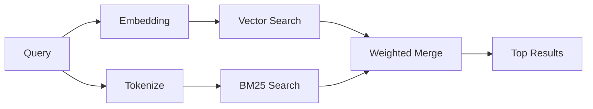

---
read_when:
    - Vous voulez comprendre comment fonctionne `memory_search`
    - Vous voulez choisir un fournisseur d’embeddings
    - Vous voulez ajuster la qualité de la recherche
summary: Comment la recherche en mémoire trouve des notes pertinentes à l’aide des embeddings et de la récupération hybride
title: Recherche en mémoire
x-i18n:
    generated_at: "2026-04-12T23:28:10Z"
    model: gpt-5.4
    provider: openai
    source_hash: 71fde251b7d2dc455574aa458e7e09136f30613609ad8dafeafd53b2729a0310
    source_path: concepts/memory-search.md
    workflow: 15
---

# Recherche en mémoire

`memory_search` trouve des notes pertinentes à partir de vos fichiers mémoire, même lorsque la formulation diffère du texte d’origine. Elle fonctionne en indexant la mémoire en petits fragments et en les recherchant à l’aide des embeddings, de mots-clés, ou des deux.

## Démarrage rapide

Si vous avez une clé API OpenAI, Gemini, Voyage ou Mistral configurée, la recherche en mémoire fonctionne automatiquement. Pour définir explicitement un fournisseur :

```json5
{
  agents: {
    defaults: {
      memorySearch: {
        provider: "openai", // or "gemini", "local", "ollama", etc.
      },
    },
  },
}
```

Pour des embeddings locaux sans clé API, utilisez `provider: "local"` (nécessite `node-llama-cpp`).

## Fournisseurs pris en charge

| Fournisseur | ID        | Nécessite une clé API | Remarques                                           |
| ----------- | --------- | --------------------- | --------------------------------------------------- |
| OpenAI      | `openai`  | Oui                   | Détecté automatiquement, rapide                     |
| Gemini      | `gemini`  | Oui                   | Prend en charge l’indexation d’images et d’audio    |
| Voyage      | `voyage`  | Oui                   | Détecté automatiquement                             |
| Mistral     | `mistral` | Oui                   | Détecté automatiquement                             |
| Bedrock     | `bedrock` | Non                   | Détecté automatiquement lorsque la chaîne d’identifiants AWS est résolue |
| Ollama      | `ollama`  | Non                   | Local, doit être défini explicitement               |
| Local       | `local`   | Non                   | Modèle GGUF, téléchargement d’environ 0,6 Go        |

## Fonctionnement de la recherche

OpenClaw exécute deux chemins de récupération en parallèle et fusionne les résultats :



- **La recherche vectorielle** trouve des notes au sens similaire (« gateway host » correspond à « la machine qui exécute OpenClaw »).
- **La recherche par mots-clés BM25** trouve les correspondances exactes (ID, chaînes d’erreur, clés de configuration).

Si un seul chemin est disponible (pas d’embeddings ou pas de FTS), l’autre s’exécute seul.

Lorsque les embeddings ne sont pas disponibles, OpenClaw utilise tout de même un classement lexical sur les résultats FTS au lieu de revenir uniquement à un ordre brut par correspondance exacte. Ce mode dégradé favorise les fragments avec une meilleure couverture des termes de la requête et des chemins de fichiers pertinents, ce qui maintient un bon rappel même sans `sqlite-vec` ni fournisseur d’embeddings.

## Améliorer la qualité de la recherche

Deux fonctionnalités optionnelles aident lorsque vous avez un long historique de notes :

### Décroissance temporelle

Les anciennes notes perdent progressivement du poids dans le classement afin que les informations récentes remontent en premier.
Avec la demi-vie par défaut de 30 jours, une note du mois dernier obtient 50 % de son poids d’origine. Les fichiers persistants comme `MEMORY.md` ne sont jamais affectés par cette décroissance.

<Tip>
Activez la décroissance temporelle si votre agent a plusieurs mois de notes quotidiennes et que des informations obsolètes continuent de dépasser le contexte récent dans le classement.
</Tip>

### MMR (diversité)

Réduit les résultats redondants. Si cinq notes mentionnent toutes la même configuration de routeur, MMR garantit que les premiers résultats couvrent différents sujets au lieu de se répéter.

<Tip>
Activez MMR si `memory_search` continue de renvoyer des extraits presque dupliqués provenant de différentes notes quotidiennes.
</Tip>

### Activer les deux

```json5
{
  agents: {
    defaults: {
      memorySearch: {
        query: {
          hybrid: {
            mmr: { enabled: true },
            temporalDecay: { enabled: true },
          },
        },
      },
    },
  },
}
```

## Mémoire multimodale

Avec Gemini Embedding 2, vous pouvez indexer des images et des fichiers audio en plus du Markdown. Les requêtes de recherche restent textuelles, mais elles correspondent aussi au contenu visuel et audio. Consultez la [référence de configuration de la mémoire](/fr/reference/memory-config) pour la configuration.

## Recherche dans la mémoire de session

Vous pouvez éventuellement indexer les transcriptions de session afin que `memory_search` puisse rappeler des conversations précédentes. Cette fonctionnalité est activée sur opt-in via `memorySearch.experimental.sessionMemory`. Consultez la [référence de configuration](/fr/reference/memory-config) pour plus de détails.

## Dépannage

**Aucun résultat ?** Exécutez `openclaw memory status` pour vérifier l’index. S’il est vide, exécutez `openclaw memory index --force`.

**Seulement des correspondances par mots-clés ?** Il se peut que votre fournisseur d’embeddings ne soit pas configuré. Vérifiez avec `openclaw memory status --deep`.

**Le texte CJK est introuvable ?** Reconstruisez l’index FTS avec `openclaw memory index --force`.

## Pour aller plus loin

- [Active Memory](/fr/concepts/active-memory) -- mémoire de sous-agent pour les sessions de chat interactives
- [Mémoire](/fr/concepts/memory) -- disposition des fichiers, backends, outils
- [Référence de configuration de la mémoire](/fr/reference/memory-config) -- tous les paramètres de configuration
