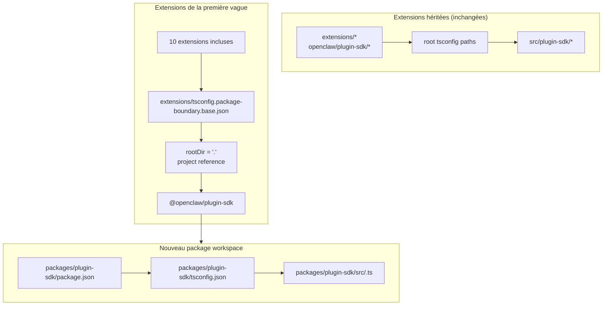

# refactorisation : faire progressivement de plugin-sdk un véritable package workspace

## Vue d’ensemble

Ce plan introduit un véritable package workspace pour le SDK plugin dans
`packages/plugin-sdk` et l’utilise pour faire adhérer une petite première vague d’extensions à
des limites de package appliquées par le compilateur. L’objectif est de faire en sorte que les imports
relatifs illégaux échouent avec le `tsc` normal pour un ensemble sélectionné d’extensions provider
intégrées, sans imposer une migration à l’échelle du dépôt ni créer une énorme surface de conflits de fusion.

Le mouvement incrémental clé consiste à exécuter deux modes en parallèle pendant un certain temps :

| Mode        | Forme d’import            | Qui l’utilise                         | Application                                  |
| ----------- | ------------------------- | ------------------------------------- | -------------------------------------------- |
| Mode hérité | `openclaw/plugin-sdk/*`   | toutes les extensions existantes non incluses | le comportement permissif actuel reste en place |
| Mode opt-in | `@openclaw/plugin-sdk/*`  | extensions de la première vague uniquement | `rootDir` local au package + références de projet |

## Cadre du problème

Le dépôt exporte actuellement une grande surface publique de SDK plugin, mais ce n’est pas un véritable
package workspace. À la place :

- le `tsconfig.json` racine mappe `openclaw/plugin-sdk/*` directement vers
  `src/plugin-sdk/*.ts`
- les extensions qui n’ont pas été incluses dans l’expérience précédente partagent encore ce
  comportement global d’alias de source
- l’ajout de `rootDir` ne fonctionne que lorsque les imports SDK autorisés cessent de se résoudre vers le code source brut du dépôt

Cela signifie que le dépôt peut décrire la politique de limite souhaitée, mais TypeScript
ne l’applique pas proprement pour la plupart des extensions.

Vous voulez un chemin incrémental qui :

- rende `plugin-sdk` réel
- fasse évoluer le SDK vers un package workspace nommé `@openclaw/plugin-sdk`
- ne modifie qu’environ 10 extensions dans la première PR
- laisse le reste de l’arborescence d’extensions sur l’ancien schéma jusqu’au nettoyage ultérieur
- évite le workflow `tsconfig.plugin-sdk.dts.json` + génération de déclarations en postinstall comme mécanisme principal du déploiement de la première vague

## Traçabilité des exigences

- R1. Créer un véritable package workspace pour le SDK sous `packages/`.
- R2. Nommer le nouveau package `@openclaw/plugin-sdk`.
- R3. Donner au nouveau package SDK son propre `package.json` et `tsconfig.json`.
- R4. Conserver le fonctionnement des imports hérités `openclaw/plugin-sdk/*` pour les extensions non incluses pendant la fenêtre de migration.
- R5. N’inclure qu’une petite première vague d’extensions dans la première PR.
- R6. Les extensions de la première vague doivent échouer de manière fermée pour les imports relatifs qui sortent de leur racine de package.
- R7. Les extensions de la première vague doivent consommer le SDK via une dépendance de package et une référence de projet TS, et non via les alias `paths` racine.
- R8. Le plan doit éviter une étape obligatoire de génération en postinstall à l’échelle du dépôt pour la correction dans l’éditeur.
- R9. Le déploiement de la première vague doit pouvoir être relu et fusionné sous la forme d’une PR de taille modérée, et non d’une refactorisation à l’échelle du dépôt de plus de 300 fichiers.

## Limites du périmètre

- Aucune migration complète de toutes les extensions intégrées dans la première PR.
- Aucune obligation de supprimer `src/plugin-sdk` dans la première PR.
- Aucune obligation de recâbler immédiatement tous les chemins de build ou de test racine pour utiliser le nouveau package.
- Aucune tentative d’imposer des erreurs de VS Code pour toutes les extensions non incluses.
- Aucun nettoyage lint large sur le reste de l’arborescence d’extensions.
- Aucune modification importante du comportement d’exécution au-delà de la résolution d’imports, de la propriété des packages,
  et de l’application des limites pour les extensions incluses.

## Contexte et recherche

### Code et modèles pertinents

- `pnpm-workspace.yaml` inclut déjà `packages/*` et `extensions/*`, donc un
  nouveau package workspace sous `packages/plugin-sdk` s’intègre dans la disposition
  existante du dépôt.
- Les packages workspace existants tels que `packages/memory-host-sdk/package.json`
  et `packages/plugin-package-contract/package.json` utilisent déjà des maps `exports` locales au package
  ancrées dans `src/*.ts`.
- Le `package.json` racine publie actuellement la surface SDK via `./plugin-sdk`
  et les exports `./plugin-sdk/*` adossés à `dist/plugin-sdk/*.js` et
  `dist/plugin-sdk/*.d.ts`.
- `src/plugin-sdk/entrypoints.ts` et `scripts/lib/plugin-sdk-entrypoints.json`
  jouent déjà le rôle d’inventaire canonique des points d’entrée pour la surface SDK.
- Le `tsconfig.json` racine mappe actuellement :
  - `openclaw/plugin-sdk` -> `src/plugin-sdk/index.ts`
  - `openclaw/plugin-sdk/*` -> `src/plugin-sdk/*.ts`
- L’expérience précédente sur les limites a montré que `rootDir` local au package fonctionne pour
  les imports relatifs illégaux seulement après que les imports SDK autorisés cessent de se résoudre vers du code source brut situé hors du package d’extension.

### Ensemble d’extensions de la première vague

Ce plan suppose que la première vague est l’ensemble centré sur les providers qui est le moins susceptible
de faire remonter des cas limites complexes liés au runtime des canaux :

- `extensions/anthropic`
- `extensions/exa`
- `extensions/firecrawl`
- `extensions/groq`
- `extensions/mistral`
- `extensions/openai`
- `extensions/perplexity`
- `extensions/tavily`
- `extensions/together`
- `extensions/xai`

### Inventaire de la surface SDK de la première vague

Les extensions de la première vague importent actuellement un sous-ensemble gérable de sous-chemins SDK.
Le package initial `@openclaw/plugin-sdk` ne doit couvrir que ceux-ci :

- `agent-runtime`
- `cli-runtime`
- `config-runtime`
- `core`
- `image-generation`
- `media-runtime`
- `media-understanding`
- `plugin-entry`
- `plugin-runtime`
- `provider-auth`
- `provider-auth-api-key`
- `provider-auth-login`
- `provider-auth-runtime`
- `provider-catalog-shared`
- `provider-entry`
- `provider-http`
- `provider-model-shared`
- `provider-onboard`
- `provider-stream-family`
- `provider-stream-shared`
- `provider-tools`
- `provider-usage`
- `provider-web-fetch`
- `provider-web-search`
- `realtime-transcription`
- `realtime-voice`
- `runtime-env`
- `secret-input`
- `security-runtime`
- `speech`
- `testing`

### Enseignements institutionnels

- Aucune entrée pertinente dans `docs/solutions/` n’était présente dans cette copie de travail.

### Références externes

- Aucune recherche externe n’était nécessaire pour ce plan. Le dépôt contient déjà les
  modèles pertinents de package workspace et d’export SDK.

## Décisions techniques clés

- Introduire `@openclaw/plugin-sdk` comme nouveau package workspace tout en conservant la
  surface racine héritée `openclaw/plugin-sdk/*` pendant la migration.
  Justification : cela permet à un ensemble d’extensions de la première vague de passer à une vraie
  résolution par package sans forcer chaque extension et chaque chemin de build racine à changer
  d’un seul coup.

- Utiliser une configuration de base de limite opt-in dédiée, telle que
  `extensions/tsconfig.package-boundary.base.json`, au lieu de remplacer la
  base d’extension existante pour tout le monde.
  Justification : le dépôt doit prendre en charge simultanément les modes d’extension hérités et opt-in pendant la migration.

- Utiliser des références de projet TS depuis les extensions de la première vague vers
  `packages/plugin-sdk/tsconfig.json` et définir
  `disableSourceOfProjectReferenceRedirect` pour le mode de limite opt-in.
  Justification : cela donne à `tsc` un vrai graphe de packages tout en décourageant le repli de l’éditeur et
  du compilateur vers la traversée du code source brut.

- Conserver `@openclaw/plugin-sdk` privé dans la première vague.
  Justification : l’objectif immédiat est l’application interne des limites et la sécurité de migration,
  pas la publication d’un second contrat SDK externe avant que la surface soit stable.

- Déplacer uniquement les sous-chemins SDK de la première vague dans la première tranche d’implémentation, et
  conserver des ponts de compatibilité pour le reste.
  Justification : déplacer physiquement les 315 fichiers `src/plugin-sdk/*.ts` en une seule PR est
  précisément la surface de conflits de fusion que ce plan cherche à éviter.

- Ne pas s’appuyer sur `scripts/postinstall-bundled-plugins.mjs` pour construire les
  déclarations SDK de la première vague.
  Justification : les flux de build/référence explicites sont plus simples à raisonner et rendent le comportement du dépôt plus prévisible.

## Questions ouvertes

### Résolues pendant la planification

- Quelles extensions doivent faire partie de la première vague ?
  Utiliser les 10 extensions provider/recherche web listées ci-dessus, car elles sont plus
  structurellement isolées que les packages de canaux plus lourds.

- La première PR doit-elle remplacer l’intégralité de l’arborescence d’extensions ?
  Non. La première PR doit prendre en charge deux modes en parallèle et n’inclure
  que la première vague.

- La première vague doit-elle exiger un build de déclarations en postinstall ?
  Non. Le graphe package/référence doit être explicite, et la CI doit exécuter
  intentionnellement la vérification de types locale au package concerné.

### Reportées à l’implémentation

- Déterminer si le package de la première vague peut pointer directement vers les `src/*.ts`
  locaux au package via les seules références de projet, ou si une petite étape d’émission de déclarations est
  tout de même requise pour le package `@openclaw/plugin-sdk`.
  Il s’agit d’une question de validation du graphe TS relevant de l’implémentation.

- Déterminer si le package racine `openclaw` doit proxifier immédiatement les sous-chemins SDK de la première vague vers les sorties de `packages/plugin-sdk`, ou continuer à utiliser des shims de compatibilité générés sous `src/plugin-sdk`.
  Il s’agit d’un détail de compatibilité et de forme du build qui dépend du chemin minimal
  d’implémentation permettant de garder la CI au vert.

## Conception technique de haut niveau

> Ceci illustre l’approche visée et constitue une orientation pour la revue, et non une spécification d’implémentation. L’agent chargé de l’implémentation doit le traiter comme du contexte, et non comme du code à reproduire.

## Unités d’implémentation

- [ ] **Unité 1 : introduire le véritable package workspace `@openclaw/plugin-sdk`**

**Objectif :** créer un véritable package workspace pour le SDK, capable de posséder la
surface des sous-chemins de la première vague sans imposer une migration à l’échelle du dépôt.

**Exigences :** R1, R2, R3, R8, R9

**Dépendances :** Aucune

**Fichiers :**

- Créer : `packages/plugin-sdk/package.json`
- Créer : `packages/plugin-sdk/tsconfig.json`
- Créer : `packages/plugin-sdk/src/index.ts`
- Créer : `packages/plugin-sdk/src/*.ts` pour les sous-chemins SDK de la première vague
- Modifier : `pnpm-workspace.yaml` uniquement si des ajustements de glob de package sont nécessaires
- Modifier : `package.json`
- Modifier : `src/plugin-sdk/entrypoints.ts`
- Modifier : `scripts/lib/plugin-sdk-entrypoints.json`
- Tester : `src/plugins/contracts/plugin-sdk-workspace-package.contract.test.ts`

**Approche :**

- Ajouter un nouveau package workspace nommé `@openclaw/plugin-sdk`.
- Commencer uniquement avec les sous-chemins SDK de la première vague, pas avec l’arborescence complète de 315 fichiers.
- Si le déplacement direct d’un point d’entrée de la première vague crée une diff trop importante, la
  première PR pourra introduire ce sous-chemin dans `packages/plugin-sdk/src` sous la forme d’un mince wrapper de package d’abord, puis basculer la source de vérité vers le package dans une PR de suivi pour ce groupe de sous-chemins.
- Réutiliser le mécanisme existant d’inventaire des points d’entrée afin que la surface du package de la première vague soit déclarée dans un emplacement canonique unique.
- Maintenir les exports du package racine pour les utilisateurs hérités pendant que le package
  workspace devient le nouveau contrat opt-in.

**Modèles à suivre :**

- `packages/memory-host-sdk/package.json`
- `packages/plugin-package-contract/package.json`
- `src/plugin-sdk/entrypoints.ts`

**Scénarios de test :**

- Cas nominal : le package workspace exporte chaque sous-chemin de la première vague listé dans
  le plan et aucun export requis de la première vague ne manque.
- Cas limite : les métadonnées d’export du package restent stables lorsque la liste des entrées de la première vague
  est régénérée ou comparée à l’inventaire canonique.
- Intégration : les exports SDK hérités du package racine restent présents après l’introduction
  du nouveau package workspace.

**Vérification :**

- Le dépôt contient un package workspace `@openclaw/plugin-sdk` valide avec une
  map d’exports stable pour la première vague et sans régression des exports hérités dans le `package.json`
  racine.

- [ ] **Unité 2 : ajouter un mode de limite TS opt-in pour les extensions appliquées par package**

**Objectif :** définir le mode de configuration TS que les extensions incluses utiliseront,
tout en laissant inchangé le comportement TS existant des extensions pour tous les autres.

**Exigences :** R4, R6, R7, R8, R9

**Dépendances :** Unité 1

**Fichiers :**

- Créer : `extensions/tsconfig.package-boundary.base.json`
- Créer : `tsconfig.boundary-optin.json`
- Modifier : `extensions/xai/tsconfig.json`
- Modifier : `extensions/openai/tsconfig.json`
- Modifier : `extensions/anthropic/tsconfig.json`
- Modifier : `extensions/mistral/tsconfig.json`
- Modifier : `extensions/groq/tsconfig.json`
- Modifier : `extensions/together/tsconfig.json`
- Modifier : `extensions/perplexity/tsconfig.json`
- Modifier : `extensions/tavily/tsconfig.json`
- Modifier : `extensions/exa/tsconfig.json`
- Modifier : `extensions/firecrawl/tsconfig.json`
- Tester : `src/plugins/contracts/extension-package-project-boundaries.test.ts`
- Tester : `test/extension-package-tsc-boundary.test.ts`

**Approche :**

- Laisser `extensions/tsconfig.base.json` en place pour les extensions héritées.
- Ajouter une nouvelle configuration de base opt-in qui :
  - définit `rootDir: "."`
  - référence `packages/plugin-sdk`
  - active `composite`
  - désactive la redirection de source des références de projet si nécessaire
- Ajouter une configuration de solution dédiée pour le graphe de vérification de types de la première vague au lieu
  de remodeler le projet TS racine du dépôt dans la même PR.

**Note d’exécution :** commencer par une vérification de types canari locale au package qui échoue pour une extension
incluse, avant d’appliquer le modèle aux 10.

**Modèles à suivre :**

- Le modèle `tsconfig.json` local au package d’extension existant issu des travaux précédents sur les limites
- Le modèle de package workspace de `packages/memory-host-sdk`

**Scénarios de test :**

- Cas nominal : chaque extension incluse passe la vérification de types avec la
  configuration TS à limites de package.
- Chemin d’erreur : un import relatif canari depuis `../../src/cli/acp-cli.ts` échoue
  avec `TS6059` pour une extension incluse.
- Intégration : les extensions non incluses restent intactes et n’ont pas besoin de
  participer à la nouvelle configuration de solution.

**Vérification :**

- Il existe un graphe dédié de vérification de types pour les 10 extensions incluses, et les mauvais
  imports relatifs depuis l’une d’elles échouent via le `tsc` normal.

- [ ] **Unité 3 : migrer les extensions de la première vague vers `@openclaw/plugin-sdk`**

**Objectif :** faire en sorte que les extensions de la première vague consomment le véritable package SDK
au moyen des métadonnées de dépendance, des références de projet et d’imports par nom de package.

**Exigences :** R5, R6, R7, R9

**Dépendances :** Unité 2

**Fichiers :**

- Modifier : `extensions/anthropic/package.json`
- Modifier : `extensions/exa/package.json`
- Modifier : `extensions/firecrawl/package.json`
- Modifier : `extensions/groq/package.json`
- Modifier : `extensions/mistral/package.json`
- Modifier : `extensions/openai/package.json`
- Modifier : `extensions/perplexity/package.json`
- Modifier : `extensions/tavily/package.json`
- Modifier : `extensions/together/package.json`
- Modifier : `extensions/xai/package.json`
- Modifier : les imports de production et de test sous chacune des 10 racines d’extension qui
  référencent actuellement `openclaw/plugin-sdk/*`

**Approche :**

- Ajouter `@openclaw/plugin-sdk: workspace:*` aux
  `devDependencies` des extensions de la première vague.
- Remplacer les imports `openclaw/plugin-sdk/*` dans ces packages par
  `@openclaw/plugin-sdk/*`.
- Conserver les imports internes aux extensions sur des barils locaux tels que `./api.ts` et
  `./runtime-api.ts`.
- Ne pas modifier les extensions non incluses dans cette PR.

**Modèles à suivre :**

- Les barils d’import locaux aux extensions existants (`api.ts`, `runtime-api.ts`)
- La forme de dépendance de package utilisée par les autres packages workspace `@openclaw/*`

**Scénarios de test :**

- Cas nominal : chaque extension migrée continue à s’enregistrer/à se charger via ses tests de
  plugin existants après la réécriture des imports.
- Cas limite : les imports SDK réservés aux tests dans l’ensemble d’extensions incluses continuent à se résoudre
  correctement via le nouveau package.
- Intégration : les extensions migrées n’ont pas besoin des alias SDK racine `openclaw/plugin-sdk/*`
  pour la vérification de types.

**Vérification :**

- Les extensions de la première vague se construisent et se testent avec `@openclaw/plugin-sdk`
  sans avoir besoin du chemin d’alias SDK racine hérité.

- [ ] **Unité 4 : préserver la compatibilité héritée tant que la migration est partielle**

**Objectif :** maintenir le fonctionnement du reste du dépôt pendant que le SDK existe à la fois sous forme héritée
et sous forme de nouveau package pendant la migration.

**Exigences :** R4, R8, R9

**Dépendances :** Unités 1-3

**Fichiers :**

- Modifier : `src/plugin-sdk/*.ts` pour les shims de compatibilité de la première vague si nécessaire
- Modifier : `package.json`
- Modifier : le plumbing de build ou d’export qui assemble les artéfacts SDK
- Tester : `src/plugins/contracts/plugin-sdk-runtime-api-guardrails.test.ts`
- Tester : `src/plugins/contracts/plugin-sdk-index.bundle.test.ts`

**Approche :**

- Conserver `openclaw/plugin-sdk/*` racine comme surface de compatibilité pour les extensions
  héritées et pour les consommateurs externes qui ne migrent pas encore.
- Utiliser soit des shims générés soit un câblage proxy d’export racine pour les sous-chemins
  de la première vague qui ont été déplacés dans `packages/plugin-sdk`.
- Ne pas tenter de retirer la surface SDK racine à cette étape.

**Modèles à suivre :**

- La génération existante des exports SDK racine via `src/plugin-sdk/entrypoints.ts`
- La compatibilité existante des exports de package dans le `package.json` racine

**Scénarios de test :**

- Cas nominal : un import SDK racine hérité continue à se résoudre pour une extension non incluse
  après l’existence du nouveau package.
- Cas limite : un sous-chemin de la première vague fonctionne à la fois via la surface racine héritée et
  via la surface du nouveau package pendant la fenêtre de migration.
- Intégration : les tests de contrat d’index/bundle de plugin-sdk continuent à voir une
  surface publique cohérente.

**Vérification :**

- Le dépôt prend en charge à la fois les modes de consommation SDK hérités et opt-in sans
  casser les extensions inchangées.

- [ ] **Unité 5 : ajouter une application ciblée et documenter le contrat de migration**

**Objectif :** intégrer dans la CI et dans les consignes aux contributeurs le nouveau comportement pour la
première vague, sans prétendre que toute l’arborescence d’extensions est migrée.

**Exigences :** R5, R6, R8, R9

**Dépendances :** Unités 1-4

**Fichiers :**

- Modifier : `package.json`
- Modifier : les fichiers de workflow CI qui doivent exécuter la vérification de types de limite opt-in
- Modifier : `AGENTS.md`
- Modifier : `docs/plugins/sdk-overview.md`
- Modifier : `docs/plugins/sdk-entrypoints.md`
- Modifier : `docs/plans/2026-04-05-001-refactor-extension-package-resolution-boundary-plan.md`

**Approche :**

- Ajouter une gate explicite pour la première vague, par exemple une exécution dédiée de `tsc -b` de solution pour
  `packages/plugin-sdk` plus les 10 extensions incluses.
- Documenter que le dépôt prend désormais en charge à la fois les modes d’extension hérités et opt-in,
  et que les nouveaux travaux sur les limites d’extension doivent privilégier le chemin du nouveau package.
- Enregistrer la règle de migration de la vague suivante afin que les PR ultérieures puissent ajouter plus d’extensions
  sans redébattre de l’architecture.

**Modèles à suivre :**

- Les tests de contrat existants sous `src/plugins/contracts/`
- Les mises à jour de documentation existantes qui expliquent les migrations par étapes

**Scénarios de test :**

- Cas nominal : la nouvelle gate de vérification de types de la première vague passe pour le package workspace
  et les extensions incluses.
- Chemin d’erreur : l’introduction d’un nouvel import relatif illégal dans une extension incluse
  fait échouer la gate ciblée de vérification de types.
- Intégration : la CI n’exige pas encore des extensions non incluses qu’elles satisfassent au nouveau
  mode à limites de package.

**Vérification :**

- Le chemin d’application de la première vague est documenté, testé et exécutable sans
  forcer toute l’arborescence d’extensions à migrer.

## Impact à l’échelle du système

- **Graphe d’interaction :** ce travail touche la source de vérité du SDK, les exports du package racine,
  les métadonnées des packages d’extension, la disposition du graphe TS et la vérification CI.
- **Propagation des erreurs :** le principal mode d’échec visé devient des erreurs TS à la compilation
  (`TS6059`) dans les extensions incluses au lieu d’échecs dépendant uniquement de scripts personnalisés.
- **Risques sur le cycle de vie de l’état :** la migration à double surface introduit un risque de dérive entre
  les exports de compatibilité racine et le nouveau package workspace.
- **Parité de surface d’API :** les sous-chemins de la première vague doivent rester sémantiquement identiques
  via `openclaw/plugin-sdk/*` et `@openclaw/plugin-sdk/*` pendant la transition.
- **Couverture d’intégration :** les tests unitaires ne suffisent pas ; des vérifications de types ciblées du
  graphe de packages sont nécessaires pour prouver la limite.
- **Invariants inchangés :** les extensions non incluses conservent leur comportement actuel dans la PR 1. Ce plan ne prétend pas appliquer les limites d’import à l’échelle de tout le dépôt.

## Risques et dépendances

| Risque                                                                                                   | Atténuation                                                                                                              |
| -------------------------------------------------------------------------------------------------------- | ------------------------------------------------------------------------------------------------------------------------ |
| Le package de la première vague continue à se résoudre vers le code source brut et `rootDir` n’échoue pas réellement de manière fermée | Faire de la première étape d’implémentation un canari de référence de package sur une extension incluse avant d’élargir à l’ensemble complet |
| Déplacer trop de code source SDK d’un coup recrée le problème initial de conflits de fusion             | Déplacer uniquement les sous-chemins de la première vague dans la première PR et conserver des ponts de compatibilité racine |
| Les surfaces SDK héritée et nouvelle dérivent sémantiquement                                             | Conserver un inventaire de points d’entrée unique, ajouter des tests de contrat de compatibilité et expliciter la parité des deux surfaces |
| Les chemins de build/test du dépôt racine commencent accidentellement à dépendre du nouveau package de manière non contrôlée | Utiliser une configuration de solution opt-in dédiée et éviter les changements de topologie TS à l’échelle de la racine dans la première PR |

## Livraison par phases

### Phase 1

- Introduire `@openclaw/plugin-sdk`
- Définir la surface des sous-chemins de la première vague
- Prouver qu’une extension incluse peut échouer de manière fermée via `rootDir`

### Phase 2

- Inclure les 10 extensions de la première vague
- Conserver la compatibilité racine pour tous les autres

### Phase 3

- Ajouter plus d’extensions dans des PR ultérieures
- Déplacer davantage de sous-chemins SDK dans le package workspace
- Retirer la compatibilité racine seulement après disparition de l’ensemble d’extensions héritées

## Notes de documentation / d’exploitation

- La première PR doit se décrire explicitement comme une migration à double mode, et non comme une
  mise en application achevée à l’échelle du dépôt.
- Le guide de migration doit permettre facilement aux PR ultérieures d’ajouter plus d’extensions
  en suivant le même modèle package/dépendance/référence.

## Sources et références

- Plan précédent : `docs/plans/2026-04-05-001-refactor-extension-package-resolution-boundary-plan.md`
- Configuration workspace : `pnpm-workspace.yaml`
- Inventaire existant des points d’entrée SDK : `src/plugin-sdk/entrypoints.ts`
- Exports SDK racine existants : `package.json`
- Modèles existants de package workspace :
  - `packages/memory-host-sdk/package.json`
  - `packages/plugin-package-contract/package.json`
