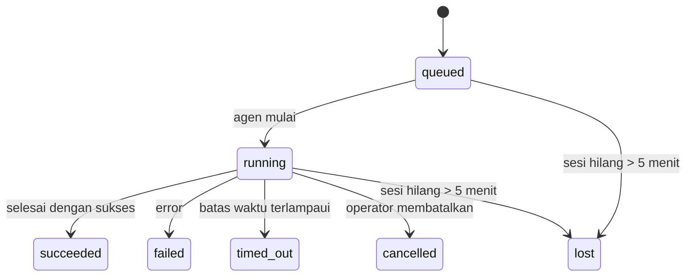

---
read_when:
    - Memeriksa pekerjaan latar belakang yang sedang berlangsung atau baru saja selesai
    - Men-debug kegagalan pengiriman untuk eksekusi agen yang dilepas
    - Memahami bagaimana eksekusi latar belakang terkait dengan sesi, cron, dan heartbeat
summary: Pelacakan tugas latar belakang untuk eksekusi ACP, subagen, pekerjaan cron terisolasi, dan operasi CLI
title: Tugas Latar Belakang
x-i18n:
    generated_at: "2026-04-06T03:06:42Z"
    model: gpt-5.4
    provider: openai
    source_hash: 2f56c1ac23237907a090c69c920c09578a2f56f5d8bf750c7f2136c603c8a8ff
    source_path: automation/tasks.md
    workflow: 15
---

# Tugas Latar Belakang

> **Mencari penjadwalan?** Lihat [Automation & Tasks](/id/automation) untuk memilih mekanisme yang tepat. Halaman ini membahas **pelacakan** pekerjaan latar belakang, bukan penjadwalannya.

Tugas latar belakang melacak pekerjaan yang berjalan **di luar sesi percakapan utama Anda**:
eksekusi ACP, pemunculan subagen, eksekusi pekerjaan cron terisolasi, dan operasi yang dimulai dari CLI.

Tugas **tidak** menggantikan sesi, pekerjaan cron, atau heartbeat — tugas adalah **buku catatan aktivitas** yang merekam pekerjaan terlepas apa yang terjadi, kapan terjadinya, dan apakah berhasil.

<Note>
Tidak setiap eksekusi agen membuat tugas. Giliran heartbeat dan chat interaktif normal tidak membuatnya. Semua eksekusi cron, pemunculan ACP, pemunculan subagen, dan perintah agen CLI membuat tugas.
</Note>

## Ringkasan singkat

- Tugas adalah **catatan**, bukan penjadwal — cron dan heartbeat menentukan _kapan_ pekerjaan berjalan, tugas melacak _apa yang terjadi_.
- ACP, subagen, semua pekerjaan cron, dan operasi CLI membuat tugas. Giliran heartbeat tidak.
- Setiap tugas bergerak melalui `queued → running → terminal` (succeeded, failed, timed_out, cancelled, atau lost).
- Tugas cron tetap aktif selama runtime cron masih memiliki pekerjaan tersebut; tugas CLI berbasis chat tetap aktif hanya selama konteks eksekusi pemiliknya masih aktif.
- Penyelesaian didorong oleh push: pekerjaan terlepas dapat memberi tahu secara langsung atau membangunkan
  sesi/heartbeat peminta saat selesai, jadi loop polling status
  biasanya bukan pola yang tepat.
- Eksekusi cron terisolasi dan penyelesaian subagen melakukan pembersihan best-effort atas tab/proses browser yang dilacak untuk sesi turunannya sebelum pencatatan pembersihan akhir.
- Pengiriman cron terisolasi menekan balasan induk sementara yang sudah usang saat
  pekerjaan subagen turunan masih dikuras, dan lebih memilih keluaran turunan final
  jika keluaran itu tiba sebelum pengiriman.
- Notifikasi penyelesaian dikirim langsung ke channel atau diantrikan untuk heartbeat berikutnya.
- `openclaw tasks list` menampilkan semua tugas; `openclaw tasks audit` menampilkan masalah.
- Catatan terminal disimpan selama 7 hari, lalu dipangkas secara otomatis.

## Mulai cepat

```bash
# Daftar semua tugas (terbaru lebih dulu)
openclaw tasks list

# Filter berdasarkan runtime atau status
openclaw tasks list --runtime acp
openclaw tasks list --status running

# Tampilkan detail untuk tugas tertentu (berdasarkan ID, ID eksekusi, atau kunci sesi)
openclaw tasks show <lookup>

# Batalkan tugas yang sedang berjalan (menghentikan sesi anak)
openclaw tasks cancel <lookup>

# Ubah kebijakan notifikasi untuk sebuah tugas
openclaw tasks notify <lookup> state_changes

# Jalankan audit kesehatan
openclaw tasks audit

# Pratinjau atau terapkan pemeliharaan
openclaw tasks maintenance
openclaw tasks maintenance --apply

# Periksa status TaskFlow
openclaw tasks flow list
openclaw tasks flow show <lookup>
openclaw tasks flow cancel <lookup>
```

## Apa yang membuat tugas

| Sumber                 | Jenis runtime | Kapan catatan tugas dibuat                           | Kebijakan notifikasi default |
| ---------------------- | ------------- | ---------------------------------------------------- | ---------------------------- |
| Eksekusi latar belakang ACP    | `acp`        | Memunculkan sesi ACP anak                            | `done_only`                  |
| Orkestrasi subagen | `subagent`   | Memunculkan subagen melalui `sessions_spawn`               | `done_only`                  |
| Pekerjaan cron (semua jenis)  | `cron`       | Setiap eksekusi cron (sesi utama dan terisolasi)       | `silent`                     |
| Operasi CLI         | `cli`        | Perintah `openclaw agent` yang berjalan melalui gateway | `silent`                     |
| Pekerjaan media agen       | `cli`        | Eksekusi `video_generate` berbasis sesi                   | `silent`                     |

Tugas cron sesi utama menggunakan kebijakan notifikasi `silent` secara default — mereka membuat catatan untuk pelacakan tetapi tidak menghasilkan notifikasi. Tugas cron terisolasi juga default ke `silent` tetapi lebih terlihat karena berjalan di sesi mereka sendiri.

Eksekusi `video_generate` berbasis sesi juga menggunakan kebijakan notifikasi `silent`. Eksekusi ini tetap membuat catatan tugas, tetapi penyelesaian dikembalikan ke sesi agen asal sebagai wake internal agar agen dapat menulis pesan lanjutan dan melampirkan video yang sudah selesai sendiri. Jika Anda memilih `tools.media.asyncCompletion.directSend`, penyelesaian asinkron `music_generate` dan `video_generate` akan mencoba pengiriman channel langsung terlebih dahulu sebelum kembali ke jalur wake sesi peminta.

Selama tugas `video_generate` berbasis sesi masih aktif, tool juga bertindak sebagai guardrail: pemanggilan `video_generate` berulang di sesi yang sama akan mengembalikan status tugas aktif alih-alih memulai generasi serentak kedua. Gunakan `action: "status"` saat Anda menginginkan pencarian kemajuan/status yang eksplisit dari sisi agen.

**Yang tidak membuat tugas:**

- Giliran heartbeat — sesi utama; lihat [Heartbeat](/id/gateway/heartbeat)
- Giliran chat interaktif normal
- Respons `/command` langsung

## Siklus hidup tugas



| Status      | Artinya                                                                  |
| ----------- | ------------------------------------------------------------------------ |
| `queued`    | Dibuat, menunggu agen mulai                                              |
| `running`   | Giliran agen sedang dieksekusi secara aktif                              |
| `succeeded` | Berhasil diselesaikan                                                    |
| `failed`    | Selesai dengan error                                                     |
| `timed_out` | Melebihi batas waktu yang dikonfigurasi                                  |
| `cancelled` | Dihentikan oleh operator melalui `openclaw tasks cancel`                 |
| `lost`      | Runtime kehilangan status dukungan otoritatif setelah masa tenggang 5 menit |

Transisi terjadi secara otomatis — saat eksekusi agen terkait berakhir, status tugas diperbarui agar sesuai.

`lost` sadar runtime:

- Tugas ACP: metadata sesi anak ACP pendukung menghilang.
- Tugas subagen: sesi anak pendukung menghilang dari penyimpanan agen target.
- Tugas cron: runtime cron tidak lagi melacak pekerjaan sebagai aktif.
- Tugas CLI: tugas sesi anak terisolasi menggunakan sesi anak; tugas CLI berbasis chat menggunakan konteks eksekusi aktif sebagai gantinya, sehingga baris sesi channel/grup/langsung yang tertinggal tidak membuatnya tetap aktif.

## Pengiriman dan notifikasi

Saat sebuah tugas mencapai status terminal, OpenClaw memberi tahu Anda. Ada dua jalur pengiriman:

**Pengiriman langsung** — jika tugas memiliki target channel (`requesterOrigin`), pesan penyelesaian langsung dikirim ke channel tersebut (Telegram, Discord, Slack, dll.). Untuk penyelesaian subagen, OpenClaw juga mempertahankan perutean thread/topik yang terikat bila tersedia dan dapat mengisi `to` / akun yang hilang dari rute tersimpan sesi peminta (`lastChannel` / `lastTo` / `lastAccountId`) sebelum menyerah pada pengiriman langsung.

**Pengiriman antrean sesi** — jika pengiriman langsung gagal atau tidak ada origin yang ditetapkan, pembaruan diantrikan sebagai peristiwa sistem di sesi peminta dan akan muncul pada heartbeat berikutnya.

<Tip>
Penyelesaian tugas memicu wake heartbeat segera agar Anda melihat hasilnya dengan cepat — Anda tidak perlu menunggu tick heartbeat terjadwal berikutnya.
</Tip>

Itu berarti alur kerja yang umum bersifat berbasis push: mulai pekerjaan terlepas sekali,
lalu biarkan runtime membangunkan atau memberi tahu Anda saat selesai. Poll status tugas hanya saat Anda
memerlukan debugging, intervensi, atau audit yang eksplisit.

### Kebijakan notifikasi

Kontrol seberapa banyak yang Anda dengar tentang setiap tugas:

| Kebijakan                | Yang dikirim                                                           |
| ------------------------ | ---------------------------------------------------------------------- |
| `done_only` (default)    | Hanya status terminal (succeeded, failed, dll.) — **ini adalah default** |
| `state_changes`          | Setiap transisi status dan pembaruan kemajuan                          |
| `silent`                 | Tidak ada sama sekali                                                  |

Ubah kebijakan saat sebuah tugas sedang berjalan:

```bash
openclaw tasks notify <lookup> state_changes
```

## Referensi CLI

### `tasks list`

```bash
openclaw tasks list [--runtime <acp|subagent|cron|cli>] [--status <status>] [--json]
```

Kolom keluaran: ID Tugas, Jenis, Status, Pengiriman, ID Eksekusi, Sesi Anak, Ringkasan.

### `tasks show`

```bash
openclaw tasks show <lookup>
```

Token lookup menerima ID tugas, ID eksekusi, atau kunci sesi. Menampilkan catatan lengkap termasuk waktu, status pengiriman, error, dan ringkasan terminal.

### `tasks cancel`

```bash
openclaw tasks cancel <lookup>
```

Untuk tugas ACP dan subagen, ini menghentikan sesi anak. Status bertransisi ke `cancelled` dan notifikasi pengiriman dikirim.

### `tasks notify`

```bash
openclaw tasks notify <lookup> <done_only|state_changes|silent>
```

### `tasks audit`

```bash
openclaw tasks audit [--json]
```

Menampilkan masalah operasional. Temuan juga muncul di `openclaw status` saat masalah terdeteksi.

| Temuan                    | Keparahan | Pemicu                                                |
| ------------------------- | --------- | ----------------------------------------------------- |
| `stale_queued`            | warn      | Berada di antrean selama lebih dari 10 menit          |
| `stale_running`           | error     | Berjalan selama lebih dari 30 menit                   |
| `lost`                    | error     | Kepemilikan tugas berbasis runtime menghilang         |
| `delivery_failed`         | warn      | Pengiriman gagal dan kebijakan notifikasi bukan `silent` |
| `missing_cleanup`         | warn      | Tugas terminal tanpa cap waktu pembersihan            |
| `inconsistent_timestamps` | warn      | Pelanggaran linimasa (misalnya selesai sebelum mulai) |

### `tasks maintenance`

```bash
openclaw tasks maintenance [--json]
openclaw tasks maintenance --apply [--json]
```

Gunakan ini untuk mempratinjau atau menerapkan rekonsiliasi, pemberian cap pembersihan, dan pemangkasan untuk
tugas dan status Task Flow.

Rekonsiliasi sadar runtime:

- Tugas ACP/subagen memeriksa sesi anak pendukungnya.
- Tugas cron memeriksa apakah runtime cron masih memiliki pekerjaan tersebut.
- Tugas CLI berbasis chat memeriksa konteks eksekusi aktif milik pemilik, bukan hanya baris sesi chat.

Pembersihan penyelesaian juga sadar runtime:

- Penyelesaian subagen melakukan penutupan best-effort tab/proses browser yang dilacak untuk sesi anak sebelum pembersihan pengumuman dilanjutkan.
- Penyelesaian cron terisolasi melakukan penutupan best-effort tab/proses browser yang dilacak untuk sesi cron sebelum eksekusi sepenuhnya dibongkar.
- Pengiriman cron terisolasi menunggu tindak lanjut subagen turunan bila diperlukan dan
  menekan teks pengakuan induk yang sudah usang alih-alih mengumumkannya.
- Pengiriman penyelesaian subagen lebih memilih teks asisten terlihat terbaru; jika kosong, akan kembali ke teks tool/toolResult terbaru yang sudah disanitasi, dan eksekusi panggilan tool yang hanya timeout dapat diringkas menjadi ringkasan kemajuan parsial singkat.
- Kegagalan pembersihan tidak menyamarkan hasil tugas yang sebenarnya.

### `tasks flow list|show|cancel`

```bash
openclaw tasks flow list [--status <status>] [--json]
openclaw tasks flow show <lookup> [--json]
openclaw tasks flow cancel <lookup>
```

Gunakan ini ketika Task Flow pengorkestrasi adalah hal yang Anda pedulikan
alih-alih satu catatan tugas latar belakang individual.

## Papan tugas chat (`/tasks`)

Gunakan `/tasks` di sesi chat mana pun untuk melihat tugas latar belakang yang tertaut ke sesi tersebut. Papan menampilkan
tugas aktif dan yang baru selesai beserta runtime, status, waktu, serta detail kemajuan atau error.

Saat sesi saat ini tidak memiliki tugas tertaut yang terlihat, `/tasks` akan kembali ke jumlah tugas lokal agen
agar Anda tetap mendapatkan ringkasan tanpa membocorkan detail sesi lain.

Untuk buku catatan operator lengkap, gunakan CLI: `openclaw tasks list`.

## Integrasi status (tekanan tugas)

`openclaw status` menyertakan ringkasan tugas sekilas:

```
Tasks: 3 queued · 2 running · 1 issues
```

Ringkasan melaporkan:

- **active** — jumlah `queued` + `running`
- **failures** — jumlah `failed` + `timed_out` + `lost`
- **byRuntime** — perincian berdasarkan `acp`, `subagent`, `cron`, `cli`

Baik `/status` maupun tool `session_status` menggunakan snapshot tugas yang sadar pembersihan: tugas aktif lebih
diprioritaskan, baris selesai yang sudah usang disembunyikan, dan kegagalan terbaru hanya ditampilkan saat tidak ada pekerjaan aktif
yang tersisa. Ini menjaga kartu status tetap berfokus pada hal yang penting saat ini.

## Penyimpanan dan pemeliharaan

### Tempat tugas disimpan

Catatan tugas disimpan di SQLite pada:

```
$OPENCLAW_STATE_DIR/tasks/runs.sqlite
```

Registry dimuat ke memori saat gateway dimulai dan menyinkronkan penulisan ke SQLite untuk ketahanan lintas restart.

### Pemeliharaan otomatis

Sebuah sweeper berjalan setiap **60 detik** dan menangani tiga hal:

1. **Rekonsiliasi** — memeriksa apakah tugas aktif masih memiliki dukungan runtime otoritatif. Tugas ACP/subagen menggunakan status sesi anak, tugas cron menggunakan kepemilikan pekerjaan aktif, dan tugas CLI berbasis chat menggunakan konteks eksekusi aktif milik pemilik. Jika status dukungan itu hilang selama lebih dari 5 menit, tugas ditandai sebagai `lost`.
2. **Pemberian cap pembersihan** — menetapkan cap waktu `cleanupAfter` pada tugas terminal (`endedAt + 7 days`).
3. **Pemangkasan** — menghapus catatan yang melewati tanggal `cleanupAfter`.

**Retensi**: catatan tugas terminal disimpan selama **7 hari**, lalu dipangkas secara otomatis. Tidak perlu konfigurasi.

## Bagaimana tugas terkait dengan sistem lain

### Tugas dan Task Flow

[Task Flow](/id/automation/taskflow) adalah lapisan orkestrasi alur di atas tugas latar belakang. Satu flow dapat mengoordinasikan beberapa tugas selama masa hidupnya menggunakan mode sinkronisasi terkelola atau tercermin. Gunakan `openclaw tasks` untuk memeriksa catatan tugas individual dan `openclaw tasks flow` untuk memeriksa flow pengorkestrasi.

Lihat [Task Flow](/id/automation/taskflow) untuk detailnya.

### Tugas dan cron

**Definisi** pekerjaan cron berada di `~/.openclaw/cron/jobs.json`. **Setiap** eksekusi cron membuat catatan tugas — baik sesi utama maupun terisolasi. Tugas cron sesi utama default ke kebijakan notifikasi `silent` sehingga melacak tanpa menghasilkan notifikasi.

Lihat [Cron Jobs](/id/automation/cron-jobs).

### Tugas dan heartbeat

Eksekusi heartbeat adalah giliran sesi utama — mereka tidak membuat catatan tugas. Saat sebuah tugas selesai, tugas itu dapat memicu wake heartbeat agar Anda melihat hasilnya dengan cepat.

Lihat [Heartbeat](/id/gateway/heartbeat).

### Tugas dan sesi

Sebuah tugas dapat mereferensikan `childSessionKey` (tempat pekerjaan berjalan) dan `requesterSessionKey` (siapa yang memulainya). Sesi adalah konteks percakapan; tugas adalah pelacakan aktivitas di atasnya.

### Tugas dan eksekusi agen

`runId` sebuah tugas terhubung ke eksekusi agen yang melakukan pekerjaan. Peristiwa siklus hidup agen (mulai, selesai, error) secara otomatis memperbarui status tugas — Anda tidak perlu mengelola siklus hidup secara manual.

## Terkait

- [Automation & Tasks](/id/automation) — semua mekanisme otomasi secara ringkas
- [Task Flow](/id/automation/taskflow) — orkestrasi alur di atas tugas
- [Scheduled Tasks](/id/automation/cron-jobs) — penjadwalan pekerjaan latar belakang
- [Heartbeat](/id/gateway/heartbeat) — giliran sesi utama berkala
- [CLI: Tasks](/cli/index#tasks) — referensi perintah CLI
