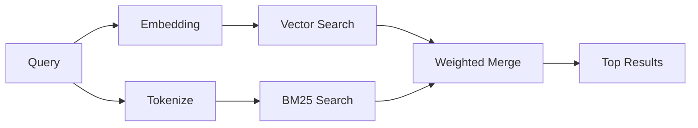

---
read_when:
    - Anda ingin memahami cara kerja memory_search
    - Anda ingin memilih provider embedding
    - Anda ingin menyetel kualitas pencarian
summary: Cara pencarian memori menemukan catatan yang relevan menggunakan embeddings dan pengambilan hibrida
title: Pencarian Memori
x-i18n:
    generated_at: "2026-04-06T03:06:29Z"
    model: gpt-5.4
    provider: openai
    source_hash: b6541cd702bff41f9a468dad75ea438b70c44db7c65a4b793cbacaf9e583c7e9
    source_path: concepts/memory-search.md
    workflow: 15
---

# Pencarian Memori

`memory_search` menemukan catatan yang relevan dari file memori Anda, bahkan saat
susunan katanya berbeda dari teks aslinya. Fitur ini bekerja dengan mengindeks memori ke dalam
potongan-potongan kecil dan mencarinya menggunakan embedding, kata kunci, atau keduanya.

## Mulai cepat

Jika Anda telah mengonfigurasi kunci API OpenAI, Gemini, Voyage, atau Mistral, pencarian memori
akan bekerja secara otomatis. Untuk menetapkan provider secara eksplisit:

```json5
{
  agents: {
    defaults: {
      memorySearch: {
        provider: "openai", // atau "gemini", "local", "ollama", dll.
      },
    },
  },
}
```

Untuk embedding lokal tanpa kunci API, gunakan `provider: "local"` (memerlukan
node-llama-cpp).

## Provider yang didukung

| Provider | ID        | Memerlukan kunci API | Catatan                                             |
| -------- | --------- | -------------------- | --------------------------------------------------- |
| OpenAI   | `openai`  | Ya                   | Terdeteksi otomatis, cepat                          |
| Gemini   | `gemini`  | Ya                   | Mendukung pengindeksan gambar/audio                 |
| Voyage   | `voyage`  | Ya                   | Terdeteksi otomatis                                 |
| Mistral  | `mistral` | Ya                   | Terdeteksi otomatis                                 |
| Bedrock  | `bedrock` | Tidak                | Terdeteksi otomatis saat rantai kredensial AWS terselesaikan |
| Ollama   | `ollama`  | Tidak                | Lokal, harus ditetapkan secara eksplisit            |
| Local    | `local`   | Tidak                | Model GGUF, unduhan ~0.6 GB                         |

## Cara kerja pencarian

OpenClaw menjalankan dua jalur pengambilan secara paralel dan menggabungkan hasilnya:



- **Pencarian vektor** menemukan catatan dengan makna yang serupa ("gateway host" cocok dengan
  "mesin yang menjalankan OpenClaw").
- **Pencarian kata kunci BM25** menemukan kecocokan yang persis (ID, string error, config
  key).

Jika hanya satu jalur yang tersedia (tanpa embedding atau tanpa FTS), jalur lainnya akan berjalan sendiri.

## Meningkatkan kualitas pencarian

Dua fitur opsional membantu saat Anda memiliki riwayat catatan yang besar:

### Peluruhan temporal

Catatan lama secara bertahap kehilangan bobot peringkat sehingga informasi terbaru muncul lebih dulu.
Dengan half-life default 30 hari, skor catatan dari bulan lalu menjadi 50% dari
bobot aslinya. File evergreen seperti `MEMORY.md` tidak pernah mengalami peluruhan.

<Tip>
Aktifkan peluruhan temporal jika agen Anda memiliki catatan harian selama berbulan-bulan dan informasi usang
terus berada di atas konteks terbaru.
</Tip>

### MMR (keragaman)

Mengurangi hasil yang redundan. Jika lima catatan semuanya menyebut config router yang sama, MMR
memastikan hasil teratas mencakup topik yang berbeda alih-alih berulang.

<Tip>
Aktifkan MMR jika `memory_search` terus mengembalikan cuplikan yang hampir duplikat dari
catatan harian yang berbeda.
</Tip>

### Aktifkan keduanya

```json5
{
  agents: {
    defaults: {
      memorySearch: {
        query: {
          hybrid: {
            mmr: { enabled: true },
            temporalDecay: { enabled: true },
          },
        },
      },
    },
  },
}
```

## Memori multimodal

Dengan Gemini Embedding 2, Anda dapat mengindeks gambar dan file audio bersama
Markdown. Query pencarian tetap berupa teks, tetapi akan dicocokkan dengan konten visual dan audio.
Lihat [referensi konfigurasi memori](/id/reference/memory-config) untuk
penyiapannya.

## Pencarian memori sesi

Anda dapat secara opsional mengindeks transkrip sesi agar `memory_search` dapat mengingat
percakapan sebelumnya. Fitur ini bersifat opt-in melalui
`memorySearch.experimental.sessionMemory`. Lihat
[referensi konfigurasi](/id/reference/memory-config) untuk detailnya.

## Pemecahan masalah

**Tidak ada hasil?** Jalankan `openclaw memory status` untuk memeriksa indeks. Jika kosong, jalankan
`openclaw memory index --force`.

**Hanya cocok dengan kata kunci?** Provider embedding Anda mungkin belum dikonfigurasi. Periksa
`openclaw memory status --deep`.

**Teks CJK tidak ditemukan?** Bangun ulang indeks FTS dengan
`openclaw memory index --force`.

## Bacaan lanjutan

- [Memori](/id/concepts/memory) -- tata letak file, backend, alat
- [Referensi konfigurasi memori](/id/reference/memory-config) -- semua opsi konfigurasi
