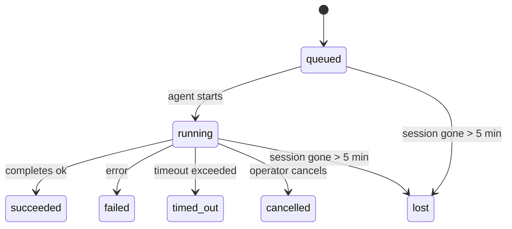

---
read_when:
    - Ispezione del lavoro in background in corso o completato di recente
    - Debug degli errori di consegna per esecuzioni agent distaccate
    - Comprendere come le esecuzioni in background si relazionano a sessioni, cron e heartbeat
summary: Monitoraggio delle attività in background per esecuzioni ACP, subagent, processi cron isolati e operazioni CLI
title: Attività in background
x-i18n:
    generated_at: "2026-04-06T03:06:37Z"
    model: gpt-5.4
    provider: openai
    source_hash: 2f56c1ac23237907a090c69c920c09578a2f56f5d8bf750c7f2136c603c8a8ff
    source_path: automation/tasks.md
    workflow: 15
---

# Attività in background

> **Cerchi la pianificazione?** Consulta [Automazione e attività](/it/automation) per scegliere il meccanismo corretto. Questa pagina riguarda il **monitoraggio** del lavoro in background, non la sua pianificazione.

Le attività in background monitorano il lavoro che viene eseguito **al di fuori della sessione principale di conversazione**:
esecuzioni ACP, avvii di subagent, esecuzioni isolate di processi cron e operazioni avviate dalla CLI.

Le attività **non** sostituiscono sessioni, processi cron o heartbeat: sono il **registro delle attività** che annota quale lavoro distaccato è avvenuto, quando, e se è andato a buon fine.

<Note>
Non tutte le esecuzioni di agent creano un'attività. I turni heartbeat e la normale chat interattiva non lo fanno. Tutte le esecuzioni cron, gli avvii ACP, gli avvii di subagent e i comandi agent della CLI lo fanno.
</Note>

## In breve

- Le attività sono **record**, non scheduler: cron e heartbeat decidono _quando_ viene eseguito il lavoro, le attività monitorano _cosa è successo_.
- ACP, subagent, tutti i processi cron e le operazioni CLI creano attività. I turni heartbeat no.
- Ogni attività passa attraverso `queued → running → terminal` (succeeded, failed, timed_out, cancelled oppure lost).
- Le attività cron restano attive finché il runtime cron continua a possedere il job; le attività CLI supportate dalla chat restano attive solo finché il relativo contesto di esecuzione è ancora attivo.
- Il completamento è basato su push: il lavoro distaccato può notificare direttamente o risvegliare la sessione richiedente/l'heartbeat quando termina, quindi i loop di polling dello stato di solito non sono l'approccio corretto.
- Le esecuzioni cron isolate e i completamenti dei subagent tentano, nei limiti del possibile, di ripulire le schede/processi del browser tracciati per la loro sessione figlia prima della contabilità finale di pulizia.
- La consegna cron isolata sopprime le risposte intermedie obsolete del parent mentre il lavoro dei subagent discendenti è ancora in fase di completamento, e preferisce l'output finale del discendente quando arriva prima della consegna.
- Le notifiche di completamento vengono consegnate direttamente a un canale o messe in coda per il prossimo heartbeat.
- `openclaw tasks list` mostra tutte le attività; `openclaw tasks audit` evidenzia i problemi.
- I record terminali vengono conservati per 7 giorni, poi eliminati automaticamente.

## Avvio rapido

```bash
# Elenca tutte le attività (prima le più recenti)
openclaw tasks list

# Filtra per runtime o stato
openclaw tasks list --runtime acp
openclaw tasks list --status running

# Mostra i dettagli di un'attività specifica (per ID, ID esecuzione o chiave sessione)
openclaw tasks show <lookup>

# Annulla un'attività in esecuzione (termina la sessione figlia)
openclaw tasks cancel <lookup>

# Modifica il criterio di notifica per un'attività
openclaw tasks notify <lookup> state_changes

# Esegui un controllo di integrità
openclaw tasks audit

# Anteprima o applicazione della manutenzione
openclaw tasks maintenance
openclaw tasks maintenance --apply

# Ispeziona lo stato di Task Flow
openclaw tasks flow list
openclaw tasks flow show <lookup>
openclaw tasks flow cancel <lookup>
```

## Cosa crea un'attività

| Origine                | Tipo di runtime | Quando viene creato un record attività                 | Criterio di notifica predefinito |
| ---------------------- | --------------- | ------------------------------------------------------ | -------------------------------- |
| Esecuzioni ACP in background | `acp`        | Avvio di una sessione ACP figlia                       | `done_only`                      |
| Orchestrazione subagent | `subagent`     | Avvio di un subagent tramite `sessions_spawn`          | `done_only`                      |
| Processi cron (tutti i tipi) | `cron`     | Ogni esecuzione cron (sessione principale e isolata)   | `silent`                         |
| Operazioni CLI         | `cli`           | Comandi `openclaw agent` eseguiti tramite il gateway   | `silent`                         |
| Processi media dell'agent | `cli`        | Esecuzioni `video_generate` supportate da sessione     | `silent`                         |

Le attività cron della sessione principale usano per impostazione predefinita il criterio di notifica `silent`: creano record per il monitoraggio ma non generano notifiche. Anche le attività cron isolate usano per impostazione predefinita `silent`, ma sono più visibili perché vengono eseguite nella propria sessione.

Anche le esecuzioni `video_generate` supportate da sessione usano il criterio di notifica `silent`. Creano comunque record attività, ma il completamento viene restituito alla sessione agent originale come risveglio interno, così l'agent può scrivere il messaggio di follow-up e allegare personalmente il video completato. Se scegli `tools.media.asyncCompletion.directSend`, i completamenti asincroni di `music_generate` e `video_generate` tentano prima la consegna diretta al canale, per poi ripiegare sul percorso di risveglio della sessione richiedente.

Mentre un'attività `video_generate` supportata da sessione è ancora attiva, lo strumento funge anche da protezione: chiamate ripetute a `video_generate` nella stessa sessione restituiscono lo stato dell'attività attiva invece di avviare una seconda generazione concorrente. Usa `action: "status"` quando desideri una ricerca esplicita di avanzamento/stato dal lato agent.

**Cosa non crea attività:**

- Turni heartbeat — sessione principale; vedi [Heartbeat](/it/gateway/heartbeat)
- Normali turni di chat interattiva
- Risposte dirette `/command`

## Ciclo di vita dell'attività



| Stato       | Significato                                                               |
| ----------- | ------------------------------------------------------------------------- |
| `queued`    | Creata, in attesa che l'agent inizi                                       |
| `running`   | Il turno dell'agent è in esecuzione attiva                                |
| `succeeded` | Completata con successo                                                    |
| `failed`    | Completata con un errore                                                  |
| `timed_out` | Ha superato il timeout configurato                                        |
| `cancelled` | Interrotta dall'operatore tramite `openclaw tasks cancel`                 |
| `lost`      | Il runtime ha perso lo stato di supporto autorevole dopo un periodo di tolleranza di 5 minuti |

Le transizioni avvengono automaticamente: quando termina l'esecuzione dell'agent associata, lo stato dell'attività si aggiorna di conseguenza.

`lost` dipende dal runtime:

- Attività ACP: i metadati della sessione figlia ACP di supporto sono scomparsi.
- Attività subagent: la sessione figlia di supporto è scomparsa dallo store agent di destinazione.
- Attività cron: il runtime cron non monitora più il job come attivo.
- Attività CLI: le attività di sessione figlia isolate usano la sessione figlia; le attività CLI supportate dalla chat usano invece il contesto di esecuzione live, quindi righe residue di sessione canale/gruppo/diretta non le mantengono attive.

## Consegna e notifiche

Quando un'attività raggiunge uno stato terminale, OpenClaw ti notifica. Esistono due percorsi di consegna:

**Consegna diretta** — se l'attività ha una destinazione di canale (il `requesterOrigin`), il messaggio di completamento viene inviato direttamente a quel canale (Telegram, Discord, Slack, ecc.). Per i completamenti dei subagent, OpenClaw preserva anche l'instradamento di thread/topic associati quando disponibile e può riempire un `to` / account mancante dalla route memorizzata della sessione richiedente (`lastChannel` / `lastTo` / `lastAccountId`) prima di rinunciare alla consegna diretta.

**Consegna in coda alla sessione** — se la consegna diretta fallisce o non è impostata alcuna origine, l'aggiornamento viene messo in coda come evento di sistema nella sessione del richiedente e compare al prossimo heartbeat.

<Tip>
Il completamento dell'attività attiva un risveglio heartbeat immediato, così puoi vedere rapidamente il risultato: non devi aspettare il prossimo tick heartbeat pianificato.
</Tip>

Questo significa che il flusso di lavoro normale è basato su push: avvia una volta il lavoro distaccato, poi lascia che il runtime ti risvegli o ti notifichi al completamento. Interroga lo stato dell'attività solo quando hai bisogno di debug, intervento o di un audit esplicito.

### Criteri di notifica

Controlla quanto vuoi essere informato su ciascuna attività:

| Criterio              | Cosa viene consegnato                                                     |
| --------------------- | ------------------------------------------------------------------------- |
| `done_only` (predefinito) | Solo lo stato terminale (succeeded, failed, ecc.) — **questo è il predefinito** |
| `state_changes`       | Ogni transizione di stato e aggiornamento di avanzamento                  |
| `silent`              | Nulla                                                                     |

Modifica il criterio mentre un'attività è in esecuzione:

```bash
openclaw tasks notify <lookup> state_changes
```

## Riferimento CLI

### `tasks list`

```bash
openclaw tasks list [--runtime <acp|subagent|cron|cli>] [--status <status>] [--json]
```

Colonne di output: ID attività, Tipo, Stato, Consegna, ID esecuzione, Sessione figlia, Riepilogo.

### `tasks show`

```bash
openclaw tasks show <lookup>
```

Il token di ricerca accetta un ID attività, un ID esecuzione o una chiave sessione. Mostra il record completo, inclusi tempi, stato di consegna, errore e riepilogo terminale.

### `tasks cancel`

```bash
openclaw tasks cancel <lookup>
```

Per le attività ACP e subagent, questo termina la sessione figlia. Lo stato passa a `cancelled` e viene inviata una notifica di consegna.

### `tasks notify`

```bash
openclaw tasks notify <lookup> <done_only|state_changes|silent>
```

### `tasks audit`

```bash
openclaw tasks audit [--json]
```

Evidenzia problemi operativi. I risultati compaiono anche in `openclaw status` quando vengono rilevati problemi.

| Risultato                  | Gravità | Trigger                                               |
| -------------------------- | ------- | ----------------------------------------------------- |
| `stale_queued`             | warn    | In coda da più di 10 minuti                           |
| `stale_running`            | error   | In esecuzione da più di 30 minuti                     |
| `lost`                     | error   | La proprietà dell'attività supportata dal runtime è scomparsa |
| `delivery_failed`          | warn    | La consegna è fallita e il criterio di notifica non è `silent` |
| `missing_cleanup`          | warn    | Attività terminale senza timestamp di pulizia         |
| `inconsistent_timestamps`  | warn    | Violazione della timeline (ad esempio terminata prima di iniziare) |

### `tasks maintenance`

```bash
openclaw tasks maintenance [--json]
openclaw tasks maintenance --apply [--json]
```

Usa questo comando per visualizzare in anteprima o applicare riconciliazione, marcatura della pulizia ed eliminazione per le attività e lo stato di Task Flow.

La riconciliazione dipende dal runtime:

- Le attività ACP/subagent controllano la sessione figlia di supporto.
- Le attività cron controllano se il runtime cron possiede ancora il job.
- Le attività CLI supportate dalla chat controllano il relativo contesto di esecuzione live, non solo la riga della sessione chat.

Anche la pulizia del completamento dipende dal runtime:

- Il completamento dei subagent chiude, nei limiti del possibile, le schede/processi del browser tracciati per la sessione figlia prima che prosegua la pulizia dell'annuncio.
- Il completamento cron isolato chiude, nei limiti del possibile, le schede/processi del browser tracciati per la sessione cron prima che l'esecuzione venga completamente smantellata.
- La consegna cron isolata attende, quando necessario, il follow-up dei subagent discendenti e sopprime il testo di conferma del parent ormai obsoleto invece di annunciarlo.
- La consegna del completamento dei subagent preferisce il testo visibile più recente dell'assistente; se è vuoto ripiega sul testo più recente sanitizzato di tool/toolResult, e le esecuzioni di sole chiamate tool terminate per timeout possono essere ridotte a un breve riepilogo di avanzamento parziale.
- Gli errori di pulizia non mascherano il vero esito dell'attività.

### `tasks flow list|show|cancel`

```bash
openclaw tasks flow list [--status <status>] [--json]
openclaw tasks flow show <lookup> [--json]
openclaw tasks flow cancel <lookup>
```

Usa questi comandi quando ciò che ti interessa è il Task Flow di orchestrazione piuttosto che un singolo record di attività in background.

## Bacheca attività della chat (`/tasks`)

Usa `/tasks` in qualsiasi sessione chat per vedere le attività in background collegate a quella sessione. La bacheca mostra
attività attive e completate di recente con runtime, stato, tempi e dettagli su avanzamento o errore.

Quando la sessione corrente non ha attività collegate visibili, `/tasks` ripiega sui conteggi attività locali dell'agent
così ottieni comunque una panoramica senza esporre dettagli di altre sessioni.

Per il registro completo dell'operatore, usa la CLI: `openclaw tasks list`.

## Integrazione stato (pressione attività)

`openclaw status` include un riepilogo immediato delle attività:

```
Tasks: 3 queued · 2 running · 1 issues
```

Il riepilogo riporta:

- **active** — conteggio di `queued` + `running`
- **failures** — conteggio di `failed` + `timed_out` + `lost`
- **byRuntime** — ripartizione per `acp`, `subagent`, `cron`, `cli`

Sia `/status` sia lo strumento `session_status` usano uno snapshot delle attività che tiene conto della pulizia: si dà priorità alle attività attive, le righe completate obsolete vengono nascoste e i guasti recenti emergono solo quando non rimane lavoro attivo.
Questo mantiene la scheda di stato concentrata su ciò che conta in questo momento.

## Archiviazione e manutenzione

### Dove si trovano le attività

I record delle attività vengono mantenuti in SQLite in:

```
$OPENCLAW_STATE_DIR/tasks/runs.sqlite
```

Il registro viene caricato in memoria all'avvio del gateway e sincronizza le scritture su SQLite per garantire la durabilità tra i riavvii.

### Manutenzione automatica

Uno sweeper viene eseguito ogni **60 secondi** e gestisce tre aspetti:

1. **Riconciliazione** — controlla se le attività attive hanno ancora un supporto runtime autorevole. Le attività ACP/subagent usano lo stato della sessione figlia, le attività cron usano la proprietà del job attivo e le attività CLI supportate dalla chat usano il relativo contesto di esecuzione. Se questo stato di supporto manca per più di 5 minuti, l'attività viene contrassegnata come `lost`.
2. **Marcatura della pulizia** — imposta un timestamp `cleanupAfter` sulle attività terminali (`endedAt + 7 days`).
3. **Eliminazione** — cancella i record oltre la data `cleanupAfter`.

**Conservazione**: i record delle attività terminali vengono mantenuti per **7 giorni**, poi eliminati automaticamente. Non è richiesta alcuna configurazione.

## Come le attività si relazionano ad altri sistemi

### Attività e Task Flow

[Task Flow](/it/automation/taskflow) è il livello di orchestrazione dei flussi sopra le attività in background. Un singolo flusso può coordinare più attività nel corso della sua durata usando modalità di sincronizzazione gestite o mirror. Usa `openclaw tasks` per ispezionare i singoli record attività e `openclaw tasks flow` per ispezionare il flusso di orchestrazione.

Consulta [Task Flow](/it/automation/taskflow) per i dettagli.

### Attività e cron

Una **definizione** di job cron si trova in `~/.openclaw/cron/jobs.json`. **Ogni** esecuzione cron crea un record attività, sia nella sessione principale sia in isolamento. Le attività cron della sessione principale usano per impostazione predefinita il criterio di notifica `silent`, così monitorano senza generare notifiche.

Consulta [Processi cron](/it/automation/cron-jobs).

### Attività e heartbeat

Le esecuzioni heartbeat sono turni della sessione principale: non creano record attività. Quando un'attività viene completata, può attivare un risveglio heartbeat così puoi vedere rapidamente il risultato.

Consulta [Heartbeat](/it/gateway/heartbeat).

### Attività e sessioni

Un'attività può fare riferimento a una `childSessionKey` (dove viene eseguito il lavoro) e a una `requesterSessionKey` (chi l'ha avviata). Le sessioni sono il contesto della conversazione; le attività sono il monitoraggio dell'attività sopra di esse.

### Attività ed esecuzioni agent

Il `runId` di un'attività collega l'esecuzione agent che sta svolgendo il lavoro. Gli eventi del ciclo di vita dell'agent (inizio, fine, errore) aggiornano automaticamente lo stato dell'attività: non devi gestire manualmente il ciclo di vita.

## Correlati

- [Automazione e attività](/it/automation) — tutti i meccanismi di automazione in sintesi
- [Task Flow](/it/automation/taskflow) — orchestrazione dei flussi sopra le attività
- [Attività pianificate](/it/automation/cron-jobs) — pianificazione del lavoro in background
- [Heartbeat](/it/gateway/heartbeat) — turni periodici della sessione principale
- [CLI: Tasks](/cli/index#tasks) — riferimento ai comandi CLI
