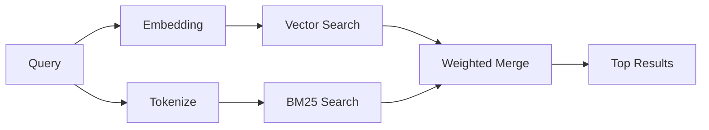

---
read_when:
    - Vuoi capire come funziona `memory_search`
    - Vuoi scegliere un provider di embedding
    - Vuoi ottimizzare la qualità della ricerca
summary: Come la ricerca della memoria trova note pertinenti usando embeddings e recupero ibrido
title: Memory Search
x-i18n:
    generated_at: "2026-04-06T03:06:32Z"
    model: gpt-5.4
    provider: openai
    source_hash: b6541cd702bff41f9a468dad75ea438b70c44db7c65a4b793cbacaf9e583c7e9
    source_path: concepts/memory-search.md
    workflow: 15
---

# Memory Search

`memory_search` trova note pertinenti nei tuoi file di memoria, anche quando la
formulazione è diversa dal testo originale. Funziona indicizzando la memoria in piccoli
blocchi e cercandoli usando embeddings, parole chiave o entrambi.

## Avvio rapido

Se hai configurato una chiave API OpenAI, Gemini, Voyage o Mistral, la ricerca
della memoria funziona automaticamente. Per impostare esplicitamente un provider:

```json5
{
  agents: {
    defaults: {
      memorySearch: {
        provider: "openai", // oppure "gemini", "local", "ollama", ecc.
      },
    },
  },
}
```

Per embedding locali senza chiave API, usa `provider: "local"` (richiede
node-llama-cpp).

## Provider supportati

| Provider | ID        | Richiede una chiave API | Note                                                 |
| -------- | --------- | ----------------------- | ---------------------------------------------------- |
| OpenAI   | `openai`  | Sì                      | Rilevato automaticamente, veloce                     |
| Gemini   | `gemini`  | Sì                      | Supporta l'indicizzazione di immagini/audio          |
| Voyage   | `voyage`  | Sì                      | Rilevato automaticamente                             |
| Mistral  | `mistral` | Sì                      | Rilevato automaticamente                             |
| Bedrock  | `bedrock` | No                      | Rilevato automaticamente quando la catena di credenziali AWS viene risolta |
| Ollama   | `ollama`  | No                      | Locale, deve essere impostato esplicitamente         |
| Local    | `local`   | No                      | Modello GGUF, download di circa 0,6 GB               |

## Come funziona la ricerca

OpenClaw esegue in parallelo due percorsi di recupero e ne unisce i risultati:



- **Ricerca vettoriale** trova note con significato simile ("gateway host" corrisponde a
  "la macchina che esegue OpenClaw").
- **Ricerca per parole chiave BM25** trova corrispondenze esatte (ID, stringhe di errore, chiavi
  di configurazione).

Se è disponibile un solo percorso (niente embeddings o niente FTS), viene eseguito solo l'altro.

## Migliorare la qualità della ricerca

Due funzionalità facoltative aiutano quando hai una cronologia ampia di note:

### Decadimento temporale

Le note vecchie perdono gradualmente peso nel ranking, così le informazioni recenti emergono per prime.
Con l'emivita predefinita di 30 giorni, una nota del mese scorso ottiene il 50% del
suo peso originale. I file sempreverdi come `MEMORY.md` non subiscono mai decadimento.

<Tip>
Abilita il decadimento temporale se il tuo agente ha mesi di note giornaliere e informazioni obsolete
continuano a superare nel ranking il contesto recente.
</Tip>

### MMR (diversità)

Riduce i risultati ridondanti. Se cinque note menzionano tutte la stessa configurazione del router, MMR
garantisce che i risultati principali coprano argomenti diversi invece di ripetersi.

<Tip>
Abilita MMR se `memory_search` continua a restituire snippet quasi duplicati da
note giornaliere diverse.
</Tip>

### Abilita entrambi

```json5
{
  agents: {
    defaults: {
      memorySearch: {
        query: {
          hybrid: {
            mmr: { enabled: true },
            temporalDecay: { enabled: true },
          },
        },
      },
    },
  },
}
```

## Memoria multimodale

Con Gemini Embedding 2, puoi indicizzare file di immagini e audio insieme al
Markdown. Le query di ricerca restano testuali, ma corrispondono a contenuti visivi e audio.
Per la configurazione, vedi il [Riferimento della configurazione della memoria](/it/reference/memory-config).

## Ricerca nella memoria della sessione

Puoi facoltativamente indicizzare le trascrizioni delle sessioni in modo che `memory_search` possa recuperare
conversazioni precedenti. Questa funzionalità è opt-in tramite
`memorySearch.experimental.sessionMemory`. Vedi il
[riferimento della configurazione](/it/reference/memory-config) per i dettagli.

## Risoluzione dei problemi

**Nessun risultato?** Esegui `openclaw memory status` per controllare l'indice. Se è vuoto, esegui
`openclaw memory index --force`.

**Solo corrispondenze per parole chiave?** Il tuo provider di embedding potrebbe non essere configurato. Controlla
`openclaw memory status --deep`.

**Testo CJK non trovato?** Ricostruisci l'indice FTS con
`openclaw memory index --force`.

## Ulteriori letture

- [Memory](/it/concepts/memory) -- layout dei file, backend, strumenti
- [Riferimento della configurazione della memoria](/it/reference/memory-config) -- tutte le opzioni di configurazione
