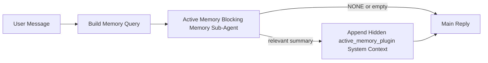

---
read_when:
    - Active Memory が何のためのものかを理解したい
    - 会話型エージェントで Active Memory を有効にしたい
    - どこでも有効にせずに Active Memory の動作を調整したい
summary: 対話型チャットセッションに関連するメモリを注入する、Plugin が所有するブロッキングメモリサブエージェント
title: Active Memory
x-i18n:
    generated_at: "2026-04-12T23:27:59Z"
    model: gpt-5.4
    provider: openai
    source_hash: 11665dbc888b6d4dc667a47624cc1f2e4cc71e1d58e1f7d9b5fe4057ec4da108
    source_path: concepts/active-memory.md
    workflow: 15
---

# Active Memory

Active Memory は、対象となる会話セッションにおけるメインの返信の前に実行される、オプションの Plugin が所有するブロッキングメモリサブエージェントです。

これは、ほとんどのメモリシステムが高機能であっても受動的だからです。メモリを検索するタイミングをメインエージェントが判断するか、あるいはユーザーが「これを覚えて」や「メモリを検索して」のように言うことに依存しています。その時点では、メモリが返信を自然に感じさせられたはずの瞬間は、すでに過ぎています。

Active Memory は、メインの返信が生成される前に、システムに関連するメモリを提示するための、制限された 1 回の機会を与えます。

## これをエージェントに貼り付ける

自己完結型で安全なデフォルト設定で Active Memory を有効にしたい場合は、これをエージェントに貼り付けてください。

```json5
{
  plugins: {
    entries: {
      "active-memory": {
        enabled: true,
        config: {
          enabled: true,
          agents: ["main"],
          allowedChatTypes: ["direct"],
          modelFallback: "google/gemini-3-flash",
          queryMode: "recent",
          promptStyle: "balanced",
          timeoutMs: 15000,
          maxSummaryChars: 220,
          persistTranscripts: false,
          logging: true,
        },
      },
    },
  },
}
```

これにより、`main` エージェントで Plugin が有効になり、デフォルトではダイレクトメッセージ形式のセッションのみに制限され、まず現在のセッションモデルを継承し、明示的または継承されたモデルが利用できない場合にのみ設定済みのフォールバックモデルを使用します。

その後、Gateway を再起動します。

```bash
openclaw gateway
```

会話の中でライブで確認するには、次を実行します。

```text
/verbose on
/trace on
```

## Active Memory を有効にする

最も安全な設定は次のとおりです。

1. Plugin を有効にする
2. 会話型エージェントを 1 つ対象にする
3. 調整中のみ logging をオンにしておく

`openclaw.json` で次の設定から始めます。

```json5
{
  plugins: {
    entries: {
      "active-memory": {
        enabled: true,
        config: {
          agents: ["main"],
          allowedChatTypes: ["direct"],
          modelFallback: "google/gemini-3-flash",
          queryMode: "recent",
          promptStyle: "balanced",
          timeoutMs: 15000,
          maxSummaryChars: 220,
          persistTranscripts: false,
          logging: true,
        },
      },
    },
  },
}
```

その後、Gateway を再起動します。

```bash
openclaw gateway
```

これが意味すること:

- `plugins.entries.active-memory.enabled: true` は Plugin を有効にします
- `config.agents: ["main"]` は `main` エージェントだけを Active Memory の対象にします
- `config.allowedChatTypes: ["direct"]` は、デフォルトでダイレクトメッセージ形式のセッションでのみ Active Memory を有効にします
- `config.model` が未設定の場合、Active Memory はまず現在のセッションモデルを継承します
- `config.modelFallback` は、必要に応じてリコール用の独自のフォールバック provider/model を指定します
- `config.promptStyle: "balanced"` は、`recent` モードのデフォルトの汎用プロンプトスタイルを使用します
- Active Memory は、対象となる対話型の永続チャットセッションでのみ引き続き実行されます

## 確認方法

Active Memory はモデルに対して隠しシステムコンテキストを注入します。生の `<active_memory_plugin>...</active_memory_plugin>` タグをクライアントに公開することはありません。

## セッショントグル

設定を編集せずに現在のチャットセッションで Active Memory を一時停止または再開したい場合は、Plugin コマンドを使用します。

```text
/active-memory status
/active-memory off
/active-memory on
```

これはセッションスコープです。`plugins.entries.active-memory.enabled`、エージェントの対象指定、またはその他のグローバル設定は変更しません。

設定を書き込み、すべてのセッションで Active Memory を一時停止または再開したい場合は、明示的なグローバル形式を使用します。

```text
/active-memory status --global
/active-memory off --global
/active-memory on --global
```

グローバル形式は `plugins.entries.active-memory.config.enabled` に書き込みます。後で Active Memory を再び有効にするためのコマンドを利用可能なままにするため、`plugins.entries.active-memory.enabled` は有効のままにします。

ライブセッションで Active Memory が何をしているか確認したい場合は、表示したい出力に対応するセッショントグルをオンにします。

```text
/verbose on
/trace on
```

これらを有効にすると、OpenClaw は次を表示できます。

- `/verbose on` 時に `Active Memory: ok 842ms recent 34 chars` のような Active Memory のステータス行
- `/trace on` 時に `Active Memory Debug: Lemon pepper wings with blue cheese.` のような読みやすいデバッグ要約

これらの行は、隠しシステムコンテキストに渡されるものと同じ Active Memory パスから導かれていますが、生のプロンプトマークアップを公開する代わりに、人間向けに整形されています。これらは通常のアシスタント返信の後にフォローアップの診断メッセージとして送信されるため、Telegram のようなチャネルクライアントで返信前の別個の診断バブルが一瞬表示されることはありません。

デフォルトでは、ブロッキングメモリサブエージェントの transcript は一時的なものであり、実行完了後に削除されます。

フローの例:

```text
/verbose on
/trace on
what wings should i order?
```

期待される可視の返信の形:

```text
...normal assistant reply...

🧩 Active Memory: ok 842ms recent 34 chars
🔎 Active Memory Debug: Lemon pepper wings with blue cheese.
```

## 実行されるタイミング

Active Memory は 2 つのゲートを使用します。

1. **設定によるオプトイン**  
   Plugin が有効であり、現在のエージェント id が `plugins.entries.active-memory.config.agents` に含まれている必要があります。
2. **厳格な実行時適格性**  
   有効化され対象指定されていても、Active Memory は対象となる対話型の永続チャットセッションでのみ実行されます。

実際のルールは次のとおりです。

```text
plugin enabled
+
agent id targeted
+
allowed chat type
+
eligible interactive persistent chat session
=
active memory runs
```

これらのいずれかが満たされない場合、Active Memory は実行されません。

## セッションタイプ

`config.allowedChatTypes` は、どの種類の会話で Active Memory をそもそも実行できるかを制御します。

デフォルトは次のとおりです。

```json5
allowedChatTypes: ["direct"]
```

これは、Active Memory がデフォルトではダイレクトメッセージ形式のセッションで実行され、明示的にオプトインしない限り group または channel セッションでは実行されないことを意味します。

例:

```json5
allowedChatTypes: ["direct"]
```

```json5
allowedChatTypes: ["direct", "group"]
```

```json5
allowedChatTypes: ["direct", "group", "channel"]
```

## 実行される場所

Active Memory は会話を強化する機能であり、プラットフォーム全体の推論機能ではありません。

| Surface                                                             | Active Memory は実行されるか |
| ------------------------------------------------------------------- | ----------------------------- |
| Control UI / web chat の永続セッション                              | はい。Plugin が有効で、エージェントが対象指定されている場合 |
| 同じ永続チャットパス上のその他の対話型チャネルセッション            | はい。Plugin が有効で、エージェントが対象指定されている場合 |
| ヘッドレスな単発実行                                                | いいえ |
| Heartbeat/バックグラウンド実行                                      | いいえ |
| 汎用の内部 `agent-command` パス                                     | いいえ |
| サブエージェント/内部ヘルパーの実行                                 | いいえ |

## 使用する理由

次のような場合に Active Memory を使用します。

- セッションが永続的でユーザー向けである
- エージェントに検索すべき意味のある長期メモリがある
- 生のプロンプトの決定性よりも、一貫性とパーソナライズの方が重要である

特に次の用途でうまく機能します。

- 安定した好み
- 繰り返しの習慣
- 自然に表面化すべき長期的なユーザーコンテキスト

次の用途には適していません。

- 自動化
- 内部ワーカー
- 単発の API タスク
- 隠れたパーソナライズが意外に感じられる場所

## 仕組み

実行時の形は次のとおりです。



ブロッキングメモリサブエージェントが使用できるのは次のみです。

- `memory_search`
- `memory_get`

接続が弱い場合は、`NONE` を返すべきです。

## クエリモード

`config.queryMode` は、ブロッキングメモリサブエージェントがどれだけの会話を参照するかを制御します。

## プロンプトスタイル

`config.promptStyle` は、ブロッキングメモリサブエージェントがメモリを返すべきかどうかを判断する際に、どれだけ積極的または厳格になるかを制御します。

利用可能なスタイル:

- `balanced`: `recent` モード向けの汎用デフォルト
- `strict`: 最も慎重。近くのコンテキストからのにじみを極力少なくしたい場合に最適
- `contextual`: 最も継続性に配慮。会話履歴をより重視したい場合に最適
- `recall-heavy`: 弱めだが妥当性のある一致でも、メモリをより積極的に提示する
- `precision-heavy`: 一致が明白でない限り、積極的に `NONE` を優先する
- `preference-only`: お気に入り、習慣、ルーチン、好み、繰り返し現れる個人的事実向けに最適化

`config.promptStyle` が未設定の場合のデフォルトの対応:

```text
message -> strict
recent -> balanced
full -> contextual
```

`config.promptStyle` を明示的に設定した場合は、その上書きが優先されます。

例:

```json5
promptStyle: "preference-only"
```

## モデルフォールバックポリシー

`config.model` が未設定の場合、Active Memory は次の順序でモデルを解決しようとします。

```text
explicit plugin model
-> current session model
-> agent primary model
-> optional configured fallback model
```

`config.modelFallback` は、設定済みフォールバックのステップを制御します。

任意のカスタムフォールバック:

```json5
modelFallback: "google/gemini-3-flash"
```

明示的、継承済み、または設定済みフォールバックのいずれのモデルも解決できない場合、Active Memory はそのターンのリコールをスキップします。

`config.modelFallbackPolicy` は、古い設定との互換性のためだけに残された非推奨フィールドです。実行時の動作はもう変更しません。

## 高度なエスケープハッチ

これらのオプションは、意図的に推奨設定には含まれていません。

`config.thinking` は、ブロッキングメモリサブエージェントの thinking レベルを上書きできます。

```json5
thinking: "medium"
```

デフォルト:

```json5
thinking: "off"
```

これはデフォルトで有効にしないでください。Active Memory は返信パスで実行されるため、thinking 時間が増えると、そのままユーザーに見えるレイテンシが増加します。

`config.promptAppend` は、デフォルトの Active Memory プロンプトの後、会話コンテキストの前に、追加のオペレーター指示を加えます。

```json5
promptAppend: "Prefer stable long-term preferences over one-off events."
```

`config.promptOverride` はデフォルトの Active Memory プロンプトを置き換えます。OpenClaw はその後も会話コンテキストを追加します。

```json5
promptOverride: "You are a memory search agent. Return NONE or one compact user fact."
```

プロンプトのカスタマイズは、意図的に異なるリコール契約をテストしている場合を除き、推奨されません。デフォルトのプロンプトは、`NONE` またはメインモデル向けのコンパクトなユーザー事実コンテキストを返すよう調整されています。

### `message`

最新のユーザーメッセージのみが送信されます。

```text
Latest user message only
```

これは次のような場合に使用します。

- 最速の動作が欲しい
- 安定した好みのリコールに最も強く寄せたい
- フォローアップターンに会話コンテキストが不要

推奨 timeout:

- `3000`〜`5000` ms 前後から始める

### `recent`

最新のユーザーメッセージに加えて、最近の会話の短い末尾が送信されます。

```text
Recent conversation tail:
user: ...
assistant: ...
user: ...

Latest user message:
...
```

これは次のような場合に使用します。

- 速度と会話の文脈づけのより良いバランスが欲しい
- フォローアップの質問がしばしば直近数ターンに依存する

推奨 timeout:

- `15000` ms 前後から始める

### `full`

会話全体がブロッキングメモリサブエージェントに送信されます。

```text
Full conversation context:
user: ...
assistant: ...
user: ...
...
```

これは次のような場合に使用します。

- レイテンシよりも最強のリコール品質が重要
- 会話に、スレッドのかなり前方にある重要な前提が含まれている

推奨 timeout:

- `message` や `recent` と比べて大幅に増やす
- スレッドサイズに応じて `15000` ms 以上から始める

一般に、timeout はコンテキストサイズに応じて増やすべきです。

```text
message < recent < full
```

## transcript の永続化

Active Memory のブロッキングメモリサブエージェント実行では、ブロッキングメモリサブエージェント呼び出し中に実際の `session.jsonl` transcript が作成されます。

デフォルトでは、その transcript は一時的です。

- 一時ディレクトリに書き込まれます
- ブロッキングメモリサブエージェント実行のためにのみ使用されます
- 実行終了直後に削除されます

デバッグや確認のためにそれらのブロッキングメモリサブエージェント transcript をディスク上に保持したい場合は、永続化を明示的に有効にしてください。

```json5
{
  plugins: {
    entries: {
      "active-memory": {
        enabled: true,
        config: {
          agents: ["main"],
          persistTranscripts: true,
          transcriptDir: "active-memory",
        },
      },
    },
  },
}
```

有効にすると、Active Memory は transcript をメインのユーザー会話 transcript パスではなく、対象エージェントの sessions フォルダー配下の別ディレクトリに保存します。

デフォルトのレイアウトの概念は次のとおりです。

```text
agents/<agent>/sessions/active-memory/<blocking-memory-sub-agent-session-id>.jsonl
```

相対サブディレクトリは `config.transcriptDir` で変更できます。

これは慎重に使用してください。

- ブロッキングメモリサブエージェント transcript は、セッションが忙しいとすぐに蓄積する可能性があります
- `full` クエリモードは大量の会話コンテキストを複製することがあります
- これらの transcript には隠しプロンプトコンテキストと呼び出されたメモリが含まれます

## 設定

Active Memory の設定はすべて次の配下にあります。

```text
plugins.entries.active-memory
```

最も重要なフィールドは次のとおりです。

| キー                        | 型                                                                                                   | 意味                                                                                                   |
| --------------------------- | ---------------------------------------------------------------------------------------------------- | ------------------------------------------------------------------------------------------------------ |
| `enabled`                   | `boolean`                                                                                            | Plugin 自体を有効にする                                                                                |
| `config.agents`             | `string[]`                                                                                           | Active Memory を使用できるエージェント id                                                              |
| `config.model`              | `string`                                                                                             | オプションのブロッキングメモリサブエージェント model ref。未設定の場合、Active Memory は現在のセッションモデルを使用する |
| `config.queryMode`          | `"message" \| "recent" \| "full"`                                                                    | ブロッキングメモリサブエージェントがどれだけの会話を見るかを制御する                                  |
| `config.promptStyle`        | `"balanced" \| "strict" \| "contextual" \| "recall-heavy" \| "precision-heavy" \| "preference-only"` | ブロッキングメモリサブエージェントがメモリを返すかどうかを判断する際に、どれだけ積極的または厳格かを制御する |
| `config.thinking`           | `"off" \| "minimal" \| "low" \| "medium" \| "high" \| "xhigh" \| "adaptive"`                         | ブロッキングメモリサブエージェント向けの高度な thinking 上書き。速度のためデフォルトは `off`         |
| `config.promptOverride`     | `string`                                                                                             | 高度な完全プロンプト置換。通常の使用には非推奨                                                         |
| `config.promptAppend`       | `string`                                                                                             | デフォルトまたは上書きされたプロンプトに追加される高度な追加指示                                      |
| `config.timeoutMs`          | `number`                                                                                             | ブロッキングメモリサブエージェントのハード timeout                                                     |
| `config.maxSummaryChars`    | `number`                                                                                             | active-memory summary に許可される合計最大文字数                                                       |
| `config.logging`            | `boolean`                                                                                            | 調整中に Active Memory のログを出力する                                                                |
| `config.persistTranscripts` | `boolean`                                                                                            | 一時ファイルを削除せず、ブロッキングメモリサブエージェント transcript をディスク上に保持する          |
| `config.transcriptDir`      | `string`                                                                                             | エージェントの sessions フォルダー配下の相対ブロッキングメモリサブエージェント transcript ディレクトリ |

便利な調整用フィールド:

| キー                          | 型       | 意味                                                        |
| ----------------------------- | -------- | ----------------------------------------------------------- |
| `config.maxSummaryChars`      | `number` | active-memory summary に許可される合計最大文字数           |
| `config.recentUserTurns`      | `number` | `queryMode` が `recent` のときに含める過去のユーザーターン数 |
| `config.recentAssistantTurns` | `number` | `queryMode` が `recent` のときに含める過去のアシスタントターン数 |
| `config.recentUserChars`      | `number` | 最近の各ユーザーターンあたりの最大文字数                    |
| `config.recentAssistantChars` | `number` | 最近の各アシスタントターンあたりの最大文字数                |
| `config.cacheTtlMs`           | `number` | 同一クエリの繰り返しに対するキャッシュ再利用                |

## 推奨設定

`recent` から始めてください。

```json5
{
  plugins: {
    entries: {
      "active-memory": {
        enabled: true,
        config: {
          agents: ["main"],
          queryMode: "recent",
          promptStyle: "balanced",
          timeoutMs: 15000,
          maxSummaryChars: 220,
          logging: true,
        },
      },
    },
  },
}
```

調整中にライブの動作を確認したい場合は、別個の active-memory デバッグコマンドを探すのではなく、通常のステータス行には `/verbose on` を、active-memory デバッグ要約には `/trace on` を使用してください。チャットチャネルでは、それらの診断行はメインのアシスタント返信の前ではなく後に送信されます。

その後、次の方向に進めます。

- より低いレイテンシが欲しいなら `message`
- 追加コンテキストにより遅いブロッキングメモリサブエージェントの価値があると判断したなら `full`

## デバッグ

期待した場所で Active Memory が表示されない場合:

1. `plugins.entries.active-memory.enabled` 配下で Plugin が有効になっていることを確認します。
2. 現在のエージェント id が `config.agents` に含まれていることを確認します。
3. 対話型の永続チャットセッション経由でテストしていることを確認します。
4. `config.logging: true` を有効にして Gateway ログを確認します。
5. `openclaw memory status --deep` で memory search 自体が動作することを確認します。

メモリヒットがノイジーすぎる場合は、次を厳しくします。

- `maxSummaryChars`

Active Memory が遅すぎる場合は、次を行います。

- `queryMode` を下げる
- `timeoutMs` を下げる
- 最近のターン数を減らす
- 各ターンの文字数上限を減らす

## よくある問題

### 埋め込み provider が予期せず変わった

Active Memory は、`agents.defaults.memorySearch` 配下の通常の `memory_search` パイプラインを使用します。つまり、embedding-provider の設定が必要になるのは、`memorySearch` の設定で望む動作のために embeddings が必要な場合だけです。

実際には:

- `ollama` のような、自動検出されない provider が欲しい場合は、明示的な provider 設定が**必須**です
- 自動検出で環境に対して利用可能な embedding provider を解決できない場合は、明示的な provider 設定が**必須**です
- 「最初に利用可能なものが勝つ」ではなく決定的な provider 選択が欲しい場合は、明示的な provider 設定を**強く推奨**します
- 自動検出ですでに望む provider が解決され、その provider がデプロイ環境で安定している場合は、通常は明示的な provider 設定は**不要**です

`memorySearch.provider` が未設定の場合、OpenClaw は最初に利用可能な embedding provider を自動検出します。

これは実運用では混乱の原因になることがあります。

- 新しく利用可能になった API キーによって、memory search が使用する provider が変わることがあります
- あるコマンドや診断画面では選択された provider が、実際にライブのメモリ同期や検索 bootstrap 中に通っている経路と異なって見えることがあります
- Hosted provider は、各返信前に Active Memory がリコール検索を発行し始めて初めて現れる quota や rate-limit エラーで失敗することがあります

embedding provider を解決できない場合、`memory_search` が劣化した lexical-only モードで動作できるときは、Active Memory は embeddings なしでも実行できます。

provider がすでに選択された後の quota 枯渇、rate limits、ネットワーク/provider エラー、ローカル/リモート model の欠落などの provider 実行時障害で、同じフォールバックが起きるとは考えないでください。

実際には:

- embedding provider を解決できない場合、`memory_search` は lexical-only 取得に劣化することがあります
- embedding provider が解決された後に実行時に失敗した場合、そのリクエストに対して OpenClaw は現在 lexical フォールバックを保証していません
- 決定的な provider 選択が必要な場合は、`agents.defaults.memorySearch.provider` を固定してください
- 実行時エラー時の provider フェイルオーバーが必要な場合は、`agents.defaults.memorySearch.fallback` を明示的に設定してください

embedding ベースのリコール、マルチモーダル indexing、または特定のローカル/リモート provider に依存する場合は、自動検出に頼らず provider を明示的に固定してください。

一般的な固定例:

OpenAI:

```json5
{
  agents: {
    defaults: {
      memorySearch: {
        provider: "openai",
        model: "text-embedding-3-small",
      },
    },
  },
}
```

Gemini:

```json5
{
  agents: {
    defaults: {
      memorySearch: {
        provider: "gemini",
        model: "gemini-embedding-001",
      },
    },
  },
}
```

Ollama:

```json5
{
  agents: {
    defaults: {
      memorySearch: {
        provider: "ollama",
        model: "nomic-embed-text",
      },
    },
  },
}
```

quota 枯渇のような実行時エラーで provider フェイルオーバーを期待する場合、provider を固定するだけでは不十分です。明示的な fallback も設定してください。

```json5
{
  agents: {
    defaults: {
      memorySearch: {
        provider: "openai",
        fallback: "gemini",
      },
    },
  },
}
```

### provider 問題のデバッグ

Active Memory が遅い、空になる、または予期せず provider を切り替えているように見える場合:

- 問題を再現しながら Gateway ログを確認し、`active-memory: ... start|done`、`memory sync failed (search-bootstrap)`、または provider 固有の embedding エラーのような行を探します
- `/trace on` を有効にして、Plugin が所有する Active Memory デバッグ要約をセッション内に表示します
- 各返信の後に通常の `🧩 Active Memory: ...` ステータス行も見たい場合は `/verbose on` も有効にします
- `openclaw memory status --deep` を実行して、現在の memory-search バックエンドとインデックスの健全性を確認します
- `agents.defaults.memorySearch.provider` と関連する auth/config を確認し、期待している provider が実際に実行時に解決可能なものであることを確認します
- `ollama` を使用している場合は、設定された embedding model がインストールされていることを確認します。たとえば `ollama list` を使用します

デバッグループの例:

```text
1. Gateway を起動し、そのログを監視する
2. チャットセッションで /trace on を実行する
3. Active Memory をトリガーするはずのメッセージを 1 つ送る
4. チャットに表示されるデバッグ行と Gateway ログ行を比較する
5. provider 選択が曖昧なら、agents.defaults.memorySearch.provider を明示的に固定する
```

例:

```json5
{
  agents: {
    defaults: {
      memorySearch: {
        provider: "ollama",
        model: "nomic-embed-text",
      },
    },
  },
}
```

または、Gemini embeddings を使いたい場合:

```json5
{
  agents: {
    defaults: {
      memorySearch: {
        provider: "gemini",
      },
    },
  },
}
```

provider を変更した後は、Gateway を再起動し、`/trace on` を付けて新しくテストを実行してください。そうすることで、Active Memory のデバッグ行に新しい embedding パスが反映されます。

## 関連ページ

- [Memory Search](/ja-JP/concepts/memory-search)
- [メモリ設定リファレンス](/ja-JP/reference/memory-config)
- [Plugin SDK セットアップ](/ja-JP/plugins/sdk-setup)
