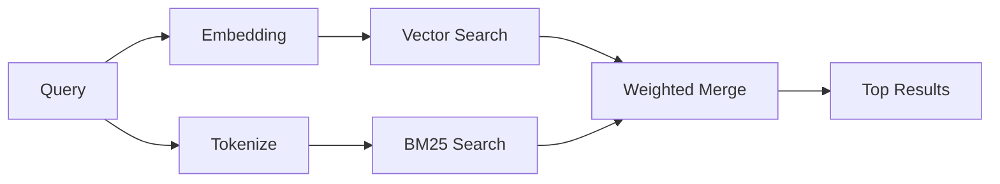

---
read_when:
    - '`memory_search` がどのように動作するかを理解したい場合'
    - 埋め込みプロバイダーを選択したい場合
    - 検索品質を調整したい場合
summary: 埋め込みとハイブリッド検索を使用してメモリ検索が関連ノートを見つける仕組み
title: メモリ検索
x-i18n:
    generated_at: "2026-04-12T23:28:07Z"
    model: gpt-5.4
    provider: openai
    source_hash: 71fde251b7d2dc455574aa458e7e09136f30613609ad8dafeafd53b2729a0310
    source_path: concepts/memory-search.md
    workflow: 15
---

# メモリ検索

`memory_search` は、表現が元のテキストと異なる場合でも、メモリファイルから関連ノートを見つけます。これは、メモリを小さなチャンクにインデックス化し、埋め込み、キーワード、またはその両方を使って検索することで動作します。

## クイックスタート

OpenAI、Gemini、Voyage、または Mistral の API キーが設定されている場合、メモリ検索は自動的に動作します。プロバイダーを明示的に設定するには、次のようにします。

```json5
{
  agents: {
    defaults: {
      memorySearch: {
        provider: "openai", // または "gemini"、"local"、"ollama" など。
      },
    },
  },
}
```

API キーなしでローカル埋め込みを使うには、`provider: "local"` を使用します（`node-llama-cpp` が必要です）。

## サポートされているプロバイダー

| プロバイダー | ID        | API キーが必要 | 注記                                                     |
| ------------ | --------- | -------------- | -------------------------------------------------------- |
| OpenAI       | `openai`  | はい           | 自動検出、高速                                           |
| Gemini       | `gemini`  | はい           | 画像/音声のインデックス化をサポート                      |
| Voyage       | `voyage`  | はい           | 自動検出                                                 |
| Mistral      | `mistral` | はい           | 自動検出                                                 |
| Bedrock      | `bedrock` | いいえ         | AWS 認証情報チェーンが解決されると自動検出               |
| Ollama       | `ollama`  | いいえ         | ローカル、明示的な設定が必要                             |
| Local        | `local`   | いいえ         | GGUF モデル、約 0.6 GB のダウンロード                    |

## 検索の仕組み

OpenClaw は 2 つの検索経路を並列に実行し、その結果をマージします。



- **ベクトル検索** は、意味が似ているノートを見つけます（「gateway host」が「OpenClaw を実行しているマシン」に一致するなど）。
- **BM25 キーワード検索** は、完全一致を見つけます（ID、エラー文字列、設定キー）。

一方の経路しか利用できない場合（埋め込みがない、または FTS がない場合）、もう一方だけで実行されます。

埋め込みが利用できない場合でも、OpenClaw は生の完全一致順にのみフォールバックするのではなく、FTS 結果に対して語彙ベースのランキングを引き続き使用します。この劣化モードでは、クエリ語のカバレッジがより強く、関連するファイルパスを持つチャンクが優先されるため、`sqlite-vec` や埋め込みプロバイダーがなくても有用な再現率を維持できます。

## 検索品質の改善

ノート履歴が大きい場合に役立つオプション機能が 2 つあります。

### 時間減衰

古いノートはランキングの重みを徐々に失うため、最近の情報が先に表示されます。デフォルトの半減期は 30 日で、先月のノートのスコアは元の重みの 50% になります。`MEMORY.md` のようなエバーグリーンなファイルには減衰が適用されません。

<Tip>
エージェントに数か月分の日次ノートがあり、古い情報が新しいコンテキストより上位に来続ける場合は、時間減衰を有効にしてください。
</Tip>

### MMR（多様性）

重複した結果を減らします。5 つのノートすべてが同じルーター設定に言及している場合、MMR は同じ内容の繰り返しではなく、異なるトピックが上位結果に含まれるようにします。

<Tip>
`memory_search` が異なる日次ノートからほぼ重複するスニペットを返し続ける場合は、MMR を有効にしてください。
</Tip>

### 両方を有効にする

```json5
{
  agents: {
    defaults: {
      memorySearch: {
        query: {
          hybrid: {
            mmr: { enabled: true },
            temporalDecay: { enabled: true },
          },
        },
      },
    },
  },
}
```

## マルチモーダルメモリ

Gemini Embedding 2 を使用すると、Markdown と一緒に画像ファイルや音声ファイルをインデックス化できます。検索クエリは引き続きテキストですが、視覚および音声コンテンツに対して一致します。設定方法については、[Memory 設定リファレンス](/ja-JP/reference/memory-config) を参照してください。

## セッションメモリ検索

`memory_search` が過去の会話を呼び出せるように、セッショントランスクリプトを任意でインデックス化できます。これは `memorySearch.experimental.sessionMemory` によるオプトイン機能です。詳細は [設定リファレンス](/ja-JP/reference/memory-config) を参照してください。

## トラブルシューティング

**結果が出ない場合は?** インデックスを確認するには `openclaw memory status` を実行してください。空の場合は `openclaw memory index --force` を実行してください。

**キーワード一致しか出ない場合は?** 埋め込みプロバイダーが設定されていない可能性があります。`openclaw memory status --deep` を確認してください。

**CJK テキストが見つからない場合は?** `openclaw memory index --force` で FTS インデックスを再構築してください。

## さらに読む

- [Active Memory](/ja-JP/concepts/active-memory) -- 対話型チャットセッション向けのサブエージェントメモリ
- [Memory](/ja-JP/concepts/memory) -- ファイルレイアウト、バックエンド、ツール
- [Memory 設定リファレンス](/ja-JP/reference/memory-config) -- すべての設定項目
