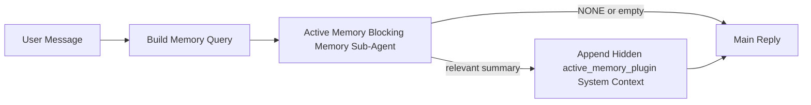

---
read_when:
    - Chcesz zrozumieć, do czego służy Active Memory
    - Chcesz włączyć Active Memory dla agenta konwersacyjnego
    - Chcesz dostroić działanie Active Memory bez włączania go wszędzie
summary: Blokujący podagent pamięci należący do Pluginu, który wstrzykuje odpowiednią pamięć do interaktywnych sesji czatu
title: Active Memory
x-i18n:
    generated_at: "2026-04-12T23:28:12Z"
    model: gpt-5.4
    provider: openai
    source_hash: 11665dbc888b6d4dc667a47624cc1f2e4cc71e1d58e1f7d9b5fe4057ec4da108
    source_path: concepts/active-memory.md
    workflow: 15
---

# Active Memory

Active Memory to opcjonalny, należący do Pluginu blokujący podagent pamięci, który działa
przed główną odpowiedzią dla kwalifikujących się sesji konwersacyjnych.

Istnieje, ponieważ większość systemów pamięci jest skuteczna, ale reaktywna. Polegają
na tym, że główny agent decyduje, kiedy przeszukiwać pamięć, albo na tym, że użytkownik mówi
rzeczy w rodzaju „zapamiętaj to” lub „przeszukaj pamięć”. Wtedy moment, w którym pamięć
sprawiłaby, że odpowiedź byłaby naturalna, już minął.

Active Memory daje systemowi jedną ograniczoną szansę na wydobycie odpowiedniej pamięci
zanim zostanie wygenerowana główna odpowiedź.

## Wklej to do swojego agenta

Wklej to do swojego agenta, jeśli chcesz włączyć Active Memory z
samowystarczalną konfiguracją z bezpiecznymi ustawieniami domyślnymi:

```json5
{
  plugins: {
    entries: {
      "active-memory": {
        enabled: true,
        config: {
          enabled: true,
          agents: ["main"],
          allowedChatTypes: ["direct"],
          modelFallback: "google/gemini-3-flash",
          queryMode: "recent",
          promptStyle: "balanced",
          timeoutMs: 15000,
          maxSummaryChars: 220,
          persistTranscripts: false,
          logging: true,
        },
      },
    },
  },
}
```

To włącza Plugin dla agenta `main`, domyślnie ogranicza go do sesji
w stylu wiadomości bezpośrednich, pozwala mu najpierw dziedziczyć bieżący model sesji i
używa skonfigurowanego modelu zapasowego tylko wtedy, gdy nie jest dostępny
żaden jawny ani dziedziczony model.

Następnie uruchom ponownie Gateway:

```bash
openclaw gateway
```

Aby sprawdzić to na żywo w rozmowie:

```text
/verbose on
/trace on
```

## Włącz Active Memory

Najbezpieczniejsza konfiguracja to:

1. włącz Plugin
2. wybierz jednego agenta konwersacyjnego
3. pozostaw logowanie włączone tylko podczas dostrajania

Zacznij od tego w `openclaw.json`:

```json5
{
  plugins: {
    entries: {
      "active-memory": {
        enabled: true,
        config: {
          agents: ["main"],
          allowedChatTypes: ["direct"],
          modelFallback: "google/gemini-3-flash",
          queryMode: "recent",
          promptStyle: "balanced",
          timeoutMs: 15000,
          maxSummaryChars: 220,
          persistTranscripts: false,
          logging: true,
        },
      },
    },
  },
}
```

Następnie uruchom ponownie Gateway:

```bash
openclaw gateway
```

Co to oznacza:

- `plugins.entries.active-memory.enabled: true` włącza Plugin
- `config.agents: ["main"]` włącza active memory tylko dla agenta `main`
- `config.allowedChatTypes: ["direct"]` domyślnie utrzymuje active memory tylko dla sesji w stylu wiadomości bezpośrednich
- jeśli `config.model` nie jest ustawione, active memory najpierw dziedziczy bieżący model sesji
- `config.modelFallback` opcjonalnie zapewnia własny zapasowy dostawcę/model do przywoływania pamięci
- `config.promptStyle: "balanced"` używa domyślnego prompt style ogólnego przeznaczenia dla trybu `recent`
- active memory nadal działa tylko w kwalifikujących się interaktywnych trwałych sesjach czatu

## Jak to zobaczyć

Active Memory wstrzykuje ukryty kontekst systemowy dla modelu. Nie ujawnia
surowych tagów `<active_memory_plugin>...</active_memory_plugin>` klientowi.

## Przełącznik sesji

Użyj polecenia Pluginu, gdy chcesz wstrzymać lub wznowić active memory dla
bieżącej sesji czatu bez edytowania konfiguracji:

```text
/active-memory status
/active-memory off
/active-memory on
```

To działa w zakresie sesji. Nie zmienia
`plugins.entries.active-memory.enabled`, kierowania agentów ani innej globalnej
konfiguracji.

Jeśli chcesz, aby polecenie zapisywało konfigurację oraz wstrzymywało lub wznawiało active memory dla
wszystkich sesji, użyj jawnej formy globalnej:

```text
/active-memory status --global
/active-memory off --global
/active-memory on --global
```

Forma globalna zapisuje `plugins.entries.active-memory.config.enabled`. Pozostawia
`plugins.entries.active-memory.enabled` włączone, aby polecenie nadal było dostępne do
ponownego włączenia active memory później.

Jeśli chcesz zobaczyć, co active memory robi w sesji na żywo, włącz
przełączniki sesji odpowiadające wyjściu, które chcesz zobaczyć:

```text
/verbose on
/trace on
```

Po ich włączeniu OpenClaw może pokazać:

- wiersz stanu active memory, taki jak `Active Memory: ok 842ms recent 34 chars`, gdy włączone jest `/verbose on`
- czytelne podsumowanie debugowania, takie jak `Active Memory Debug: Lemon pepper wings with blue cheese.`, gdy włączone jest `/trace on`

Te wiersze pochodzą z tego samego przebiegu active memory, który zasila ukryty
kontekst systemowy, ale są sformatowane dla ludzi zamiast ujawniać surowe
oznaczenia promptu. Są wysyłane jako diagnostyczna wiadomość uzupełniająca po normalnej
odpowiedzi asystenta, aby klienci kanałów, tacy jak Telegram, nie wyświetlali osobnego
diagnostycznego dymka przed odpowiedzią.

Domyślnie transkrypt blokującego podagenta pamięci jest tymczasowy i usuwany
po zakończeniu działania.

Przykładowy przebieg:

```text
/verbose on
/trace on
what wings should i order?
```

Oczekiwany widoczny kształt odpowiedzi:

```text
...normal assistant reply...

🧩 Active Memory: ok 842ms recent 34 chars
🔎 Active Memory Debug: Lemon pepper wings with blue cheese.
```

## Kiedy to działa

Active Memory używa dwóch bramek:

1. **Jawne włączenie w konfiguracji**
   Plugin musi być włączony, a identyfikator bieżącego agenta musi występować w
   `plugins.entries.active-memory.config.agents`.
2. **Ścisła kwalifikacja w czasie działania**
   Nawet gdy jest włączone i skierowane na agenta, active memory działa tylko dla
   kwalifikujących się interaktywnych trwałych sesji czatu.

Rzeczywista reguła jest następująca:

```text
plugin enabled
+
agent id targeted
+
allowed chat type
+
eligible interactive persistent chat session
=
active memory runs
```

Jeśli którykolwiek z tych warunków nie zostanie spełniony, active memory nie działa.

## Typy sesji

`config.allowedChatTypes` kontroluje, jakie rodzaje rozmów mogą w ogóle uruchamiać Active
Memory.

Wartość domyślna to:

```json5
allowedChatTypes: ["direct"]
```

Oznacza to, że Active Memory domyślnie działa w sesjach w stylu wiadomości bezpośrednich, ale
nie w sesjach grupowych ani kanałowych, chyba że jawnie je włączysz.

Przykłady:

```json5
allowedChatTypes: ["direct"]
```

```json5
allowedChatTypes: ["direct", "group"]
```

```json5
allowedChatTypes: ["direct", "group", "channel"]
```

## Gdzie to działa

Active memory to funkcja wzbogacająca rozmowę, a nie ogólnoplatformowa
funkcja inferencji.

| Powierzchnia                                                        | Czy uruchamia active memory?                            |
| ------------------------------------------------------------------- | ------------------------------------------------------- |
| Trwałe sesje w interfejsie Control UI / czacie webowym              | Tak, jeśli Plugin jest włączony i agent jest wskazany   |
| Inne interaktywne sesje kanałowe na tej samej ścieżce trwałego czatu | Tak, jeśli Plugin jest włączony i agent jest wskazany   |
| Bezobsługowe uruchomienia jednorazowe                               | Nie                                                     |
| Uruchomienia Heartbeat/w tle                                        | Nie                                                     |
| Ogólne wewnętrzne ścieżki `agent-command`                           | Nie                                                     |
| Wykonanie podagenta/wewnętrznego pomocnika                          | Nie                                                     |

## Dlaczego warto tego używać

Używaj active memory, gdy:

- sesja jest trwała i skierowana do użytkownika
- agent ma sensowną pamięć długoterminową do przeszukania
- ciągłość i personalizacja są ważniejsze niż surowy determinizm promptu

Działa to szczególnie dobrze dla:

- trwałych preferencji
- powtarzających się nawyków
- długoterminowego kontekstu użytkownika, który powinien naturalnie się pojawiać

To słabo nadaje się do:

- automatyzacji
- wewnętrznych workerów
- jednorazowych zadań API
- miejsc, w których ukryta personalizacja byłaby zaskakująca

## Jak to działa

Kształt w czasie działania jest następujący:



Blokujący podagent pamięci może używać tylko:

- `memory_search`
- `memory_get`

Jeśli połączenie jest słabe, powinien zwrócić `NONE`.

## Tryby zapytania

`config.queryMode` kontroluje, jak dużą część rozmowy widzi blokujący podagent pamięci.

## Style promptów

`config.promptStyle` kontroluje, jak chętny lub rygorystyczny jest blokujący podagent pamięci
podczas podejmowania decyzji, czy zwrócić pamięć.

Dostępne style:

- `balanced`: domyślne ustawienie ogólnego przeznaczenia dla trybu `recent`
- `strict`: najmniej chętny; najlepszy, gdy chcesz bardzo małego przenikania z pobliskiego kontekstu
- `contextual`: najbardziej sprzyjający ciągłości; najlepszy, gdy historia rozmowy powinna mieć większe znaczenie
- `recall-heavy`: bardziej skłonny do wydobywania pamięci przy słabszych, ale nadal prawdopodobnych dopasowaniach
- `precision-heavy`: zdecydowanie preferuje `NONE`, chyba że dopasowanie jest oczywiste
- `preference-only`: zoptymalizowany pod ulubione rzeczy, nawyki, rutyny, gust i powtarzające się fakty osobiste

Domyślne mapowanie, gdy `config.promptStyle` nie jest ustawione:

```text
message -> strict
recent -> balanced
full -> contextual
```

Jeśli jawnie ustawisz `config.promptStyle`, to nadpisanie ma pierwszeństwo.

Przykład:

```json5
promptStyle: "preference-only"
```

## Zasady modelu zapasowego

Jeśli `config.model` nie jest ustawione, Active Memory próbuje rozwiązać model w tej kolejności:

```text
explicit plugin model
-> current session model
-> agent primary model
-> optional configured fallback model
```

`config.modelFallback` kontroluje krok skonfigurowanego modelu zapasowego.

Opcjonalny własny model zapasowy:

```json5
modelFallback: "google/gemini-3-flash"
```

Jeśli nie zostanie rozpoznany żaden jawny, dziedziczony ani skonfigurowany model zapasowy, Active Memory
pomija przywoływanie pamięci dla tej tury.

`config.modelFallbackPolicy` jest zachowane wyłącznie jako przestarzałe pole zgodności
dla starszych konfiguracji. Nie zmienia już zachowania w czasie działania.

## Zaawansowane furtki awaryjne

Te opcje celowo nie są częścią zalecanej konfiguracji.

`config.thinking` może nadpisać poziom myślenia blokującego podagenta pamięci:

```json5
thinking: "medium"
```

Wartość domyślna:

```json5
thinking: "off"
```

Nie włączaj tego domyślnie. Active Memory działa na ścieżce odpowiedzi, więc dodatkowy
czas myślenia bezpośrednio zwiększa widoczne dla użytkownika opóźnienie.

`config.promptAppend` dodaje dodatkowe instrukcje operatora po domyślnym prompcie Active
Memory i przed kontekstem rozmowy:

```json5
promptAppend: "Prefer stable long-term preferences over one-off events."
```

`config.promptOverride` zastępuje domyślny prompt Active Memory. OpenClaw
nadal dodaje potem kontekst rozmowy:

```json5
promptOverride: "You are a memory search agent. Return NONE or one compact user fact."
```

Dostosowywanie promptu nie jest zalecane, chyba że celowo testujesz inną
umowę przywoływania pamięci. Domyślny prompt jest dostrojony tak, aby zwracał `NONE`
albo zwięzły kontekst faktów o użytkowniku dla głównego modelu.

### `message`

Wysyłana jest tylko najnowsza wiadomość użytkownika.

```text
Latest user message only
```

Użyj tego, gdy:

- chcesz najszybszego działania
- chcesz najsilniejszego ukierunkowania na przywoływanie trwałych preferencji
- kolejne tury nie potrzebują kontekstu rozmowy

Zalecany limit czasu:

- zacznij od około `3000` do `5000` ms

### `recent`

Wysyłana jest najnowsza wiadomość użytkownika wraz z niewielkim ostatnim ogonem rozmowy.

```text
Recent conversation tail:
user: ...
assistant: ...
user: ...

Latest user message:
...
```

Użyj tego, gdy:

- chcesz lepszej równowagi między szybkością a osadzeniem w rozmowie
- pytania uzupełniające często zależą od kilku ostatnich tur

Zalecany limit czasu:

- zacznij od około `15000` ms

### `full`

Do blokującego podagenta pamięci wysyłana jest pełna rozmowa.

```text
Full conversation context:
user: ...
assistant: ...
user: ...
...
```

Użyj tego, gdy:

- najwyższa jakość przywoływania pamięci ma większe znaczenie niż opóźnienie
- rozmowa zawiera ważne przygotowanie daleko wcześniej w wątku

Zalecany limit czasu:

- zwiększ go znacząco w porównaniu z `message` lub `recent`
- zacznij od około `15000` ms lub więcej, zależnie od rozmiaru wątku

Ogólnie limit czasu powinien rosnąć wraz z rozmiarem kontekstu:

```text
message < recent < full
```

## Trwałość transkryptów

Uruchomienia blokującego podagenta pamięci active memory tworzą rzeczywisty
transkrypt `session.jsonl` podczas wywołania blokującego podagenta pamięci.

Domyślnie ten transkrypt jest tymczasowy:

- jest zapisywany w katalogu tymczasowym
- jest używany tylko do uruchomienia blokującego podagenta pamięci
- jest usuwany natychmiast po zakończeniu działania

Jeśli chcesz zachować te transkrypty blokującego podagenta pamięci na dysku do debugowania lub
inspekcji, jawnie włącz trwałość:

```json5
{
  plugins: {
    entries: {
      "active-memory": {
        enabled: true,
        config: {
          agents: ["main"],
          persistTranscripts: true,
          transcriptDir: "active-memory",
        },
      },
    },
  },
}
```

Po włączeniu active memory przechowuje transkrypty w oddzielnym katalogu w
folderze sesji docelowego agenta, a nie w głównej ścieżce transkryptu rozmowy
użytkownika.

Domyślny układ koncepcyjnie wygląda tak:

```text
agents/<agent>/sessions/active-memory/<blocking-memory-sub-agent-session-id>.jsonl
```

Możesz zmienić względny podkatalog za pomocą `config.transcriptDir`.

Używaj tego ostrożnie:

- transkrypty blokującego podagenta pamięci mogą szybko się gromadzić przy obciążonych sesjach
- tryb zapytania `full` może duplikować dużo kontekstu rozmowy
- te transkrypty zawierają ukryty kontekst promptu i przywołane wspomnienia

## Konfiguracja

Cała konfiguracja active memory znajduje się w:

```text
plugins.entries.active-memory
```

Najważniejsze pola to:

| Klucz                       | Typ                                                                                                  | Znaczenie                                                                                              |
| --------------------------- | ---------------------------------------------------------------------------------------------------- | ------------------------------------------------------------------------------------------------------ |
| `enabled`                   | `boolean`                                                                                            | Włącza sam Plugin                                                                                      |
| `config.agents`             | `string[]`                                                                                           | Identyfikatory agentów, które mogą używać active memory                                                |
| `config.model`              | `string`                                                                                             | Opcjonalne odwołanie do modelu blokującego podagenta pamięci; gdy nie jest ustawione, active memory używa bieżącego modelu sesji |
| `config.queryMode`          | `"message" \| "recent" \| "full"`                                                                    | Określa, jak dużą część rozmowy widzi blokujący podagent pamięci                                       |
| `config.promptStyle`        | `"balanced" \| "strict" \| "contextual" \| "recall-heavy" \| "precision-heavy" \| "preference-only"` | Określa, jak chętny lub rygorystyczny jest blokujący podagent pamięci przy podejmowaniu decyzji, czy zwrócić pamięć |
| `config.thinking`           | `"off" \| "minimal" \| "low" \| "medium" \| "high" \| "xhigh" \| "adaptive"`                         | Zaawansowane nadpisanie poziomu myślenia dla blokującego podagenta pamięci; domyślnie `off` dla szybkości |
| `config.promptOverride`     | `string`                                                                                             | Zaawansowane pełne zastąpienie promptu; niezalecane do normalnego użycia                               |
| `config.promptAppend`       | `string`                                                                                             | Zaawansowane dodatkowe instrukcje dołączane do domyślnego lub nadpisanego promptu                      |
| `config.timeoutMs`          | `number`                                                                                             | Twardy limit czasu dla blokującego podagenta pamięci                                                   |
| `config.maxSummaryChars`    | `number`                                                                                             | Maksymalna łączna liczba znaków dozwolona w podsumowaniu active-memory                                 |
| `config.logging`            | `boolean`                                                                                            | Emisja logów active memory podczas dostrajania                                                         |
| `config.persistTranscripts` | `boolean`                                                                                            | Zachowuje transkrypty blokującego podagenta pamięci na dysku zamiast usuwać pliki tymczasowe          |
| `config.transcriptDir`      | `string`                                                                                             | Względny katalog transkryptów blokującego podagenta pamięci w folderze sesji agenta                   |

Przydatne pola do dostrajania:

| Klucz                         | Typ      | Znaczenie                                                    |
| ----------------------------- | -------- | ------------------------------------------------------------ |
| `config.maxSummaryChars`      | `number` | Maksymalna łączna liczba znaków dozwolona w podsumowaniu active-memory |
| `config.recentUserTurns`      | `number` | Poprzednie tury użytkownika do uwzględnienia, gdy `queryMode` to `recent` |
| `config.recentAssistantTurns` | `number` | Poprzednie tury asystenta do uwzględnienia, gdy `queryMode` to `recent` |
| `config.recentUserChars`      | `number` | Maksymalna liczba znaków na ostatnią turę użytkownika        |
| `config.recentAssistantChars` | `number` | Maksymalna liczba znaków na ostatnią turę asystenta          |
| `config.cacheTtlMs`           | `number` | Ponowne użycie pamięci podręcznej dla powtarzanych identycznych zapytań |

## Zalecana konfiguracja

Zacznij od `recent`.

```json5
{
  plugins: {
    entries: {
      "active-memory": {
        enabled: true,
        config: {
          agents: ["main"],
          queryMode: "recent",
          promptStyle: "balanced",
          timeoutMs: 15000,
          maxSummaryChars: 220,
          logging: true,
        },
      },
    },
  },
}
```

Jeśli chcesz sprawdzać zachowanie na żywo podczas dostrajania, użyj `/verbose on` dla
normalnego wiersza stanu oraz `/trace on` dla podsumowania debugowania active-memory, zamiast
szukać osobnego polecenia debugowania active-memory. W kanałach czatu te
wiersze diagnostyczne są wysyłane po głównej odpowiedzi asystenta, a nie przed nią.

Następnie przejdź do:

- `message`, jeśli chcesz mniejszego opóźnienia
- `full`, jeśli uznasz, że dodatkowy kontekst jest wart wolniejszego blokującego podagenta pamięci

## Debugowanie

Jeśli active memory nie pojawia się tam, gdzie się tego spodziewasz:

1. Potwierdź, że Plugin jest włączony w `plugins.entries.active-memory.enabled`.
2. Potwierdź, że identyfikator bieżącego agenta jest wymieniony w `config.agents`.
3. Potwierdź, że testujesz przez interaktywną trwałą sesję czatu.
4. Włącz `config.logging: true` i obserwuj logi Gateway.
5. Sprawdź, czy samo przeszukiwanie pamięci działa, używając `openclaw memory status --deep`.

Jeśli trafienia pamięci są zbyt chaotyczne, zaostrz:

- `maxSummaryChars`

Jeśli active memory jest zbyt wolne:

- obniż `queryMode`
- obniż `timeoutMs`
- zmniejsz liczbę ostatnich tur
- zmniejsz limity znaków na turę

## Częste problemy

### Dostawca osadzania zmienił się nieoczekiwanie

Active Memory używa zwykłego potoku `memory_search` w
`agents.defaults.memorySearch`. Oznacza to, że konfiguracja dostawcy osadzania jest wymagana
tylko wtedy, gdy Twoja konfiguracja `memorySearch` wymaga osadzań dla oczekiwanego
zachowania.

W praktyce:

- jawna konfiguracja dostawcy jest **wymagana**, jeśli chcesz dostawcę, który nie jest
  automatycznie wykrywany, na przykład `ollama`
- jawna konfiguracja dostawcy jest **wymagana**, jeśli automatyczne wykrywanie nie rozpoznaje
  żadnego użytecznego dostawcy osadzania dla Twojego środowiska
- jawna konfiguracja dostawcy jest **zdecydowanie zalecana**, jeśli chcesz deterministycznego
  wyboru dostawcy zamiast zasady „pierwszy dostępny wygrywa”
- jawna konfiguracja dostawcy zwykle **nie jest wymagana**, jeśli automatyczne wykrywanie już
  rozpoznaje dostawcę, którego chcesz, i ten dostawca jest stabilny w Twoim wdrożeniu

Jeśli `memorySearch.provider` nie jest ustawione, OpenClaw automatycznie wykrywa
pierwszego dostępnego dostawcę osadzania.

Może to być mylące w rzeczywistych wdrożeniach:

- nowo dostępny klucz API może zmienić dostawcę używanego przez przeszukiwanie pamięci
- jedno polecenie lub powierzchnia diagnostyczna może sprawiać, że wybrany dostawca wygląda
  inaczej niż ścieżka, którą rzeczywiście trafiasz podczas synchronizacji pamięci na żywo lub
  bootstrapu wyszukiwania
- dostawcy hostowani mogą kończyć się błędami limitu przydziału lub limitu szybkości, które pojawiają się
  dopiero wtedy, gdy Active Memory zaczyna wykonywać wyszukiwania przywoływania przed każdą odpowiedzią

Active Memory może nadal działać bez osadzań, gdy `memory_search` może działać
w zdegradowanym trybie wyłącznie leksykalnym, co zwykle ma miejsce wtedy, gdy nie można
rozpoznać żadnego dostawcy osadzania.

Nie zakładaj takiego samego mechanizmu awaryjnego przy błędach dostawcy w czasie działania, takich jak
wyczerpanie limitu przydziału, limity szybkości, błędy sieci/dostawcy lub brakujące modele lokalne/zdalne
po tym, jak dostawca został już wybrany.

W praktyce:

- jeśli nie można rozpoznać żadnego dostawcy osadzania, `memory_search` może przejść
  do pobierania wyłącznie leksykalnego
- jeśli dostawca osadzania zostanie rozpoznany, a następnie zawiedzie w czasie działania, OpenClaw
  obecnie nie gwarantuje leksykalnego mechanizmu awaryjnego dla tego żądania
- jeśli potrzebujesz deterministycznego wyboru dostawcy, przypnij
  `agents.defaults.memorySearch.provider`
- jeśli potrzebujesz przełączania awaryjnego dostawcy przy błędach w czasie działania, jawnie skonfiguruj
  `agents.defaults.memorySearch.fallback`

Jeśli zależysz od przywoływania opartego na osadzaniu, indeksowania multimodalnego lub określonego
dostawcy lokalnego/zdalnego, przypnij dostawcę jawnie zamiast polegać na
automatycznym wykrywaniu.

Typowe przykłady przypinania:

OpenAI:

```json5
{
  agents: {
    defaults: {
      memorySearch: {
        provider: "openai",
        model: "text-embedding-3-small",
      },
    },
  },
}
```

Gemini:

```json5
{
  agents: {
    defaults: {
      memorySearch: {
        provider: "gemini",
        model: "gemini-embedding-001",
      },
    },
  },
}
```

Ollama:

```json5
{
  agents: {
    defaults: {
      memorySearch: {
        provider: "ollama",
        model: "nomic-embed-text",
      },
    },
  },
}
```

Jeśli oczekujesz przełączania awaryjnego dostawcy przy błędach w czasie działania, takich jak wyczerpanie limitu przydziału,
samo przypięcie dostawcy nie wystarczy. Skonfiguruj również jawny mechanizm awaryjny:

```json5
{
  agents: {
    defaults: {
      memorySearch: {
        provider: "openai",
        fallback: "gemini",
      },
    },
  },
}
```

### Debugowanie problemów z dostawcą

Jeśli Active Memory jest wolne, puste lub wygląda, jakby nieoczekiwanie przełączało dostawców:

- obserwuj logi Gateway podczas odtwarzania problemu; szukaj wierszy takich jak
  `active-memory: ... start|done`, `memory sync failed (search-bootstrap)` lub
  błędów osadzania specyficznych dla dostawcy
- włącz `/trace on`, aby wyświetlić należące do Pluginu podsumowanie debugowania Active Memory w
  sesji
- włącz `/verbose on`, jeśli chcesz także widzieć zwykły wiersz stanu
  `🧩 Active Memory: ...` po każdej odpowiedzi
- uruchom `openclaw memory status --deep`, aby sprawdzić bieżący backend
  wyszukiwania pamięci i stan indeksu
- sprawdź `agents.defaults.memorySearch.provider` oraz powiązaną autoryzację/konfigurację, aby
  upewnić się, że dostawca, którego oczekujesz, jest faktycznie tym, który może zostać rozpoznany w czasie działania
- jeśli używasz `ollama`, sprawdź, czy skonfigurowany model osadzania jest zainstalowany, na
  przykład `ollama list`

Przykładowa pętla debugowania:

```text
1. Start the gateway and watch its logs
2. In the chat session, run /trace on
3. Send one message that should trigger Active Memory
4. Compare the chat-visible debug line with the gateway log lines
5. If provider choice is ambiguous, pin agents.defaults.memorySearch.provider explicitly
```

Przykład:

```json5
{
  agents: {
    defaults: {
      memorySearch: {
        provider: "ollama",
        model: "nomic-embed-text",
      },
    },
  },
}
```

Albo, jeśli chcesz osadzania Gemini:

```json5
{
  agents: {
    defaults: {
      memorySearch: {
        provider: "gemini",
      },
    },
  },
}
```

Po zmianie dostawcy uruchom ponownie Gateway i przeprowadź nowy test z
`/trace on`, aby wiersz debugowania Active Memory odzwierciedlał nową ścieżkę osadzania.

## Powiązane strony

- [Memory Search](/pl/concepts/memory-search)
- [Dokumentacja konfiguracji pamięci](/pl/reference/memory-config)
- [Konfiguracja Plugin SDK](/pl/plugins/sdk-setup)
