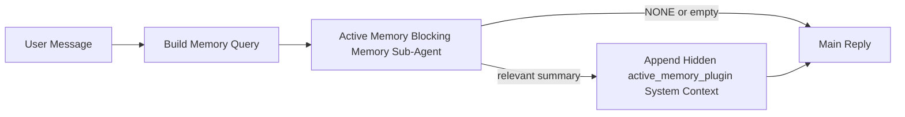

---
read_when:
    - Chcesz zrozumieć, do czego służy aktywna pamięć
    - Chcesz włączyć aktywną pamięć dla agenta konwersacyjnego
    - Chcesz dostroić działanie aktywnej pamięci bez włączania jej wszędzie
summary: Podagent pamięci blokującej należący do pluginu, który wstrzykuje odpowiednią pamięć do interaktywnych sesji czatu
title: Aktywna pamięć
x-i18n:
    generated_at: "2026-04-10T09:44:39Z"
    model: gpt-5.4
    provider: openai
    source_hash: 6a51437df4ae4d9d57764601dfcfcdadb269e2895bf49dc82b9f496c1b3cb341
    source_path: concepts/active-memory.md
    workflow: 15
---

# Aktywna pamięć

Aktywna pamięć to opcjonalny, należący do pluginu blokujący podagent pamięci, który uruchamia się
przed główną odpowiedzią dla kwalifikujących się sesji konwersacyjnych.

Istnieje, ponieważ większość systemów pamięci jest skuteczna, ale reaktywna. Polegają one na
tym, że główny agent zdecyduje, kiedy przeszukać pamięć, albo na tym, że użytkownik powie coś
w rodzaju „zapamiętaj to” lub „przeszukaj pamięć”. W tym momencie chwila, w której pamięć
sprawiłaby, że odpowiedź byłaby naturalna, już minęła.

Aktywna pamięć daje systemowi jedną ograniczoną szansę na wydobycie istotnej pamięci
przed wygenerowaniem głównej odpowiedzi.

## Wklej to do swojego agenta

Wklej to do swojego agenta, jeśli chcesz włączyć Aktywną pamięć z
samowystarczalną konfiguracją z bezpiecznymi ustawieniami domyślnymi:

```json5
{
  plugins: {
    entries: {
      "active-memory": {
        enabled: true,
        config: {
          enabled: true,
          agents: ["main"],
          allowedChatTypes: ["direct"],
          modelFallbackPolicy: "default-remote",
          queryMode: "recent",
          promptStyle: "balanced",
          timeoutMs: 15000,
          maxSummaryChars: 220,
          persistTranscripts: false,
          logging: true,
        },
      },
    },
  },
}
```

To włącza plugin dla agenta `main`, domyślnie ogranicza go do sesji
w stylu wiadomości bezpośrednich, pozwala mu najpierw dziedziczyć bieżący model sesji, a
także nadal dopuszcza wbudowany zdalny mechanizm awaryjny, jeśli nie jest dostępny
żaden jawny ani odziedziczony model.

Następnie uruchom ponownie gateway:

```bash
node scripts/run-node.mjs gateway --profile dev
```

Aby obserwować to na żywo w rozmowie:

```text
/verbose on
```

## Włącz aktywną pamięć

Najbezpieczniejsza konfiguracja to:

1. włączenie pluginu
2. wskazanie jednego agenta konwersacyjnego
3. pozostawienie logowania włączonego tylko podczas dostrajania

Zacznij od tego w `openclaw.json`:

```json5
{
  plugins: {
    entries: {
      "active-memory": {
        enabled: true,
        config: {
          agents: ["main"],
          allowedChatTypes: ["direct"],
          modelFallbackPolicy: "default-remote",
          queryMode: "recent",
          promptStyle: "balanced",
          timeoutMs: 15000,
          maxSummaryChars: 220,
          persistTranscripts: false,
          logging: true,
        },
      },
    },
  },
}
```

Następnie uruchom ponownie gateway:

```bash
node scripts/run-node.mjs gateway --profile dev
```

Co to oznacza:

- `plugins.entries.active-memory.enabled: true` włącza plugin
- `config.agents: ["main"]` włącza aktywną pamięć tylko dla agenta `main`
- `config.allowedChatTypes: ["direct"]` domyślnie utrzymuje aktywną pamięć tylko dla sesji w stylu wiadomości bezpośrednich
- jeśli `config.model` nie jest ustawione, aktywna pamięć najpierw dziedziczy bieżący model sesji
- `config.modelFallbackPolicy: "default-remote"` pozostawia wbudowany zdalny mechanizm awaryjny jako domyślny, gdy nie jest dostępny żaden jawny ani odziedziczony model
- `config.promptStyle: "balanced"` używa domyślnego, ogólnego stylu promptu dla trybu `recent`
- aktywna pamięć nadal działa tylko w kwalifikujących się interaktywnych trwałych sesjach czatu

## Jak to zobaczyć

Aktywna pamięć wstrzykuje ukryty kontekst systemowy dla modelu. Nie ujawnia
surowych tagów `<active_memory_plugin>...</active_memory_plugin>` klientowi.

## Przełącznik sesji

Użyj polecenia pluginu, jeśli chcesz wstrzymać lub wznowić aktywną pamięć dla
bieżącej sesji czatu bez edytowania konfiguracji:

```text
/active-memory status
/active-memory off
/active-memory on
```

To ustawienie dotyczy zakresu sesji. Nie zmienia
`plugins.entries.active-memory.enabled`, wyboru agenta ani innej globalnej
konfiguracji.

Jeśli chcesz, aby polecenie zapisało konfigurację oraz wstrzymało lub wznowiło aktywną pamięć
dla wszystkich sesji, użyj jawnej formy globalnej:

```text
/active-memory status --global
/active-memory off --global
/active-memory on --global
```

Forma globalna zapisuje `plugins.entries.active-memory.config.enabled`. Pozostawia
`plugins.entries.active-memory.enabled` włączone, aby polecenie nadal było dostępne i można było
ponownie włączyć aktywną pamięć później.

Jeśli chcesz zobaczyć, co aktywna pamięć robi w sesji na żywo, włącz tryb
szczegółowy dla tej sesji:

```text
/verbose on
```

Gdy tryb szczegółowy jest włączony, OpenClaw może pokazać:

- wiersz stanu aktywnej pamięci, taki jak `Active Memory: ok 842ms recent 34 chars`
- czytelne podsumowanie debugowania, takie jak `Active Memory Debug: Lemon pepper wings with blue cheese.`

Te wiersze pochodzą z tego samego przebiegu aktywnej pamięci, który zasila ukryty
kontekst systemowy, ale są sformatowane dla ludzi zamiast ujawniać surowe
znaczniki promptu.

Domyślnie transkrypt blokującego podagenta pamięci jest tymczasowy i usuwany
po zakończeniu działania.

Przykładowy przebieg:

```text
/verbose on
what wings should i order?
```

Oczekiwany widoczny kształt odpowiedzi:

```text
...normal assistant reply...

🧩 Active Memory: ok 842ms recent 34 chars
🔎 Active Memory Debug: Lemon pepper wings with blue cheese.
```

## Kiedy się uruchamia

Aktywna pamięć używa dwóch bramek:

1. **Włączenie w konfiguracji**
   Plugin musi być włączony, a identyfikator bieżącego agenta musi występować w
   `plugins.entries.active-memory.config.agents`.
2. **Ścisła kwalifikacja w czasie działania**
   Nawet gdy jest włączona i skierowana do danego agenta, aktywna pamięć działa tylko dla
   kwalifikujących się interaktywnych trwałych sesji czatu.

Rzeczywista reguła jest następująca:

```text
plugin enabled
+
agent id targeted
+
allowed chat type
+
eligible interactive persistent chat session
=
active memory runs
```

Jeśli którykolwiek z tych warunków nie jest spełniony, aktywna pamięć się nie uruchamia.

## Typy sesji

`config.allowedChatTypes` kontroluje, w jakich rodzajach rozmów Aktywna
Pamięć może się w ogóle uruchamiać.

Wartość domyślna to:

```json5
allowedChatTypes: ["direct"]
```

Oznacza to, że Aktywna pamięć domyślnie działa w sesjach w stylu wiadomości bezpośrednich, ale
nie w sesjach grupowych ani kanałowych, chyba że jawnie je włączysz.

Przykłady:

```json5
allowedChatTypes: ["direct"]
```

```json5
allowedChatTypes: ["direct", "group"]
```

```json5
allowedChatTypes: ["direct", "group", "channel"]
```

## Gdzie działa

Aktywna pamięć to funkcja wzbogacająca rozmowę, a nie ogólnoplatformowa
funkcja inferencji.

| Surface                                                             | Runs active memory?                                     |
| ------------------------------------------------------------------- | ------------------------------------------------------- |
| Control UI / web chat persistent sessions                           | Yes, if the plugin is enabled and the agent is targeted |
| Other interactive channel sessions on the same persistent chat path | Yes, if the plugin is enabled and the agent is targeted |
| Headless one-shot runs                                              | No                                                      |
| Heartbeat/background runs                                           | No                                                      |
| Generic internal `agent-command` paths                              | No                                                      |
| Sub-agent/internal helper execution                                 | No                                                      |

## Dlaczego warto tego używać

Używaj aktywnej pamięci, gdy:

- sesja jest trwała i skierowana do użytkownika
- agent ma istotną pamięć długoterminową do przeszukania
- ciągłość i personalizacja są ważniejsze niż pełna deterministyczność promptu

Sprawdza się szczególnie dobrze w przypadku:

- stałych preferencji
- powtarzających się nawyków
- długoterminowego kontekstu użytkownika, który powinien naturalnie się pojawiać

Nie jest dobrym wyborem dla:

- automatyzacji
- wewnętrznych workerów
- jednorazowych zadań API
- miejsc, w których ukryta personalizacja byłaby zaskakująca

## Jak to działa

Kształt działania w czasie wykonywania jest następujący:



Blokujący podagent pamięci może używać tylko:

- `memory_search`
- `memory_get`

Jeśli połączenie jest słabe, powinien zwrócić `NONE`.

## Tryby zapytań

`config.queryMode` kontroluje, jak dużą część rozmowy widzi blokujący podagent pamięci.

## Style promptu

`config.promptStyle` kontroluje, jak chętnie lub rygorystycznie blokujący podagent pamięci
decyduje o tym, czy zwrócić pamięć.

Dostępne style:

- `balanced`: domyślne ustawienie ogólnego przeznaczenia dla trybu `recent`
- `strict`: najmniej skłonny; najlepszy, gdy chcesz bardzo małego przenikania z pobliskiego kontekstu
- `contextual`: najbardziej przyjazny dla ciągłości; najlepszy, gdy historia rozmowy powinna mieć większe znaczenie
- `recall-heavy`: bardziej skłonny do wydobywania pamięci przy słabszych, ale nadal wiarygodnych dopasowaniach
- `precision-heavy`: zdecydowanie preferuje `NONE`, chyba że dopasowanie jest oczywiste
- `preference-only`: zoptymalizowany pod ulubione rzeczy, nawyki, rutyny, gust i powtarzające się fakty osobiste

Domyślne mapowanie, gdy `config.promptStyle` nie jest ustawione:

```text
message -> strict
recent -> balanced
full -> contextual
```

Jeśli jawnie ustawisz `config.promptStyle`, to nadpisanie ma pierwszeństwo.

Przykład:

```json5
promptStyle: "preference-only"
```

## Zasady mechanizmu awaryjnego modelu

Jeśli `config.model` nie jest ustawione, Aktywna pamięć próbuje rozwiązać model w tej kolejności:

```text
explicit plugin model
-> current session model
-> agent primary model
-> optional built-in remote fallback
```

`config.modelFallbackPolicy` kontroluje ostatni krok.

Wartość domyślna:

```json5
modelFallbackPolicy: "default-remote"
```

Inna opcja:

```json5
modelFallbackPolicy: "resolved-only"
```

Użyj `resolved-only`, jeśli chcesz, aby Aktywna pamięć pomijała przywoływanie zamiast
korzystać z wbudowanego zdalnego domyślnego mechanizmu awaryjnego, gdy nie jest dostępny
żaden jawny ani odziedziczony model.

## Zaawansowane mechanizmy awaryjne

Te opcje celowo nie są częścią zalecanej konfiguracji.

`config.thinking` może nadpisać poziom myślenia blokującego podagenta pamięci:

```json5
thinking: "medium"
```

Wartość domyślna:

```json5
thinking: "off"
```

Nie włączaj tego domyślnie. Aktywna pamięć działa na ścieżce odpowiedzi, więc dodatkowy
czas myślenia bezpośrednio zwiększa opóźnienie widoczne dla użytkownika.

`config.promptAppend` dodaje dodatkowe instrukcje operatora po domyślnym
prompcie Aktywnej pamięci i przed kontekstem rozmowy:

```json5
promptAppend: "Prefer stable long-term preferences over one-off events."
```

`config.promptOverride` zastępuje domyślny prompt Aktywnej pamięci. OpenClaw
nadal dołącza później kontekst rozmowy:

```json5
promptOverride: "You are a memory search agent. Return NONE or one compact user fact."
```

Dostosowywanie promptu nie jest zalecane, chyba że celowo testujesz inny
kontrakt przywoływania. Domyślny prompt jest dostrojony tak, aby zwracać `NONE`
albo zwięzły kontekst faktów o użytkowniku dla głównego modelu.

### `message`

Wysyłana jest tylko najnowsza wiadomość użytkownika.

```text
Latest user message only
```

Użyj tego, gdy:

- chcesz najszybszego działania
- chcesz najsilniejszego nastawienia na przywoływanie stabilnych preferencji
- kolejne tury nie wymagają kontekstu rozmowy

Zalecany limit czasu:

- zacznij od około `3000` do `5000` ms

### `recent`

Wysyłana jest najnowsza wiadomość użytkownika wraz z niewielkim ogonem ostatniej rozmowy.

```text
Recent conversation tail:
user: ...
assistant: ...
user: ...

Latest user message:
...
```

Użyj tego, gdy:

- chcesz lepszej równowagi między szybkością a osadzeniem w rozmowie
- pytania uzupełniające często zależą od kilku ostatnich tur

Zalecany limit czasu:

- zacznij od około `15000` ms

### `full`

Do blokującego podagenta pamięci wysyłana jest cała rozmowa.

```text
Full conversation context:
user: ...
assistant: ...
user: ...
...
```

Użyj tego, gdy:

- najwyższa jakość przywoływania jest ważniejsza niż opóźnienie
- rozmowa zawiera istotne przygotowanie daleko wcześniej w wątku

Zalecany limit czasu:

- zwiększ go znacząco w porównaniu z `message` lub `recent`
- zacznij od około `15000` ms lub więcej, w zależności od rozmiaru wątku

Ogólnie limit czasu powinien rosnąć wraz z rozmiarem kontekstu:

```text
message < recent < full
```

## Trwałość transkryptów

Uruchomienia blokującego podagenta pamięci aktywnej pamięci tworzą rzeczywisty
transkrypt `session.jsonl` podczas wywołania blokującego podagenta pamięci.

Domyślnie ten transkrypt jest tymczasowy:

- jest zapisywany w katalogu tymczasowym
- jest używany tylko na potrzeby uruchomienia blokującego podagenta pamięci
- jest usuwany natychmiast po zakończeniu działania

Jeśli chcesz zachować te transkrypty blokującego podagenta pamięci na dysku do debugowania lub
inspekcji, jawnie włącz ich trwałość:

```json5
{
  plugins: {
    entries: {
      "active-memory": {
        enabled: true,
        config: {
          agents: ["main"],
          persistTranscripts: true,
          transcriptDir: "active-memory",
        },
      },
    },
  },
}
```

Po włączeniu aktywna pamięć zapisuje transkrypty w osobnym katalogu w folderze
sesji docelowego agenta, a nie w głównej ścieżce transkryptu rozmowy użytkownika.

Domyślny układ wygląda koncepcyjnie tak:

```text
agents/<agent>/sessions/active-memory/<blocking-memory-sub-agent-session-id>.jsonl
```

Możesz zmienić względny podkatalog za pomocą `config.transcriptDir`.

Używaj tego ostrożnie:

- transkrypty blokującego podagenta pamięci mogą szybko się gromadzić w aktywnych sesjach
- tryb zapytań `full` może duplikować dużą część kontekstu rozmowy
- te transkrypty zawierają ukryty kontekst promptu i przywołane wspomnienia

## Konfiguracja

Cała konfiguracja aktywnej pamięci znajduje się pod:

```text
plugins.entries.active-memory
```

Najważniejsze pola to:

| Klucz                       | Typ                                                                                                  | Znaczenie                                                                                              |
| --------------------------- | ---------------------------------------------------------------------------------------------------- | ------------------------------------------------------------------------------------------------------ |
| `enabled`                   | `boolean`                                                                                            | Włącza sam plugin                                                                                      |
| `config.agents`             | `string[]`                                                                                           | Identyfikatory agentów, które mogą używać aktywnej pamięci                                             |
| `config.model`              | `string`                                                                                             | Opcjonalne odwołanie do modelu blokującego podagenta pamięci; gdy nie jest ustawione, aktywna pamięć używa bieżącego modelu sesji |
| `config.queryMode`          | `"message" \| "recent" \| "full"`                                                                    | Określa, jak dużą część rozmowy widzi blokujący podagent pamięci                                       |
| `config.promptStyle`        | `"balanced" \| "strict" \| "contextual" \| "recall-heavy" \| "precision-heavy" \| "preference-only"` | Określa, jak chętnie lub rygorystycznie blokujący podagent pamięci decyduje, czy zwrócić pamięć       |
| `config.thinking`           | `"off" \| "minimal" \| "low" \| "medium" \| "high" \| "xhigh" \| "adaptive"`                         | Zaawansowane nadpisanie poziomu myślenia dla blokującego podagenta pamięci; domyślnie `off` dla szybkości |
| `config.promptOverride`     | `string`                                                                                             | Zaawansowana pełna zamiana promptu; niezalecana do zwykłego użycia                                     |
| `config.promptAppend`       | `string`                                                                                             | Zaawansowane dodatkowe instrukcje dołączane do domyślnego lub nadpisanego promptu                     |
| `config.timeoutMs`          | `number`                                                                                             | Twardy limit czasu dla blokującego podagenta pamięci                                                   |
| `config.maxSummaryChars`    | `number`                                                                                             | Maksymalna łączna liczba znaków dozwolona w podsumowaniu active-memory                                 |
| `config.logging`            | `boolean`                                                                                            | Emituje logi aktywnej pamięci podczas dostrajania                                                      |
| `config.persistTranscripts` | `boolean`                                                                                            | Zachowuje transkrypty blokującego podagenta pamięci na dysku zamiast usuwać pliki tymczasowe          |
| `config.transcriptDir`      | `string`                                                                                             | Względny katalog transkryptów blokującego podagenta pamięci w folderze sesji agenta                   |

Przydatne pola do dostrajania:

| Klucz                         | Typ      | Znaczenie                                                        |
| ----------------------------- | -------- | ---------------------------------------------------------------- |
| `config.maxSummaryChars`      | `number` | Maksymalna łączna liczba znaków dozwolona w podsumowaniu active-memory |
| `config.recentUserTurns`      | `number` | Poprzednie tury użytkownika do uwzględnienia, gdy `queryMode` ma wartość `recent` |
| `config.recentAssistantTurns` | `number` | Poprzednie tury asystenta do uwzględnienia, gdy `queryMode` ma wartość `recent` |
| `config.recentUserChars`      | `number` | Maksymalna liczba znaków na ostatnią turę użytkownika            |
| `config.recentAssistantChars` | `number` | Maksymalna liczba znaków na ostatnią turę asystenta              |
| `config.cacheTtlMs`           | `number` | Ponowne użycie pamięci podręcznej dla powtarzających się identycznych zapytań |

## Zalecana konfiguracja

Zacznij od `recent`.

```json5
{
  plugins: {
    entries: {
      "active-memory": {
        enabled: true,
        config: {
          agents: ["main"],
          queryMode: "recent",
          promptStyle: "balanced",
          timeoutMs: 15000,
          maxSummaryChars: 220,
          logging: true,
        },
      },
    },
  },
}
```

Jeśli chcesz sprawdzić działanie na żywo podczas dostrajania, użyj `/verbose on` w
sesji zamiast szukać osobnego polecenia debugowania active-memory.

Następnie przejdź do:

- `message`, jeśli chcesz mniejszych opóźnień
- `full`, jeśli uznasz, że dodatkowy kontekst jest wart wolniejszego blokującego podagenta pamięci

## Debugowanie

Jeśli aktywna pamięć nie pojawia się tam, gdzie się spodziewasz:

1. Potwierdź, że plugin jest włączony w `plugins.entries.active-memory.enabled`.
2. Potwierdź, że identyfikator bieżącego agenta znajduje się w `config.agents`.
3. Potwierdź, że testujesz przez interaktywną trwałą sesję czatu.
4. Włącz `config.logging: true` i obserwuj logi gateway.
5. Sprawdź, czy samo wyszukiwanie pamięci działa, używając `openclaw memory status --deep`.

Jeśli trafienia pamięci są zbyt zaszumione, zaostrz:

- `maxSummaryChars`

Jeśli aktywna pamięć jest zbyt wolna:

- obniż `queryMode`
- obniż `timeoutMs`
- zmniejsz liczbę ostatnich tur
- zmniejsz limity znaków na turę

## Powiązane strony

- [Wyszukiwanie w pamięci](/pl/concepts/memory-search)
- [Dokumentacja konfiguracji pamięci](/pl/reference/memory-config)
- [Konfiguracja Plugin SDK](/pl/plugins/sdk-setup)
