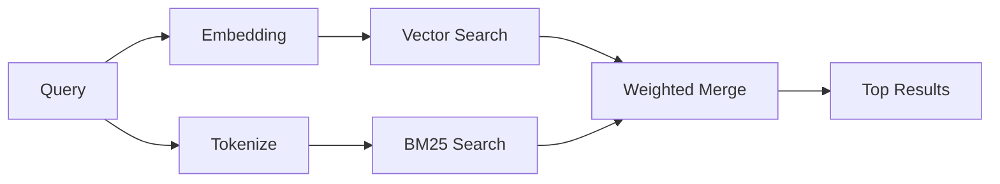

---
read_when:
    - Chcesz zrozumieć, jak działa `memory_search`
    - Chcesz wybrać dostawcę embeddingów
    - Chcesz dostroić jakość wyszukiwania
summary: Jak wyszukiwanie pamięci znajduje odpowiednie notatki za pomocą embeddingów i wyszukiwania hybrydowego
title: Wyszukiwanie pamięci
x-i18n:
    generated_at: "2026-04-12T23:28:04Z"
    model: gpt-5.4
    provider: openai
    source_hash: 71fde251b7d2dc455574aa458e7e09136f30613609ad8dafeafd53b2729a0310
    source_path: concepts/memory-search.md
    workflow: 15
---

# Wyszukiwanie pamięci

`memory_search` znajduje odpowiednie notatki z Twoich plików pamięci, nawet gdy sformułowania różnią się od oryginalnego tekstu. Działa przez indeksowanie pamięci w małych fragmentach i przeszukiwanie ich za pomocą embeddingów, słów kluczowych albo obu tych metod.

## Szybki start

Jeśli masz skonfigurowany klucz API OpenAI, Gemini, Voyage lub Mistral, wyszukiwanie pamięci działa automatycznie. Aby jawnie ustawić dostawcę:

```json5
{
  agents: {
    defaults: {
      memorySearch: {
        provider: "openai", // lub "gemini", "local", "ollama" itp.
      },
    },
  },
}
```

W przypadku lokalnych embeddingów bez klucza API użyj `provider: "local"` (wymaga `node-llama-cpp`).

## Obsługiwani dostawcy

| Dostawca | ID        | Wymaga klucza API | Uwagi                                                |
| -------- | --------- | ----------------- | ---------------------------------------------------- |
| OpenAI   | `openai`  | Tak               | Wykrywany automatycznie, szybki                      |
| Gemini   | `gemini`  | Tak               | Obsługuje indeksowanie obrazów i dźwięku             |
| Voyage   | `voyage`  | Tak               | Wykrywany automatycznie                              |
| Mistral  | `mistral` | Tak               | Wykrywany automatycznie                              |
| Bedrock  | `bedrock` | Nie               | Wykrywany automatycznie, gdy łańcuch poświadczeń AWS zostanie rozwiązany |
| Ollama   | `ollama`  | Nie               | Lokalny, trzeba ustawić jawnie                       |
| Local    | `local`   | Nie               | Model GGUF, pobieranie ~0,6 GB                       |

## Jak działa wyszukiwanie

OpenClaw uruchamia równolegle dwie ścieżki wyszukiwania i scala wyniki:



- **Wyszukiwanie wektorowe** znajduje notatki o podobnym znaczeniu („gateway host” pasuje do „maszyna, na której działa OpenClaw”).
- **Wyszukiwanie słów kluczowych BM25** znajduje dokładne dopasowania (ID, ciągi błędów, klucze konfiguracji).

Jeśli dostępna jest tylko jedna ścieżka (brak embeddingów albo brak FTS), działa tylko ta jedna.

Gdy embeddingi są niedostępne, OpenClaw nadal używa rankingu leksykalnego na wynikach FTS zamiast sprowadzać się wyłącznie do surowego porządku dokładnych dopasowań. Ten tryb obniżonej jakości wzmacnia fragmenty z lepszym pokryciem terminów zapytania i odpowiednimi ścieżkami plików, co pomaga zachować użyteczny recall nawet bez `sqlite-vec` lub dostawcy embeddingów.

## Poprawa jakości wyszukiwania

Dwie opcjonalne funkcje pomagają, gdy masz dużą historię notatek:

### Zanikanie czasowe

Stare notatki stopniowo tracą wagę rankingową, dzięki czemu nowsze informacje pojawiają się wyżej. Przy domyślnym okresie połowicznego zaniku wynoszącym 30 dni notatka z zeszłego miesiąca zachowuje 50% swojej pierwotnej wagi. Pliki trwałe, takie jak `MEMORY.md`, nigdy nie podlegają zanikowi.

<Tip>
Włącz zanikanie czasowe, jeśli Twój agent ma miesiące codziennych notatek, a nieaktualne informacje stale wyprzedzają nowszy kontekst.
</Tip>

### MMR (różnorodność)

Ogranicza redundantne wyniki. Jeśli pięć notatek wspomina tę samą konfigurację routera, MMR sprawia, że najwyższe wyniki obejmują różne tematy zamiast się powtarzać.

<Tip>
Włącz MMR, jeśli `memory_search` stale zwraca niemal identyczne fragmenty z różnych codziennych notatek.
</Tip>

### Włącz oba

```json5
{
  agents: {
    defaults: {
      memorySearch: {
        query: {
          hybrid: {
            mmr: { enabled: true },
            temporalDecay: { enabled: true },
          },
        },
      },
    },
  },
}
```

## Pamięć multimodalna

Dzięki Gemini Embedding 2 możesz indeksować obrazy i pliki audio obok Markdownu. Zapytania wyszukiwania nadal pozostają tekstowe, ale dopasowują się do treści wizualnych i dźwiękowych. Informacje o konfiguracji znajdziesz w [referencji konfiguracji pamięci](/pl/reference/memory-config).

## Wyszukiwanie pamięci sesji

Możesz opcjonalnie indeksować transkrypcje sesji, aby `memory_search` mogło przywoływać wcześniejsze rozmowy. Jest to funkcja opt-in przez `memorySearch.experimental.sessionMemory`. Szczegóły znajdziesz w [referencji konfiguracji](/pl/reference/memory-config).

## Rozwiązywanie problemów

**Brak wyników?** Uruchom `openclaw memory status`, aby sprawdzić indeks. Jeśli jest pusty, uruchom `openclaw memory index --force`.

**Tylko dopasowania słów kluczowych?** Twój dostawca embeddingów może nie być skonfigurowany. Sprawdź `openclaw memory status --deep`.

**Nie znajduje tekstu CJK?** Przebuduj indeks FTS za pomocą `openclaw memory index --force`.

## Dalsza lektura

- [Active Memory](/pl/concepts/active-memory) -- pamięć podagenta dla interaktywnych sesji czatu
- [Pamięć](/pl/concepts/memory) -- układ plików, backendy, narzędzia
- [Referencja konfiguracji pamięci](/pl/reference/memory-config) -- wszystkie opcje konfiguracji
