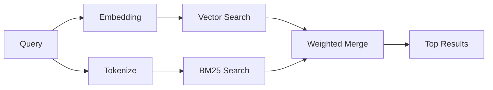

---
read_when:
    - Chcesz zrozumieć, jak działa memory_search
    - Chcesz wybrać dostawcę embeddingów
    - Chcesz dostroić jakość wyszukiwania
summary: Jak wyszukiwanie w pamięci znajduje odpowiednie notatki za pomocą embeddingów i wyszukiwania hybrydowego
title: Wyszukiwanie w pamięci
x-i18n:
    generated_at: "2026-04-10T09:44:32Z"
    model: gpt-5.4
    provider: openai
    source_hash: ca0237f4f1ee69dcbfb12e6e9527a53e368c0bf9b429e506831d4af2f3a3ac6f
    source_path: concepts/memory-search.md
    workflow: 15
---

# Wyszukiwanie w pamięci

`memory_search` znajduje odpowiednie notatki z Twoich plików pamięci, nawet gdy
sformułowania różnią się od oryginalnego tekstu. Działa poprzez indeksowanie pamięci na małe
fragmenty i przeszukiwanie ich za pomocą embeddingów, słów kluczowych albo obu tych metod.

## Szybki start

Jeśli masz skonfigurowany klucz API OpenAI, Gemini, Voyage lub Mistral, wyszukiwanie w pamięci
działa automatycznie. Aby jawnie ustawić dostawcę:

```json5
{
  agents: {
    defaults: {
      memorySearch: {
        provider: "openai", // or "gemini", "local", "ollama", etc.
      },
    },
  },
}
```

W przypadku lokalnych embeddingów bez klucza API użyj `provider: "local"` (wymaga
`node-llama-cpp`).

## Obsługiwani dostawcy

| Dostawca | ID        | Wymaga klucza API | Uwagi                                                |
| -------- | --------- | ----------------- | ---------------------------------------------------- |
| OpenAI   | `openai`  | Tak               | Wykrywany automatycznie, szybki                      |
| Gemini   | `gemini`  | Tak               | Obsługuje indeksowanie obrazów/dźwięku               |
| Voyage   | `voyage`  | Tak               | Wykrywany automatycznie                              |
| Mistral  | `mistral` | Tak               | Wykrywany automatycznie                              |
| Bedrock  | `bedrock` | Nie               | Wykrywany automatycznie, gdy łańcuch poświadczeń AWS zostanie rozwiązany |
| Ollama   | `ollama`  | Nie               | Lokalny, trzeba ustawić jawnie                       |
| Local    | `local`   | Nie               | Model GGUF, pobieranie ~0.6 GB                       |

## Jak działa wyszukiwanie

OpenClaw uruchamia równolegle dwie ścieżki pobierania wyników i scala ich rezultaty:



- **Wyszukiwanie wektorowe** znajduje notatki o podobnym znaczeniu („gateway host” pasuje do
  „maszyna, na której działa OpenClaw”).
- **Wyszukiwanie słów kluczowych BM25** znajduje dokładne dopasowania (ID, ciągi błędów, klucze
  konfiguracji).

Jeśli dostępna jest tylko jedna ścieżka (brak embeddingów albo brak FTS), działa samodzielnie tylko druga.

## Poprawa jakości wyszukiwania

Dwie opcjonalne funkcje pomagają, gdy masz dużą historię notatek:

### Zanikanie czasowe

Starsze notatki stopniowo tracą wagę w rankingu, dzięki czemu najpierw pojawiają się nowsze informacje.
Przy domyślnym okresie półtrwania wynoszącym 30 dni notatka z zeszłego miesiąca ma wynik równy 50% swojej
pierwotnej wagi. Pliki stałe, takie jak `MEMORY.md`, nigdy nie podlegają zanikaniu.

<Tip>
Włącz zanikanie czasowe, jeśli Twój agent ma wiele miesięcy codziennych notatek, a nieaktualne
informacje stale wyprzedzają nowszy kontekst.
</Tip>

### MMR (różnorodność)

Ogranicza powtarzające się wyniki. Jeśli pięć notatek wspomina tę samą konfigurację routera, MMR
sprawia, że najwyższe wyniki obejmują różne tematy, zamiast się powtarzać.

<Tip>
Włącz MMR, jeśli `memory_search` stale zwraca niemal identyczne fragmenty z
różnych codziennych notatek.
</Tip>

### Włącz oba

```json5
{
  agents: {
    defaults: {
      memorySearch: {
        query: {
          hybrid: {
            mmr: { enabled: true },
            temporalDecay: { enabled: true },
          },
        },
      },
    },
  },
}
```

## Pamięć multimodalna

Z Gemini Embedding 2 możesz indeksować obrazy i pliki audio obok plików
Markdown. Zapytania wyszukiwania nadal pozostają tekstowe, ale dopasowują się do treści wizualnych i audio.
Informacje o konfiguracji znajdziesz w [dokumencie referencyjnym konfiguracji pamięci](/pl/reference/memory-config).

## Wyszukiwanie w pamięci sesji

Możesz opcjonalnie indeksować transkrypcje sesji, aby `memory_search` mógł przywoływać
wcześniejsze rozmowy. Jest to funkcja opt-in dostępna przez
`memorySearch.experimental.sessionMemory`. Szczegóły znajdziesz w
[dokumencie referencyjnym konfiguracji](/pl/reference/memory-config).

## Rozwiązywanie problemów

**Brak wyników?** Uruchom `openclaw memory status`, aby sprawdzić indeks. Jeśli jest pusty, uruchom
`openclaw memory index --force`.

**Tylko dopasowania słów kluczowych?** Twój dostawca embeddingów może nie być skonfigurowany. Sprawdź
`openclaw memory status --deep`.

**Nie znajduje tekstu CJK?** Odbuduj indeks FTS za pomocą
`openclaw memory index --force`.

## Dalsza lektura

- [Aktywna pamięć](/pl/concepts/active-memory) -- pamięć sub-agentów dla interaktywnych sesji czatu
- [Pamięć](/pl/concepts/memory) -- układ plików, backendy, narzędzia
- [Dokument referencyjny konfiguracji pamięci](/pl/reference/memory-config) -- wszystkie opcje konfiguracji
