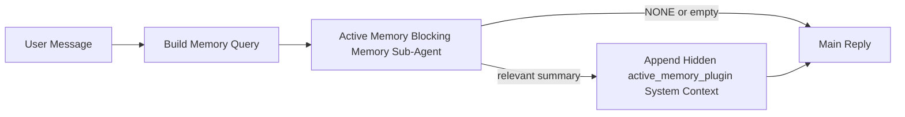

---
read_when:
    - Ви хочете зрозуміти, для чого потрібна Active Memory
    - Ви хочете увімкнути Active Memory для розмовного агента
    - Ви хочете налаштувати поведінку Active Memory, не вмикаючи її всюди
summary: Підагент блокувальної пам’яті, яким володіє Plugin і який впроваджує релевантну пам’ять в інтерактивні сеанси чату
title: Active Memory
x-i18n:
    generated_at: "2026-04-12T19:29:14Z"
    model: gpt-5.4
    provider: openai
    source_hash: 11665dbc888b6d4dc667a47624cc1f2e4cc71e1d58e1f7d9b5fe4057ec4da108
    source_path: concepts/active-memory.md
    workflow: 15
---

# Active Memory

Active Memory — це необов’язковий блокувальний підагент пам’яті, яким володіє Plugin і який запускається
перед основною відповіддю для відповідних розмовних сеансів.

Він існує тому, що більшість систем пам’яті є потужними, але реактивними. Вони покладаються на
те, що головний агент вирішить, коли шукати в пам’яті, або на те, що користувач скаже щось
на кшталт «запам’ятай це» чи «пошукай у пам’яті». На той момент мить, коли пам’ять могла б
зробити відповідь природнішою, уже минула.

Active Memory дає системі одну обмежену можливість підняти релевантну пам’ять
до того, як буде згенеровано основну відповідь.

## Вставте це у свого агента

Вставте це у свого агента, якщо хочете ввімкнути Active Memory із
самодостатнім налаштуванням із безпечними значеннями за замовчуванням:

```json5
{
  plugins: {
    entries: {
      "active-memory": {
        enabled: true,
        config: {
          enabled: true,
          agents: ["main"],
          allowedChatTypes: ["direct"],
          modelFallback: "google/gemini-3-flash",
          queryMode: "recent",
          promptStyle: "balanced",
          timeoutMs: 15000,
          maxSummaryChars: 220,
          persistTranscripts: false,
          logging: true,
        },
      },
    },
  },
}
```

Це вмикає Plugin для агента `main`, за замовчуванням обмежує його сеансами
у стилі прямих повідомлень, дозволяє йому спочатку успадковувати модель поточного сеансу та
використовує налаштовану резервну модель лише тоді, коли немає доступної
ані явно заданої, ані успадкованої моделі.

Після цього перезапустіть Gateway:

```bash
openclaw gateway
```

Щоб спостерігати за ним наживо в розмові:

```text
/verbose on
/trace on
```

## Увімкніть active memory

Найбезпечніше налаштування таке:

1. увімкнути Plugin
2. націлити його на одного розмовного агента
3. залишати журналювання ввімкненим лише під час налаштування

Почніть із цього в `openclaw.json`:

```json5
{
  plugins: {
    entries: {
      "active-memory": {
        enabled: true,
        config: {
          agents: ["main"],
          allowedChatTypes: ["direct"],
          modelFallback: "google/gemini-3-flash",
          queryMode: "recent",
          promptStyle: "balanced",
          timeoutMs: 15000,
          maxSummaryChars: 220,
          persistTranscripts: false,
          logging: true,
        },
      },
    },
  },
}
```

Потім перезапустіть Gateway:

```bash
openclaw gateway
```

Що це означає:

- `plugins.entries.active-memory.enabled: true` вмикає Plugin
- `config.agents: ["main"]` підключає до active memory лише агента `main`
- `config.allowedChatTypes: ["direct"]` за замовчуванням залишає active memory увімкненою лише для сеансів у стилі прямих повідомлень
- якщо `config.model` не задано, active memory спочатку успадковує модель поточного сеансу
- `config.modelFallback` за бажанням надає власну резервну модель постачальника/модель для відновлення пам’яті
- `config.promptStyle: "balanced"` використовує типовий універсальний стиль запиту для режиму `recent`
- active memory, як і раніше, запускається лише для відповідних інтерактивних постійних сеансів чату

## Як це побачити

Active Memory впроваджує прихований системний контекст для моделі. Вона не показує
сирі теги `<active_memory_plugin>...</active_memory_plugin>` клієнту.

## Перемикач сеансу

Використовуйте команду Plugin, коли хочете призупинити або відновити active memory для
поточного сеансу чату без редагування конфігурації:

```text
/active-memory status
/active-memory off
/active-memory on
```

Це діє в межах сеансу. Це не змінює
`plugins.entries.active-memory.enabled`, націлювання на агентів чи іншу глобальну
конфігурацію.

Якщо ви хочете, щоб команда записувала конфігурацію та призупиняла або відновлювала active memory
для всіх сеансів, використовуйте явну глобальну форму:

```text
/active-memory status --global
/active-memory off --global
/active-memory on --global
```

Глобальна форма записує `plugins.entries.active-memory.config.enabled`. Вона залишає
`plugins.entries.active-memory.enabled` увімкненим, щоб команда залишалася доступною для
повторного ввімкнення active memory пізніше.

Якщо ви хочете бачити, що робить active memory у живому сеансі, увімкніть
перемикачі сеансу, які відповідають потрібному вам виводу:

```text
/verbose on
/trace on
```

Коли їх увімкнено, OpenClaw може показувати:

- рядок стану active memory, наприклад `Active Memory: ok 842ms recent 34 chars`, коли ввімкнено `/verbose on`
- читабельний підсумок налагодження, наприклад `Active Memory Debug: Lemon pepper wings with blue cheese.`, коли ввімкнено `/trace on`

Ці рядки походять із того самого проходу active memory, який формує прихований
системний контекст, але вони відформатовані для людей, а не для показу сирої
розмітки запиту. Вони надсилаються як додаткове діагностичне повідомлення після звичайної
відповіді асистента, щоб клієнти каналів, як-от Telegram, не показували окрему
діагностичну бульбашку перед відповіддю.

За замовчуванням стенограма блокувального підагента пам’яті є тимчасовою і видаляється
після завершення виконання.

Приклад сценарію:

```text
/verbose on
/trace on
what wings should i order?
```

Очікувана форма видимої відповіді:

```text
...normal assistant reply...

🧩 Active Memory: ok 842ms recent 34 chars
🔎 Active Memory Debug: Lemon pepper wings with blue cheese.
```

## Коли це запускається

Active Memory використовує два шлюзи:

1. **Явне ввімкнення в конфігурації**
   Plugin має бути ввімкнений, а ідентифікатор поточного агента має бути присутній у
   `plugins.entries.active-memory.config.agents`.
2. **Сувора відповідність під час виконання**
   Навіть коли active memory ввімкнено й націлено, вона запускається лише для
   відповідних інтерактивних постійних сеансів чату.

Фактичне правило таке:

```text
plugin enabled
+
agent id targeted
+
allowed chat type
+
eligible interactive persistent chat session
=
active memory runs
```

Якщо будь-яка з цих умов не виконується, active memory не запускається.

## Типи сеансів

`config.allowedChatTypes` визначає, у яких типах розмов узагалі може запускатися Active
Memory.

Значення за замовчуванням:

```json5
allowedChatTypes: ["direct"]
```

Це означає, що Active Memory за замовчуванням запускається в сеансах у стилі прямих повідомлень, але
не в групових сеансах або сеансах каналу, якщо ви не ввімкнете їх явно.

Приклади:

```json5
allowedChatTypes: ["direct"]
```

```json5
allowedChatTypes: ["direct", "group"]
```

```json5
allowedChatTypes: ["direct", "group", "channel"]
```

## Де це запускається

Active memory — це функція покращення розмов, а не загальноплатформна
функція інференсу.

| Surface                                                             | Запускає active memory?                                 |
| ------------------------------------------------------------------- | ------------------------------------------------------- |
| Постійні сеанси чату в Control UI / вебчаті                         | Так, якщо Plugin увімкнений і агент націлений           |
| Інші інтерактивні сеанси каналів на тому самому шляху постійного чату | Так, якщо Plugin увімкнений і агент націлений           |
| Безголові одноразові запуски                                        | Ні                                                      |
| Запуски Heartbeat/фонові запуски                                    | Ні                                                      |
| Загальні внутрішні шляхи `agent-command`                            | Ні                                                      |
| Виконання підагента/внутрішнього помічника                          | Ні                                                      |

## Навіщо це використовувати

Використовуйте active memory, коли:

- сеанс є постійним і орієнтованим на користувача
- агент має змістовну довготривалу пам’ять для пошуку
- безперервність і персоналізація важливіші за чисту детермінованість запиту

Особливо добре це працює для:

- стабільних уподобань
- повторюваних звичок
- довгострокового контексту користувача, який має з’являтися природно

Погано підходить для:

- автоматизації
- внутрішніх воркерів
- одноразових API-завдань
- місць, де прихована персоналізація була б несподіваною

## Як це працює

Форма під час виконання така:



Блокувальний підагент пам’яті може використовувати лише:

- `memory_search`
- `memory_get`

Якщо з’єднання слабке, він має повернути `NONE`.

## Режими запиту

`config.queryMode` визначає, скільки розмови бачить блокувальний підагент пам’яті.

## Стилі запиту

`config.promptStyle` визначає, наскільки охоче чи суворо блокувальний підагент пам’яті
вирішує, чи повертати пам’ять.

Доступні стилі:

- `balanced`: універсальне значення за замовчуванням для режиму `recent`
- `strict`: найменш охочий; найкраще, коли ви хочете якнайменше впливу сусіднього контексту
- `contextual`: найбільш дружній до безперервності; найкраще, коли історія розмови має мати більше значення
- `recall-heavy`: охочіше піднімає пам’ять за м’якших, але все ще правдоподібних збігів
- `precision-heavy`: агресивно віддає перевагу `NONE`, якщо збіг не є очевидним
- `preference-only`: оптимізований для фаворитів, звичок, рутин, смаків і повторюваних особистих фактів

Типове зіставлення, коли `config.promptStyle` не задано:

```text
message -> strict
recent -> balanced
full -> contextual
```

Якщо ви явно задасте `config.promptStyle`, це перевизначення матиме пріоритет.

Приклад:

```json5
promptStyle: "preference-only"
```

## Політика резервної моделі

Якщо `config.model` не задано, Active Memory намагається визначити модель у такому порядку:

```text
explicit plugin model
-> current session model
-> agent primary model
-> optional configured fallback model
```

`config.modelFallback` керує кроком із налаштованою резервною моделлю.

Необов’язкова власна резервна модель:

```json5
modelFallback: "google/gemini-3-flash"
```

Якщо не вдається визначити ані явну, ані успадковану, ані налаштовану резервну модель,
Active Memory пропускає відновлення пам’яті для цього ходу.

`config.modelFallbackPolicy` збережено лише як застаріле поле сумісності
для старіших конфігурацій. Воно більше не змінює поведінку під час виконання.

## Розширені аварійні варіанти

Ці параметри навмисно не входять до рекомендованого налаштування.

`config.thinking` може перевизначити рівень thinking блокувального підагента пам’яті:

```json5
thinking: "medium"
```

За замовчуванням:

```json5
thinking: "off"
```

Не вмикайте це за замовчуванням. Active Memory запускається в шляху відповіді, тому додатковий
час на thinking напряму збільшує затримку, видиму користувачу.

`config.promptAppend` додає додаткові інструкції оператора після типового запиту Active
Memory і перед контекстом розмови:

```json5
promptAppend: "Prefer stable long-term preferences over one-off events."
```

`config.promptOverride` замінює типовий запит Active Memory. OpenClaw
усе одно додає контекст розмови після нього:

```json5
promptOverride: "You are a memory search agent. Return NONE or one compact user fact."
```

Налаштування запиту не рекомендується, якщо ви не тестуєте свідомо
інший контракт відновлення пам’яті. Типовий запит налаштовано так, щоб повертати або `NONE`,
або компактний контекст фактів про користувача для основної моделі.

### `message`

Надсилається лише останнє повідомлення користувача.

```text
Latest user message only
```

Використовуйте це, коли:

- вам потрібна найшвидша поведінка
- вам потрібний найсильніший ухил у бік відновлення стабільних уподобань
- наступні ходи не потребують розмовного контексту

Рекомендований тайм-аут:

- починайте приблизно з `3000` до `5000` мс

### `recent`

Надсилається останнє повідомлення користувача плюс невеликий хвіст недавньої розмови.

```text
Recent conversation tail:
user: ...
assistant: ...
user: ...

Latest user message:
...
```

Використовуйте це, коли:

- вам потрібен кращий баланс між швидкістю та розмовним контекстом
- запитання в наступних ходах часто залежать від кількох останніх ходів

Рекомендований тайм-аут:

- починайте приблизно з `15000` мс

### `full`

До блокувального підагента пам’яті надсилається вся розмова.

```text
Full conversation context:
user: ...
assistant: ...
user: ...
...
```

Використовуйте це, коли:

- найвища якість відновлення пам’яті важливіша за затримку
- розмова містить важливі налаштування далеко вище в гілці

Рекомендований тайм-аут:

- суттєво збільште його порівняно з `message` або `recent`
- починайте приблизно з `15000` мс або вище залежно від розміру гілки

Загалом тайм-аут має збільшуватися разом із розміром контексту:

```text
message < recent < full
```

## Збереження стенограм

Запуски блокувального підагента пам’яті Active Memory створюють реальну
стенограму `session.jsonl` під час виклику блокувального підагента пам’яті.

За замовчуванням ця стенограма є тимчасовою:

- вона записується до тимчасового каталогу
- вона використовується лише для запуску блокувального підагента пам’яті
- вона видаляється одразу після завершення запуску

Якщо ви хочете зберігати ці стенограми блокувального підагента пам’яті на диску для налагодження або
перевірки, явно ввімкніть збереження:

```json5
{
  plugins: {
    entries: {
      "active-memory": {
        enabled: true,
        config: {
          agents: ["main"],
          persistTranscripts: true,
          transcriptDir: "active-memory",
        },
      },
    },
  },
}
```

Коли це ввімкнено, active memory зберігає стенограми в окремому каталозі в межах
папки сеансів цільового агента, а не в основному шляху стенограми розмови
користувача.

Типова структура концептуально виглядає так:

```text
agents/<agent>/sessions/active-memory/<blocking-memory-sub-agent-session-id>.jsonl
```

Ви можете змінити відносний підкаталог за допомогою `config.transcriptDir`.

Використовуйте це обережно:

- стенограми блокувального підагента пам’яті можуть швидко накопичуватися в активних сеансах
- режим запиту `full` може дублювати значну частину контексту розмови
- ці стенограми містять прихований контекст запиту та відновлені спогади

## Конфігурація

Уся конфігурація active memory розміщена в:

```text
plugins.entries.active-memory
```

Найважливіші поля:

| Key                         | Type                                                                                                 | Значення                                                                                               |
| --------------------------- | ---------------------------------------------------------------------------------------------------- | ------------------------------------------------------------------------------------------------------ |
| `enabled`                   | `boolean`                                                                                            | Вмикає сам Plugin                                                                                      |
| `config.agents`             | `string[]`                                                                                           | Ідентифікатори агентів, які можуть використовувати active memory                                       |
| `config.model`              | `string`                                                                                             | Необов’язкове посилання на модель блокувального підагента пам’яті; якщо не задано, active memory використовує модель поточного сеансу |
| `config.queryMode`          | `"message" \| "recent" \| "full"`                                                                    | Визначає, яку частину розмови бачить блокувальний підагент пам’яті                                     |
| `config.promptStyle`        | `"balanced" \| "strict" \| "contextual" \| "recall-heavy" \| "precision-heavy" \| "preference-only"` | Визначає, наскільки охочим чи суворим є блокувальний підагент пам’яті під час вирішення, чи повертати пам’ять |
| `config.thinking`           | `"off" \| "minimal" \| "low" \| "medium" \| "high" \| "xhigh" \| "adaptive"`                         | Розширене перевизначення рівня thinking для блокувального підагента пам’яті; типове значення `off` для швидкості |
| `config.promptOverride`     | `string`                                                                                             | Розширена повна заміна запиту; не рекомендується для звичайного використання                           |
| `config.promptAppend`       | `string`                                                                                             | Розширені додаткові інструкції, що додаються до типового або перевизначеного запиту                    |
| `config.timeoutMs`          | `number`                                                                                             | Жорсткий тайм-аут для блокувального підагента пам’яті                                                  |
| `config.maxSummaryChars`    | `number`                                                                                             | Максимальна загальна кількість символів, дозволена в підсумку active-memory                            |
| `config.logging`            | `boolean`                                                                                            | Виводить журнали active memory під час налаштування                                                    |
| `config.persistTranscripts` | `boolean`                                                                                            | Зберігає стенограми блокувального підагента пам’яті на диску замість видалення тимчасових файлів      |
| `config.transcriptDir`      | `string`                                                                                             | Відносний каталог стенограм блокувального підагента пам’яті в папці сеансів агента                    |

Корисні поля налаштування:

| Key                           | Type     | Значення                                                     |
| ----------------------------- | -------- | ------------------------------------------------------------ |
| `config.maxSummaryChars`      | `number` | Максимальна загальна кількість символів, дозволена в підсумку active-memory |
| `config.recentUserTurns`      | `number` | Попередні ходи користувача, які слід включити, коли `queryMode` має значення `recent` |
| `config.recentAssistantTurns` | `number` | Попередні ходи асистента, які слід включити, коли `queryMode` має значення `recent` |
| `config.recentUserChars`      | `number` | Максимум символів на один недавній хід користувача           |
| `config.recentAssistantChars` | `number` | Максимум символів на один недавній хід асистента             |
| `config.cacheTtlMs`           | `number` | Повторне використання кешу для однакових повторних запитів   |

## Рекомендоване налаштування

Почніть із `recent`.

```json5
{
  plugins: {
    entries: {
      "active-memory": {
        enabled: true,
        config: {
          agents: ["main"],
          queryMode: "recent",
          promptStyle: "balanced",
          timeoutMs: 15000,
          maxSummaryChars: 220,
          logging: true,
        },
      },
    },
  },
}
```

Якщо ви хочете перевіряти поведінку наживо під час налаштування, використовуйте `/verbose on` для
звичайного рядка стану і `/trace on` для підсумку налагодження active-memory замість
пошуку окремої команди налагодження active-memory. У каналах чату ці
діагностичні рядки надсилаються після основної відповіді асистента, а не перед нею.

Потім переходьте до:

- `message`, якщо хочете нижчу затримку
- `full`, якщо вирішите, що додатковий контекст вартий повільнішого блокувального підагента пам’яті

## Налагодження

Якщо active memory не з’являється там, де ви очікуєте:

1. Переконайтеся, що Plugin увімкнений у `plugins.entries.active-memory.enabled`.
2. Переконайтеся, що ідентифікатор поточного агента вказаний у `config.agents`.
3. Переконайтеся, що ви тестуєте через інтерактивний постійний сеанс чату.
4. Увімкніть `config.logging: true` і перегляньте журнали Gateway.
5. Перевірте, що сам пошук у пам’яті працює, за допомогою `openclaw memory status --deep`.

Якщо збіги пам’яті шумні, посильте обмеження:

- `maxSummaryChars`

Якщо active memory надто повільна:

- зменште `queryMode`
- зменште `timeoutMs`
- зменште кількість недавніх ходів
- зменште обмеження символів на хід

## Поширені проблеми

### Постачальник embedding неочікувано змінився

Active Memory використовує звичайний конвеєр `memory_search` у
`agents.defaults.memorySearch`. Це означає, що налаштування постачальника embedding є
вимогою лише тоді, коли ваша конфігурація `memorySearch` потребує embedding для бажаної
поведінки.

На практиці:

- явне налаштування постачальника **обов’язкове**, якщо ви хочете постачальника, який
  не визначається автоматично, наприклад `ollama`
- явне налаштування постачальника **обов’язкове**, якщо автоматичне визначення не знаходить
  жодного придатного постачальника embedding для вашого середовища
- явне налаштування постачальника **дуже рекомендоване**, якщо ви хочете
  детермінований вибір постачальника замість моделі «перший доступний перемагає»
- явне налаштування постачальника зазвичай **не обов’язкове**, якщо автоматичне визначення вже
  знаходить потрібного вам постачальника і цей постачальник стабільний у вашому розгортанні

Якщо `memorySearch.provider` не задано, OpenClaw автоматично визначає першого доступного
постачальника embedding.

У реальних розгортаннях це може збивати з пантелику:

- новий доступний API-ключ може змінити те, який постачальник використовує пошук у пам’яті
- одна команда або поверхня діагностики може показувати вибраного постачальника
  інакше, ніж шлях, який ви фактично використовуєте під час живої синхронізації пам’яті або
  ініціалізації пошуку
- розміщені постачальники можуть завершуватися помилками квоти або обмеження швидкості, які проявляються
  лише тоді, коли Active Memory починає виконувати пошуки відновлення пам’яті перед кожною відповіддю

Active Memory усе ще може працювати без embedding, коли `memory_search` може працювати
в деградованому режимі лише з лексичним пошуком, що зазвичай трапляється, коли не вдається
визначити жодного постачальника embedding.

Не припускайте такого самого резервного механізму для збоїв постачальника під час виконання, як-от вичерпання квоти,
обмеження швидкості, помилки мережі/постачальника або відсутність локальних/віддалених
моделей після того, як постачальника вже було вибрано.

На практиці:

- якщо не вдається визначити постачальника embedding, `memory_search` може перейти
  до вилучення лише за лексичним пошуком
- якщо постачальника embedding визначено, а потім він зазнає збою під час виконання, OpenClaw
  наразі не гарантує лексичний резервний варіант для цього запиту
- якщо вам потрібен детермінований вибір постачальника, зафіксуйте
  `agents.defaults.memorySearch.provider`
- якщо вам потрібне переключення на резервного постачальника у разі помилок під час виконання, явно налаштуйте
  `agents.defaults.memorySearch.fallback`

Якщо ви залежите від відновлення пам’яті на основі embedding, мультимодальної індексації або конкретного
локального/віддаленого постачальника, явно зафіксуйте постачальника замість покладання на
автоматичне визначення.

Поширені приклади фіксації:

OpenAI:

```json5
{
  agents: {
    defaults: {
      memorySearch: {
        provider: "openai",
        model: "text-embedding-3-small",
      },
    },
  },
}
```

Gemini:

```json5
{
  agents: {
    defaults: {
      memorySearch: {
        provider: "gemini",
        model: "gemini-embedding-001",
      },
    },
  },
}
```

Ollama:

```json5
{
  agents: {
    defaults: {
      memorySearch: {
        provider: "ollama",
        model: "nomic-embed-text",
      },
    },
  },
}
```

Якщо ви очікуєте переключення на резервного постачальника в разі помилок під час виконання, таких як вичерпання квоти,
простого фіксування постачальника недостатньо. Також налаштуйте явний резервний варіант:

```json5
{
  agents: {
    defaults: {
      memorySearch: {
        provider: "openai",
        fallback: "gemini",
      },
    },
  },
}
```

### Налагодження проблем із постачальником

Якщо Active Memory повільна, порожня або здається, що вона неочікувано перемикає постачальників:

- переглядайте журнали Gateway під час відтворення проблеми; шукайте рядки на кшталт
  `active-memory: ... start|done`, `memory sync failed (search-bootstrap)` або
  помилки embedding, специфічні для постачальника
- увімкніть `/trace on`, щоб показати у сеансі підсумок налагодження Active Memory, яким володіє Plugin
- увімкніть `/verbose on`, якщо ви також хочете бачити звичайний рядок стану `🧩 Active Memory: ...`
  після кожної відповіді
- виконайте `openclaw memory status --deep`, щоб перевірити поточний
  бекенд пошуку в пам’яті та стан індексу
- перевірте `agents.defaults.memorySearch.provider` і пов’язану автентифікацію/конфігурацію, щоб
  упевнитися, що постачальник, якого ви очікуєте, справді може бути визначений під час виконання
- якщо ви використовуєте `ollama`, перевірте, що налаштована модель embedding встановлена, наприклад через `ollama list`

Приклад циклу налагодження:

```text
1. Запустіть Gateway і переглядайте його журнали
2. У сеансі чату виконайте /trace on
3. Надішліть одне повідомлення, яке має активувати Active Memory
4. Порівняйте видимий у чаті рядок налагодження з рядками журналу Gateway
5. Якщо вибір постачальника неоднозначний, явно зафіксуйте agents.defaults.memorySearch.provider
```

Приклад:

```json5
{
  agents: {
    defaults: {
      memorySearch: {
        provider: "ollama",
        model: "nomic-embed-text",
      },
    },
  },
}
```

Або, якщо ви хочете embedding від Gemini:

```json5
{
  agents: {
    defaults: {
      memorySearch: {
        provider: "gemini",
      },
    },
  },
}
```

Після зміни постачальника перезапустіть Gateway і виконайте новий тест із
`/trace on`, щоб рядок налагодження Active Memory відображав новий шлях embedding.

## Пов’язані сторінки

- [Memory Search](/uk/concepts/memory-search)
- [Довідник із конфігурації пам’яті](/uk/reference/memory-config)
- [Налаштування Plugin SDK](/uk/plugins/sdk-setup)
