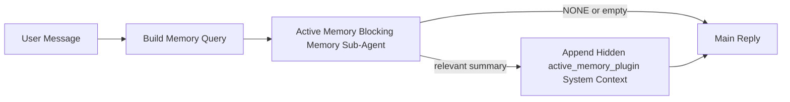

---
read_when:
    - Ви хочете зрозуміти, для чого потрібна Active Memory
    - Ви хочете ввімкнути Active Memory для розмовного агента
    - Ви хочете налаштувати поведінку Active Memory, не вмикаючи її всюди
summary: Керований Plugin блокувальний підагент пам’яті, який впроваджує релевантну пам’ять в інтерактивні сеанси чату
title: Active Memory
x-i18n:
    generated_at: "2026-04-12T18:22:02Z"
    model: gpt-5.4
    provider: openai
    source_hash: dc15b2139618d9dbb0ba4d9951fb82a4d86076f7b8dc1a6bf2013bcce61878c4
    source_path: concepts/active-memory.md
    workflow: 15
---

# Active Memory

Active Memory — це необов’язковий керований Plugin блокувальний підагент пам’яті, який запускається
перед основною відповіддю для придатних розмовних сеансів.

Він існує тому, що більшість систем пам’яті є потужними, але реактивними. Вони покладаються на те,
що головний агент вирішить, коли шукати в пам’яті, або на те, що користувач скаже щось на кшталт
«запам’ятай це» чи «пошукай у пам’яті». На той момент мить, коли пам’ять могла б зробити відповідь
природною, уже минула.

Active Memory дає системі одну обмежену можливість показати релевантну пам’ять
до того, як буде згенеровано основну відповідь.

## Вставте це у свій агент

Вставте це у свій агент, якщо хочете ввімкнути Active Memory із
самодостатнім і безпечним типово налаштуванням:

```json5
{
  plugins: {
    entries: {
      "active-memory": {
        enabled: true,
        config: {
          enabled: true,
          agents: ["main"],
          allowedChatTypes: ["direct"],
          modelFallback: "google/gemini-3-flash",
          queryMode: "recent",
          promptStyle: "balanced",
          timeoutMs: 15000,
          maxSummaryChars: 220,
          persistTranscripts: false,
          logging: true,
        },
      },
    },
  },
}
```

Це вмикає Plugin для агента `main`, типово обмежує його сеансами
у стилі прямих повідомлень, дає йому змогу спочатку успадковувати модель поточного сеансу та
використовує налаштовану резервну модель лише якщо жодна явна або успадкована модель недоступна.

Після цього перезапустіть Gateway:

```bash
openclaw gateway
```

Щоб переглянути це наживо в розмові:

```text
/verbose on
/trace on
```

## Увімкнення active memory

Найбезпечніше налаштування:

1. увімкнути Plugin
2. націлити його на одного розмовного агента
3. залишати журналювання увімкненим лише під час налаштування

Почніть із цього в `openclaw.json`:

```json5
{
  plugins: {
    entries: {
      "active-memory": {
        enabled: true,
        config: {
          agents: ["main"],
          allowedChatTypes: ["direct"],
          modelFallback: "google/gemini-3-flash",
          queryMode: "recent",
          promptStyle: "balanced",
          timeoutMs: 15000,
          maxSummaryChars: 220,
          persistTranscripts: false,
          logging: true,
        },
      },
    },
  },
}
```

Потім перезапустіть Gateway:

```bash
openclaw gateway
```

Що це означає:

- `plugins.entries.active-memory.enabled: true` вмикає Plugin
- `config.agents: ["main"]` підключає до active memory лише агента `main`
- `config.allowedChatTypes: ["direct"]` типово залишає active memory увімкненою лише для сеансів у стилі прямих повідомлень
- якщо `config.model` не задано, active memory спочатку успадковує модель поточного сеансу
- `config.modelFallback` за бажанням надає вашу резервну модель провайдера для відновлення пам’яті
- `config.promptStyle: "balanced"` використовує типовий універсальний стиль підказки для режиму `recent`
- active memory однаково запускається лише в придатних інтерактивних постійних сеансах чату

## Як це побачити

Active Memory впроваджує прихований системний контекст для моделі. Вона не показує
сирі теги `<active_memory_plugin>...</active_memory_plugin>` клієнту.

## Перемикач сеансу

Використовуйте команду Plugin, коли хочете призупинити або відновити active memory для
поточного сеансу чату без редагування конфігурації:

```text
/active-memory status
/active-memory off
/active-memory on
```

Це має область дії сеансу. Це не змінює
`plugins.entries.active-memory.enabled`, націлення на агентів чи іншу глобальну
конфігурацію.

Якщо ви хочете, щоб команда записувала конфігурацію й призупиняла або відновлювала active memory для
всіх сеансів, використовуйте явну глобальну форму:

```text
/active-memory status --global
/active-memory off --global
/active-memory on --global
```

Глобальна форма записує `plugins.entries.active-memory.config.enabled`. Вона залишає
`plugins.entries.active-memory.enabled` увімкненим, щоб команда залишалася доступною для
повторного ввімкнення active memory пізніше.

Якщо ви хочете побачити, що active memory робить у живому сеансі, увімкніть
перемикачі сеансу, які відповідають потрібному вам виводу:

```text
/verbose on
/trace on
```

Коли вони ввімкнені, OpenClaw може показувати:

- рядок стану active memory на кшталт `Active Memory: ok 842ms recent 34 chars`, коли ввімкнено `/verbose on`
- зручне для читання підсумкове налагодження на кшталт `Active Memory Debug: Lemon pepper wings with blue cheese.`, коли ввімкнено `/trace on`

Ці рядки походять із того самого проходу active memory, який подає прихований
системний контекст, але вони відформатовані для людей замість показу сирої
розмітки підказки. Вони надсилаються як діагностичне повідомлення після
звичайної відповіді асистента, щоб клієнти каналів, як-от Telegram, не показували окрему
діагностичну бульбашку перед відповіддю.

Типово транскрипт блокувального підагента пам’яті є тимчасовим і видаляється
після завершення виконання.

Приклад потоку:

```text
/verbose on
/trace on
what wings should i order?
```

Очікувана форма видимої відповіді:

```text
...normal assistant reply...

🧩 Active Memory: ok 842ms recent 34 chars
🔎 Active Memory Debug: Lemon pepper wings with blue cheese.
```

## Коли це запускається

Active Memory використовує два шлюзи:

1. **Явне ввімкнення в конфігурації**
   Plugin має бути ввімкнений, а ідентифікатор поточного агента має бути присутній у
   `plugins.entries.active-memory.config.agents`.
2. **Сувора придатність під час виконання**
   Навіть коли Active Memory ввімкнено й націлено, вона запускається лише для придатних
   інтерактивних постійних сеансів чату.

Фактичне правило таке:

```text
plugin enabled
+
agent id targeted
+
allowed chat type
+
eligible interactive persistent chat session
=
active memory runs
```

Якщо будь-яка з цих умов не виконується, active memory не запускається.

## Типи сеансів

`config.allowedChatTypes` керує тим, у яких типах розмов узагалі може запускатися Active
Memory.

Типове значення:

```json5
allowedChatTypes: ["direct"]
```

Це означає, що Active Memory типово працює в сеансах у стилі прямих повідомлень, але
не в групових сеансах чи сеансах каналів, якщо ви не ввімкнете їх явно.

Приклади:

```json5
allowedChatTypes: ["direct"]
```

```json5
allowedChatTypes: ["direct", "group"]
```

```json5
allowedChatTypes: ["direct", "group", "channel"]
```

## Де це працює

Active memory — це функція покращення розмов, а не загальноплатформна
функція інференсу.

| Поверхня                                                            | Active memory запускається?                              |
| ------------------------------------------------------------------- | -------------------------------------------------------- |
| Постійні сеанси Control UI / вебчату                                | Так, якщо Plugin увімкнено та агент націлено            |
| Інші інтерактивні сеанси каналів на тому самому шляху постійного чату | Так, якщо Plugin увімкнено та агент націлено            |
| Headless одноразові запуски                                         | Ні                                                       |
| Запуски Heartbeat/у фоновому режимі                                 | Ні                                                       |
| Загальні внутрішні шляхи `agent-command`                            | Ні                                                       |
| Виконання підагента/внутрішнього допоміжного компонента             | Ні                                                       |

## Навіщо це використовувати

Використовуйте active memory, коли:

- сеанс є постійним і призначеним для користувача
- агент має змістовну довготривалу пам’ять для пошуку
- безперервність і персоналізація важливіші за чистий детермінізм підказок

Це особливо добре працює для:

- стабільних уподобань
- повторюваних звичок
- довготривалого контексту користувача, який має проявлятися природно

Це погано підходить для:

- автоматизації
- внутрішніх воркерів
- одноразових API-завдань
- місць, де прихована персоналізація була б несподіваною

## Як це працює

Форма виконання така:



Блокувальний підагент пам’яті може використовувати лише:

- `memory_search`
- `memory_get`

Якщо з’єднання слабке, він має повертати `NONE`.

## Режими запиту

`config.queryMode` керує тим, скільки розмови бачить блокувальний підагент пам’яті.

## Стилі підказок

`config.promptStyle` керує тим, наскільки охоче чи суворо блокувальний підагент пам’яті
вирішує, чи повертати пам’ять.

Доступні стилі:

- `balanced`: типовий універсальний варіант для режиму `recent`
- `strict`: найменш охочий; найкраще, коли ви хочете мінімального впливу сусіднього контексту
- `contextual`: найкращий для безперервності; найкраще, коли історія розмови має більше значення
- `recall-heavy`: охочіше показує пам’ять за м’якших, але все ще правдоподібних збігів
- `precision-heavy`: агресивно віддає перевагу `NONE`, якщо збіг не є очевидним
- `preference-only`: оптимізований для улюбленого, звичок, рутин, смаків і повторюваних особистих фактів

Типове зіставлення, якщо `config.promptStyle` не задано:

```text
message -> strict
recent -> balanced
full -> contextual
```

Якщо ви явно задаєте `config.promptStyle`, саме це перевизначення і використовується.

Приклад:

```json5
promptStyle: "preference-only"
```

## Політика резервної моделі

Якщо `config.model` не задано, Active Memory намагається визначити модель у такому порядку:

```text
explicit plugin model
-> current session model
-> agent primary model
-> optional configured fallback model
```

`config.modelFallback` керує кроком налаштованої резервної моделі.

Необов’язкова власна резервна модель:

```json5
modelFallback: "google/gemini-3-flash"
```

Якщо не вдається визначити явну, успадковану чи налаштовану резервну модель, Active Memory
пропускає відновлення пам’яті для цього ходу.

`config.modelFallbackPolicy` збережено лише як застаріле поле сумісності
для старіших конфігурацій. Воно більше не змінює поведінку під час виконання.

## Розширені аварійні опції

Ці параметри навмисно не входять до рекомендованого налаштування.

`config.thinking` може перевизначати рівень thinking блокувального підагента пам’яті:

```json5
thinking: "medium"
```

Типове значення:

```json5
thinking: "off"
```

Не вмикайте це типово. Active Memory запускається на шляху відповіді, тому додатковий
час thinking безпосередньо збільшує видиму для користувача затримку.

`config.promptAppend` додає додаткові інструкції оператора після типової підказки Active
Memory і перед контекстом розмови:

```json5
promptAppend: "Prefer stable long-term preferences over one-off events."
```

`config.promptOverride` замінює типову підказку Active Memory. OpenClaw
все одно додає контекст розмови після неї:

```json5
promptOverride: "You are a memory search agent. Return NONE or one compact user fact."
```

Налаштування підказки не рекомендується, якщо тільки ви свідомо не тестуєте
інший контракт відновлення пам’яті. Типову підказку налаштовано так, щоб повертати або `NONE`,
або компактний контекст фактів про користувача для основної моделі.

### `message`

Надсилається лише останнє повідомлення користувача.

```text
Latest user message only
```

Використовуйте це, коли:

- ви хочете найшвидшої поведінки
- ви хочете найсильнішого ухилу в бік відновлення стабільних уподобань
- наступні ходи не потребують контексту розмови

Рекомендований тайм-аут:

- починайте приблизно з `3000` до `5000` мс

### `recent`

Надсилається останнє повідомлення користувача разом із невеликим хвостом недавньої розмови.

```text
Recent conversation tail:
user: ...
assistant: ...
user: ...

Latest user message:
...
```

Використовуйте це, коли:

- ви хочете кращого балансу між швидкістю та прив’язкою до розмовного контексту
- уточнювальні запитання часто залежать від кількох останніх ходів

Рекомендований тайм-аут:

- починайте приблизно з `15000` мс

### `full`

До блокувального підагента пам’яті надсилається вся розмова.

```text
Full conversation context:
user: ...
assistant: ...
user: ...
...
```

Використовуйте це, коли:

- найвища якість відновлення пам’яті важливіша за затримку
- розмова містить важливий вступний контекст далеко вище в гілці

Рекомендований тайм-аут:

- суттєво збільшуйте його порівняно з `message` або `recent`
- починайте приблизно з `15000` мс або вище залежно від розміру гілки

Загалом тайм-аут має зростати разом із розміром контексту:

```text
message < recent < full
```

## Збереження транскриптів

Запуски блокувального підагента пам’яті active memory створюють реальний
транскрипт `session.jsonl` під час виклику блокувального підагента пам’яті.

Типово цей транскрипт є тимчасовим:

- він записується до тимчасового каталогу
- він використовується лише для запуску блокувального підагента пам’яті
- він видаляється одразу після завершення запуску

Якщо ви хочете зберігати ці транскрипти блокувального підагента пам’яті на диску для налагодження або
перевірки, явно ввімкніть збереження:

```json5
{
  plugins: {
    entries: {
      "active-memory": {
        enabled: true,
        config: {
          agents: ["main"],
          persistTranscripts: true,
          transcriptDir: "active-memory",
        },
      },
    },
  },
}
```

Коли це ввімкнено, active memory зберігає транскрипти в окремому каталозі в
теці сеансів цільового агента, а не в основному шляху транскрипту
розмови користувача.

Типова структура концептуально виглядає так:

```text
agents/<agent>/sessions/active-memory/<blocking-memory-sub-agent-session-id>.jsonl
```

Ви можете змінити відносний підкаталог за допомогою `config.transcriptDir`.

Використовуйте це обережно:

- транскрипти блокувального підагента пам’яті можуть швидко накопичуватися в активних сеансах
- режим запиту `full` може дублювати велику кількість контексту розмови
- ці транскрипти містять прихований контекст підказки та відновлені спогади

## Конфігурація

Уся конфігурація active memory розміщується в:

```text
plugins.entries.active-memory
```

Найважливіші поля:

| Key                         | Type                                                                                                 | Meaning                                                                                                  |
| --------------------------- | ---------------------------------------------------------------------------------------------------- | -------------------------------------------------------------------------------------------------------- |
| `enabled`                   | `boolean`                                                                                            | Вмикає сам Plugin                                                                                        |
| `config.agents`             | `string[]`                                                                                           | Ідентифікатори агентів, які можуть використовувати active memory                                         |
| `config.model`              | `string`                                                                                             | Необов’язкове посилання на модель блокувального підагента пам’яті; якщо не задано, active memory використовує модель поточного сеансу |
| `config.queryMode`          | `"message" \| "recent" \| "full"`                                                                    | Керує тим, скільки розмови бачить блокувальний підагент пам’яті                                          |
| `config.promptStyle`        | `"balanced" \| "strict" \| "contextual" \| "recall-heavy" \| "precision-heavy" \| "preference-only"` | Керує тим, наскільки охоче чи суворо блокувальний підагент пам’яті вирішує, чи повертати пам’ять        |
| `config.thinking`           | `"off" \| "minimal" \| "low" \| "medium" \| "high" \| "xhigh" \| "adaptive"`                         | Розширене перевизначення thinking для блокувального підагента пам’яті; типово `off` для швидкості      |
| `config.promptOverride`     | `string`                                                                                             | Розширена повна заміна підказки; не рекомендовано для звичайного використання                            |
| `config.promptAppend`       | `string`                                                                                             | Розширені додаткові інструкції, додані в кінець типової або перевизначеної підказки                      |
| `config.timeoutMs`          | `number`                                                                                             | Жорсткий тайм-аут для блокувального підагента пам’яті                                                    |
| `config.maxSummaryChars`    | `number`                                                                                             | Максимальна загальна кількість символів, дозволена в підсумку active-memory                              |
| `config.logging`            | `boolean`                                                                                            | Виводить журнали active memory під час налаштування                                                      |
| `config.persistTranscripts` | `boolean`                                                                                            | Зберігає транскрипти блокувального підагента пам’яті на диску замість видалення тимчасових файлів       |
| `config.transcriptDir`      | `string`                                                                                             | Відносний каталог транскриптів блокувального підагента пам’яті в теці сеансів агента                    |

Корисні поля налаштування:

| Key                           | Type     | Meaning                                                          |
| ----------------------------- | -------- | ---------------------------------------------------------------- |
| `config.maxSummaryChars`      | `number` | Максимальна загальна кількість символів, дозволена в підсумку active-memory |
| `config.recentUserTurns`      | `number` | Попередні ходи користувача, які слід включити, коли `queryMode` дорівнює `recent` |
| `config.recentAssistantTurns` | `number` | Попередні ходи асистента, які слід включити, коли `queryMode` дорівнює `recent` |
| `config.recentUserChars`      | `number` | Максимум символів на один нещодавній хід користувача             |
| `config.recentAssistantChars` | `number` | Максимум символів на один нещодавній хід асистента               |
| `config.cacheTtlMs`           | `number` | Повторне використання кешу для повторюваних ідентичних запитів   |

## Рекомендоване налаштування

Починайте з `recent`.

```json5
{
  plugins: {
    entries: {
      "active-memory": {
        enabled: true,
        config: {
          agents: ["main"],
          queryMode: "recent",
          promptStyle: "balanced",
          timeoutMs: 15000,
          maxSummaryChars: 220,
          logging: true,
        },
      },
    },
  },
}
```

Якщо ви хочете перевіряти поведінку наживо під час налаштування, використовуйте `/verbose on` для
звичайного рядка стану та `/trace on` для підсумку налагодження active-memory замість
пошуку окремої команди налагодження active-memory. У каналах чату ці
діагностичні рядки надсилаються після основної відповіді асистента, а не перед нею.

Потім переходьте до:

- `message`, якщо хочете меншої затримки
- `full`, якщо вирішите, що додатковий контекст вартий повільнішого блокувального підагента пам’яті

## Налагодження

Якщо active memory не з’являється там, де ви очікуєте:

1. Переконайтеся, що Plugin увімкнено в `plugins.entries.active-memory.enabled`.
2. Переконайтеся, що ідентифікатор поточного агента вказано в `config.agents`.
3. Переконайтеся, що ви тестуєте через інтерактивний постійний сеанс чату.
4. Увімкніть `config.logging: true` і перегляньте журнали Gateway.
5. Перевірте, що сам пошук у пам’яті працює, за допомогою `openclaw memory status --deep`.

Якщо збіги в пам’яті шумні, зменште:

- `maxSummaryChars`

Якщо active memory працює надто повільно:

- зменште `queryMode`
- зменште `timeoutMs`
- зменште кількість нещодавніх ходів
- зменште ліміти символів на хід

## Поширені проблеми

### Провайдер вбудовувань неочікувано змінився

Active Memory покладається на звичайний провайдер вбудовувань для пошуку в пам’яті в
`agents.defaults.memorySearch`. Якщо ви не задаєте цей провайдер явно,
OpenClaw автоматично виявляє перший доступний провайдер вбудовувань.

Це може збивати з пантелику в реальних розгортаннях:

- новий доступний API-ключ може змінити провайдера, який використовує пошук у пам’яті
- одна команда або поверхня діагностики може створювати враження, що вибраний провайдер
  інший, ніж шлях, який ви фактично використовуєте під час живої синхронізації пам’яті або
  ініціалізації пошуку
- хостовані провайдери можуть завершуватися помилками квоти або обмеження швидкості, які проявляються лише
  коли Active Memory починає надсилати запити на відновлення пам’яті перед кожною відповіддю

Якщо для вас важлива передбачувана поведінка, явно закріпіть провайдера вбудовувань для пам’яті
замість покладання на автовиявлення.

Приклад:

```json5
{
  agents: {
    defaults: {
      memorySearch: {
        provider: "ollama",
        model: "nomic-embed-text",
      },
    },
  },
}
```

Або, якщо ви хочете вбудовування Gemini:

```json5
{
  agents: {
    defaults: {
      memorySearch: {
        provider: "gemini",
      },
    },
  },
}
```

Після зміни провайдера перезапустіть Gateway і виконайте новий тест з
`/trace on`, щоб рядок налагодження Active Memory відображав новий шлях вбудовувань.

## Пов’язані сторінки

- [Memory Search](/uk/concepts/memory-search)
- [Довідник із конфігурації пам’яті](/uk/reference/memory-config)
- [Налаштування Plugin SDK](/uk/plugins/sdk-setup)
