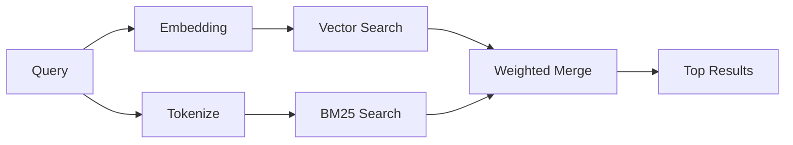

---
read_when:
    - Ви хочете зрозуміти, як працює memory_search
    - Ви хочете вибрати провайдера ембедингів
    - Ви хочете налаштувати якість пошуку
summary: Як пошук у пам’яті знаходить релевантні нотатки за допомогою ембедингів і гібридного пошуку
title: Пошук у пам’яті
x-i18n:
    generated_at: "2026-04-12T17:37:53Z"
    model: gpt-5.4
    provider: openai
    source_hash: 71fde251b7d2dc455574aa458e7e09136f30613609ad8dafeafd53b2729a0310
    source_path: concepts/memory-search.md
    workflow: 15
---

# Пошук у пам’яті

`memory_search` знаходить релевантні нотатки з ваших файлів пам’яті, навіть коли
формулювання відрізняється від оригінального тексту. Він працює, індексуючи пам’ять у малі
фрагменти та шукаючи їх за допомогою ембедингів, ключових слів або обох способів.

## Швидкий старт

Якщо у вас налаштовано API-ключ OpenAI, Gemini, Voyage або Mistral, пошук у пам’яті
працює автоматично. Щоб явно вказати провайдера:

```json5
{
  agents: {
    defaults: {
      memorySearch: {
        provider: "openai", // або "gemini", "local", "ollama" тощо
      },
    },
  },
}
```

Для локальних ембедингів без API-ключа використовуйте `provider: "local"` (потрібен
node-llama-cpp).

## Підтримувані провайдери

| Провайдер | ID        | Потрібен API-ключ | Примітки                                             |
| --------- | --------- | ----------------- | ---------------------------------------------------- |
| OpenAI    | `openai`  | Так               | Визначається автоматично, швидко                     |
| Gemini    | `gemini`  | Так               | Підтримує індексацію зображень/аудіо                 |
| Voyage    | `voyage`  | Так               | Визначається автоматично                             |
| Mistral   | `mistral` | Так               | Визначається автоматично                             |
| Bedrock   | `bedrock` | Ні                | Визначається автоматично, коли доступний ланцюжок облікових даних AWS |
| Ollama    | `ollama`  | Ні                | Локально, потрібно вказати явно                      |
| Local     | `local`   | Ні                | Модель GGUF, завантаження ~0.6 ГБ                    |

## Як працює пошук

OpenClaw запускає два шляхи пошуку паралельно та об’єднує результати:



- **Векторний пошук** знаходить нотатки зі схожим змістом ("gateway host" відповідає
  "the machine running OpenClaw").
- **Пошук за ключовими словами BM25** знаходить точні збіги (ID, рядки помилок, ключі
  конфігурації).

Якщо доступний лише один шлях (немає ембедингів або немає FTS), інший працює самостійно.

Коли ембединги недоступні, OpenClaw усе одно використовує лексичне ранжування за результатами FTS замість того, щоб повертатися лише до сирого впорядкування за точним збігом. У цьому деградованому режимі підвищується вага фрагментів із кращим покриттям термінів запиту та релевантними шляхами до файлів, що зберігає корисну повноту навіть без `sqlite-vec` або провайдера ембедингів.

## Поліпшення якості пошуку

Дві необов’язкові функції допомагають, коли у вас велика історія нотаток:

### Часове згасання

Старі нотатки поступово втрачають вагу в ранжуванні, тому новіша інформація з’являється першою.
За стандартного періоду напіврозпаду 30 днів нотатка з минулого місяця матиме 50% від
своєї початкової ваги. Для постійно актуальних файлів, таких як `MEMORY.md`, згасання ніколи не застосовується.

<Tip>
Увімкніть часове згасання, якщо ваш агент має місяці щоденних нотаток і застаріла
інформація постійно випереджає новіший контекст.
</Tip>

### MMR (різноманітність)

Зменшує кількість повторюваних результатів. Якщо п’ять нотаток згадують ту саму конфігурацію роутера, MMR
гарантує, що верхні результати охоплюватимуть різні теми, а не повторюватимуться.

<Tip>
Увімкніть MMR, якщо `memory_search` постійно повертає майже дубльовані фрагменти з
різних щоденних нотаток.
</Tip>

### Увімкнути обидва

```json5
{
  agents: {
    defaults: {
      memorySearch: {
        query: {
          hybrid: {
            mmr: { enabled: true },
            temporalDecay: { enabled: true },
          },
        },
      },
    },
  },
}
```

## Мультимодальна пам’ять

З Gemini Embedding 2 ви можете індексувати зображення та аудіофайли разом із
Markdown. Пошукові запити залишаються текстовими, але вони зіставляються з візуальним та аудіовмістом. Див. [довідник із конфігурації пам’яті](/uk/reference/memory-config) для
налаштування.

## Пошук у пам’яті сеансу

Ви можете додатково індексувати транскрипти сеансів, щоб `memory_search` міг згадувати
попередні розмови. Це функція з явним увімкненням через
`memorySearch.experimental.sessionMemory`. Докладніше див. у
[довіднику з конфігурації](/uk/reference/memory-config).

## Усунення несправностей

**Немає результатів?** Виконайте `openclaw memory status`, щоб перевірити індекс. Якщо він порожній, виконайте
`openclaw memory index --force`.

**Лише збіги за ключовими словами?** Можливо, ваш провайдер ембедингів не налаштований. Перевірте
`openclaw memory status --deep`.

**Текст CJK не знаходиться?** Перебудуйте індекс FTS за допомогою
`openclaw memory index --force`.

## Додаткові матеріали

- [Active Memory](/uk/concepts/active-memory) -- пам’ять субагента для інтерактивних чат-сеансів
- [Пам’ять](/uk/concepts/memory) -- структура файлів, бекенди, інструменти
- [Довідник із конфігурації пам’яті](/uk/reference/memory-config) -- усі параметри конфігурації
