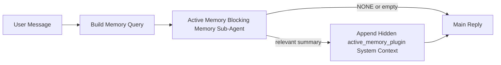

---
read_when:
    - 你想了解活动记忆的用途
    - 你想为一个对话式智能体启用活动记忆
    - 你想调整活动记忆的行为，而不在所有地方都启用它
summary: 一个由插件拥有的阻塞型 Memory 子智能体，会将相关记忆注入到交互式聊天会话中
title: 活动记忆
x-i18n:
    generated_at: "2026-04-12T18:22:05Z"
    model: gpt-5.4
    provider: openai
    source_hash: dc15b2139618d9dbb0ba4d9951fb82a4d86076f7b8dc1a6bf2013bcce61878c4
    source_path: concepts/active-memory.md
    workflow: 15
---

# 活动记忆

活动记忆是一个可选的、由插件拥有的阻塞型 Memory 子智能体，会在符合条件的对话式会话中于主回复之前运行。

之所以存在它，是因为大多数记忆系统虽然能力很强，但都偏向被动。它们依赖主智能体来决定何时搜索记忆，或者依赖用户说出类似“记住这个”或“搜索记忆”这样的话。等到那时，记忆原本可以让回复显得自然的那个时刻其实已经过去了。

活动记忆为系统提供了一次有边界的机会，在生成主回复之前呈现相关记忆。

## 粘贴到你的智能体中

如果你想为你的智能体启用活动记忆，并使用一个自包含、默认安全的设置，请将以下内容粘贴到你的智能体中：

```json5
{
  plugins: {
    entries: {
      "active-memory": {
        enabled: true,
        config: {
          enabled: true,
          agents: ["main"],
          allowedChatTypes: ["direct"],
          modelFallback: "google/gemini-3-flash",
          queryMode: "recent",
          promptStyle: "balanced",
          timeoutMs: 15000,
          maxSummaryChars: 220,
          persistTranscripts: false,
          logging: true,
        },
      },
    },
  },
}
```

这会为 `main` 智能体开启该插件，默认将其限制为仅在私信风格的会话中运行，优先让它继承当前会话模型，并且只有在没有显式模型或继承模型可用时，才使用已配置的回退模型。

之后，重启 Gateway 网关：

```bash
openclaw gateway
```

要在对话中实时检查它：

```text
/verbose on
/trace on
```

## 启用活动记忆

最安全的设置方式是：

1. 启用插件
2. 指定一个对话式智能体
3. 仅在调优期间保持日志开启

先在 `openclaw.json` 中添加以下内容：

```json5
{
  plugins: {
    entries: {
      "active-memory": {
        enabled: true,
        config: {
          agents: ["main"],
          allowedChatTypes: ["direct"],
          modelFallback: "google/gemini-3-flash",
          queryMode: "recent",
          promptStyle: "balanced",
          timeoutMs: 15000,
          maxSummaryChars: 220,
          persistTranscripts: false,
          logging: true,
        },
      },
    },
  },
}
```

然后重启 Gateway 网关：

```bash
openclaw gateway
```

这意味着：

- `plugins.entries.active-memory.enabled: true` 会启用该插件
- `config.agents: ["main"]` 只让 `main` 智能体加入活动记忆
- `config.allowedChatTypes: ["direct"]` 默认只在私信风格的会话中启用活动记忆
- 如果 `config.model` 未设置，活动记忆会优先继承当前会话模型
- `config.modelFallback` 可选，用于为召回提供你自己的回退提供商/模型
- `config.promptStyle: "balanced"` 会为 `recent` 模式使用默认的通用提示风格
- 活动记忆仍然只会在符合条件的交互式持久聊天会话中运行

## 如何查看它

活动记忆会为模型注入隐藏的系统上下文。它不会向客户端暴露原始的 `<active_memory_plugin>...</active_memory_plugin>` 标签。

## 会话切换

当你想在不编辑配置的情况下，为当前聊天会话暂停或恢复活动记忆时，请使用插件命令：

```text
/active-memory status
/active-memory off
/active-memory on
```

这是会话级作用域。它不会更改
`plugins.entries.active-memory.enabled`、智能体目标设定或其他全局配置。

如果你希望该命令写入配置，并为所有会话暂停或恢复活动记忆，请使用显式的全局形式：

```text
/active-memory status --global
/active-memory off --global
/active-memory on --global
```

全局形式会写入 `plugins.entries.active-memory.config.enabled`。它会保留
`plugins.entries.active-memory.enabled` 为开启状态，以便该命令之后仍可用于重新开启活动记忆。

如果你想查看活动记忆在实时会话中的行为，请开启与你想看到的输出相匹配的会话开关：

```text
/verbose on
/trace on
```

启用后，OpenClaw 可以显示：

- 当 `/verbose on` 时，显示活动记忆状态行，例如 `Active Memory: ok 842ms recent 34 chars`
- 当 `/trace on` 时，显示可读的调试摘要，例如 `Active Memory Debug: Lemon pepper wings with blue cheese.`

这些行源自同一次活动记忆流程，也正是它为隐藏系统上下文提供内容的那次流程，但它们是为人类阅读而格式化的，而不是暴露原始提示标记。它们会在正常的助手回复之后作为一条后续诊断消息发送，因此像 Telegram 这样的渠道客户端不会在回复前闪出一个单独的诊断气泡。

默认情况下，这个阻塞型 Memory 子智能体的转录是临时的，并会在运行完成后删除。

示例流程：

```text
/verbose on
/trace on
what wings should i order?
```

预期的可见回复形态：

```text
...normal assistant reply...

🧩 Active Memory: ok 842ms recent 34 chars
🔎 Active Memory Debug: Lemon pepper wings with blue cheese.
```

## 何时运行

活动记忆使用两个门控条件：

1. **配置选择加入**
   必须启用该插件，并且当前智能体 id 必须出现在
   `plugins.entries.active-memory.config.agents` 中。
2. **严格的运行时资格条件**
   即使已启用并已设定目标，活动记忆也只会在符合条件的交互式持久聊天会话中运行。

实际规则是：

```text
plugin enabled
+
agent id targeted
+
allowed chat type
+
eligible interactive persistent chat session
=
active memory runs
```

如果其中任何一项不满足，活动记忆都不会运行。

## 会话类型

`config.allowedChatTypes` 控制哪些类型的对话可以运行活动记忆。

默认值是：

```json5
allowedChatTypes: ["direct"]
```

这意味着，默认情况下活动记忆会在私信风格的会话中运行，但不会在群组或渠道会话中运行，除非你显式将它们加入。

示例：

```json5
allowedChatTypes: ["direct"]
```

```json5
allowedChatTypes: ["direct", "group"]
```

```json5
allowedChatTypes: ["direct", "group", "channel"]
```

## 运行位置

活动记忆是一项对话增强功能，而不是一项平台范围内的推理功能。

| Surface                                                             | 是否运行活动记忆？ |
| ------------------------------------------------------------------- | ------------------ |
| Control UI / web chat 持久会话                                      | 是，如果插件已启用且该智能体已被设为目标 |
| 同一持久聊天路径上的其他交互式渠道会话                              | 是，如果插件已启用且该智能体已被设为目标 |
| 无头一次性运行                                                      | 否 |
| 心跳/后台运行                                                       | 否 |
| 通用内部 `agent-command` 路径                                       | 否 |
| 子智能体/内部辅助执行                                               | 否 |

## 为什么使用它

在以下情况下使用活动记忆：

- 会话是持久的且面向用户
- 智能体拥有可供搜索的有意义长期记忆
- 连续性和个性化比原始提示确定性更重要

它尤其适用于：

- 稳定偏好
- 重复习惯
- 应该自然浮现出来的长期用户上下文

它不适合用于：

- 自动化
- 内部工作进程
- 一次性 API 任务
- 那些隐藏个性化会让人意外的场景

## 它如何工作

运行时形态如下：



这个阻塞型 Memory 子智能体只能使用：

- `memory_search`
- `memory_get`

如果连接较弱，它应返回 `NONE`。

## 查询模式

`config.queryMode` 控制这个阻塞型 Memory 子智能体能看到多少对话内容。

## 提示风格

`config.promptStyle` 控制这个阻塞型 Memory 子智能体在决定是否返回记忆时有多积极或多严格。

可用风格：

- `balanced`：`recent` 模式的通用默认值
- `strict`：最不积极；最适合你希望尽量减少附近上下文渗入的情况
- `contextual`：最有利于连续性；最适合对话历史应更重要的情况
- `recall-heavy`：更愿意在较弱但仍合理的匹配下呈现记忆
- `precision-heavy`：除非匹配非常明显，否则会强烈倾向返回 `NONE`
- `preference-only`：针对收藏、习惯、日常规律、口味和重复出现的个人事实进行了优化

当 `config.promptStyle` 未设置时，默认映射为：

```text
message -> strict
recent -> balanced
full -> contextual
```

如果你显式设置了 `config.promptStyle`，则以该覆盖设置为准。

示例：

```json5
promptStyle: "preference-only"
```

## 模型回退策略

如果 `config.model` 未设置，活动记忆会按以下顺序尝试解析模型：

```text
explicit plugin model
-> current session model
-> agent primary model
-> optional configured fallback model
```

`config.modelFallback` 控制已配置回退这一步。

可选的自定义回退：

```json5
modelFallback: "google/gemini-3-flash"
```

如果没有解析出显式模型、继承模型或已配置回退模型，活动记忆会跳过该轮的召回。

`config.modelFallbackPolicy` 仅作为已弃用的兼容字段保留，用于旧配置。
它不再改变运行时行为。

## 高级逃生舱

这些选项有意不包含在推荐设置中。

`config.thinking` 可以覆盖这个阻塞型 Memory 子智能体的 thinking 级别：

```json5
thinking: "medium"
```

默认值：

```json5
thinking: "off"
```

默认不要启用它。活动记忆运行在回复路径中，因此额外的思考时间会直接增加用户可见的延迟。

`config.promptAppend` 会在默认活动记忆提示之后、对话上下文之前追加额外的操作员指令：

```json5
promptAppend: "Prefer stable long-term preferences over one-off events."
```

`config.promptOverride` 会替换默认的活动记忆提示。OpenClaw
仍会在其后追加对话上下文：

```json5
promptOverride: "You are a memory search agent. Return NONE or one compact user fact."
```

除非你是在有意测试不同的召回契约，否则不建议进行提示自定义。默认提示已针对“返回 `NONE` 或返回适用于主模型的紧凑用户事实上下文”进行了优化。

### `message`

只发送最新的用户消息。

```text
Latest user message only
```

适用场景：

- 你希望获得最快的行为
- 你希望对稳定偏好召回有最强偏向
- 后续轮次不需要对话上下文

建议超时时间：

- 从 `3000` 到 `5000` ms 左右开始

### `recent`

发送最新的用户消息以及最近的一小段对话尾部。

```text
Recent conversation tail:
user: ...
assistant: ...
user: ...

Latest user message:
...
```

适用场景：

- 你希望在速度和对话上下文之间取得更好的平衡
- 后续问题通常依赖最近几轮对话

建议超时时间：

- 从 `15000` ms 左右开始

### `full`

将完整对话发送给这个阻塞型 Memory 子智能体。

```text
Full conversation context:
user: ...
assistant: ...
user: ...
...
```

适用场景：

- 最强的召回质量比延迟更重要
- 对话中包含位于线程较早位置的重要铺垫内容

建议超时时间：

- 相较于 `message` 或 `recent` 明显增加
- 根据线程大小，从 `15000` ms 或更高开始

一般来说，超时时间应随上下文大小增加：

```text
message < recent < full
```

## 转录持久化

活动记忆阻塞型 Memory 子智能体运行会在阻塞型 Memory 子智能体调用期间创建一个真实的 `session.jsonl` 转录文件。

默认情况下，该转录是临时的：

- 它会写入临时目录
- 它仅用于该次阻塞型 Memory 子智能体运行
- 它会在运行结束后立即删除

如果你想将这些阻塞型 Memory 子智能体转录保留在磁盘上以便调试或检查，请显式开启持久化：

```json5
{
  plugins: {
    entries: {
      "active-memory": {
        enabled: true,
        config: {
          agents: ["main"],
          persistTranscripts: true,
          transcriptDir: "active-memory",
        },
      },
    },
  },
}
```

启用后，活动记忆会将转录存储在目标智能体会话文件夹下的单独目录中，而不是主用户对话转录路径中。

默认布局在概念上是：

```text
agents/<agent>/sessions/active-memory/<blocking-memory-sub-agent-session-id>.jsonl
```

你可以通过 `config.transcriptDir` 更改这个相对的子目录。

请谨慎使用：

- 在繁忙会话中，阻塞型 Memory 子智能体转录可能会快速累积
- `full` 查询模式可能会重复大量对话上下文
- 这些转录包含隐藏的提示上下文和召回的记忆

## 配置

所有活动记忆配置都位于：

```text
plugins.entries.active-memory
```

最重要的字段有：

| 键 | 类型 | 含义 |
| --------------------------- | ---------------------------------------------------------------------------------------------------- | ------------------------------------------------------------------------------------------------------ |
| `enabled` | `boolean` | 启用插件本身 |
| `config.agents` | `string[]` | 允许使用活动记忆的智能体 id |
| `config.model` | `string` | 可选的阻塞型 Memory 子智能体模型引用；未设置时，活动记忆会使用当前会话模型 |
| `config.queryMode` | `"message" \| "recent" \| "full"` | 控制阻塞型 Memory 子智能体能看到多少对话内容 |
| `config.promptStyle` | `"balanced" \| "strict" \| "contextual" \| "recall-heavy" \| "precision-heavy" \| "preference-only"` | 控制阻塞型 Memory 子智能体在决定是否返回记忆时有多积极或多严格 |
| `config.thinking` | `"off" \| "minimal" \| "low" \| "medium" \| "high" \| "xhigh" \| "adaptive"` | 阻塞型 Memory 子智能体的高级 thinking 覆盖项；默认为 `off` 以保证速度 |
| `config.promptOverride` | `string` | 高级完整提示替换；不建议日常使用 |
| `config.promptAppend` | `string` | 追加到默认或覆盖提示后的高级额外说明 |
| `config.timeoutMs` | `number` | 阻塞型 Memory 子智能体的硬超时时间 |
| `config.maxSummaryChars` | `number` | active-memory 摘要允许的最大总字符数 |
| `config.logging` | `boolean` | 在调优期间输出活动记忆日志 |
| `config.persistTranscripts` | `boolean` | 将阻塞型 Memory 子智能体转录保留在磁盘上，而不是删除临时文件 |
| `config.transcriptDir` | `string` | 智能体会话文件夹下阻塞型 Memory 子智能体转录的相对子目录 |

有用的调优字段：

| 键 | 类型 | 含义 |
| ----------------------------- | -------- | ------------------------------------------------------------- |
| `config.maxSummaryChars` | `number` | active-memory 摘要允许的最大总字符数 |
| `config.recentUserTurns` | `number` | 当 `queryMode` 为 `recent` 时要包含的先前用户轮次 |
| `config.recentAssistantTurns` | `number` | 当 `queryMode` 为 `recent` 时要包含的先前助手轮次 |
| `config.recentUserChars` | `number` | 每个最近用户轮次的最大字符数 |
| `config.recentAssistantChars` | `number` | 每个最近助手轮次的最大字符数 |
| `config.cacheTtlMs` | `number` | 对重复的相同查询复用缓存 |

## 推荐设置

从 `recent` 开始。

```json5
{
  plugins: {
    entries: {
      "active-memory": {
        enabled: true,
        config: {
          agents: ["main"],
          queryMode: "recent",
          promptStyle: "balanced",
          timeoutMs: 15000,
          maxSummaryChars: 220,
          logging: true,
        },
      },
    },
  },
}
```

如果你想在调优时检查实时行为，请使用 `/verbose on` 查看正常状态行，使用 `/trace on` 查看 active-memory 调试摘要，而不是去寻找单独的 active-memory 调试命令。在聊天渠道中，这些诊断行会在主助手回复之后发送，而不是之前。

然后再调整为：

- 如果你想降低延迟，则使用 `message`
- 如果你认为更多上下文值得接受更慢的阻塞型 Memory 子智能体，则使用 `full`

## 调试

如果活动记忆没有如你预期那样显示：

1. 确认已在 `plugins.entries.active-memory.enabled` 下启用插件。
2. 确认当前智能体 id 已列在 `config.agents` 中。
3. 确认你是通过交互式持久聊天会话进行测试。
4. 开启 `config.logging: true` 并查看 Gateway 网关日志。
5. 使用 `openclaw memory status --deep` 验证记忆搜索本身是否正常。

如果记忆命中过于嘈杂，请收紧：

- `maxSummaryChars`

如果活动记忆过慢：

- 降低 `queryMode`
- 降低 `timeoutMs`
- 减少最近轮次数量
- 降低每轮字符上限

## 常见问题

### 嵌入提供商意外更改

活动记忆依赖于 `agents.defaults.memorySearch` 下正常的记忆搜索嵌入提供商。如果你没有显式设置该提供商，OpenClaw 会自动检测第一个可用的嵌入提供商。

这在真实部署中可能会令人困惑：

- 新增可用的 API 密钥可能会改变记忆搜索所使用的提供商
- 某个命令或诊断界面可能会让选中的提供商看起来与实时记忆同步或搜索引导期间实际命中的路径不同
- 托管提供商可能因配额或速率限制而失败，而这些错误只有在活动记忆开始于每次回复前发起召回搜索后才会显现

如果你在意可预测行为，请显式固定记忆嵌入提供商，而不要依赖自动检测。

示例：

```json5
{
  agents: {
    defaults: {
      memorySearch: {
        provider: "ollama",
        model: "nomic-embed-text",
      },
    },
  },
}
```

或者，如果你想使用 Gemini 嵌入：

```json5
{
  agents: {
    defaults: {
      memorySearch: {
        provider: "gemini",
      },
    },
  },
}
```

更改提供商后，重启 Gateway 网关，并在开启 `/trace on` 的情况下重新测试，这样活动记忆调试行就会反映新的嵌入路径。

## 相关页面

- [记忆搜索](/zh-CN/concepts/memory-search)
- [记忆配置参考](/zh-CN/reference/memory-config)
- [插件 SDK 设置](/zh-CN/plugins/sdk-setup)
